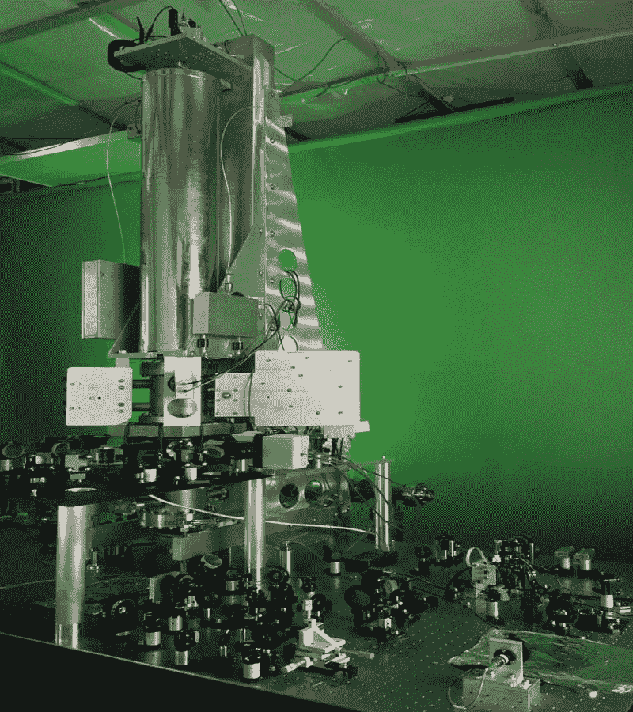
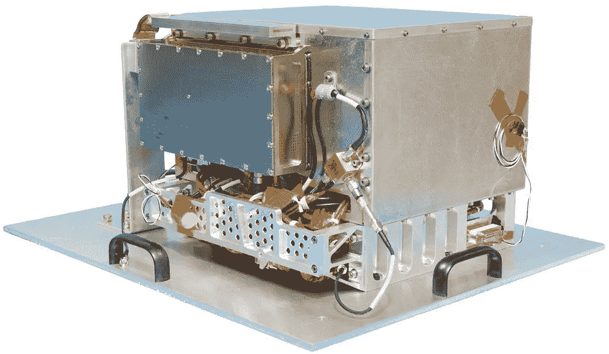
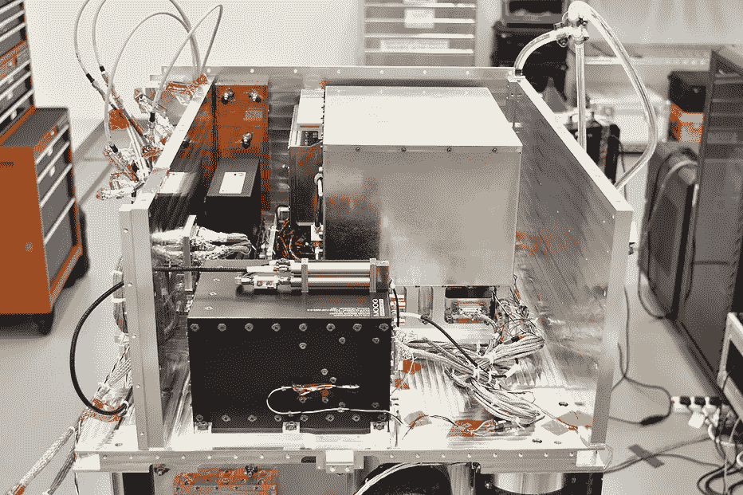
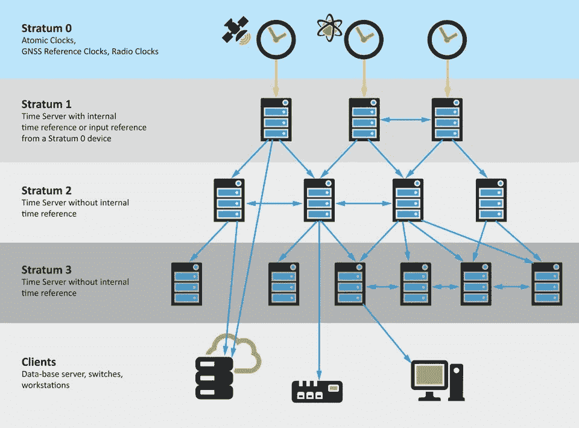

# 分布式系统中的所有事物时钟、时间和顺序:深度物理时间

> 原文：<https://medium.com/geekculture/all-things-clock-time-and-order-in-distributed-systems-physical-time-in-depth-3c0a4389a838?source=collection_archive---------4----------------------->

Photo by [Jens Kreuter](https://unsplash.com/@jenskreuter?utm_source=medium&utm_medium=referral) on [Unsplash](https://unsplash.com?utm_source=medium&utm_medium=referral)

# 介绍

作为一个人，我们在童年(0 岁)出生，开始上学(大约 5 岁)，大学毕业(大约 18 岁)，可能毕业后(大约 22 岁)，然后开始我们的职业生涯(大约 22 岁到 24 岁以上)，生活继续前进。整个事情按照一定的顺序发生:你可能无法在没有完成学业的情况下上大学——如果你是个神童，你可能会，但这只是一次性的。完成这一旅程平均需要 20 多年。一旦我们回顾这段旅程，我们会说**随着时间的推移**我们成长了这么多，哇！！。

只要观察，时间的概念是如何进入画面来定义一个时期，最重要的是**来定义我们生活中事件的顺序**。

类似地，我们获得时间来定义事件的周期和顺序，以实现业务系统中事件的同步。让我们来看一些重要的跨行业订购和时间用例:

1.  移动和数据网络使用精确的时间来实现它们之间的平滑同步，以便移动手机可以更有效地共享有限的无线电频谱。
2.  航空业需要准确的天气信息，因此精确的时间用于同步分布在各地的气象站数据。
3.  地震监测网络通过使用网络上的精确时间，帮助研究人员快速定位地震和其他地震事件的震中。
4.  为了检测电网中的电气异常，设备和公用事业需要使用精确的时间。它有助于工程师分析停电，并确定异常开始的确切位置。
5.  像好莱坞这样的行业正在采用精确的时间来控制音频、视频数据和多摄像机序列，以提供最终的用户体验。
6.  应用和网络监控系统对时间敏感，有助于工程师有效检测性能问题。
7.  股票交易平台、在线游戏、即时通讯都有自己的排序和计时要求。

这些只是精确时间的一些重要例子，只是为了让你理解它在总体上有多重要。我们更感兴趣的是用低级分布式系统的术语来理解时间，本文的其余部分将重点讨论这个问题。

**问:那么，首先，我们在分布式系统中哪里需要排序？**
**A.** 在计算中有许多需要某种排序概念的用例:
***例 1:*** 你正在与你的团队进行一个每日站立仪式的在线会议，但是你收到了一大块完全无序的视频帧。这样会给你留下很好的用户体验的味道吗？
***例 2:*** 你在一家电子商务公司调试一个关键问题，那里有很多连续的服务调用。当您跟踪这些电话时，您会发现一个客户订单甚至在付款之前就已经得到了确认。你对此有何感想？
***例 3:*** 类似地，在无领导的数据库系统中，多台机器可以接受对同一对象的请求以获得更好的可用性，它们需要以这样的方式同步对象，即在该对象上发生的事件序列在系统和业务逻辑中保持可接受。
***举例 4:*** 在运营中交易需要排序，甚至交易本身在某些情况下也需要在彼此之间排序。无论是金融机构、电子商务还是社交媒体平台，交易无处不在。

事实是，在许多系统中，我们无法避免排序的概念，但是，是的，并不是所有的系统都需要排序，这完全取决于手头的业务用例看起来如何。

现在的问题是**我们如何衡量排序？**

要在计算机运行的进程中排序数据样本**，最简单的直觉是给它们分配单调递增的数字，并比较谁先谁后。我们可以在这个过程中管理一个计数器变量，并不断增加它，很简单！**

如果我们的样本数据受到在同一台计算机上运行的多个进程甚至多个线程的影响，该怎么办？我们仍然可以管理一个全局计数器(可能由锁保护),仍然可以实现排序，但显然是以多线程或进程同步为代价的。

有其他选择吗？既然一般来说计算机时钟是单调递增的，我们就不能简单地使用它吗？

管理计数器和时钟的想法起初看起来很直观，因为我们的基本直觉是它们是单调递增的。但是事情并没有看起来那么简单。

这里先讨论一下时钟能否拯救我们。

# 计算机时钟和物理时间

每台电脑的主板上都装有一个硬件时钟，它由某种材料制成，依靠机械晶体振荡(T2)的机制工作。大多数**石英钟**是如此普遍，因为它们重量轻，价格便宜，现在它们是综合开发的。当一个特定的电压施加到石英晶体上时，石英晶体以精确的频率振荡，时钟对这些振荡进行计数。**指定数量的振荡称为一个滴答。每一个刻度代表一个时间单位。**时钟内部管理一个 64 位计数器，并对其进行递增以标记一个滴答。

操作系统维护一个软件时钟，软件时钟反过来使用硬件时钟来计算当前时间。

**注意:**不仅是石英钟，任何时钟都要基于某种振荡来测量时间。在石英钟中，石英晶体是用来振荡的。

使用计算机时钟来计算顺序起初看起来非常直观，但是对于包含多个节点的分布式系统来说，这就变得棘手了。

## 时钟的问题

**分布式系统中没有单一的全局时钟**。每台计算机
(任何计算设备，但我们最关心的是服务器端)都有自己的时钟，它们的材料、物理属性、时钟频率都不同。此外，根据服务器所处位置的环境(物理条件),时钟的振荡可能会因温度变化而受到影响。因此**没有两个时钟在测量时间方面是完全相同的**。两个时钟之间可能有几毫秒甚至几秒的差异。

**时钟偏移(offset ):** 两个时钟上的时间之差称为时钟偏移。

**时钟漂移:**如上所述，没有两个时钟具有相同的时钟振荡速率，即:**时钟速率会不同**。时钟速率的差异称为时钟漂移。**普通石英钟在 11–12 天**内漂移~ `**1 second**` **。漂移速率因时钟而异。**

问:服务器(计算机)的时钟总是单调递增的吗？
答:在基于 Linux 的系统中，通常有两种非常不同的时钟，这里有一个详尽的列表:

**实时时钟或挂钟:**这是我们在电脑上看到的滴答作响的时钟。时钟可以与 NTP 同步(稍后我们将讨论 NTP ),并相应地向前或向后**跳跃**以调整其当前时间。Linux `**CLOCK_REALTIME**`是提供`**get_time()**`和`**set_time()**`API 的实现。`**System.currentTimeMillis()**`是 Java 的实时时钟实现。所以这个时间无论如何都不适合点事件。

**单调时钟:**单调时钟时间表示从过去某个任意固定点开始的绝对经过时间。这种类型的时钟不会跳跃，而是在与 NTP 同步后，如果它发现本地时钟落后或领先 NTP，它可以相应地调整时钟速率。它以服务器启动时间 or 或任何参考时间(Epoch)作为基准时间，并且**严格地单调递增**。`**CLOCK_MONOTONIC**`是以服务器启动时间为基数的 Linux 实现，如果服务器重启，时钟也会重置。时钟不提供`**set_time()**` API。`**System.nanoTime()**`是单调时钟的 Java 实现。如果需要计算流程中两点之间的绝对时间差，可以使用单调时钟时间。然而，跨进程的单调时钟也不是彼此同步的，因此简单地说，它也不能用于在分布式系统中排序事件。

## 石英钟的准确度

根据 NASA 的这篇文章，**一个石英钟可以通过** `**1 nanosecond**` **漂移一个小时后，** `**1 millisecond**` **漂移六个星期后**。因此漂移实现得相当快，使得**石英钟对于超精密用例**来说不可靠。

# 更精确的时钟:原子钟

在原子钟中，某种形式的能量(如激光)被施加到某种特定元素的原子上(如**铯**)。这使得原子中的亚原子粒子，如电子，从一个能级移动到稍高的能级(称为**超精细基态**，并在不久后回到之前的能级，从而释放出之前在`**9,192,631,770 Hz**`获得的额外能量。

`‘Hz’`，赫兹是频率的国际单位制单位，定义为‘每秒’。SI 单位将**秒**定义为“**对应于铯-133 原子基态两个超精细能级之间跃迁的 9192631770 个辐射周期的持续时间。**”

因此，当检测到来自铯原子的 9192631770 个微波发射波时，一秒钟就过去了。这种测量非常精确，以至于**原子钟被认为是迄今为止最精确的时钟**。

任何时钟都有三个通用高级组件:

**能量源:**在原子钟中，比方说一个激光源(取决于设计，该激光源可能有所不同)，它被应用于原子上，使它们在设计的能量状态之间振动。在石英钟中，电池(在计算机 CMOS 电池的情况下)作为电源工作。

**谐振腔:**在原子钟中，原子释放的辐射就是谐振腔。在石英钟中，以周期性方式运动的机械齿轮起着谐振器的作用。

能源和谐振器合称为**振荡器**。

**计数器:**在原子钟中，测量微波辐射周期的探测器。在石英钟中，显示器是计数器。

## 原子钟的精确度

一般来说，原子钟每天精确到十亿分之一秒。

位于美国科罗拉多州博尔德的国家标准与技术研究院(NIST)维护着一个铯原子钟，名为 NIST-F1，作为美国的主要时间和频率标准。

> NIST-F1 铯原子钟可以产生非常精确的频率，其每天的时间误差约为 0.03 纳秒，这意味着该钟在 1 亿年内会慢一秒钟。

更多原子钟的细节可以在[这里](https://www.livescience.com/32660-how-does-an-atomic-clock-work.html)、[这里](https://news.softpedia.com/news/How-Does-An-Atomic-Clock-Keep-Track-of-Time-51345.shtml)和[这里](https://science.thewire.in/the-sciences/india-optical-atomic-clocks-iucaa-iiser-quantum-technologies/)找到。

但是，原子钟不适合商用服务器和计算机。它们看起来比冰箱还大，极其昂贵，需要特殊维护。看看下面的 NIST-F1 铯原子钟就知道了:

Figure: 1, Courtesy: [news.softpedia](https://news.softpedia.com/news/How-Does-An-Atomic-Clock-Keep-Track-of-Time-51345.shtml)

# GPS 时钟

卫星上的 GPS 时钟是较小的原子钟装置，精度非常高，但不如上面描述的巨型地面原子钟精确。当然，它们背后的能源或技术与地面原子钟不同。下面这个 GPS 时钟很有意思:

美国宇航局喷气推进实验室开发了**深空原子钟**，这是一种非常先进的 GPS 时钟，可以帮助其卫星在深空导航，最大限度地减少来自地球的干扰。到火星或任何其他星球的长距离任务都是由这种技术驱动的。

**这个原子钟比其他在太空中飞行的 GPS 时钟稳定 50 倍(稳定意味着时钟测量单位时间的一致性)**。

关于深空原子钟的更多细节，[请看这里](https://www.nasa.gov/feature/jpl/what-is-an-atomic-clock/)。

## GPS 时钟的精确度

> 美国宇航局的深空原子钟将在 4 天后误差不到 1 纳秒，10 年后误差不到 1 微秒(百万分之一秒)。这相当于每 1000 万年只差一秒。

Figure: 2, Courtesy: [Deep Space Atomic Clock Images](https://www.nasa.gov/mission_pages/tdm/clock/images.html)

现在让我们看看如何使用上述时间源来计算服务器和其他设备每天使用的实际时间。

# UTC(协调世界时)时间

我相信每个人都知道 UTC。它是全球时间标准，不同时区的本地时间都是根据它来计算的。UTC 有以下两个部分:

## 世界时

世界时是一种计算时间的天文方法，由国际地球自转和参考系统服务(IERS)测量。它不同于通常的时钟时间。

> 世界时是反映地球自转平均速度的太阳时标准。使用本初子午线 0°经度作为参考点，它显示了地球上平均太阳日的实际长度，即从一个太阳正午到下一个太阳正午的时间。在一个太阳日期间，我们的星球绕着它相对于太阳的轴完成一次完整的旋转。

由于太空中围绕地球的几个天体的存在，地球的形状发生了变化，例如:月球的引力在地球上引起潮汐，这反过来又改变了地球的形状。这导致了地球完成一天的总时间的一些调整。所以通常一个地球日比`24`小时多几毫秒，在一些罕见的情况下，它也可能比`24`小时少几毫秒。

根据写作日期，下表显示了最近几年的平均太阳日长度。如果你想知道今天的太阳日长度是多少，请查看[本页](https://www.timeanddate.com/time/earth-rotation.html)。

Figure 3, Average solar day length as per March 7, 2021

世界时有不同的格式:UT0，UT1，UT2。UT1 很流行，其他很少用。

> UT1 是通过使用长基线干涉测量技术确定遥远的[类星体](https://en.wikipedia.org/wiki/Quasar)的位置，对月球和人造卫星进行激光测距，以及确定 [GPS](https://en.wikipedia.org/wiki/Global_Positioning_System) 卫星轨道来计算的。 **UT1 在地球上各处都一样**，与地球相对于遥远类星体的旋转角度成正比，具体来说就是[国际天体参考系](https://en.wikipedia.org/wiki/International_Celestial_Reference_Frame) (ICRF)，忽略一些小的调整。

在甚长基线干涉测量技术中，多个射电望远镜相隔数千英里放置以观察类星体。将所有这些数据结合起来，有效地发挥了一个数千英里大小的大型望远镜的作用，分辨率更高，能够以不到千分之一秒的精度确定行星的自转速度。观看以下视频，了解更多信息:

## 国际原子时

TAI 是一种时间刻度，使用全球 69 个国家实验室的大约 400 个高精度原子钟的组合输出。

> 它提供了我们时钟滴答的准确速度。时间尺度是加权的，优先考虑由保持初级铯最高质量的机构提供的时间信号。

**国际原子时不考虑地球缓慢的自转，但通用时间考虑**。所以两者之间总是有时间差的。

## 闰秒

不仅是月球引力引起的潮汐效应，还有地震、地球熔融外核质量分布变化、两极附近大块冰的运动、地球大气密度和角动量变化等现象都会影响地球自转。总的观察是**地球变得越来越慢**，目前它每世纪每天慢`0.002`秒。这个速率不是恒定的，只是一个平均数字，并且这个速率也随着时间缓慢增长。

**问:那又怎样？这个数字很小，何必在意呢？是的，虽然很小，但是日差会随着时间的推移而累积。以这种速度，今天是`0.002`，大约一年半后是`1`第二，大约`5000`年后是`1`小时。这意味着**如果我们不在乎这种偏差，我们的时钟将在未来的某个时刻与天文时间或地球的实际自转速率不同步**。为了补偿这种偏差，闰秒被引入。**

闰秒是额外的一秒，通常在 6 月或 12 月的最后一天(通常在`23:59`小时后)添加，此时原子钟(如 NIST-F1)和世界时之间的时差变为`≥ 0.9`秒(读作`1`秒)。

闰秒的发生没有确切的时间，但是根据地球运动的快慢，互联网上的计时器会相应地公布下一个闰秒。2016 年 12 月 31 日(或 2017 年 1 月 1 日)添加了最后一个闰秒。到目前为止闰秒的完整列表可以在[这里](https://www.ietf.org/timezones/data/leap-seconds.list)找到。

添加闰秒是一件棘手的事情，[阅读](https://www.wired.com/2012/07/leap-second-glitch-explained/)2012 年网络崩溃仅仅是因为 Linux 的一个错误不能处理闰秒。

问:闰秒可以是负数吗？
A. 如果地球自转速度持续加快(2020 年，[地球自转速度加快](https://www.timeanddate.com/time/earth-faster-rotation.html) 28 倍:O)，平均一天将比 24 小时少几毫秒(可能是毫秒的几分之一)。在这种情况下，闰秒可以是负数。但是自从 1973 年这个概念出现以来，它从未发生过。

## 闰秒涂抹

尽管服务器和系统在没有闰秒的情况下仍然可以运行，但如上所述，时差会变得很大，从而在未来造成更多的混乱。给时钟添加闰秒似乎很简单，但这是一个繁琐的过程。有几项工作，比如在那一秒钟停止/暂停时钟(技术上是将时钟倒推)，以欺骗他们，好像没有额外的一秒钟，或者实际上给时钟增加了额外的一秒钟。这些都是非常错误的伎俩。

谷歌推出了一种更好的方法，称为[闰涂抹](https://developers.google.com/time/smear)—**将多出来的一秒钟分成几毫秒，在很长一段时间内持续添加到闰前后的时钟中**，而不是一次性添加。这是一个聪明的解决方案，但还不是标准。谷歌通过其 NTP 服务器发布这些时间。

**事实:** **GPS 时钟不在乎闰秒**，所以 GPS 时间与地球真实自转不同步。他们在 GPS 信号中传输额外的偏移信息，让接收器知道他们需要调整多少偏移。

**UTC 时间是使用 UT 和原子时得出的。**

> 协调世界时的速率基于原子频率标准，但协调世界时的纪元是同步的，以保持接近天文世界时。

现在我们知道普通的设备时钟不可靠，很容易漂移，而且原子钟非常昂贵，甚至一些最大的公司也不愿意在它们上面投资，问题是**我们如何在日常设备和商用服务器上同步时钟？**

# 6.网络时间协议(NTP)

NTP 来此救援:)Yayyy！！！！

[NTP](https://en.wikipedia.org/wiki/Network_Time_Protocol) 通常是一种基于 UDP 的协议，旨在通过考虑网络延迟选择合适的时间服务器来同步可变延迟分组交换网络中的时钟。NTP 在 UTC 时间的几毫秒内将时钟与**同步。**

NTP 有一个被称为**层**的概念，它只不过是时间服务器的层次结构。从`0`到`15`有`16`这样的层次。**地层** `**n + 1**` **与地层** `**n**`同步。层`0`是最精确的级别，层`1`不如层`0`精确，以此类推，层`15`是上限，级别`16`代表完全不同步的设备。

任何计算机都可以通过这种 NTP 时间服务器层次结构将其时钟与互联网参考时钟同步(参见下面的 stratum `0`时钟)。

Figure: 4, Courtesy: [https://www.ntp-zeit.de/index-en.htm](https://www.ntp-zeit.de/index-en.htm)

代表最准确(高精度)的时钟，如 GPS 时钟、原子钟、电波钟等。**地层** `**0**` **时钟与自身不同步**。它们被称为**参考时钟**，这是一个非常特殊的类别，**NTP 中没有其他时钟可以自称为地层** `**0**` **时钟**。

**层 1** 设备保持**与层**的直接连接。上图中的黄色箭头代表了这一点。他们可能比地层 `**0**` **时钟**晚**几微秒。它们还可以作为备用时钟，在 stratum `0`服务器不可用时相互同步。地层`1`设备被称为**主时钟或主时间服务器**。**

**层 2** 设备通过网络与层`1`设备**同步(如上图蓝色箭头所示)。他们的精度在地层** `**1**`的几毫秒之内。Stratum `2`设备可以查询多个 stratum 1 设备，甚至可以与自身同步，以获得更高的准确性。

同样，层`3`设备的工作机制与层`2`相似，其他层也是如此。

**问:为什么 NTP 是时间服务器的分级结构？
A.** 处理水垢。有数百万台设备异步连接到 NTP 服务器来调整时间。让它们都连接到同一个 NTP 层是不可行的。因此就有了等级制度。通常任何设备，比如说我们的计算机时钟，都会查询不同级别的多个时间服务器，选择最好的一个来调整时间。

已经有数以千计的地层`2`服务器。大多数大公司管理自己的 NTP 时间服务器，让成千上万的设备同步时间——其中一台计算机连接到 NTP stratum `2`服务器，所有其他服务器或设备连接到这个内部服务器(从而形成 stratum `3`)来同步自己的时间。

**问:计算机如何与 NTP 同步？
答:**计算机运行类似 [ntpd](http://doc.ntp.org/4.1.0/ntpd.htm) (主要在*unix 机器中)或 [chrony](https://opensource.com/article/18/12/manage-ntp-chrony) 的守护进程，它们与 NTP 服务器同步——基本上它们按照配置文件中定义的间隔定期轮询 NTP 时间服务器。它们都实现了 NTP 协议，但一般来说，chrony 比 ntpd 更准确、更好，因为它使用了[扩展的 NTP 协议](https://tools.ietf.org/html/draft-ietf-ntp-interleaved-modes-01)。

**问:NTP 如何处理闰秒？
答**。NTP 服务器可以配置为涂抹闰秒并将调整后的偏移传播到下游设备。谷歌的 NTP 服务器就是这样做的。

## NTP 池

[NTP 池](https://www.ntppool.org/en/)是一个虚拟的(不是由任何公司管理的真实集群，如果你有合理的互联网连接并且服务器有静态 ip，你可以注册一个在你家运行的服务器)时间服务器集群，托管在**pool.ntp.org**的子域下。目前，NTP 池下有 4300 多台时间服务器。

## NTP 的准确性

准确性取决于许多因素，如地层级别(级别越高，您的时钟离参考时钟越远，因此准确性可能越低)、拥塞或设备导致的网络延迟、网络延迟的可变性、请求采用的网络路径、网络速度和质量等。此外，ntpd 或 chrony 守护程序会根据提到的参数来测量估计时间。

自己测量 NTP 延迟并不容易，需要特殊的硬件设置。脸书有自己的 NTP 服务器(`time.facebook.com`服务器)，你可以通过[这篇文章](https://engineering.fb.com/2020/03/18/production-engineering/ntp-service/)了解他们是如何为他们的实验测量 NTP 偏移量的。

很难引用任何数字，但总体来看取决于多个因素，****NTP 准确性可以在范围** `**0.1 ms**` **与快速局域网** `**10 ms**` **或更多(对于洲际网络**)。**

**关于 NTP 准确性的精彩讨论可在[这里](https://serverfault.com/questions/508586/is-there-research-material-on-ntp-accuracy-available)找到。**

## **公共 NTP 服务器**

**如果感兴趣，请查看这里的是免费的公共 NTP 服务器列表。**

****问:回到分布式系统中排序的原始问题，如果我们使用 NTP 同步时钟来排序事件，我们的问题应该解决吗？
答:**最小`10 ms`(最坏的情况下可能更高)内的精度看起来显然很小。但是对于一个大规模可扩展的系统，每微秒到纳秒都很重要。所以这种准确性并不适合大多数面向消费者的大型科技公司。**

**物理时间戳有可能**严格排序事件**。例如:假设有两个物理时间差为`1 millisecond`的节点，第一个节点运行事务`A`，第二个节点**同时**运行另一个事务`B`。`A`发生在时间戳`1614308336728`的，而`B`发生在时间戳`1614308336727`——注意`A`和`B`之间的`1 ms`时间差。尽管事务实际上是并发的，但是当您通过降序时间戳检索它们时，`B`出现在`A`之前。如果此时此刻有数以千计的此类交易发生，想象一下排序会有多混乱。因此，使用物理时间，我们只是在这个特殊的例子中失去了并发的概念。类似地，如果两个事务甚至不应该是并发的，它们可能会因为时间戳的不同而看起来是并发的。根据系统和业务需求，这种场景可能会导致难以跟踪的错误。**

**这是物理时间的普遍问题，尽管时钟看起来高度同步。**

**问:我们现在如何解决这个问题？
A. 我们有两种方法可以在高层解决这个:
**选项一:**忘记真实时钟的存在，取一个更简单的机制来定义顺序。数字，是的！！！使用单调递增的普通整数计数器。这个机制叫做**逻辑时钟或者逻辑时间戳**。**

****选项 2:** 使用真实时钟—定义一种机制，使时钟精度尽可能最高—定义**在给定时刻跨节点观察到的最小可能最大时间偏差**。这很难实现。我们将在以后的文章中回顾时钟的这一部分。**

# **结论**

**我希望现在物理时间源和时间同步对我们所有人都很清楚。我们已经看到了物理时间在我们生活中的重要性，以及它与空间科学的关系。我们现在知道，在大规模分布式系统中，并不总是能够使用物理时间来对事件进行排序。**

**在本系列的下一篇文章中，我们将深入讨论逻辑时钟。在那之前，请消化这篇文章，感谢科学家和工程师对时间和时钟做了这么多令人敬畏的研究，并为了人类的利益创造了如此美丽的系统。**

**如果你喜欢它，请给**多次鼓掌**并在 Twitter 和 LinkedIn 等社交媒体上与更广泛的观众分享它。**

# **参考**

1.  **https://aphyr.com/posts/299-the-trouble-with-timestamps**
2.  **【https://www.nasa.gov/feature/jpl/what-is-an-atomic-clock **
3.  **[https://www.gps.gov/applications/timing/](https://www.gps.gov/applications/timing/)**
4.  **[https://engineering . FB . com/2020/03/18/production-engineering/NTP-service/](https://engineering.fb.com/2020/03/18/production-engineering/ntp-service/)**
5.  **[https://science . the wire . in/the-sciences/India-optical-atomic-clocks-iucaa-iiser-quantum-technologies/](https://science.thewire.in/the-sciences/india-optical-atomic-clocks-iucaa-iiser-quantum-technologies/)**
6.  **[https://EarthSky . org/human-world/leap-second-June-30-December-31-why-need-contention](https://earthsky.org/human-world/leap-second-june-30-december-31-why-need-controversy)**
7.  **[https://gist . github . com/mutin-sa/EEA 1c 396 B1 e 610 a2 da 1e 5550d 94b 0453](https://gist.github.com/mutin-sa/eea1c396b1e610a2da1e5550d94b0453)**
8.  **[https://www.ntppool.org/en/](https://www.ntppool.org/en/)**
9.  **[https://en.wikipedia.org/wiki/Network_Time_Protocol](https://en.wikipedia.org/wiki/Network_Time_Protocol)**
10.  **[https://netcraftsmen.com/ntp-accuracy/](https://netcraftsmen.com/ntp-accuracy/)**
11.  **[http://www.ciol.com/leap-second-how-google-saved-websites/](http://www.ciol.com/leap-second-how-google-saved-websites/)**
12.  **[https://en.wikipedia.org/wiki/Leap_second](https://en.wikipedia.org/wiki/Leap_second)**
13.  **[https://www.wired.com/2012/07/leap-second-glitch-explained/](https://www.wired.com/2012/07/leap-second-glitch-explained/)**
14.  **[https://queue.acm.org/detail.cfm?id=2745385](https://queue.acm.org/detail.cfm?id=2745385)**
15.  **[http://people.cs.aau.dk/~bnielsen/DS-E08/material/clock.pdf](http://people.cs.aau.dk/~bnielsen/DS-E08/material/clock.pdf)**
16.  **[http://www . cs . CMU . edu/~ srini/15-446/S09/lectures/08-phy _ time . pdf](http://www.cs.cmu.edu/~srini/15-446/S09/lectures/08-phy_time.pdf)**
17.  **http://www.ntp.org/ntpfaq/NTP-s-sw-clocks.htm**
18.  **【https://www.eecis.udel.edu/~mills/ntp/html/warp.html **
19.  **[https://blog.selectel.com/synchronizing-servers-ntp/](https://blog.selectel.com/synchronizing-servers-ntp/)**
20.  **[http://tornado . sfsu . edu/geosciences/classes/m356/UTC/UTC . html](http://tornado.sfsu.edu/geosciences/classes/m356/UTC/UTC.html)**