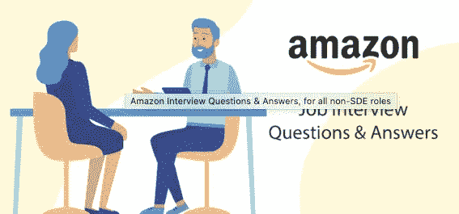
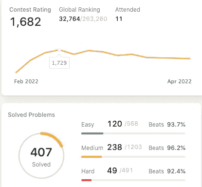

# 亚马逊面试流程

> 原文：<https://medium.com/geekculture/amazon-interview-process-418d9253fe7d?source=collection_archive---------17----------------------->

是什么让我得到了亚马逊的报价？

Amazon Interview process

通过这篇文章，我想展示几个让我成为 SDE 的重要因素。我看过很多关于亚马逊或者 FAANG 面试流程的帖子。这些文章有一个共同的因素:实际的面试过程。

# 面试过程

大多数情况下，FAANG 公司都有共同的面试流程。(进入下一阶段的候选人百分比)

*   排查
*   编码评估(30%)
*   电话屏幕(20%)
*   现场面试(15%)

让我来详细说明每个阶段。

# 排查

这个阶段主要检查你过去的经验是否与团队正在寻找的当前角色相匹配。因为亚马逊用英语进行所有的申请过程，所以简历必须用英语写。最重要的是，简历应该精确，也就是说不应该超过一页(最多两页)。)如果你有一个文件夹，那是可以额外包含在其他文档中的东西。另一件要记住的事情是，因为简历是一张展示候选人过去经历的纸或 pdf 文件，所以与招聘人员保持联系是很重要的。我在亚马逊举办的一次活动中与招聘人员取得了联系，招聘人员能够在整个过程中帮助我。

# 编码评估

在这个阶段，我必须在 90 分钟内解决两个算法问题。这些问题在一个名为 *Hackerrank* 的平台上得到了解决。对于每个问题，当候选人提交解决方案时，平台会显示候选人的解决方案通过了多少个测试案例。通常，有 20~30 个测试用例，其中一些包含大规模的输入来测试时间复杂度。这个阶段需要注意的一点是，尝试实施可行的解决方案。(但是，不是用蛮力的方法)我记得我没有想出两者的完美解决方案，但是通过了 80~90%的测试用例。幸运的是，我能够进入下一阶段。

# 电话屏幕

在这个阶段，公司的一名高级 SDE 进行 60 分钟的虚拟面试，通常是 50 分钟评估技术技能和领导原则，或者只是技术技能和 10 分钟的问答时间。根据我的个人经验和网上调查，面试官可以在这个阶段问任何问题。因此，当候选人走到这一步时，他们应该能够全面地回答问题。例如，我的亚马逊面试官对我的 OOP 设计和系统设计进行了评估，其中包括合适的数据结构和 5 分钟的领导原则，所以几乎没有时间进行问答。(在时钟到达 60 分钟之前还剩 2 分钟)这一阶段可以涵盖的主题是数据结构和算法、OOP 设计和系统设计。在这一阶段，我只有很短的时间进行系统设计，因此无法深入一些概念，但幸运的是，我能够进入下一阶段。

# 现场

这一阶段包括 4 次面试，每次 1 小时，由公司的一名软件工程师参加。四次面试中的每一次都应该根据不同的标准来评估候选人。然而，受访者不知道每个面试阶段评估的标准是什么。这些评估点是反复无常的，但一般如下:

*   数据结构和算法
*   问题解决
*   面向对象设计
*   系统设计

以及受访者过去的经验，包括一些领导原则。面试官可以在两天内安排面试，每天进行两次 1 小时的面试。然而，我强烈建议在一天内完成，因为第二天的精神压力对我来说是痛苦的。经过几天的面试，我收到了录用通知。

以上，我总结了在亚马逊和其他 FAANG 公司面试是什么感觉。我实际上面试了另一家 FAANG 公司，并可以确认它遵循了相同的面试流程。

现在，继续从第一段开始，回答我的小标题，我想展示几件我一贯做的事情。

# Leetcode

number of problems

为了准备，我一共解决了 300 多个问题。许多人提到，解决大约 100 个问题就足够进行面试了，但是我通过反复试验和更多的实践学到了更多。解决类似的概念问题帮助我理解为什么以及在哪里需要使用特定的算法和数据结构。

6-month leetcode submissions

正如你所看到的，我在十月份开始 leetcoding。大约在那个时候，我在一家小型初创公司进行一次非正式的面试。面试后，我提交了大约 30~40 份材料，感觉更有信心了，于是开始连续申请不同的公司，最后申请了亚马逊。

# 系统设计

为了这个特定的部分，我看了很多 youtube 视频。当然，看和吸收完全是两回事。我在看完每个视频后做的是，我试图在大约 30 或 40 分钟内呈现完全相同的东西。还有其他平台，如 SystemsExpert 和 educative.io，它们详细解释了系统设计，并且基本上在这些平台上做了同样的事情。需要注意的一点是，随着我了解的越来越多，我在当前公司的工程架构讨论中变得更加活跃，我学会了如何在最具工程性的决策和业务驱动的决策之间进行妥协。

# 面向对象设计

这部分对我来说可能是最难的部分，因为我更习惯于函数式编程，而不是面向对象编程。对于这一特定部分，我彻底探索了这个库[。帮助我为这一节做好准备的另一件事是从面向对象编程的角度来思考。基本上，当我去一家餐厅吃饭时，我试图思考如何有效地为这家餐厅制定预订系统。所有这些实践帮助我打开了面向对象编程概念的眼界。](https://github.com/tssovi/grokking-the-object-oriented-design-interview/blob/master/object-oriented-design-and-uml/object-oriented-basics.md)

# 结论

我认为在这篇文章中，有几个词反复出现，那就是“幸运”和“始终如一”。我参加过很多不同公司的面试，从来没有想象过我的位置是亚马逊。努力工作总会有回报，如果现在没有，将来的某个时候也会有。对自己有信心，继续磨。