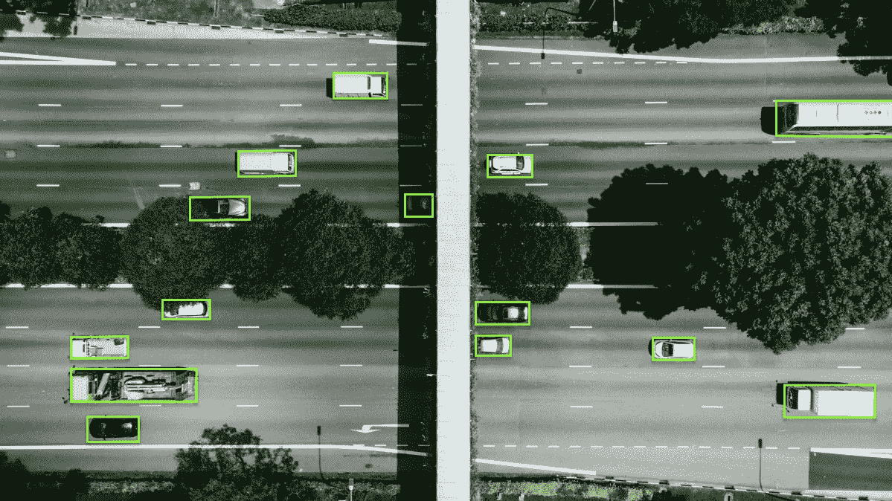

# 计算机视觉导论:技术与实际应用

> 原文：<https://medium.com/geekculture/an-introduction-to-computer-vision-techniques-real-life-applications-78111bf86d2?source=collection_archive---------10----------------------->

## 查看这篇文章，了解计算机视觉技术的基础知识，以及它的技术、用例和挑战。

直到最近，计算机视觉与我们的日常现实几乎没有什么关系。虽然这个想法从 20 世纪 50 年代就开始发展了，但对大多数人来说，这只是科幻电影的事情。但是这种情况已经改变了。如今，计算机视觉算法是许多现代软件解决方案不可或缺的一部分，其采用程度也在不断提高。

基于目前的增长，全球计算机视觉市场[预计到 2028 年将达到](https://www.grandviewresearch.com/press-release/global-machine-vision-market)211.7 亿美元，比 2021 年的 CAGR 增长 6.9%。

本文将解释这项技术是关于什么的，概述它所基于的技术，并提供最常见的计算机视觉示例。我们还将讨论该技术的应用领域以及您可能需要克服的实施挑战。首先，让我们从定义开始。

# 什么是计算机视觉？

计算机视觉(CV)是人工智能(AI)的一个分支学科，它使计算机系统能够分析和解释视觉信息。例如，现代 CV 系统可以直接使用来自摄像机和热传感器的数据，或者过程就绪数据集。CV 背后的想法非常简单:我们希望机器能够识别现实世界中的物体。我们还希望他们能够根据视觉数据快速做出决策，最好是实时决策。

但是计算机视觉是如何工作的呢？首先，你必须提供一个视觉参考的 CV 算法，而且你需要用数字来做，因为计算机不擅长创造性思维。假设您希望基于 CV 的系统能够识别鼠标的图像。事情会这样发展:

1.  你会发现一只老鼠的图像
2.  将它标记为“鼠标”，并为系统逐个像素地进行编码，包括颜色信息
3.  你用几千张图片重复这个过程
4.  CV 系统分析数据并识别模式。现在你的系统有了鼠标的定义
5.  该系统将该定义应用于一张新图像，检查图像帧中的图案，并实时检测老鼠

当然，这是一个简化的场景。今天的计算机视觉技术已经取得了很大的进步，不再依赖人工。AI 使用机器学习(ML)和深度学习(DL)来更好地识别物体。

有了 ML，部分软件采用了可以自动识别模式的算法。它允许 CV 系统检测和分类对象。DL 是机器学习的更高级子集。它使人工智能能够在没有人类帮助的情况下，根据大量数据提取重复出现的模式。向系统输入成千上万的图像，神经网络将破解代码，并产生一个描述识别模式的数学方程。

既然我们已经大体上触及了 CV 的概念，那么让我们来看看构成其核心的技术。

# 改变世界的计算机视觉技术

CV 系统利用复杂的分析工具为我们提供几项关键功能。这里有一个快速概述。

# 图像с分类

为了理解图像分类在计算机视觉中是如何使用的，想想你最后一次通过验证码来证明你是人类的时候。还记得你被要求选择所有有摩托车的图片吗？嗯，我们希望 CV 系统也能在运行中做到这一点。

有一个数据集，其中的项目被分为不同的类别:根据对象的类型，颜色，大小。我们需要计算机视觉应用程序来查看这些类别，并将分类方法外推至一组新的图像。基本上，让人工智能通过验证码测试。

为此，数据科学家经常使用深度卷积神经网络。事情是这样的:

1.  数据科学家向系统提供一个数据集，其中包含被标记并分类的图像
2.  他们不断重复这样做来定义一个分类器——定义一个类的特征
3.  然后，他们获取一组未知的图像，并要求 CV 系统对它们进行分类
4.  最后，数据科学家将结果与这个新集合的实际类别标签进行比较，进行修正，然后重复。

我们的目标是得到一个能够以最高精度对图像进行分类的系统。所以我们可以在下一个任务中使用这些类。

# 目标检测

当我们知道在图像中寻找什么类型的对象时，我们需要做的就是正确地标记它们。对于特斯拉自动驾驶仪来说，这意味着“汽车”、“卡车”、“路标”、“行人”等类别。如果我们有无限的资源，我们可以简单地逐个像素地扫描整个图像。但如果是高清视频直播呢？

解决方法很简单:识别纹理不均匀的区域，因为它们比背景更可能包含物体。从现在开始，计算机视觉算法将只对这些区域起作用，从而节省计算能力——特别是因为我们将在下一项技术中需要它。

# 目标跟踪

如果你对摄影感兴趣，你可能已经接触过这种技术。当您在自动对焦设置中选择对象跟踪并标记该对象时，只要它在相框中，您的相机就会一直对它对焦。

数据科学家使用两种通用方法来跟踪对象:

*   **生财。**这意味着系统必须通过物体的独特特征来识别物体。可靠，但费力。
*   **歧视性的。**在这种方法中，计算机视觉用于从背景中辨别物体。因为它是健壮的和资源敏感的，这种方法正在成为跟踪的工业标准。

工程师可以使用像[深度学习跟踪器](https://proceedings.neurips.cc/paper/2013/file/dc6a6489640ca02b0d42dabeb8e46bb7-Paper.pdf)这样的资源来训练神经网络。但是，新的方法不断被创造出来，以提高精度和排除图像中的干扰。但是还有另一个层次。

# 语义分割

除了分类之外，CV 系统能够定义对象的类别，它还需要检测它们的边缘。分割是一种技术，旨在在像素级别上识别天空结束和建筑物开始的位置，行人的身影与汽车重叠的位置，等等。

这项任务需要大量的资源，工程师们通过使用[全卷积网络](https://arxiv.org/pdf/1411.4038.pdf)来解决这个问题。因为将这种方法应用到全分辨率图像对资源来说过于贪婪，所以该技术使用下采样和上采样的组合。但是我们还需要再深入一点。

# 实例分割

这种技术使用最先进的 [Mask R-CNN](https://arxiv.org/pdf/1703.06870.pdf) 框架来区分类中的实例。示例:

*   计算机视觉系统识别出图像中存在名为“汽车”的类别
*   通过应用实例分割，系统可以用不同颜色的遮罩来标记类别中的每辆汽车
*   数据科学家可以使用这些信息来单独跟踪每个对象，保留其独特的特征

这是五种主要的计算机视觉技术，提供了 CV 系统的大部分功能。

计算机视觉技术用于多种目的，从人脸识别到社交媒体上的应急响应服务。无人驾驶特斯拉汽车、早期癌症诊断工具和军用雷达系统——所有这些都要归功于 CV。所以，让我们回顾一下 CV 的真实用例。

# 计算机视觉在各行业中最常见的应用

计算机视觉技术在当今的技术世界中蓬勃发展。首先，人类创造了越来越多的视觉数据。例如，仅谷歌照片每天就有 280 亿张图片和视频被上传。庞大的公共数据集也是可用的。第二，计算资源已经变得更便宜和更先进，能够为 CV 构建强大的硬件解决方案。最后，数据科学家不断努力工作，开发更有效的计算机视觉算法。

计算机视觉技术的进步改变了各种行业。我们挑选了一些影响最明显的地方。

# 汽车的

计算机视觉给汽车市场带来的最突出的好处来自于物体检测和分类。来自外部摄像头的数据，结合监控司机的数据，可以防止事故发生，并有助于实现道路安全的新标准。

作为当今最先进的汽车制造商之一，特斯拉清楚地展示了尖端技术如何能够彻底改变行业。自动驾驶汽车的出现似乎是不可避免的。为了让自动驾驶仪工作，车辆需要支持计算机视觉的硬件，而制造商绝对需要这些大量的数据集来进行分析。

# 农业

联合国预测，到 2050 年，对农产品的需求将增长 70%。随着全球变暖的推进，该行业需要加强其技术游戏，而 CV 是首选。计算机视觉在农业中的使用案例包括:

*   产品质量控制
*   [牲畜监控](https://quantumobile.com/rd-blog/livestock-monitoring-using-machine-learning-and-computer-vision-approach/)
*   更好的分级和分类
*   [早期发现异常](https://quantumobile.com/blog/computer-vision-for-presiced-agriculture/)
*   天气状况预测
*   作物模型校准

深度学习有助于为农业企业创造更好的模式，这将确保智能农业的可持续发展。

# 银行业务

谈到金融服务，计算机视觉大有可为，特别是在促进数字化转型方面。银行和其他金融机构有望在以下方面有所改进:

*   文档数字化—加快处理和数据提取
*   人脸识别—为了更好的安全性和了解您的客户服务
*   损害评估—适用于保险公司，包括汽车和房地产

计算机视觉技术可以产生大量有价值的数据，银行可以利用这些数据来简化运营和改善客户体验。

# 卫生保健

医疗保健专业人员经常发现自己处于分秒必争的情况下，因此能够提供速度和可靠性的计算机系统受到高度重视。计算机视觉技术为医生提供了做出更明智决策的正确工具。

例如，CV 通过分析 ct 扫描帮助[检测神经疾病](https://www.nature.com/articles/s41591-018-0147-y)。它也用于 X 射线图像和超声波扫描的分析。通过使用这项技术，肿瘤学家可以更准确地诊断癌症，并区分恶性和良性肿瘤。

# 运动

CV 提供的实时跟踪工具对运动员的表现评分有很大帮助。我们不再完全依赖法官的视力和记忆，现在我们有了一种客观的手段来监控我们可能需要的每一个参数。

收集绩效指标对于培训也是非常宝贵的。培训师的经验不可低估，但用第一手数据充实它可以带来更好的成绩。

# 制造业

得益于高效的监控和强大的自动化，计算机视觉系统可以简化生产的许多方面。例如，Quantum 的[质量控制 CV 解决方案](https://quantumobile.com/case-studies/automated-quality-control-for-manufacturing-using-computer-vision/)通过实现 99.99%的准确性帮助客户减少了生产损失。相比之下，以前的解决方案只能提供 10%的性能。

CV 在制造业中的其他用途包括视觉引导机器人、包装控制和贴标。通过分析在这些过程中收集的数据，制造商可以发现痛点，并做出将在更大范围内影响其业务运营的决策。

# 物流

结合物联网传感器，CV 允许创建全自动物流解决方案。以下是在供应链中使用计算机视觉系统的一些好处:

*   标签、条形码和包装尺寸的精确检测
*   受损货物的识别
*   全天候监控
*   缺失项目的检测
*   增强型分类
*   运输中的空间优化

有了精心设计的 CV 解决方案，物流公司可以在整个周期实现 100%的可追溯性。

# 应急服务机构

CV 可以通过提供卫星拍摄的实时分析来帮助紧急服务。这对于应对野火、洪水、地震和其他灾害的规划至关重要。随着人工智能快速准确的分析，管理灾难的人道主义方面也变得更加容易。

我们提到的用例绝不是计算机视觉系统在所有行业的可能应用的详尽列表。但是在实现 CV 技术时，你可能会遇到一些困难。

# 计算机视觉的挑战

实施计算机视觉系统是一项严肃的工作，需要精通软件工程和相关硬件知识。以下是你的简历解决方案可能遇到的一些问题:

*   **硬件限制。**摄像头传感器和服务器硬件等技术总有改进的空间。如果您的工作需要在光线不足的条件下获得最高质量的图像或实时数据处理，您应该从一开始就投资合适的硬件。
*   **输入数据质量差。**为了进行最佳训练，深度学习模型需要高质量的数据集，获得这些数据集可能会很昂贵，特别是如果你正在经营一个利基业务，并且没有公共数据集可用。但是有一个解决方案——您可以使用编程生成的合成数据，这可以便宜十倍。
*   **未能选择正确的架构。**选择一个能够帮助您在更短的时间内交付最终产品的架构模型可能很有诱惑力。但是，您应该始终考虑与高成本返工和无法实现业务目标相关的风险。仔细评估您当前的技术成熟度，并与您的软件供应商交流您的期望，以便您可以提出最佳策略。
*   **可扩展性问题。**这个问题基本上是硬件和架构的初始选择不佳的组合。当需要增长时，您的基础架构不应成为瓶颈。虽然增加云资源通常是可能的，但是要解决软件固有的可伸缩性限制要困难得多。

好消息是，这些大多是技术问题，你不应该与一个有信誉的软件合作伙伴遇到。

# 结论

为了获得计算机视觉的众多好处，你需要正确地设置深度学习算法，并为它们提供大量高质量的数据。下一步是开发一个根据您的目标定制的解决方案，同时具有轻松扩展的潜力。

与 Quantum 这样经验丰富的软件公司合作是您获得最佳结果的保证。我们花了 15 年时间开发定制的[计算机视觉解决方案](https://quantumobile.com/expertise/computer-vision)，掌握深度学习和数据分析的技术。请随意浏览我们的[产品组合](https://quantumobile.com/case-studies/?filter=29)，如有任何问题，请随时[联系我们](https://quantumobile.com/contact-us/)。