# 使用 Python 和 Matplotlib 的足球运动员仪表盘介绍

> 原文：<https://medium.com/geekculture/an-introduction-to-football-player-dashboards-using-python-and-matplotlib-eb5328dfe85f?source=collection_archive---------1----------------------->

今天，我们将深入探讨如何使用 Python 和一些内置库从头开始制作可视化仪表板。Python 有一些最好的内置绘图库，主要是 Matplotlib。虽然 R 中的 ggplot 和 Tableau 可以让您更快地绘制出现成的图形，但花一点时间，您就可以通过学习足够的基础知识，用 Python 制作出令人惊叹的可视化图形。事不宜迟，我们开始吧。

在本教程中，我们将为[***Erling Haaland***](https://en.wikipedia.org/wiki/Erling_Haaland)和他的进球创建一个仪表板。我们将从[**understand**](https://understat.com/player/8260)**和 [**Fbref**](https://fbref.com/en/comps/Big5/shooting/players/Big-5-European-Leagues-Stats) 中抓取数据，然后使用这些数据在仪表板中绘制射门图和一个进球与预期进球散点图。**

**首先，我们需要导入所有必要的库**

```
import requests
from bs4 import BeautifulSoup as soup
import json
import pandas as pd
import matplotlib.pyplot as plt
import numpy as np
import matplotlib as mpl
```

**现在，我们将着手从理解中搜集数据。为此，我们需要请求，BeautifulSoup，JSON 和 pandas 包。我不会深入到抓取的每一步，但我会附上一个满足这个需求的 Youtube 链接。**

```
# HAALAND'S PLAYER ID IN UNDERSTAT IS 8260
url ='[https://understat.com/player/8260'](https://understat.com/player/8260')
html = requests.get(url)
parse_soup = soup(html.content,'lxml')scripts = parse_soup.find_all('script')
strings = scripts[3].stringind_start = strings.index("('")+2
ind_end = strings.index("')")json_data = strings[ind_start:ind_end]
json_data = json_data.encode('utf8').decode('unicode_escape')data = json.loads(json_data)x = []
y = []
xg = []
result = []
season = []for i,_ in enumerate(data):
    for key in data[i]:
        if key=='X':
            x.append(data[i][key])
        if key=='Y':
            y.append(data[i][key])
        if key=='xG':
            xg.append(data[i][key])
        if key=='result':
            result.append(data[i][key])
        if key=='season':
            season.append(data[i][key])columns = ['X','Y','xG','Result','Season']
df_understat = pd.DataFrame([x, y, xg, result, season], index=columns)
df_understat = df_understat.T
df_understat = df_understat.apply(pd.to_numeric,errors='ignore')
```

**因此，我们能够创建一个包含拍摄位置、拍摄结果、xG(预期目标)和赛季的数据框。然而，快速浏览一下数据库就会发现，我们的 x 和 y 在 0 和 1 之间。**

**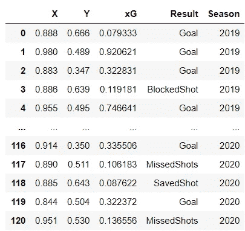**

**为了解决这个问题，我们将 X 和 Y 列缩放到 100，因为我们稍后将使用的 **Opta** 间距使用 100 x 100 间距。**

```
df_understat['X'] = df_understat['X'].apply(lambda x:x*100)
df_understat['Y'] = df_understat['Y'].apply(lambda x:x*100)
```

**恭喜你，我们已经刮到了理解网站。继续刮 Fbref。**

**使用熊猫的 read_html 函数可以简单的刮出 Fbref。但是，这将返回网页中所有表格的列表，我们只需要第一个表格，因此我们将使用索引。此外，需要清理数据，我已经使用自己为此创建的函数完成了这项工作。**

```
def readfromhtml(filepath):
    df = pd.read_html(filepath)[0]
    column_lst = list(df.columns)
    for index in range(len(column_lst)):
        column_lst[index] = column_lst[index][1]df.columns = column_lst
    df.drop(df[df['Player'] == 'Player'].index, inplace=True)
    df = df.fillna('0')
    df.set_index('Rk', drop=True, inplace=True)
    try:
        df['Comp'] = df['Comp'].apply(lambda x: ' '.join(x.split()[1:]))
        df['Nation'] = df['Nation'].astype(str)
        df['Nation'] = df['Nation'].apply(lambda x: x.split()[-1])
    except:
        print('Error in uploading file:' + filepath)
    finally:
        df = df.apply(pd.to_numeric, errors='ignore')
        return dfdf_fbref = readfromhtml('[https://fbref.com/en/comps/Big5/shooting/players/Big-5-European-Leagues-Stats'](https://fbref.com/en/comps/Big5/shooting/players/Big-5-European-Leagues-Stats'))
```

**现在让我们看看我们的数据框架**

****

**太好了，我们的数据准备好了。现在，我们可以开始在仪表板上绘制这一部分了。**

**我们将需要两个自定义软件包，可以在 pip 上找到— [mplsoccer](https://mplsoccer.readthedocs.io/en/latest/gallery/index.html) 和 [highlight-text](https://pypi.org/project/highlight-text/#:~:text=the%20examples%20below.-,Use,the%20figure%20in%20figure%20coordinates) 。**

**如果您的环境中没有安装这些包，只需运行以下命令。**

```
pip install mplsoccer
pip install highlight-textfrom highlight_text import ax_text,fig_text
import mplsoccer
```

**我不太喜欢 Matplotlib 提供的默认颜色和字体，所以我将使用不同的颜色和字体，并使用 Matplotlib 的 rcParams 进行更改。如果你不喜欢默认的颜色名称，可以随意查看这个[颜色网格](https://htmlcolorcodes.com/color-picker/)，它提供了不同颜色的十六进制代码。**

```
background = '#D6DBD9'
text_color = 'black'
mpl.rcParams['xtick.color']=text_color
mpl.rcParams['ytick.color']=text_color
mpl.rcParams['text.color']=text_color
mpl.rcParams['font.family']='Candara'
mpl.rcParams['legend.fontsize'] = 15
```

**第一步:现在进入剧情本身。首先，我们将使用 [mpl(Matplotlib)](https://matplotlib.org/stable/gallery/index.html) 的 OOPs API。这给了我们更多的控制我们观想的各种元素。**

```
# SETTING UP THE AXES
fig, ax = plt.subplots(figsize=(12,10))
ax.axis('off')
fig.set_facecolor(background)
```

**这段代码执行后给我们一个十六进制颜色的普通背景#D6DBD9**

****

**Step 1-Initialising and background colour**

****第 2 步:**我们现在将为 19–20 年的哈兰德 Opta 球场设置轴线。我们将首先初始化轴。**

```
#SETTING UP THE MPL AXIS FOR THE FIRST SEASONpitch =
mplsoccer.VerticalPitch(half=True,pitch_type='opta', pitch_color='grass')
ax_opta1 = fig.add_axes((0.1, 0.06, 0.4, 0.4))
ax_opta1.patch.set_facecolor(background)
pitch.draw(ax=ax_opta1)
```

**fig 的 add_axes 方法在 fig 区域中添加轴。列表中的前两个参数对应于轴的(0，0)位置，而后两个对应于长度和宽度。我们还将使用垂直间距，而不是默认的水平间距，并且只有一半。如需更多参考，请查看此 [Youtube](https://www.youtube.com/watch?v=2RhTuRWNqUc) 链接。**

**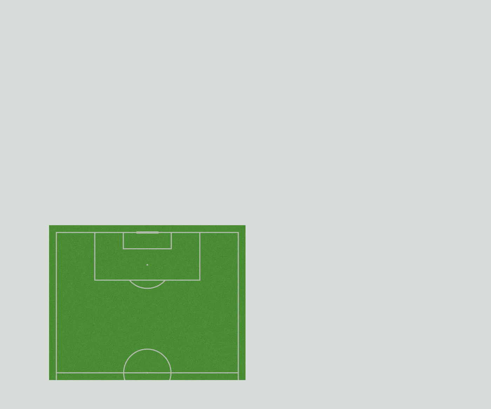**

**Step 2-Drawing the pitch**

****第三步:**现在我们将绘制目标。我们在过滤了 2019 赛季的 Understat 数据帧以及那些导致进球的射门之后，使用了散点图函数。镜头的大小取决于特定镜头的 xG。**

```
#NOW PLOTTING THE GOALS IN THE 2019-20 SEASONdf_fil = df_understat.loc[df_understat['Season']==2019]pitch.scatter(df_fil[df_fil['Result']=='Goal']['X'],df_fil[df_fil['Result']=='Goal']['Y'], 
              s=np.sqrt(df_fil[df_fil['Result']=='Goal']['xG'])*100, marker='o', alpha=0.9,
              edgecolor='black', facecolor='#6778d0', ax=ax_opta1, label='Goal')
```

**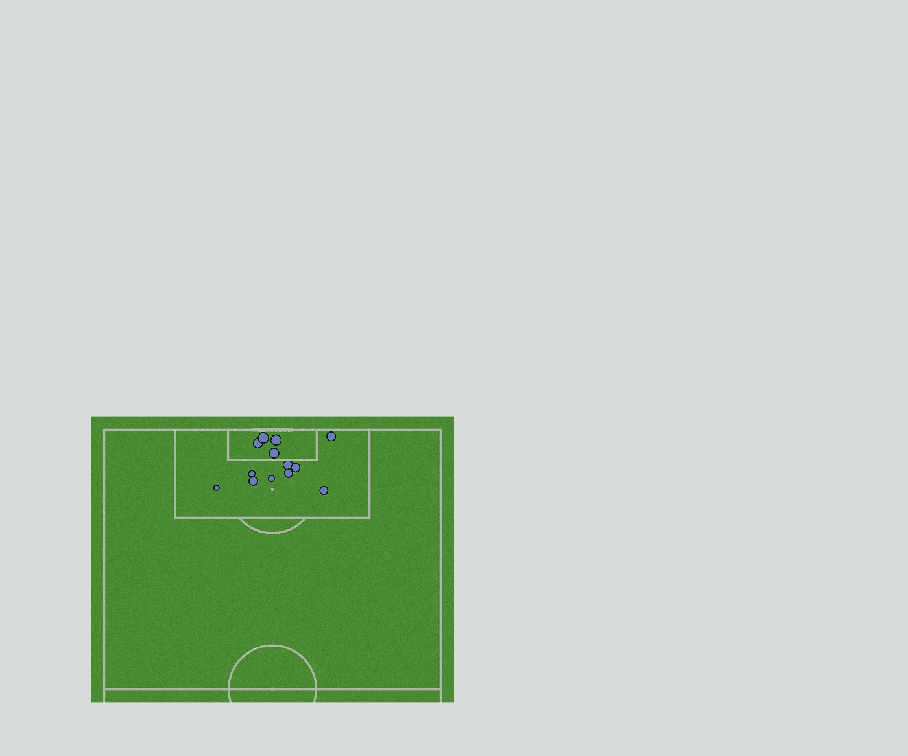**

**Step 3-We obtain the shot zones which resulted in a goal.**

****步骤 4:** 既然我们已经绘制了进球的结果镜头，我们现在也将绘制其他镜头。我们将使用不同的颜色，并通过减少阿尔法使它们稍微透明一些。请记住将此代码放在前面的代码之前，以便首先绘制这些镜头。**

```
#PLOTTING OTHER SHOTSpitch.scatter(df_fil[df_fil['Result']!='Goal']['X'],df_fil[df_fil['Result']!='Goal']['Y'], 
              s=np.sqrt(df_fil[df_fil['Result']!='Goal']['xG'])*100, marker='o', alpha=0.6,
              edgecolor='black', facecolor='grey', ax=ax_opta1)
```

**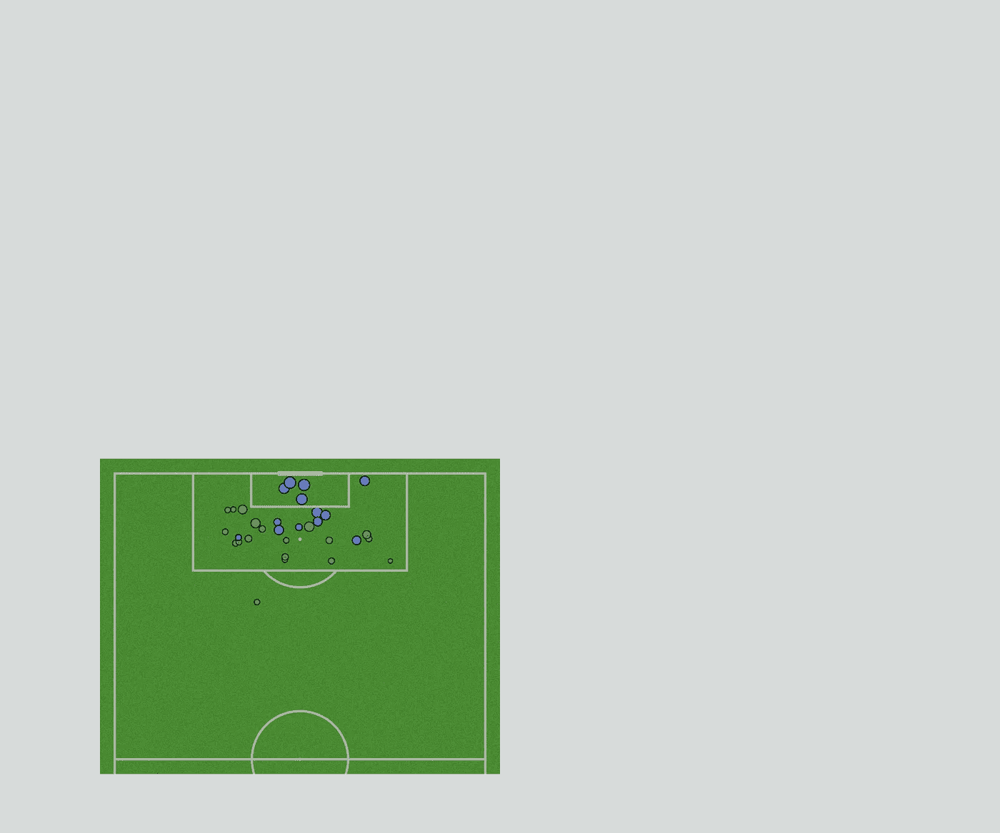**

**Step 4-Plotting all shots of the 19–20 Season**

**太好了，一个情节完成了。我们现在也将尝试给我们的照片添加图例和信息。**

****第五步:**添加标签。我们将为目标添加一个图例，使其更加清晰。**

```
# ADDING THE LEGEND
ax_opta1.legend(loc='lower right').get_texts()[0].set_color("black")
```

****

**Step 5-Adding a legend**

****第六步:**现在我们要给这个图添加一些额外的信息，比如总射门数、进球数等。我们将使用 axes 对象的 text 方法。Y 值可以在 0 到 100 之间波动，但是因为我们只使用上半部分，所以 X 值需要大于 50。
你可以通过改变文本方法的前两个参数来改变位置。**

```
ax_opta1.text(25,61,'GOALS : '+str(len(df_fil[df_fil['Result']=='Goal'])), weight='bold', size=15)
ax_opta1.text(25,64,f"xG : {round(sum(df_fil['xG']),2)}", weight='bold', size=15)
ax_opta1.text(25,58,'SHOTS : '+str(len(df_fil)), weight='bold', size=15)
ax_opta1.text(85, 60, '2019-20', weight='bold', size=20)
```

**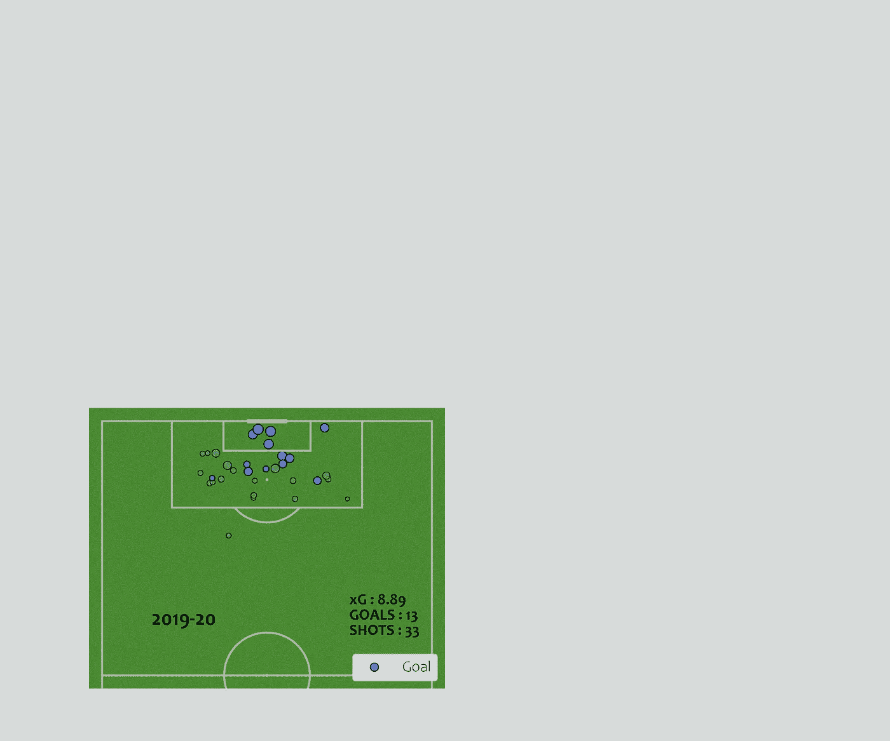**

**Step 6-Adding additional information**

****第 7 步:**现在我们也将为 20-21 赛季重复上述步骤。**

```
# DOING THE SAME FOR THE 20-21 SEASON TOO
ax_opta2 = fig.add_axes((0.50, 0.06, 0.4, 0.4))
ax_opta2.patch.set_facecolor(background)
pitch.draw(ax=ax_opta2)#PLOTTING OTHER SHOTS
df_fil = df_understat.loc[df_understat['Season']==2020]pitch.scatter(df_fil[df_fil['Result']!='Goal']['X'],df_fil[df_fil['Result']!='Goal']['Y'], 
              s=np.sqrt(df_fil[df_fil['Result']!='Goal']['xG'])*100, marker='o', alpha=0.6,
              edgecolor='black', facecolor='grey', ax=ax_opta2)#NOW PLOTTING THE GOALS IN THE 2019-20 SEASON
pitch.scatter(df_fil[df_fil['Result']=='Goal']['X'],df_fil[df_fil['Result']=='Goal']['Y'], 
              s=np.sqrt(df_fil[df_fil['Result']=='Goal']['xG'])*100, marker='o', alpha=0.9,
              edgecolor='black', facecolor='#6778d0', ax=ax_opta2, label='Goal')# ADDING THE LEGEND
ax_opta2.legend(loc='lower right').get_texts()[0].set_color("black")ax_opta2.text(25,61,'GOALS : '+str(len(df_fil[df_fil['Result']=='Goal'])), weight='bold', size=15)
ax_opta2.text(25,64,f"xG : {round(sum(df_fil['xG']),2)}", weight='bold', size=15)
ax_opta2.text(25,58,'SHOTS : '+str(len(df_fil)), weight='bold', size=15)
ax_opta2.text(85, 60, '2020-21', weight='bold', size=20)
```

**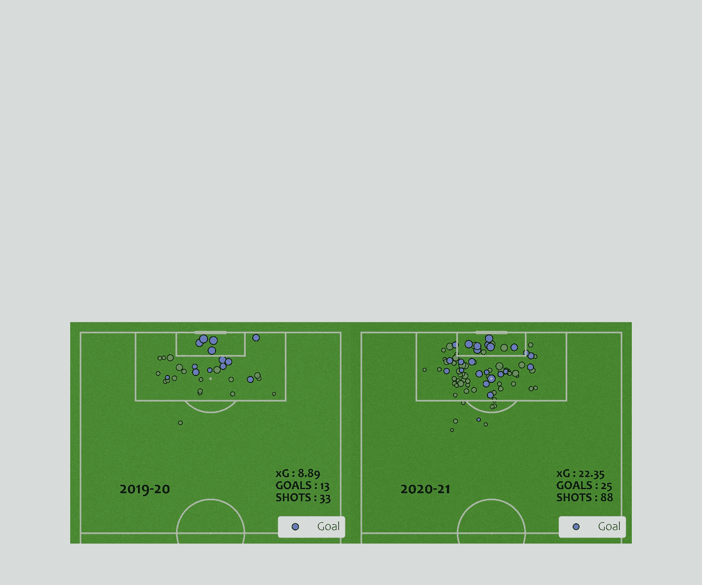**

**Step 7-Repeating for 20–21 season**

****第八步:**我对坐标轴和图片边框的间隙不是很满意。因此，我更改了 ax_opta1 和 ax_opta2 的 fig.add_axes 参数，使其看起来更清晰一些。一点自我操纵导致了这一点。**

**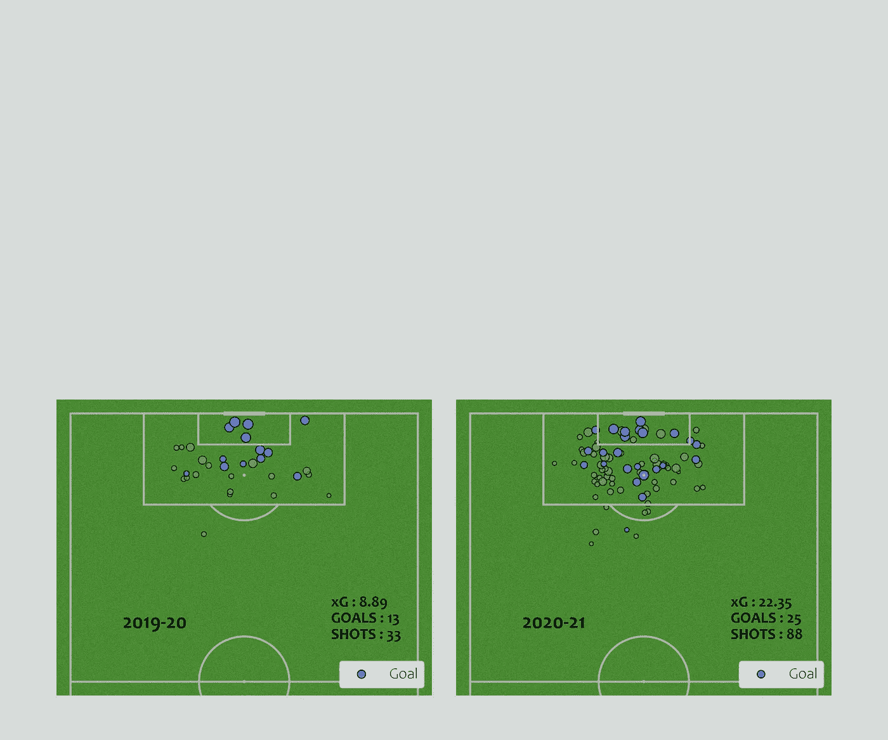**

**Step 8**

**是的，这个看起来好多了。继续看散点图。**

****第 9 步:**现在进入散点图。首先，我们像以前一样初始化轴。**

```
# NOW PLOTTING THE SCATTERPLOT
ax_scatter = fig.add_axes([0.52,0.57,0.4,0.35])
ax_scatter.patch.set_facecolor(background)
```

**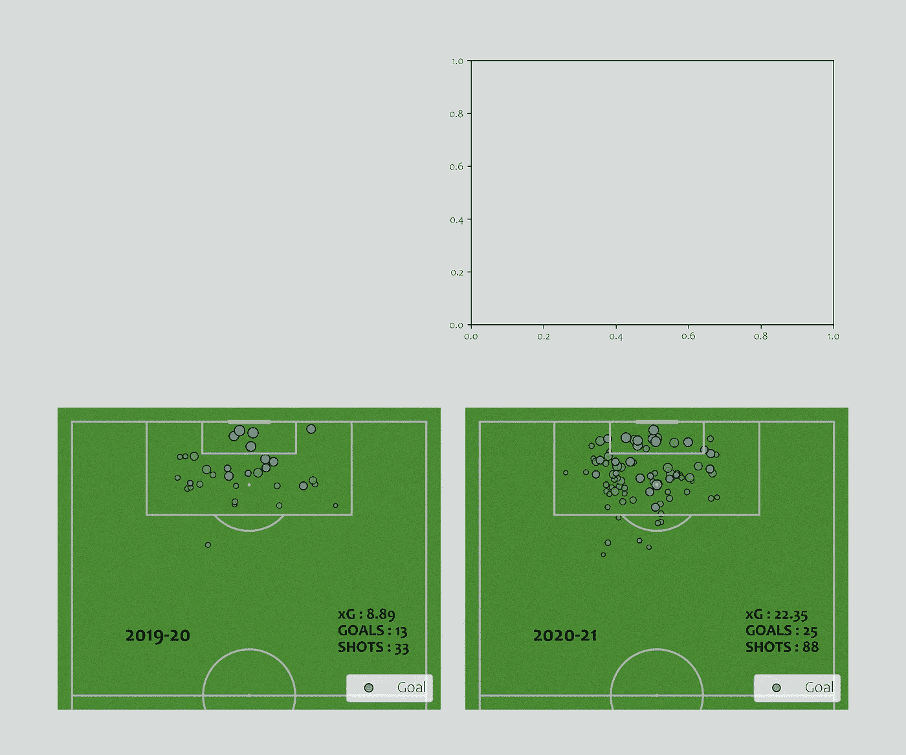**

**Step 9-Adding axes for the scatterplot**

****步骤 10:** 我们现在绘制目标与预期目标图。我们的第一项工作是过滤 Fbref 数据帧，最少播放分钟数和某个位置。**

```
# SETTING UP THE X AND Y OF THE SCATTERPLOTno_90s = 10
df_fil = df_fbref[df_fbref['90s']>=no_90s]
df_fil = df_fil[df_fil['Pos'].apply(lambda x: x in ['FW','MF,FW','FW,MF'])]x,y = (df_fil['xG']/df_fil['90s']).to_list(), (df_fil['Gls']/df_fil['90s']).to_list()ax_scatter.scatter(x,y,alpha=0.3,c='#EF8804')
```

**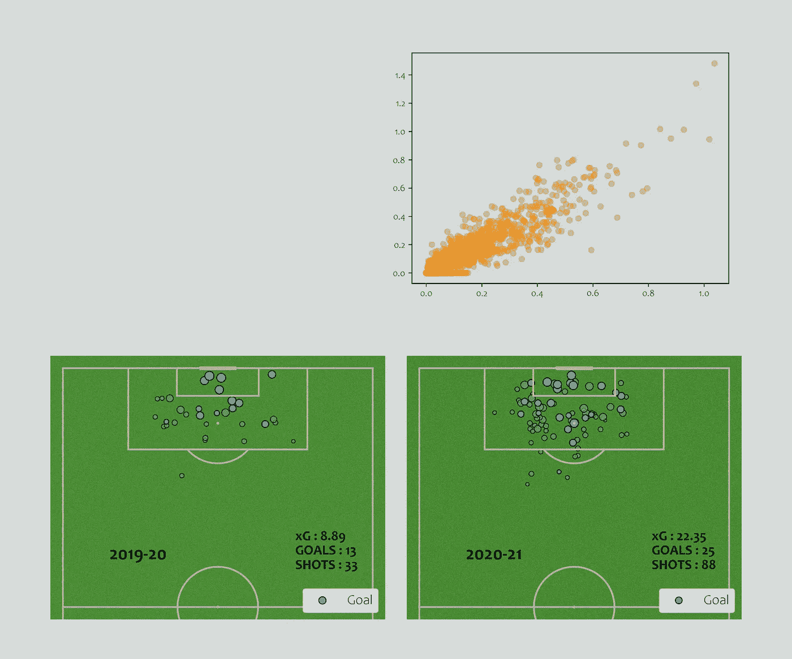**

**Step 10-Plotting the scatterplot**

**我们用十六进制代码#EF8804 表示了前锋的颜色。以后请记住这一点。**

****步骤 11:** 我们现在过滤对应于 Erling Haaland 的数据。我们将在散点图上用不同的颜色和更深的不透明度来突出它。**

```
# NOW FILTERING ERLING HAALAND'S DATAdf_player = df_fil[df_fil['Player']=='Erling Haaland']
ax_scatter.scatter(df_player['xG']/df_player['90s'], df_player['Gls']/df_player['90s'], c='blue')
```

****

**Step 11-Plotting Haaland’s data**

****第 12 步:**现在我们用网格线和 x、y 标签给这个散点图添加最后的修饰。**

```
# ADDING FINISHING TOUCHES TO THE SCATTERPLOTax_scatter.grid(b = True, color ='grey',
            linestyle ='-.', linewidth = 0.5,
            alpha = 0.4)
ax_scatter.set_xlabel('Expected Goals per 90', fontdict = {'fontsize':15, 'weight' : 'bold', 'color':text_color})
ax_scatter.set_ylabel('Goals per 90', fontdict = dict(fontsize = 15, weight = 'bold',color=text_color))
```

**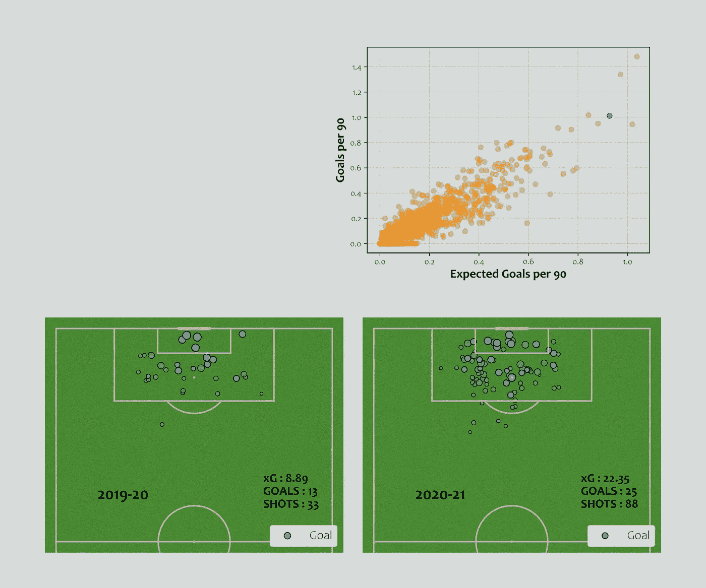**

**Step 12-Adding last touches to the scatterplot**

****第 13 步:**我们差不多完成了，剩下的事情就是再美化一下，添加一些关于厄灵哈兰的信息。**

**我们将从在左上角添加哈兰德的图像开始。我们通过使用 add_axes 来实现这一点，你猜对了。**

**我有一个名为“haaland.png”的图片，保存在我执行这个操作的 Python 笔记本的同一个文件夹中。这是必要的，你这样做或给直接的位置，否则，图像将无法找到。**

```
#ADDING HAALAND'S IMAGE
ax_player = fig.add_axes([0,0.43,0.25,0.45])
ax_player.axis('off')
im = plt.imread('haaland.png')
ax_player.imshow(im)
```

**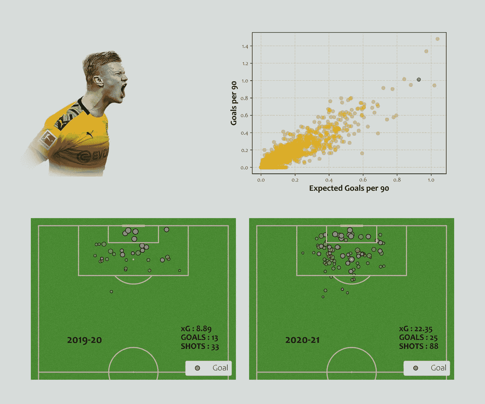**

**Step 13-Adding Haaland’s image**

****第 14 步:**现在我们将向这个仪表板添加一些文本，比如职务、年龄和职位。**

**为此，我们将使用高亮文本包。通过调用三角形<>括号，包含在这些括号中的任何文本都将被指定的颜色着色，有点像 HTML 的 span 标签。对于前锋的位置，我在散点图中取了一个十六进制代码。我们将在这里使用相同的颜色来表示向前。类似地，在猜想中，哈兰的名字将被涂成蓝色，在散点图中，蓝色对应于他。**

```
# ADDING TITLES AND INFOfig_text(0.1,0.94,"<ERLING HAALAND's> FINISHING",weight='heavy', size=25, highlight_textprops=[{'color':'blue'}])
fig_text(0.25,0.85,'POSITION: <FORWARD>',weight='bold', size=20, highlight_textprops=[{'color':'#EF8804'}])
fig_text(0.25,0.81,'AGE: <20>',weight='bold', size=20, highlight_textprops=[{'color':'red'}])
```

**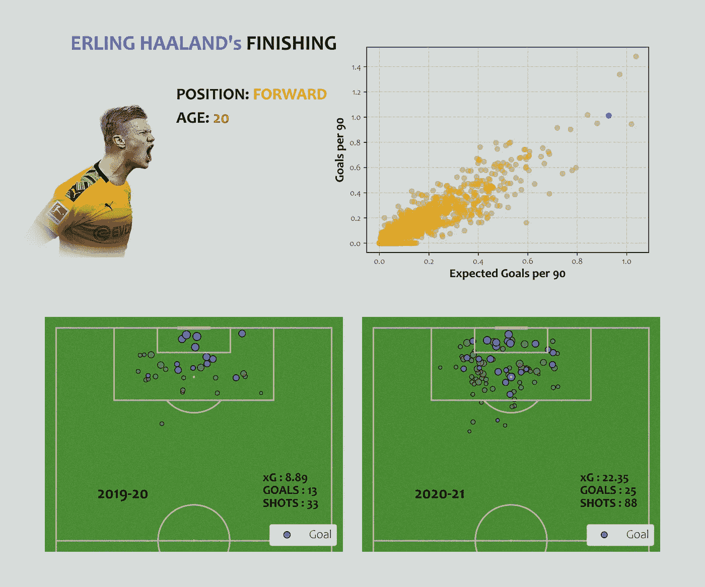**

**Step 14-Adding text**

****第十五步:**就像我们之前添加哈兰德的形象一样，我们也将添加一个 [***多特蒙德***](https://en.wikipedia.org/wiki/Borussia_Dortmund) 徽章，让 viz 更有吸引力。与步骤 13 相同的程序。**

```
# ADDING CLUB LOGOax_team = fig.add_axes([0.27,0.55,0.15,0.15])
ax_team.axis('off')
im = plt.imread('bvb.png')
ax_team.imshow(im)
```

****

**Step 15-Adding a BVB badge**

****步骤 16(可选):**我们还可以通过向该仪表板添加页脚来结束。页脚可以包含关于创建者的信息以及数据源和其他信息。**

```
# ADDING A FOOTERfig_text(0.05,0.03,'Made by Shreyas Khatri/@khatri_shreyas. Data from Fbref.com and Understat.com. Comparison with <forwards>'+
        ' with more than '+str(no_90s)+' 90s('+str(no_90s*90)+' minutes).',
        size=12, highlight_textprops=[{'color':'#EF8804'}], weight = 'bold')
```

**最后，我们准备好了仪表板。**

**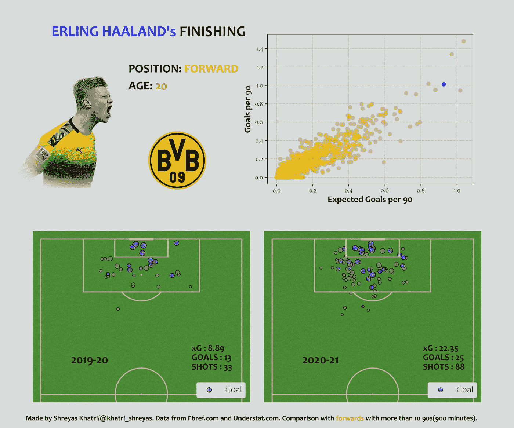**

**Step 16-It’s ready**

**我希望这是一个关于如何为足球运动员制作仪表盘的好教程。我也试着加入了网络抓取，这样就可以在各个方面都有曝光率。如前所述，肯定有很多可定制性，但我希望这些基本步骤将大大有助于您在 Matplotlib 中的可视化技能。**

## **资源**

***它的项目文件夹在这个 GITHUB 存储库中。PYTHON 笔记本和我用的两张图片一起呈现在这里:*【https://github.com/shreyas7kha/DataVizTutorial】T4**