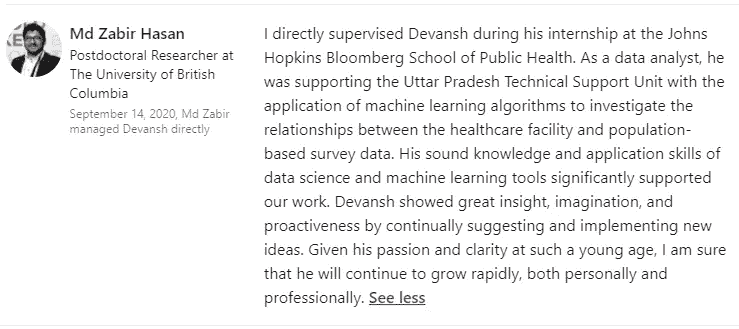

# 如何成为机器学习专家

> 原文：<https://medium.com/geekculture/an-overlooked-tool-for-becoming-a-machine-learning-expert-edfef1556135?source=collection_archive---------4----------------------->

## 不，我不会告诉你做个人项目

为了帮助我了解您[请填写此调查(匿名)](https://forms.gle/7MfQmKhEhyBTMDUD7)

作为机器学习领域的一名教育工作者，我经常看到许多人就初学者如何进入机器学习领域并在那里做得很好给出建议。通常，该建议遵循以下思路:

1.  上数学课的组合。通常涉及概率和统计、微积分、线性代数和逻辑。
2.  找一两个你感兴趣的个人项目。真正好的建议是建立一个端到端的管道，从数据收集一直到分析和报告生成。
3.  查看一些在线教程/文档来学习实现。
4.  享受你的 ML 专业知识。

有些人可能会推荐在线 ML 课程。但这是他们建议的要点。严格来说，这些都不是坏事。然而，它是不完整的。这样的建议会对你有用，但是要达到一个更高的水平会是一种折磨。如果你正试图从其他领域过渡到 ML(或者有任何其他时间义务)，你没有时间进行这种自下而上的方法。这样的人怎么能和我这样全职工作的人竞争呢？或者是在课堂上花几个小时学习这些系统的来龙去脉的人。我花了 3 年的数学时间来学习卷积、拉普拉斯变换和多元优化。我还在学习更多的东西(作为一名学生，我有这个权利)。你没有三年时间。那么你应该怎么做呢？这篇文章将深入探讨这个问题。

如何才能打入更高的机器学习行列？你能给大师们推荐的训练增加什么？简单。阅读 ML 中的研究。拿一些看起来有趣的论文去读。关注 YouTubers，比如[、我自己](https://www.youtube.com/channel/UC1JX4z0BxxNDzniJe1skzTQ)、[亚尼奇·基尔彻](https://www.youtube.com/yannickilcher)、[两分钟论文](https://www.youtube.com/user/keeroyz)，这些论文以人们可以理解的方式对研究进行了细分。去 Twitter 和 LinkedIn，开始关注那些分享有趣的 ML 论文和博客的人。

# 但是我没有太多的专业知识。论文不会太复杂吗？

是也不是。就其本身而言，阅读论文(或观看某人解释论文)不会立即有用。他们会有很多你不知道的关键词。他们用的技术你一半都不会。但是它会让你养成搜索和学习新事物的习惯。它会教你熟悉复杂的问题。这是巨大的。随着时间的推移，你会发现自己对论文理解得更好了。你会开始明白为什么作者做了一件特别的事情。你可能会问为什么他们选择了一种特定的数据增强技术而不是另一种。一篇接一篇，你会发现你的知识在进步。这将有助于你解决专注于项目时会遇到的问题。它解决了这种方法的缺陷。

# 什么瑕疵？

项目重方法是学习技术方面的例外。它会很好地教会你如何体验。没有比亲身经历更好的学习方法了。就机器学习的*方式而言，*没有更好的方式。但它忽略了一件事。在 ML 中,“是什么”通常和“如何”一样重要。你需要学会如何识别问题的不同方面。你需要能够理解管道中的不同步骤。教程和课程是非常结构化的。**他们提供指导，但通常不会给你一个构建解决方案的所有方法的概念。阅读解决类似问题的不同团队和研究不会有这个缺陷。你会接触到不同的想法和观点。例如，阅读所有的计算机视觉研究(以及在恶意软件检测中使用机器学习的研究)产生了我的 Deepfakes 检测想法(我现在正在研究)。**

它还会让你接触到社区中的其他人。你可以和有经验的专业人士讨论这项研究。他们将分享自己的经历，为讨论增添内容。你可以看到一个例子，我和我作品的读者讨论了 SimCLR(一个可视化学习架构)。他们告诉我不平衡数据集的潜在问题。这对我来说是新的。这是参与研究社区的一个被忽视的优势。可以向专家学习。

# 简单地

将自己暴露在研究中会打开你的世界，让你知道有多少种方法可以解决问题。它会让你接触到不同的想法和概念。您甚至可能会遇到新颖的实现(比如如何通过将二进制文件转换成图像来对恶意软件进行分类)。简单来说就是黑。它将允许你像全职员工那样参与到 ML 中。它将帮助你像人们在工作中学习 ML 一样学习(遇到和测试新的想法)，而不需要你自己花费那么多时间去试错。

这适用于更高级的人。我最近在我的 ML 旅程中遇到了 TSNE(2020 年 7 月)。这对我来说是一个有趣的想法，我一直在用它来取得很好的效果。我是通过阅读研究论文偶然发现这个想法的。要了解这个概念的更多信息，请务必查看下面的视频。

Be sure to like and subscribe. Appreciate the love

# 如何进行

我将详细介绍如何自己阅读研究论文(为了不同程度的数学舒适)。所以如果你对此感兴趣，一定要在不同的平台上关注我的工作。但是快速浏览一下。我会建议这样的事情。每周花大约 2-4 个小时接触新的 ML 研究(通过其中一个渠道，或者只是跟随出版物)。确保你对论文的理解达到可以解释它们在高层次上做什么的程度。即使低端，2 篇论文/周也就是 8 篇论文/月。这将成倍增加(复利回报会产生惊人的效果)。使用互联网与人互动。这是一件很棒的事情，你可以将它最大化。

对于技术方面，构建一个简单版本的酷项目。这只是为了让您熟悉技术堆栈和实现。确保你很好地学习了这些技术。并利用从研究中获得的知识为这个项目添加新的内容。很快你也会顺利过渡到精通 ML，并有这样的建议。顶层见。

Another LinkedIn Recommendation

# 向我伸出手

如果这篇文章(或建议)让你有兴趣联系我，那么这一部分就是为你准备的。你可以在任何平台上联系我，或者查看我的其他内容。如果你想讨论家教，发短信给我。我帮助人们进行机器学习、人工智能、数学、计算机科学和编码面试。

如果你想支持我的工作，使用我的免费罗宾汉推荐链接。我们都有免费的股票，对你没有风险。所以不使用它只是失去了免费的钱。

查看我在 Medium 上的其他文章。:【https://rb.gy/zn1aiu 

我的 YouTube:[https://rb.gy/88iwdd](https://rb.gy/88iwdd)

在 LinkedIn 上联系我。我们来连线:【https://rb.gy/m5ok2y】T2

我的 insta gram:【https://rb.gy/gmvuy9】T4

我的推特:[https://twitter.com/Machine01776819](https://twitter.com/Machine01776819)

我的子任务:[https://devanshacc.substack.com/](https://devanshacc.substack.com/)

twitch 现场对话:[https://rb.gy/zlhk9y](https://rb.gy/zlhk9y)

获得罗宾汉的免费股票:[https://join.robinhood.com/fnud75](https://www.youtube.com/redirect?redir_token=QUFFLUhqa0xDdC1jTW9nSU91WXlCSFhEVkJ0emJvN1FaUXxBQ3Jtc0ttWkRObUdfem1DZzIyZElfcXVZNGlVNE1xSUc4aVhSVkxBVGtHMWpmei1lWWVKNzlDUXVJR24ydHBtWG1PSXNaMlBMWDQycnlIVXNMYjJZWjdXcHNZQWNnaFBnQUhCV2dNVERQajFLTTVNMV9NVnA3UQ%3D%3D&q=https%3A%2F%2Fjoin.robinhood.com%2Ffnud75&v=WAYRtSj0ces&event=video_description)