# 分析分治算法并推导主定理

> 原文：<https://medium.com/geekculture/analysing-divide-and-conquer-algorithms-and-deriving-the-master-theorem-996352bbfc8?source=collection_archive---------28----------------------->

本文是算法运行时复杂性分析系列文章的第二部分。在第一部分中，我们介绍了渐近分析背后的数学基础，并分析了几种简单的算法。本文重点分析分治算法。

我们将从头开始分析一些分治算法，然后推导出主定理。

以下是第一部分的链接:

 [## 算法分析的手写介绍(1/2):渐近符号和例子

### 这篇文章是关于渐近符号以及我们如何使用它们来估计算法的运行时复杂度。我们…

medium.com](/@alouizakarie/a-handwritten-introduction-to-analysis-of-algorithms-1-2-asymptotic-notations-and-examples-57324f6becb5) 

# 内容

1.  术语和简单性质:分治算法、对数、线性和准线性复杂性、递归树；
2.  分治算法的分析实例；
3.  主定理:陈述和证明。

# 分治算法和递归树

*分治*是一种算法设计范式，分三步解决一个问题:*划分*、*征服*和*组合*。第一步是将一个总问题分解成几个子问题，第二步是独立地解决所有子问题，第三步是将子问题的解决方案组合成一个总的解决方案。

正如我们将在本文后面看到的，分治算法通常具有涉及对数的复杂性。如果 T 表示某个算法的复杂度，那么我们说当 T(*n*)=θ(log*n*)时该算法具有对数复杂度，当 T(*n*)=θ(*n*log*n*)时该算法具有线性复杂度，更一般地，当存在正数 *a* 使得 T(*n*)=θ(【T2

递归树是一种有用的可视化工具，有助于发现递归算法的复杂性。它是一个树，其中每个节点对应一个不同的递归调用。分治算法的复杂度是每个节点复杂度的总和。

还记得上一部分我们学习的最后一个算法吗？它通过将需要移动 *n* 个磁盘的问题简化为需要移动 *n* -1 个磁盘的问题，递归地解决了汉诺塔难题。

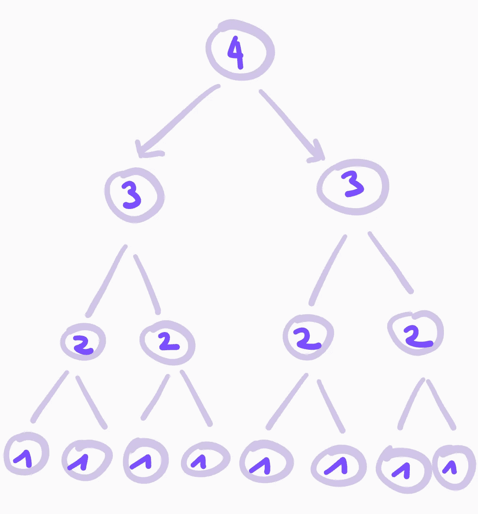

Figure A

图 A 显示了当参数`n`的初始值为 4 时`solveHanoi`的递归树。每个节点内的数字是它所代表的调用中`n`的值。函数的非递归部分在常数时间内运行，所以这证实了当 *n* = 4 时算法的复杂度是 15 = 2⁴-1.我们将在本文后面使用递归树给出这个结果的更一般的证明。

因为我们的算法进行了两次递归调用，所以树是二叉树。更一般地说，进行 *r* 递归调用的函数的递归树是一个 *r* 元树，即每个节点最多有 *r* 个子节点的树。递归树的叶子(没有子节点的节点)对应于算法的基本情况。

大多数时候，相同深度(距离根相同距离)的所有节点都具有相同的复杂度。当所有递归调用将原始问题分成大小相同的问题时，就会发生这种情况。例如，我们通过将一个大小为 *n* 的问题简化为几个大小为 *n* -1 的问题来求解汉诺塔。因此，计算递归树中所有节点的复杂度之和可以归结为计算深度为 *i* 的每个节点的复杂度，以及所有 *i* 的深度为 *i* 、*的节点数，以及递归树中的总高度。这就是对数的用武之地，我们将在下一节看到。*

# 分治算法分析示例

在本节中，我们将研究使用递归树分析分治算法的三个不同示例。

## 有循环树的河内塔

我们首先使用递归树来验证汉诺塔算法的复杂性，我们在第一部分已经证明了这一点。

设 *N* 表示参数 *n* 的初始值，即我们要移动的磁盘总数；以及 n( *j* )传递给深度 *j* 处递归调用的参数 *n* 的值。

深度 0 处有一个单节点(原始函数调用)，对于所有的 *j* ，深度 *j* + 1 处的节点是深度 *j* 处的两倍。因此，深度 *j* 处有 2^ *j* 节点，用于所有 *j* 。

我们知道，对于所有深度 *j* ，n(0) = N 且 n( *j* + 1) = n( *j* )-1。因此，n(j) = *N* - *j* ，对于所有深度 *j* 。到达 n( *j* ) = 1 的基本情况，即当 *j* = *N* -1:最深节点在深度 *N* - 1。由于每次递归调用执行的非递归工作都是在常数时间内运行的(我们将其复杂度*称为*)，所以函数的复杂度由下面的公式给出。

Figure B

## 投入规模的划分:二分搜索法的例子

二分搜索法是一种在排序列表上运行的搜索算法。它通常被归类为*递减-征服*算法，而不是*分治*算法，因为没有*组合*步骤:每个递归调用决定以输入的一半为目标，并丢弃其余部分。

我们将使用以下实现:

二分搜索法的递归树是一个一元树。每一层恰好包含一个节点，如果 n( *j* )表示深度 *j* 处递归调用的输入大小，则 n(*j*+1)= g(n(*j*)/2)，其中 *g* = floor 或 *g* = ceil。

递归树的高度恰好是θ(log _ 2(*n*))，其中 *N* 是原始输入大小(我们将在本节的其余部分保留这一符号)，深度 *j* 、 *N* /2 *ʲ* 处的输入大小。我们将证明一个更一般的陈述，包括我们把原始问题分成任意数量的相同大小的子问题的情况。

假设存在一个正整数 *c* 使得 n(*j*+1)= n(*j*)/*c*对于所有的 *j* ，设 *r* 为递归调用的次数。这是一个几何数列，所以我们很容易找到它的通项。它给出了每个深度的输入大小的表达式(我们假设 *N* 是 2 的幂，以消除 floor 函数的麻烦，但我们稍后会回到这个问题)。记住这一点，我们可以推导出递归树的高度 *H* 的表达式，如下图所示。

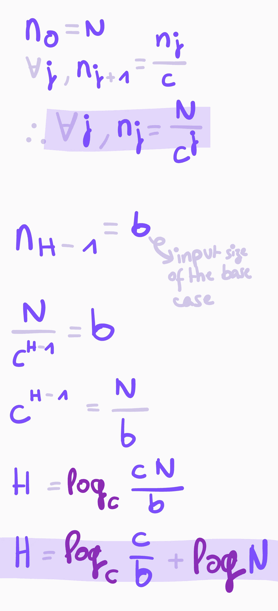

Figure C

在二分搜索法的情况下， *b* = 1，c = 2。所以它的递归树的高度是 log _ 2(2)+log _ 2(*N*)= 1+log _ 2(*N*)。

正如我们将看到的，当我们使用渐近符号时，这个结果可以推广到输入大小不是 2 的幂的情况。但目前，我们可以证明，当 N 是 2 的幂时，二分搜索法具有对数复杂性( *c* 表示非递归工作的复杂性，它在恒定时间内运行):

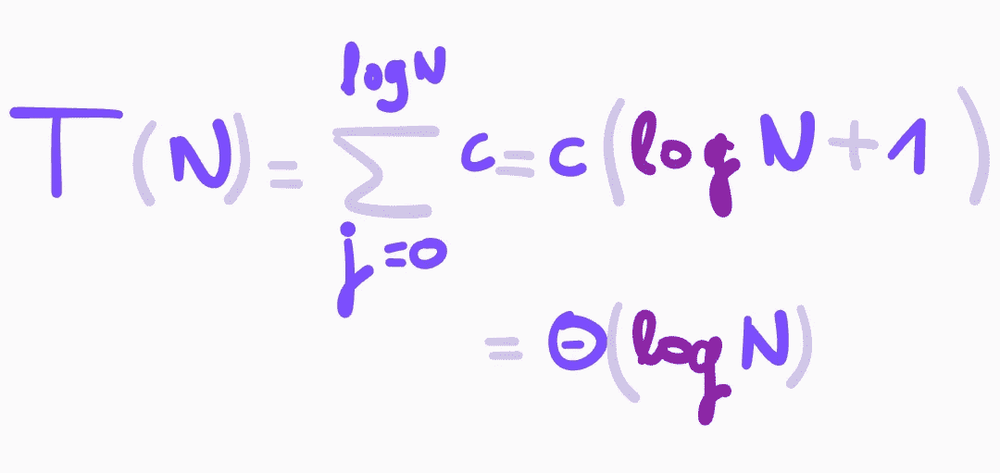

Image D

为了严格证明我们可以忽略 floor 和 ceil 函数的应用，我们将引入两个序列，p+(n)和 p-(n)。它们将每个非负整数分别映射到小于或等于 n 的 2 的最大幂和大于或等于 n 的 2 的最小幂。我们可以表明，对于所有的 *n* ，我们有表达式 p+(*n*)= 2^{ceil(log*n*)}和 p-(*n*)= 2^{floor(log*n*)}。

设 *C* 是一个常数，使得对于所有的 *N* ，如果 *N* 是 2 的幂，那么 T(N) ≤ C log N .这样的常数存在是因为 T(*N*)=θ(log*N*)。因为 T 代表算法的复杂度，所以它必须增加。所以对于每一个自然数 *N* ，T( *N* ) ≤ T(p+( *N* ))。下图显示这个不等式足以证明 T(N) = O(log *N* )。

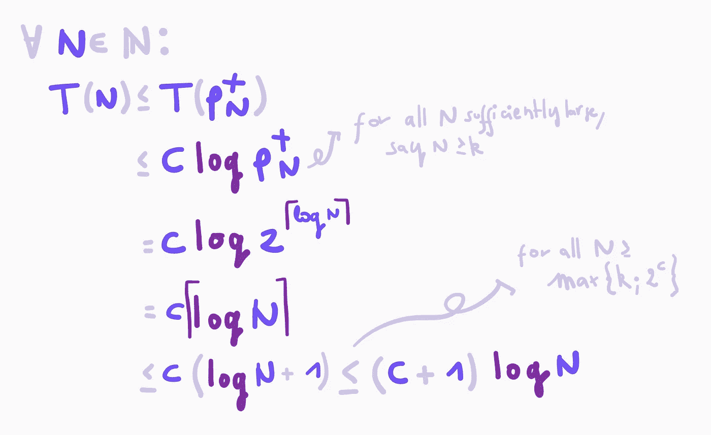

Figure E

我们已经证明，对于超过某个阈值的所有 N 值，T( *N* )小于 log *N* ，直到一个乘法常数。因此，T( *N* ) = O(log *N* )。如果我们用 p-( *N* )代替 p+( *N* )，我们可以证明 T( *N* )也大于 log *N* 一个常数因子，因此，t(*n*)=θ(log*n*)🥳.

我们已经证明了二进制排序具有对数复杂度。

## 合并排序

现在让我们来看一个更高级的例子:合并排序。合并排序是一种排序算法，它将原始列表分成两个大小相同的子列表(取决于 floor 或 ceil 的应用)，对它们进行递归排序，并将两个排序后的列表合并成一个大的排序列表。最后一步由`merge`子程序执行，实现如下:

`merge`相对于 *X* 和 *Y* 的长度 *n* 以线性时间运行:每次递归调用都消耗一个链表的头，并将其前置到`bigList`的头(在常数时间内)，直到它们都为空。这发生在 2 个 *n* 步骤之后。然后我们反转列表，这也需要线性时间。

下面是我们将要分析的合并排序主循环的实现:

复杂度由公式 T(n) = f(n) + T(floor n) + T(ceil n)给出，其中 *f* 是函数执行的非递归开销。我们知道*f*(n)=θ(*n*)是因为唯一不恒定的步骤是*切片*和*合并*，这两个步骤都需要θ(*n*)时间。

我们首先分析当输入是 2 的幂时合并排序的复杂性。

Figure F

正如我们前面看到的，每一层 *j* 包含 2 个 *ʲ* 节点，输入大小为 *N* /2 *ʲ* ，其中 *N* 是原始输入大小。树的高度由我们在《二分搜索法》分析中看到的公式给出:*H*(*N*)= log(*c*/*b*)+log*N*。c = 2，b = 1，所以*H*(*N*)= 1+log*N*。

对所有深度求和，我们可以表明合并排序具有线性复杂度:

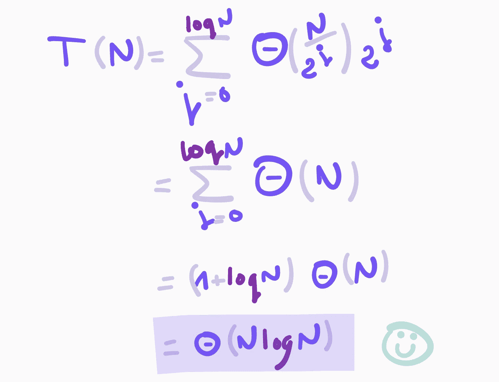

Figure G

我们现在需要说服自己，渐近界限实际上适用于ℕ的任何地方，而不仅仅是当输入是 2 的幂时。就像我们对二分搜索法做的那样，我们将证明当输入是任意自然数时，上界(大 O 近似)是真的。下限(大ω)来自类似的论证。这个证明比二分搜索法的要复杂一点，但应该不会太痛苦。

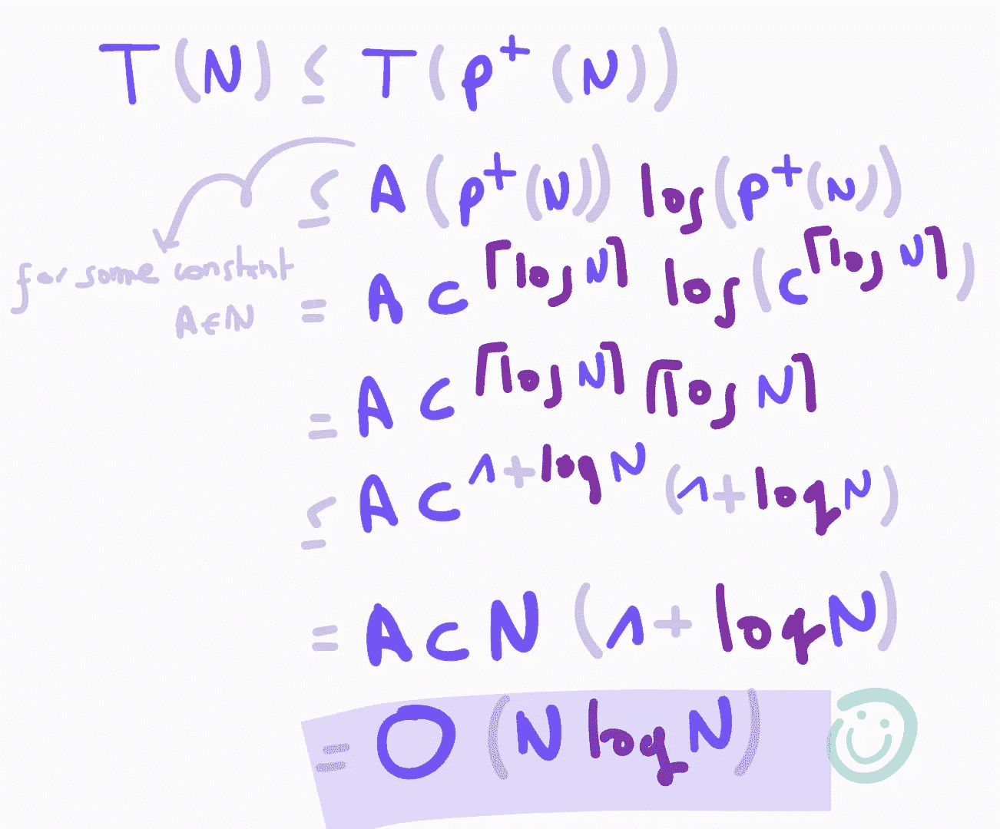

Figure H

我们通过允许一个任意的常数 *c* 而不是 2，使这个证明稍微更一般。

在实践中，发现像二分搜索法和合并排序这样的分治算法的复杂性比我们刚才所做的要容易得多。下一节展示了一种方法，我们可以用它来计算许多递归算法复杂性的一个紧界。

# 主定理

主定理有助于计算分治算法的运行时间复杂度，其中对于某些正常数 *r* 和 *c* ，复杂度服从 T(*N*)=*r*T(*N*/*c*)+f(*N*)形式的递归关系。

当子问题的数量或子问题的大小不恒定时，主方法不起作用。存在另一个更复杂的公式，它能够计算更广泛的算法的运行时间复杂度。这就是著名的阿克拉-宝宝定理。

## 推导主定理

我们考虑一个算法，其运行时间复杂度 T( *N* )由公式 T(*N*)=*r*T(*N*/*c*)+f(*N*)给出。 *r* 表示递归调用的次数，在递归调用之前，我们将输入大小除以 *c* 。log 将始终引用以 c 为底的对数， *f* 表示函数每次调用所执行的非递归工作的复杂度。

设 *b* 表示基本情况下的最大输入尺寸。

我们首先假设 *N* 是 *c* 的幂。

我们算法的递归树的高度是 H(*N*):= log(c/b)+log*N*。在本节的其余部分，我们将假设 b = 1。确切的值并不重要:我们可以在不改变最终结果的情况下向递归树中添加或删除恒定数量的节点，因为我们想要的只是渐近界限。

如果我们对每个深度的复杂度求和，我们得到 T( *N* )的以下表达式:

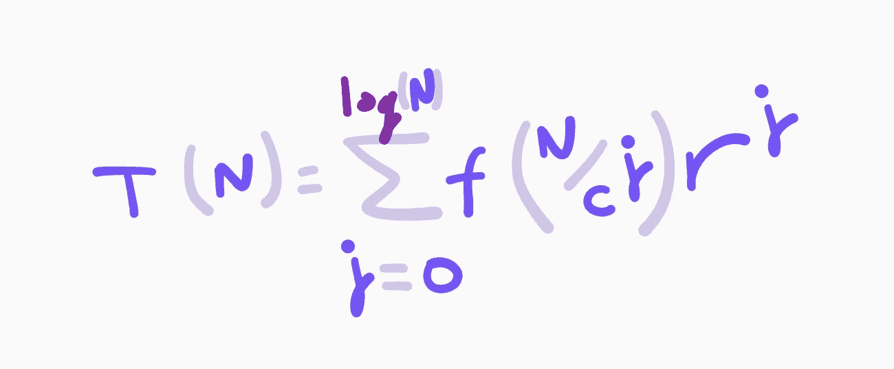

Figure I

我们现在将看看如何在三种不同的情况下计算这个和，这取决于 *f* 增长的速度。

**首先，假设存在一个正数 *t* 使得 *t* < log *r* 和 f(*n*)=θ(*nᵗ*)。**那么，当 *n* 足够大时，我们可以找到一个常数 *A* 使得 f( *n* ) ≤ *Anᵗ* (由于 f( *n* ) = O( *nᵗ* )。为简单起见，我们将假设不等式适用于所有自然数，但这同样对渐近界没有影响。

我们首先证明以下引理:*n*^{(log*r*)-*t*} =(*r*/*cᵗ*)^{log*n*}。

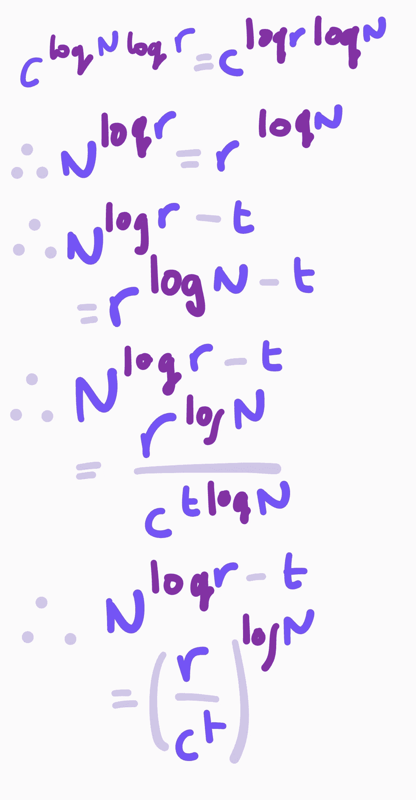

Figure J

利用这个等式，我们可以证明 t(n)= θ(n^{log r }。为此，我们将 T(N)写成递归树的叶子的复杂度 L(N)和内部节点的复杂度 I(N)之和。

我们首先证明 I(N) = O(N^{log r})。

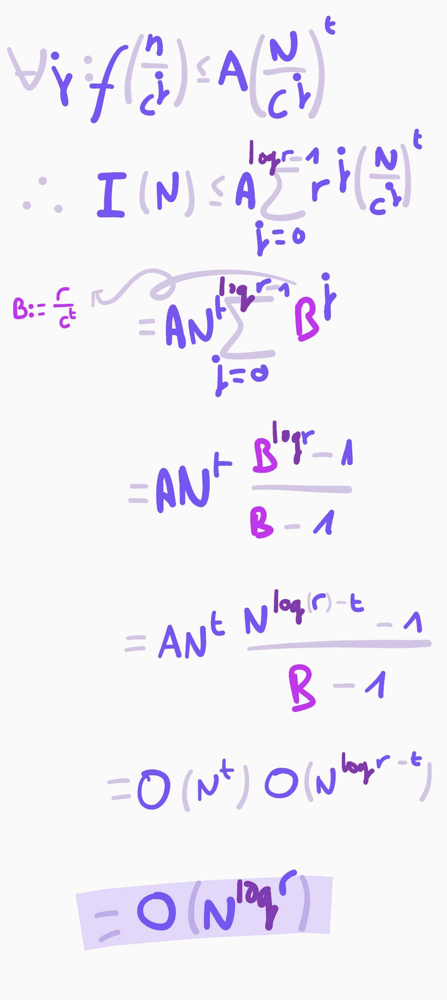

Figure K

L( *N* )是递归树的最后一级。对应的是求和的最后一项，即 l(*n*)= f(1)*r*^{log*n*}。一个类似于我们用来证明引理的论证表明 r^{log N} = N^{log r}。因此，l(n)= θ(n^{log r })，因为有 r^{log N}片叶子都在恒定时间内运行。这使得能够证明**t(n)= θ(n^{log r })**:

*(错别字:是 T(N) = I(N) + L(N)而不是 L(N) + L(N))*

Figure L

直观上，该结果表明，与分解和组合子问题的结果所做的工作相比，为解决子问题所做的工作可以忽略不计(总复杂度与叶节点的复杂度渐近相同)。

我们将所有自然数的上限概括如下:

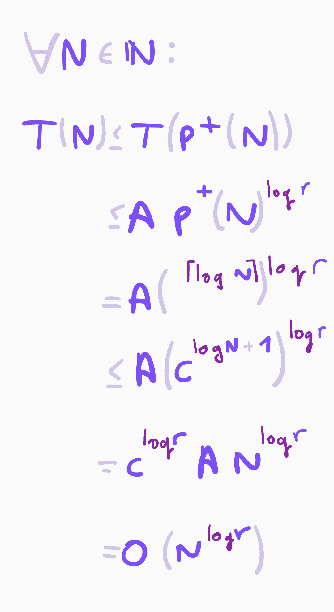

Figure M

而且下界也差不多，用 floor 代替 ceil。

可以获得有用结果的第二种情况是当**f(*n*)=θ(*n*^{log*r*} log*ᴴ**n*时，对于某个非负常数 *H*** (log^ *x* 表示将 *n* 映射到(log *n* )^ *x 【T21)的函数*

我们首先推导出 I(N)的上界:

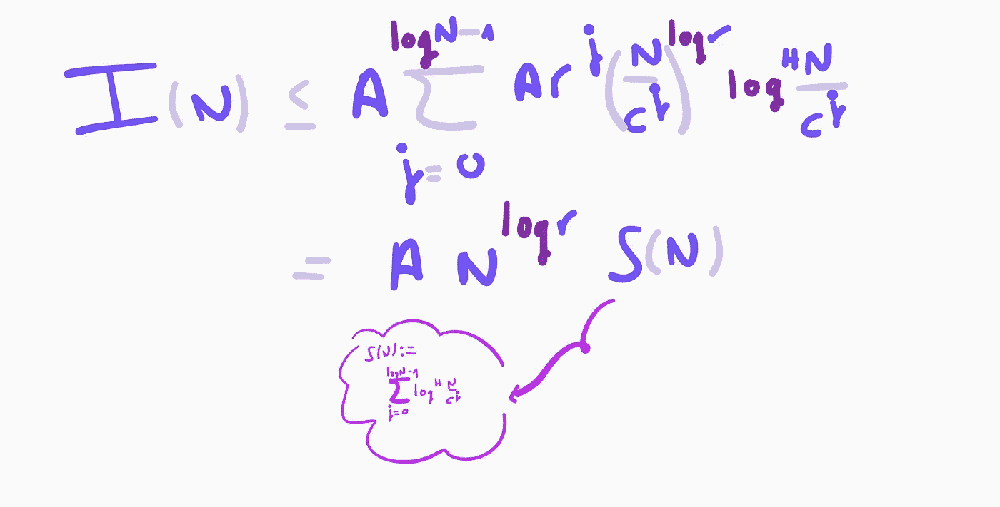

Figure N

同样的论证表明，存在满足 B N^{log r} S(N) ≤ I(N)的正整数 b。

我们现在将证明 s(n)= θ(log^{h+1 } n)。

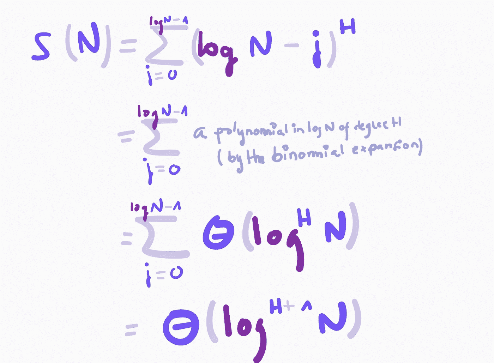

Figure O

这证明了 I(n)= θ(n^{log r } log^{h+1 } n)。

L(N)仍然不变，即θ(n^{log r })。所以 t(n)= θ(n^{log r })+θ(n^{log r } log^{h+1 } n)。利用θ-符号的定义，我们可以得出**t(n)= θ(n^{log r } log^{h+1 } n)**。

对所有自然数的推广类似于我们在合并排序分析中看到的。

第三种情况可能是最简单的一种。我们使用两个假设:t(n)=ω(nᵗ)对于一些 t > log r；并且正则性条件必须成立。正则条件说明存在某个常数 k，使得对于所有自然数 *n* ，0< k < 1 and *r*f(*n*/*c【T29)≤k f(*n*)。*

通过用 *n* 取值 *N* ， *N* / *c* ， *N* / *c* …，迭代正则性条件，我们可以假设 f(*n*)/cʲ≤(*k*/r)ʲf(*n*)对于所有正整数 *j* 。我们可以通过归纳法很容易地证明这一点:

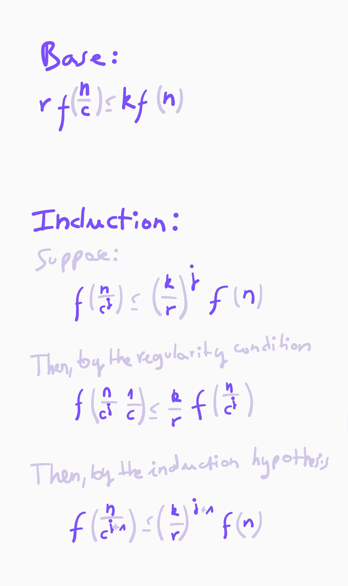

Figure P

使用这个引理，我们可以使用几何和的公式导出上界如下:

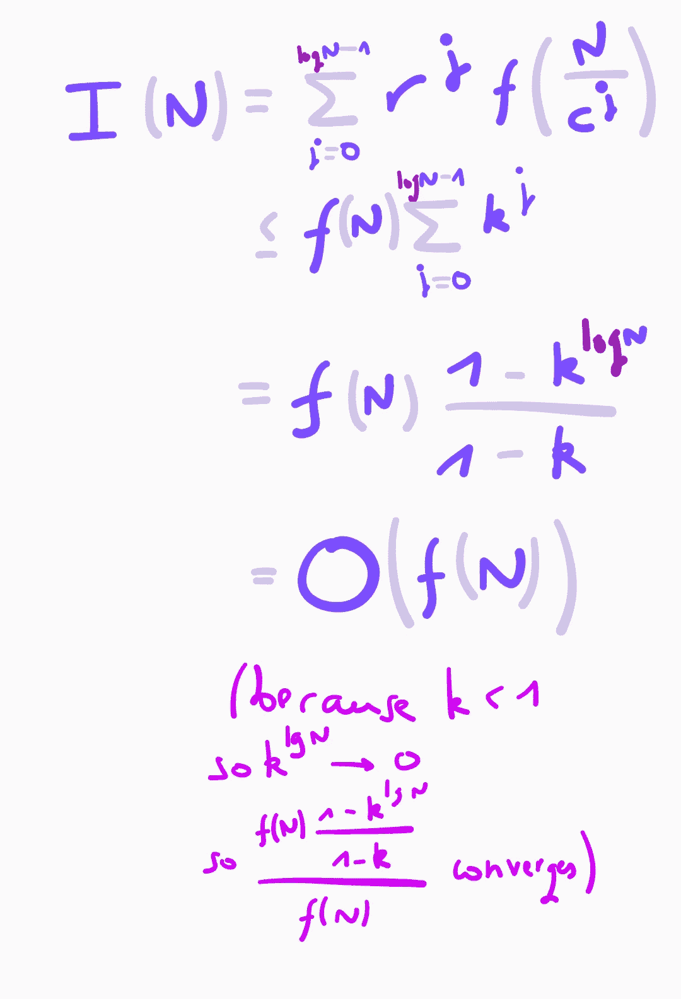

Figure Q

下界的证明就大不一样了。我们从写出*t*= log*r*+*ε*开始，对于某些正的 *ε* ，我们推导出如下不等式:

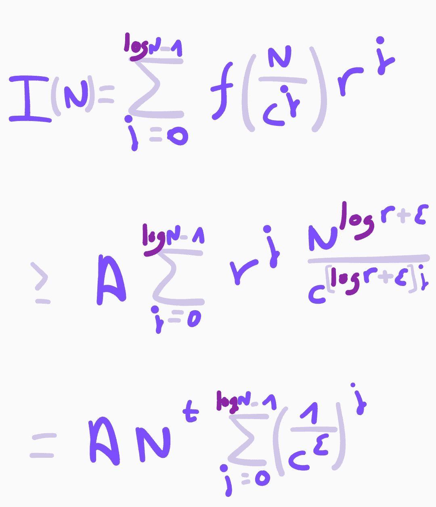

Figure R

我们现在需要证明我们刚刚找到的下界本身就是 *f* (N)的ω。为此，我们将使用(1/c^ε) < 1 这一事实，这意味着级数∑ (1/c^ε)^j 收敛，因此是有界的。

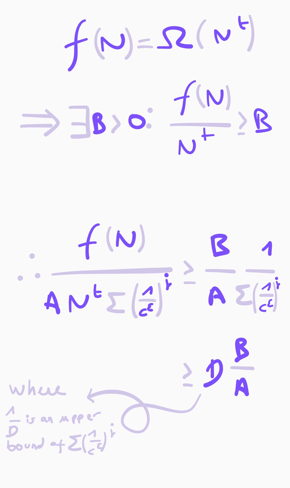

Figure S

这就证明了 I(*N*)=θ(f(*N*))。

所以 t(*n*)=θ(*n*^{log*r*})+θ(f(*n*))。这使得能够推断出**T(N)=θ(f(*N*)**。

总结一下，我们有以下三个案例:

# 参考

*   杰夫·埃里克森的算法:第 1.7 节。
*   *算法介绍*(科尔曼、莱瑟森、里维斯特、斯坦):4.5、4.6 节。
*   *主定理*维基百科上的文章(2021 年 6 月 30 日):[https://en . Wikipedia . org/wiki/Master _ theory _(analysis _ of _ algorithms)](https://en.wikipedia.org/wiki/Master_theorem_(analysis_of_algorithms))。