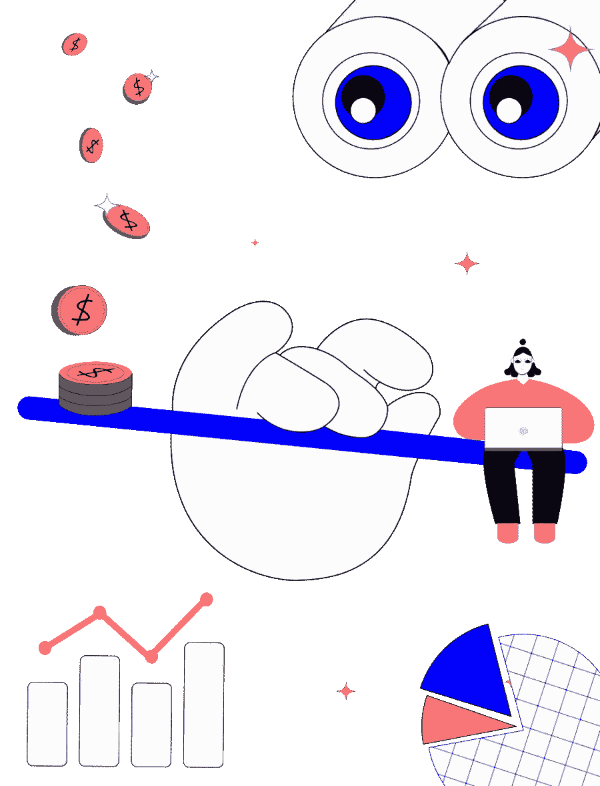

# 产品指标的分析是 MVP 成功的关键

> 原文：<https://medium.com/geekculture/analysis-of-product-metrics-is-key-to-mvp-success-d5fb0cfe6e6?source=collection_archive---------22----------------------->

在深入产品指标之前，让我们从一个[小故事](https://www.businessinsider.com/how-twitter-was-founded-2011-4)开始。

*早在 2005 年，一家播客公司诞生了。它将成为一个目录，人们可以在那里找到、下载和创建音频内容。这个想法似乎很新鲜。团队努力实现它，并与早期用户一起检查它。但是很快这个团队开始意识到他们发现它不够有用。人们听播客的时间没有他们想象的那么多。正如一个主要团队成员所说:“我们构建了它，测试了它很多次，但我们从未使用过它。”他们认为这家初创公司的未来不在于播客，他们必须寻找新的方向。与此同时，苹果公司计划推出带有嵌入式播客平台的 iTunes，这一消息也让该团队大吃一惊。这只证明了他们的发现。该公司开始举办黑客马拉松，员工们可以在潜在的破坏性项目上转移注意力。*

*其中一个项目围绕着简单的理念，被设想为一个基于短信的社交网络。它应该是如此简单，以至于用户甚至没有考虑他们在做什么。他们所要做的只是打些东西然后发送出去。构建平台的 MVP 并与朋友和家人进行验证并没有花费太多时间。发布两个月后，该平台已有 5000 名注册用户。现在，它有 13 亿。它叫做推特。*

这个故事是关于什么的？关于失败？或者，成功？

成功，毫无疑问。这正是一个 MVP 必须做的事情，即给你足够的关于你的产品想法是否可行的数据，并引导产品开发走上正确的道路。即使上市后的数据证明没有人对你的 MVP 产品感兴趣，这也是一个积极的结果，因为你仍然有资源检查其他假设。这是迭代或精益开发的基础。

# 构建-测量-学习:关注什么产品度量？

已经成为商业经典的[精益创业](http://theleanstartup.com/principles)为推出成功产品的新方法铺平了道路——构建-测量-学习。它遵循由客户与产品的交互数据决定的持续改进原则。这种数据驱动的方法将关注点从专家的直觉转移到知识和确定性，从而最大限度地降低冲动性直觉决策带来的风险。结果呢？—每个人都想要的精致产品。

然而，并非所有的产品数据都是有价值的。只有当数据为您提供洞察，并在此基础上对产品的进一步开发做出决策时，它才有意义。

当设定成功的基准衡量标准时，以类似产品为目标是值得的。当我们说“相似”时，我们指的是那些在利基、市场规模、受众、用户场景甚至地理位置方面与你的产品特征相匹配的产品。假设你计划在菲律宾发布一个 P2P 小额贷款平台的 MVP。将你的成功指标建立在全球流行的金融科技产品的性能指标上是没有意义的。这就像把苹果比作橘子。最终的结果会非常误导人。尽量缩小关注范围，这是获得对产品成功有意义的指标的唯一方法。

此外，您还应该记住，您是为一个 MVP 而不是一个现成的产品设置性能指标的。这是一个完全不同的野兽。通常，最小可行产品只有一个核心功能——因此，它们是最小的。为了获取相关数据并衡量正确的事情，你必须让转换漏斗和用户流适应这个功能。通过这样做，你将切断所有的虚荣指标，专注于在当前阶段对你的产品增长真正重要的东西。

为了设置正确的 MVP 产品成功标准，我们建议坚持使用经过实践检验的框架。其中之一是由企业家、天使投资人和 500 Startups accelerator 创始人大卫·麦克卢尔(David McClure)介绍的 [AARRR 框架](https://www.slideshare.net/dmc500hats/startup-metrics-for-pirates-long-version)。

## AARRR 成功的衡量标准

AARRR 指标是基于漏斗的，这意味着它们考虑了每个接触点的用户交互——从仅仅试图使用你的 MVP 到转化为付费客户。这让你了解人们在旅行过程中如何使用产品，他们最看重什么，以及你的链条中的薄弱环节在哪里。这些产品指标为您提供了足够的数据来帮助您做出决策。

**收购**

*产品指标:流量、每次点击成本、获客成本、点击率、跳出率*

没有客户，就没有收入。这是一个简单的事实，很难反对。因此，营销预算的很大一部分往往用于获取用户。让人们发现你的产品并不是什么大事。但是让正确的人发现它是。为此，你应该很好地了解你的潜在客户，并在他们想见面的地方与他们见面。获取指标显示您是否吸引了高质量的潜在客户，并有效地在渠道上投资。

*实用见解*

一个好的做法是跟踪每个渠道的指标。这样，你会发现哪些渠道比其他渠道更有效。还记得 80/20 法则吗？据说 80%的结果来自 20%的努力。如果我们参考这个特例，这意味着 20%的渠道将产生 80%的销售线索。那么，为什么要把钱花在其余 80%不起作用的渠道上呢？太浪费了。最好把它再投资到已经证明有效的那 20%上。

**激活**

*产品指标:转化率、访客注册值、页面停留时间*

这是你开始看到你和用户一拍即合的时候。这个阶段意味着用户不仅参与进来，而且对你的产品产生了兴趣，并采取了一些有针对性的行动。激活指标表明用户是否意识到你的 MVP 的价值。换句话说，它们显示了你是否吸引了用户。

*实用见解*

如果很大比例的用户在这个阶段放弃了，可能有几个常见的原因:1)错误的受众，2)糟糕的用户体验，或 3)没有价值。有了错误的受众，很明显——你需要回到用户研究阶段，提炼用户角色。为了提高用户体验，你需要知道人们在什么时候离开。为此，看看热图，它显示了用户实际上是如何与你的 MVP 互动的。根据我们的经验，激活失败的根本原因通常是注册困难或[缺乏入职培训](https://cxdojo.com/improving-app)。因此，将 UX 改进的努力引向这些行动是值得的。最后，如果用户在你的 MVP 中看不到价值，这是产品无关紧要的警告信号，表明你需要转向。但是，也有可能用户还没有机会理解 MVP 的价值，因为通往它的道路太坎坷了。话又说回来，你需要重新考虑 UX 的设计并简化它。

**保持力**

*产品指标:重复访问、每日和每月活跃用户、客户流失*

激活会通知您用户是否试用了您的产品，而保留指标会显示他们是否定期试用。它是不断地为用户提供价值，并鼓励他们一次又一次地回来购买更多。

*实用见解*

如果用户留存率很低，这意味着人们只是不想使用你的 MVP，因为 1)它没有兑现承诺，2)它没有物有所值，或者 3)它太复杂。你需要做的是优化 MVP 的核心功能，重新考虑定价，或者分别提高 UX 和增加客户支持。还有一个更有趣的场景。有可能一些用户根本没有打算购买你的产品——他们可能只是被你提供的赠品所吸引。然后，将重点转向付费用户是有意义的，这意味着你需要定义目标细分市场，并投资获取此类线索。

**转诊**

*产品指标:推荐、提及、病毒系数、病毒周期时间、评级&评论*

强保留表明用户可能会向其他人推荐你的 MVP 产品。诀窍是，除非你给每个客户提供一个特殊的 UTM 链接来分享，否则用普通的分析工具很难衡量推荐率。然而，你可以跟踪品牌提及、评论或进行客户调查来找出答案。

*实用见解*

如果你注意到人们乐于使用你的 MVP，甚至推荐它(包括在线评论和分享)，考虑实施一个联盟计划，既奖励现有用户，也奖励他们吸引的用户。这将意味着你关心并鼓励他们进一步刺激你的产品的病毒循环。通过这样做，您可以显著降低采购成本。

**收入**

*产品指标:每用户平均收入、客户终身价值、每月经常性收入*

这一条可能会让你直觉地想到老派公式:“收入——成本=利润”，敦促你强调产品的盈利能力。但是有一个问题。在这里，我们谈论的是一个 MVP。它的主要作用是验证产品的生存能力，而从中获利可能是额外的奖励。在这种情况下，您更愿意将收入指标视为用户准备为未来产品付费的标志。你的任务是在随后的迭代中优化它，让付费用户渴望投入更多。

*实用见解*

我们建议你再次求助于 80/20 法则。在这里，它是这样写的:只有 20%的客户负责 80%的收入。通过分析收集到的数据，确定那 20%的人是谁，他们有什么共同点，他们在你的 MVP 中最看重什么。那是你的最佳位置。投资于吸引属于这一类别的线索，并确保通过优化他们对您产品的体验来为他们提供附加值。

然而，即使有适当的数据分析，你可能仍然对你的产品性能不清楚。如果是这种情况，你的定量分析应该用定性分析来补充，即通过访谈、调查和问卷获得客户反馈。我们经常在激活阶段应用它来了解用户是否发现 MVP 是有价值的，并保持——以澄清他们期望什么功能改进。但是，请注意，客户反馈不应该被视为产品成功的唯一衡量标准。调查是用来了解[客户满意度](https://cxdojo.com/cx-metrics-how-to-measure-customer-satisfaction)的工具。它们增加了您的数据分析工作，而不是取代它。

**你可以使用哪些数据分析工具？**谷歌分析、振幅、Mixpanel、Hotjar(用于热图)。

# 总结

有一个简单的事实你应该坚持。无论你在构建一个 MVP 时有多谨慎，如果你没有在其中嵌入分析，你所有的工作都是徒劳的。这就像在没有全球定位系统或地图的情况下在外国开车一样——你根本不知道它会带你去哪里，也不知道你是否能在汽油用完之前到达目的地。

当客户向 CXDojo 寻求咨询时，我们总是强调，在计划阶段就必须考虑测量 MVP。在建立它之前，你需要确切地知道什么将被视为产品成功。所以，从一开始就考虑你将测量什么，以及你将如何去做。如果你有困难，我们会在这里指导你。