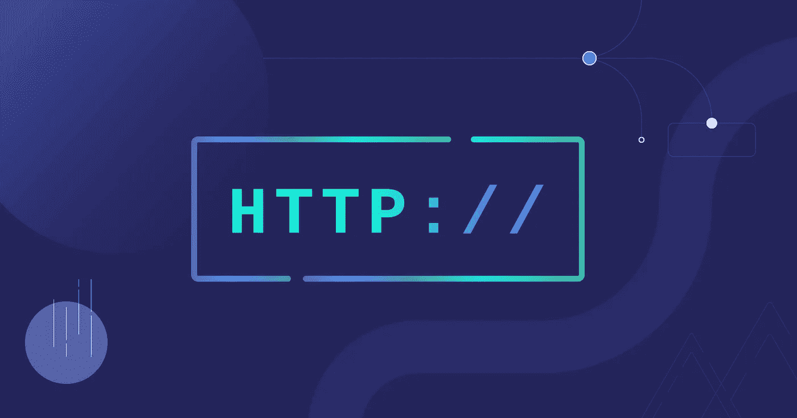

# 解析 Webhook HTTP 请求

> 原文：<https://medium.com/geekculture/anatomy-of-a-webhook-http-request-55d51c1098a8?source=collection_archive---------15----------------------->



HTTP *消息*是两个系统(通常是服务器和客户端)交换数据的常用方式。我们通常将每个 HTTP 消息称为 HTTP *请求*或 HTTP *响应*。

HTTP 请求是 HTTP 请求的一个特定子集，它基于系统中的事件在系统之间传输数据。Webhooks 与许多事件驱动的集成一起使用。

在与我们的客户合作时，我们发现有些人对 webhooks 不熟悉，他们想了解更多关于 webhook HTTP 请求的内容。如果你属于这一类，这篇文章会有所帮助。

# webhook HTTP 请求由哪些部分组成？

webhook HTTP 请求通常包含以下内容:

*   开始行
*   标题
*   车身(有效负载)

**起跑线**。每个请求都有一个单独的起始行。它出现在请求的开始，包括方法、URL 和版本。这是一个开始行的例子:

`POST /webhook/E474BA38/58E1/4544 HTTP/2`

**标题**。每个请求可以有零个或多个头。头通常描述请求的一些信息(例如数据类型或 HTTP 客户端)，但是您可以为几乎任何目的创建自定义头。以下是标题示例:

```
Host: example.com
user-agent: curl/7.79.1
accept: */*
myapp-hmac-sha1: f237e4a4062590a674b0adc1e84614196aae79f4
myapp-api-key: 90B649F2-70F2-4180-95BC-951F5D832F0D
content-type: application/json
content-length: 188
```

**车身(有效载荷)。**每个请求(除了 GET 和 DELETE 之外)都有一个单独的主体，可以是 JSON、XML 或一些二进制文件，尽管多部分请求可以将多种类型的数据编码到一个请求中。这是一个身体的例子:

```
{
  *"orderId"*: *"abc-123"*,
  *"state"*: *"update"*,
  *"updates"*: [
    { *"action"*: *"remove"*, *"item"*: *"widgets"*, *"quantity"*: 5 },
    { *"action"*: *"add"*, *"item"*: *"gadgets"*, *"quantity"*: 20 }
  ]
}
```

当我们把所有的部分放在一起时，一个 webhook HTTP 请求(和相应的响应)可能看起来像这样:

```
curl https://example.com/ \
 --verbose \
 --request POST \
 --header 'myapp-hmac-sha1: f237e4a4062590a674b0adc1e84614196aae79f4' \
 --header 'myapp-api-key: 90B649F2-70F2-4180-95BC-951F5D832F0D' \
 --header 'content-type: application/json' \
 --data '{
  "orderId": "abc-123",
  "state": "update",
  "updates": [
    { "action": "remove", "item": "widgets", "quantity": 5 },
    { "action": "add", "item": "gadgets", "quantity": 20 }
  ]
}'> POST / HTTP/2
> Host: example.com
> user-agent: curl/7.79.1
> accept: */*
> myapp-hmac-sha1: f237e4a4062590a674b0adc1e84614196aae79f4
> myapp-api-key: 90B649F2-70F2-4180-95BC-951F5D832F0D
> content-type: application/json
> content-length: 188
>
* We are completely uploaded and fine
< HTTP/2 200
< accept-ranges: bytes
< cache-control: max-age=604800
< content-type: text/html; charset=UTF-8
< date: Thu, 02 Jun 2022 20:26:44 GMT
< etag: "3147526947"
< expires: Thu, 09 Jun 2022 20:26:44 GMT
< last-modified: Thu, 17 Oct 2019 07:18:26 GMT
< server: EOS (vny/044E)
< content-length: 1256
```

# 检查起跑线

每个起始行由以下内容组成:

*   方法
*   统一资源定位器
*   版本

# 方法

请求方法(动词)定义了 HTTP 请求执行的操作。目前，HTTP 支持八种方法:

*   删除
*   得到
*   头
*   选择
*   修补
*   邮政
*   放
*   找到；查出

然而，webhooks 只使用了其中的一部分。大多数情况下使用 POST，即使是在更新或删除数据而不是创建数据时。有时，我们可能会看到 webhook 使用 GET 来验证 webhook 端点是否存在。不太常见的是，PUT 和 PATCH 用于修改/替换数据。可能最不常见的是，一些 webhooks 使用 DELETE。

# 统一资源定位器

webhook 最常见的 URL 类似于`[https://example.com/my-webhook](https://example.com/my-webhook.)` [。](https://example.com/my-webhook.)

一些应用程序在 URL 后面附加了一个绝对路径，让你知道请求的记录类型:例如，当订单被确认时，`https://example.com/my-webhook/order-confirmation`。

带有查询字符串的 URL 是 web 页面请求(如搜索引擎)的一种普遍模式，其中一些值被附加到标准 URL `https://example.com/my-webhook?param1=Param-Value1&param2=Param-Value2`的末尾。虽然不常见，但一些应用程序使用查询字符串通过 URL 而不是在自定义头中发送元数据。

# 版本

版本就是用于请求的 HTTP 协议的版本。一般会是`HTTP/1.1`或者`HTTP/2`。虽然 webhook HTTP 请求包含版本，但它通常没有影响，并确保 HTTP 请求是有效的。

# 检查标题

webhook HTTP 请求的头可以是默认(标准)头，也可以是自定义头。

# 默认标题

许多标题是默认的，由源系统自动生成。以下是一些 webhooks 常用的默认头:

*   `Content-Type`:描述正文中发送的数据(例如:`application/json`)
*   `User-Agent`:描述用于请求的 HTTP 客户端(例如:`Mozilla/5.0`)
*   `Content-Length`:以字节为单位定义请求的大小。
*   `Accept`或`Accept-Encoding`:定义预期的响应类型。

# 自定义标题

webhook HTTP 请求的自定义头可以有很大的不同，但经常用于签署主体、发送一些其他类型的认证(如 API 密钥)或发送其他数据(如`Customer-ID`)，无论出于什么原因，这些数据都没有包含在请求主体中。自定义标头也可用于 HMAC 签名，以保护 webhook 端点。

下面是一个 webhook HTTP 请求的两个自定义头的示例:

```
myapp-hmac-sha1: f237e4a4062590a674b0adc1e84614196aae79f4
myapp-api-key: 90B649F2-70F2-4180-95BC-951F5D832F0D
```

# 检查尸体

webhook HTTP 请求的主体包含通过 POST(大多数情况下)或者有时通过 PUT 或 PATCH 发送的数据。

这些数据通常是 JSON 格式的，但也可以是 XML、CSV、PDF 或您想使用的任何其他格式。如果需要一次发送几种类型的数据，可以将正文设置为多部分正文。这样做允许像 PDF 或 MP3 这样的文件通过 HTTP 请求和 JSON 等一起传输。请注意，多部分正文需要相应的多部分`Content-Type`头。

下面是一个简单几何体的例子:

```
{*"renderId"*:51266,*"s3Bucket"*:*"test-customer-renders"*,*"status"*:*"complete"*}
```

以下是多部分正文的示例(带有多部分标题):

```
curl 'https://example.io/webhook/' \
  --request POST \
  --header "Content-Type: multipart/form-data" \
  --form person='{"firstname":"Sam","lastname":"McElhaney"};type=application/json' \
  --form photo=@sam.jpeg \
  --form resume=@resume.pdf> POST /webhook HTTP/2
> Host: example.com
> user-agent: curl/7.79.1
> accept: */*
> content-length: 73686
> content-type: multipart/form-data; boundary=------------------------0c985f7380ec6342--------------------------0c985f7380ec6342
Content-Disposition: form-data; name="person"
Content-Type: application/json{"firstname":"Sam","lastname":"McElhaney"}
--------------------------0c985f7380ec6342
Content-Disposition: form-data; name="photo"; filename="sam.jpeg"
Content-Type: image/jpegSOME BINARY DATA...
--------------------------0c985f7380ec6342
Content-Disposition: form-data; name="resume"; filename="resume.pdf"
Content-Type: application/pdf%PDF-1.3
MORE BINARY DATA
%%EOF
--------------------------0c985f7380ec6342--
```

# 结论

随着越来越多的公司(从 Salesforce 到 Shopify)实施 webhooks，这项技术正迅速成为 SaaS 集成的标准。Webhooks 易于理解和实现，并且高度灵活——允许您根据数据的需要将它们变得简单或复杂。