# 使用 Github、AWS CI/CD CodeBuild 和 S3 部署 Angular 应用程序——分步指南。

> 原文：<https://medium.com/geekculture/angular-application-deployment-with-github-aws-ci-cd-codebuild-s3-the-step-by-step-guide-8893777104da?source=collection_archive---------3----------------------->

恭喜您，您已经完成了改变世界的角度应用程序的构建。现在是展示它的时候了，让整个世界都变得更好🤓！在过去的几年中，部署任何应用程序的过程都成了一个热门的讨论话题。但是有一个问题支配着他们所有人。如何自动化这个过程并使之对开发者友好。

在本文中，我们将把 AWS 基础设施作为首选基础设施，并重点关注它的两个产品: [**Codebuild**](https://docs.aws.amazon.com/codebuild/?id=docs_gateway) 和 [**S3**](https://docs.aws.amazon.com/s3/index.html) 。如果你猜对了——**我希望你猜对了**——我们正在努力做到以下几点:

🚀把我们的代码推给 Github。

🚀有一个简单的 [**CI/CD**](https://en.wikipedia.org/wiki/CI/CD) **管道**使用 **Codebuild** 帮助我们检验、构建&部署我们的 Angular 应用程序。

🚀将我们工作的结果或工件推送到 **S3** ，在那里我们将把它配置成一个静态网站托管者。

🚀定制构建过程以包含用户变量— **TBD 即将推出🙈**

过去的清单会有一些基本要求:

AWS 帐户。

2 — Github 帐户。

3-工作角度应用。

**免责声明**:如果您没有 Angular 应用程序，您仍然可以跟随，只需:

1-使用 angular Cli 引导您的 Angular 应用程序。

2 —创建代码并将其推送到 Github，您就可以开始了！

Cute cat trying to deploy code to AWS 🙈

## 1 —整体架构

我们的最终目标是建立并运行以下体系结构:

Final architectural schema.

让我们来解释一下我为这种部署所做的上述架构决策的一点一滴:

答:开发人员将开发他的 Angular 应用程序，并将代码推送到 Github repo。

b——他的 AWS 帐户中的开发人员创建了两件事:一个代码构建过程和一个 S3 桶。

开发人员管理不同部分之间的整体授权。

D —开发人员将 S3 存储桶配置为静态 web hoster +存储桶策略，以使公众可以访问这些存储桶。

e-code build process 将从 Github repo 中提取代码，并使用 Angular Cli 执行必要的构建过程。

f——code build 过程会将产生的工件(dist 文件夹)推到选择的 S3 桶中。

很简单，不是吗！现在，我将认为你已经启动并运行了你的项目，你的代码被放入了 Github repo。为了清晰起见，我将使用以下项目:

 [## GitHub-houssem-yahiaoui/angular-aws-cicd-demo:只是一个展示 AWS 代码构建 cicd 的演示应用程序…

### 此项目是使用 Angular CLI 版本 10.0.3 生成的。为开发服务器运行 ng serve。导航到…

github.com](https://github.com/houssem-yahiaoui/angular-aws-cicd-demo) 

这个回购将有最新的和改进的构建脚本，我们将很快介绍。现在转到您的 AWS 帐户，在搜索栏中搜索 Codebuild。

## 2 — AWS 代码构建流程:

为了保持整洁，这是我们代码构建步骤的迷你议程:

A —创建一个代码构建项目。

B —创建一个 buildspec.yml 文件。

c-更新 CodeBuild I'am 角色以访问 AWS S3

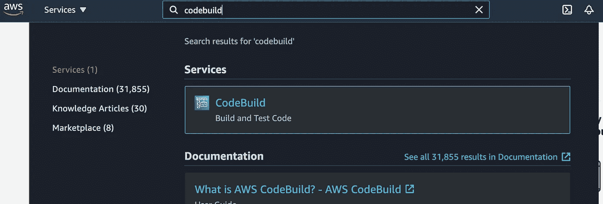

接下来，在该部分，我们要创建一个新项目，如下所示:

Codebuild main screen

然后，我们将填写我们的项目详情如下:

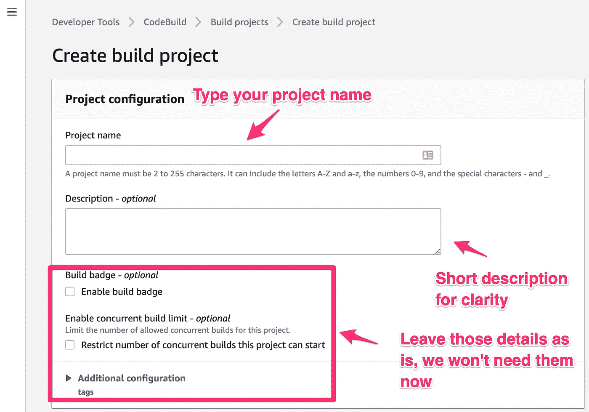

Codebuild project creation phase — 1

下一步非常重要，因为我们将配置我们的代码源，AWS Codebuild 为我们提供了一个包含主要代码版本平台的综合列表，如下表所示:

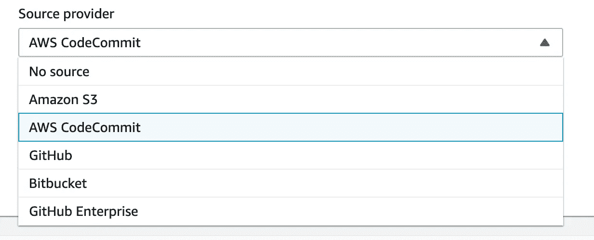

AWS Codebuild different code sources selector.

在我们的例子中，我们将选择 Github，因为它是托管代码的地方。现在，这将需要您进行 OAuth 授权，以便 AWS CodeBuild 可以与您的 Github 帐户通信，并提取所有现有的存储库，所以让我们开始吧。

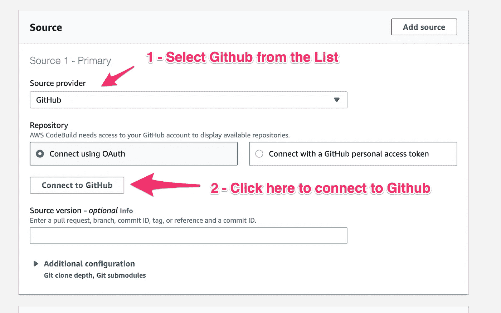

Codebuild Source selection phase — 2

接下来，在点击“连接到 Github”后，您将看到一个弹出的 iframe 列表，要求您授权 Aws 连接您的 Github 帐户:

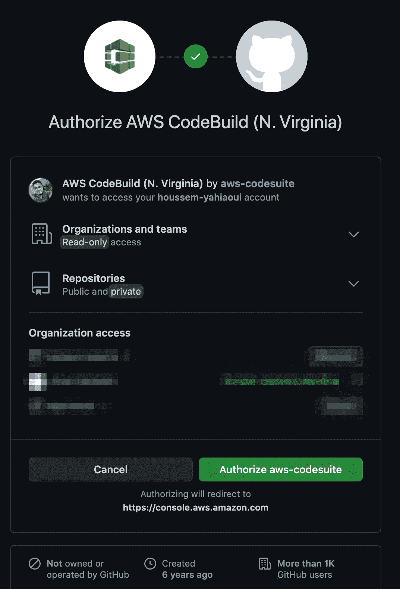

Github OAuth Authorization

点击“**授权 aws-codesuite** ”按钮后，您将看到以下屏幕:

点击“**确认**按钮，现在你给 AWS 访问你的个人 Github 账户的权限，我们可以在那里进行所有正常的 Git 操作，之后，你将有两个选择，要么选择一个公共项目，要么从你的 Github 仓库中选择一个项目，在我们的例子中，我们将选择后者。

Codebuild Source selection phase — 3

有趣的是，Codebuild 使用 [**Docker**](https://docs.docker.com/get-started/overview/) 实例来运行它的操作。像任何 docker 实例一样，它需要一个环境、操作系统映像..等等。代码构建也给了我们管理它的能力。向下滚动并在**环境**部分选择以下选项。

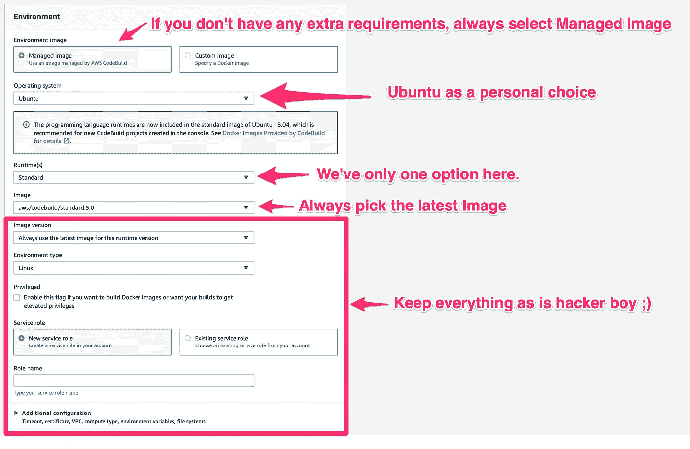

Codebuild Source selection phase — 4

**推荐🙌:**

1 — **尽可能使用托管映像。**

2 — **总是**选择最新的图像，所以如果你要找例如**标准:6.0** 的话，你选择它只是为了拥有最新最棒的技术。

> PS:作为最后一步的一部分，AWS 将自动为我们的 CodeBuild 项目创建一个新的 [IAM](https://docs.aws.amazon.com/IAM/latest/UserGuide/id_roles.html) 角色，当我们需要为我们的构建过程添加额外的访问时，比如 S3，参数存储，这将是需要的..等等。

下一步至关重要，因为我们需要指定我们的构建文件，这个构建文件将包含 Codebuild 运行所需的所有命令。Codbuild 将搜索一个 **buildspec.yml** 文件，这是默认的文件名，但是根据您的情况和需要，您会看到以下选项:

Codebuild Source selection phase — 5

在我们的例子中，我们将选择“**使用一个 buildspec 文件**”选项，它将和我们的文件看起来像这样:

让我们解释一下这个文件的不同部分，因为在创建您的构建脚本时，充分理解每个步骤是至关重要的:

*   **版本**:这是 AWS 提供的，参见[的文档在这里](https://docs.aws.amazon.com/codebuild/latest/userguide/getting-started-cli-create-build-spec.html)。
*   **env** :我们可以添加本地环境变量、参数存储路径…等等，供以后在我们的代码构建规范文件中使用。
*   **阶段**:这里我们将指定构建过程将经历的所有不同阶段，作为 buildspec 文件展示，我们有不同的阶段，它们是: ***安装*** 、 ***pre_build*** 、 ***build*** 、 ***post_build。*** 每一步都会有一组命令在里面。后面的命令将与您通常在本地机器上运行的任何 bash 或控制台命令一样。
*   **安装阶段**:在 ***安装*** 阶段，我们将 ***运行时版本*** 指定为 ***nodejs 版本 14.x*** ，然后作为命令的一部分，我们将安装应用程序依赖项以及 ***@angular/cli*** 包来运行我们的构建。
*   **构建阶段**:我们运行一个简单的 echo 命令来简单指示正在发生的事情，然后运行 angular-cli 构建命令来生成最终的工件。
*   **后期构建阶段:**用于步骤分离的另一个 echo 命令，进入 dist 文件夹，然后简单地列出我们的文件夹内容(我已经将此步骤添加为调试步骤，在生产级别将其删除)，之后我们运行 AWS cli 命令，请记住 AWS cli 命令将是任何构建过程的一部分，因此我们可以使用任何 AWS 功能。位于 **buildspec.yml** 文件第 **22** 行的命令将简单地将本地文件夹的内容与我们的 AWS S3 桶同步。`--delete`参数是告诉 S3 存储桶在我们有新内容时删除它的所有内容。

让我们完成构建过程:

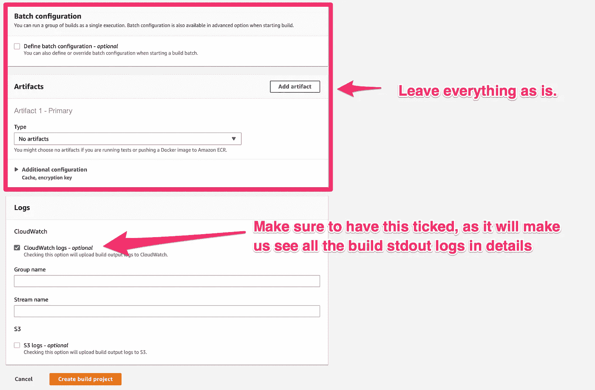

Codebuild Source selection phase — 6

至此，我们已经完成了构建过程。现在点击“**创建构建项目**按钮。

现在，我们的 CodeBuild 项目不会完全工作，因为它没有访问 S3 的权限，为此我们需要给这个项目 [IAM](https://docs.aws.amazon.com/IAM/latest/UserGuide/id_roles.html) 角色，能够访问& modify AWS S3 存储桶。在您的 Codebuild 项目中，转到**构建细节**选项卡。

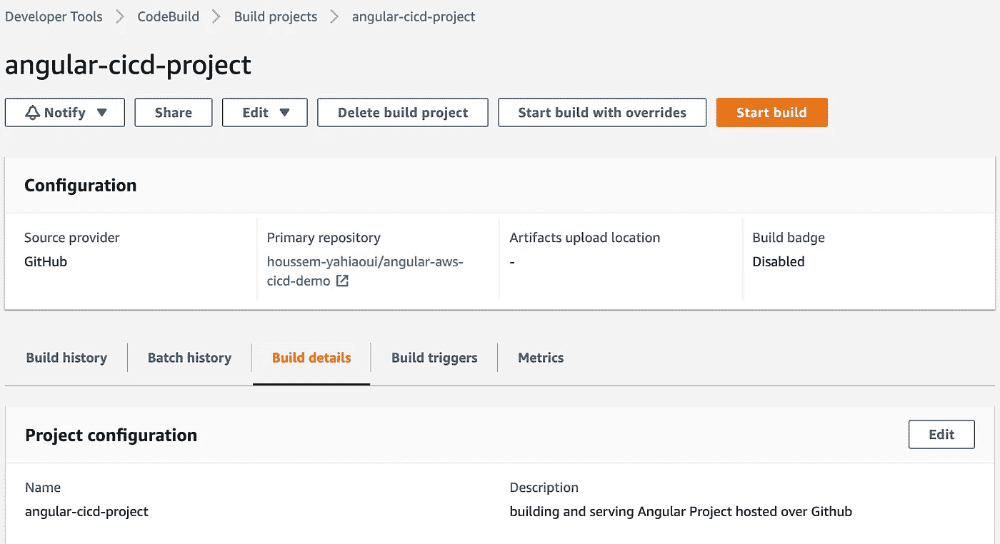

AWS CodeBuild Project Page

向下滚动到环境部分，在那里您将找到您的项目 ARN 名称。

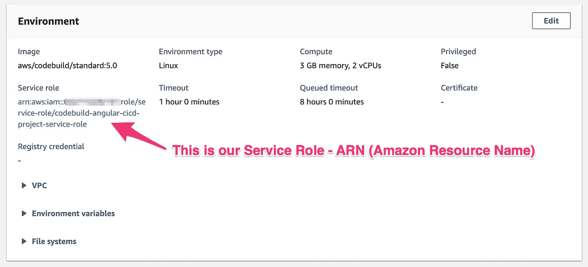

AWS CodeBuild Project Build Details page

单击该链接会将您带到特定服务角色 [IAM](https://docs.aws.amazon.com/IAM/latest/UserGuide/id_roles.html) 策略页面，在这里我们将添加所需的访问权限，您会发现 AWS 已经为您提供了一个可以扩展的简单策略。

AWS CodeBuild project managed simple policy

单击该政策，我们将进入另一个页面，在那里我们可以查看和更新我们的政策:

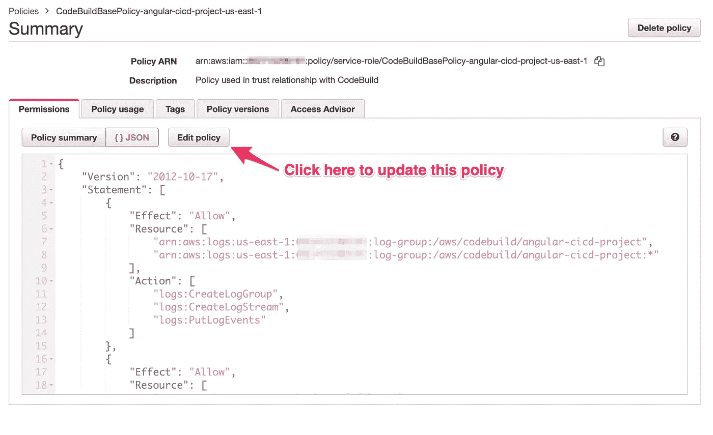

AWS Codebuild Manage policy update page

单击 Edit Policy 按钮后，您将有一个简单的 JSON 编辑器，将该语句添加到语句数组中:

我们所做的非常简单，我们允许主要的 S3 操作，从列表到删除，到将对象放在特定的资源(或桶)上，以限制我们端的访问。

不要点击 ***审核策略按钮*** ，**确认变更**，这样，我们就完成了代码构建和我们的迷你议程🥳，现在让我们专注于 S3。

## 3 — AWS S3 铲斗配置:

为了做好充分准备，我们现在需要做以下工作:

a——创建一个 S3 存储桶，并将其命名为***my-awsome-bucket-of-files*(缺少命名是一个真正的问题🤣).**

B —将 S3 配置为 ***静态网站托管*** 。

c—Tun off***阻止公共访问。***

D —更新**存储桶策略**。

在搜索栏中，查找 S3:

点击“**创建桶**”按钮，将出现以下画面:

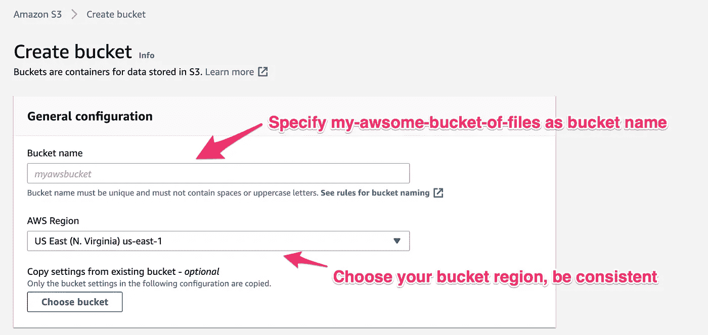

S3 bucket creation

接下来，取消勾选该桶的**阻止公共访问设置**

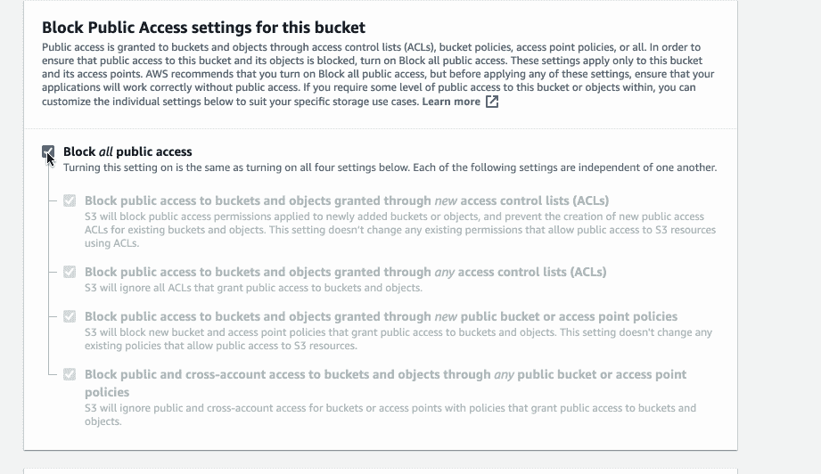

现在，让其他一切保持原样。向下滚动并点击“**创建桶**按钮。

现在，单击您新创建的 Bucket，转到“ **Properties** 选项卡，如下所示:

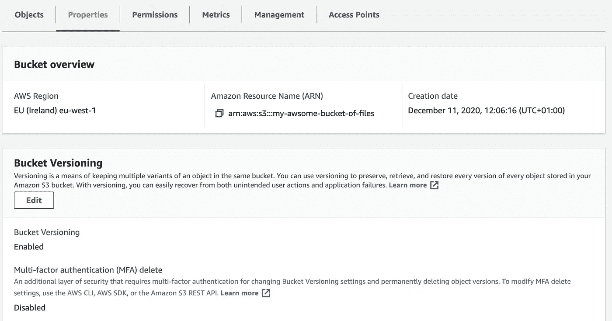

S3 bucket properties page

现在向下滚动到“**静态网站托管**”部分，默认情况下**会被禁用**。

S3 bucket Static website hosting section

现在单击“编辑”按钮，您将被带到一个新页面，您可以在此启用它，如下所示:

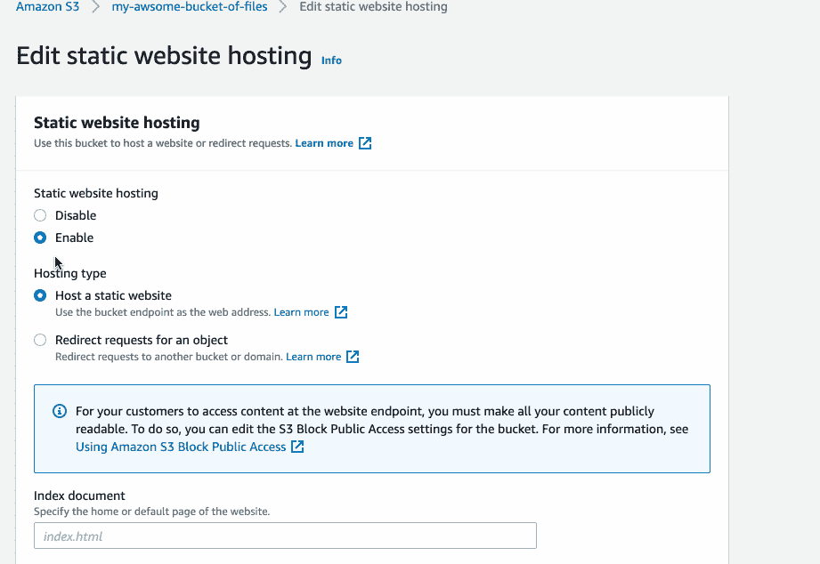

所以在 gif(及其 jif——和我战斗💪在评论部分)，我们做了以下工作:

1-启用静态网站托管。

2-将索引和错误页面设置为 inde.html，因为我们希望我们的 Angular 应用程序从那里接管错误或正常页面显示。

3 —之后，AWS s3 会给你你的**桶公共 URL** 。

到目前为止一切顺利，现在我们需要更新 [AWS S3 政策](https://docs.aws.amazon.com/AmazonS3/latest/userguide/example-bucket-policies.html)，这样我们就可以以公开模式访问我们的文件。要更新我们的权限，请单击**权限选项卡**并滚动到存储桶策略部分，然后编辑策略。

将以下策略添加到语句数组中:

这将确保我们可以在公共模式下读取存储桶内容，而无需任何策略签名签名，如果您正在访问私有内容，这是很典型的。

如果一切正常，您将在您的存储桶名称旁边看到此标志:

这样，我们就正式配置了我们的 S3 存储桶干得好，🥳

## 3 —让我们进行系统测试🚀

回到您的 Codebuild 项目，点击**“Start Build”**之后，我们的构建过程就开始了，您可以通过两件事来监控它:构建阶段部分，在这里我们可以看到我们在 Buildspec.yml 文件中指出的所有面:

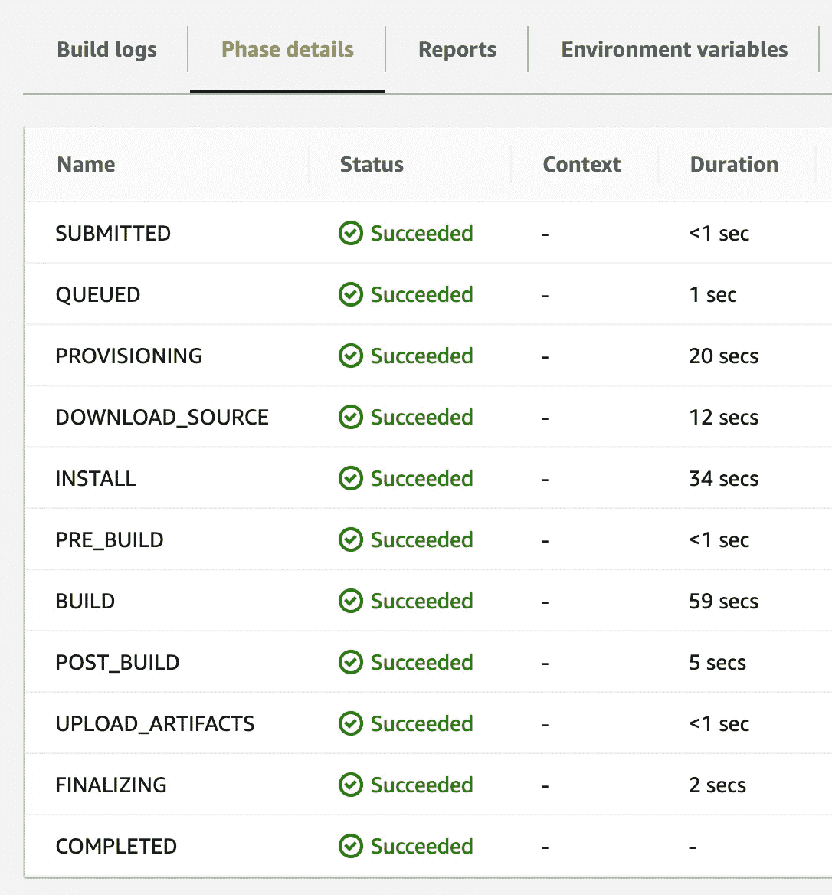

Build process phases

如果您的构建过程一切顺利，您将对所有地方进行绿色检查，否则系统将指出您的系统出现故障的正确位置。

作为第二个检入点，您可以通过 Build logs 选项卡检查日志:

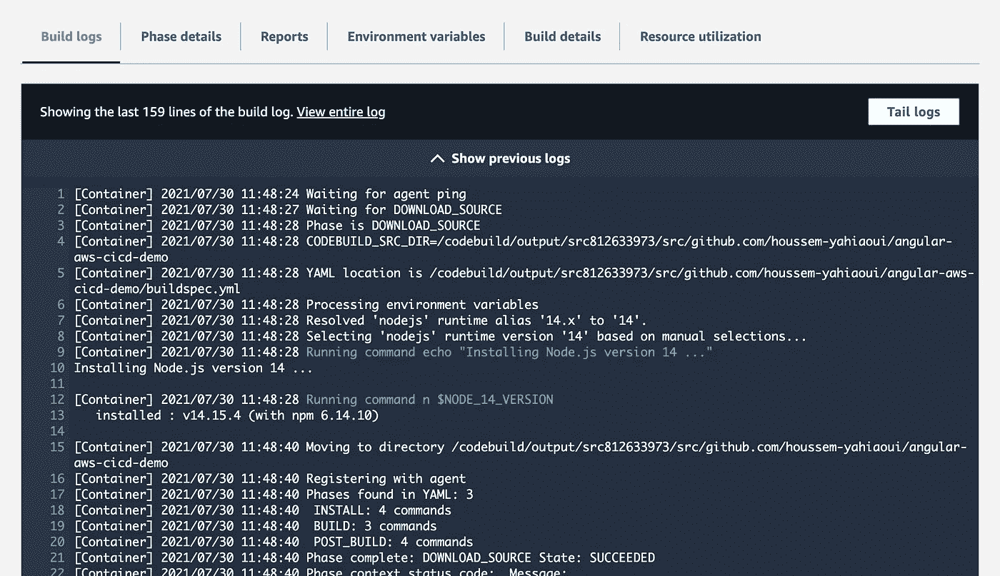

如果你向下滚动，你会发现我们的`ls -la`命令正在执行

之后，S3 同步命令:

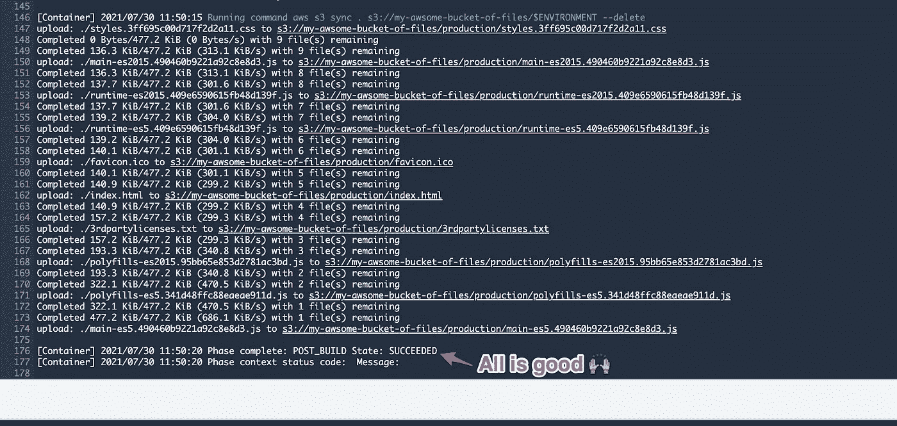

现在去你的 S3 桶，你会看到一个非常熟悉的场景:

我们所有的工件或构建命令的结果都被同步到我们的 S3 桶中，并反映在我们的网站上。

## 4 —定制构建流程:

很快就到 TBD 了！

## 5 —建议

1 —建议在不同的环境中使用不同的存储桶，这意味着转移和生产应该在不同的存储桶中，尽管您可以将它们放在同一个存储桶中的两个不同文件夹中。

2 —为了安全性和可送达性，始终将您的 S3 存储在一个 [CloudFront](https://aws.amazon.com/fr/cloudfront/) Edge 实例之后，毕竟，它是一个 [CDN](https://en.wikipedia.org/wiki/Content_delivery_network) (我可以在另一篇文章中展示这一点)。

3——我们实际上可以通过 codebuild 配置中的 Git 挂钩实现更多的自动化，但这仍然需要我们有一个更不同的 buildspec.yml 文件来响应所有这些推送。但我的建议是保持它的不可知论，这样你就可以部署任何分支——是的，它现在只从主分支开始构建，但我们可以添加环境变量——

在本文中，我们做了以下工作:

1 —创建并配置我们的 CodeBuild 项目。

2 —详细介绍了 buildspec.yml 文件及其不同阶段。

3 —更新了我们的代码构建 [IAM](https://docs.aws.amazon.com/IAM/latest/UserGuide/id_roles.html) 角色，以获得 S3 授权。

4 —创建了 S3 桶，启用了静态网站托管和畅通的公共访问。

5 —更新了 [S3 策略](https://docs.aws.amazon.com/AmazonS3/latest/userguide/example-bucket-policies.html)以允许公共文件访问。

**祝贺你** 🥳 🥳你已经正式完成了你的系统的创建，这个系统从 Github 获取你的代码，在 CodeBuild 中处理它，然后把所有的东西推送到 S3。

通过我的社交媒体档案找到我并关注我:

 [## Houssam Yahiaoui -高级软件工程师- Lirium AG | LinkedIn

### 你好👋🏼感谢您查阅我的个人资料，希望您将我视为加入您团队的潜在新人…

www.linkedin.com](https://www.linkedin.com/in/houssemyahiaoui/)  [## 胡塞姆-亚希亚乌伊-概述

### const houssamyahiaoubio = { about me:{ full name:" Houssam Yahiaoui "，公司:" Lirium AG "，角色:"高级…

github.com](https://github.com/houssem-yahiaoui) 

阅读我写的其他文章:

 [## 侯赛因·亚希亚乌伊-中型

### 以今天的标准来看，这是显而易见的，它反应灵敏、现代、直观，而且需要人性化的界面…

medium.com](/@houssemyahiaoui)