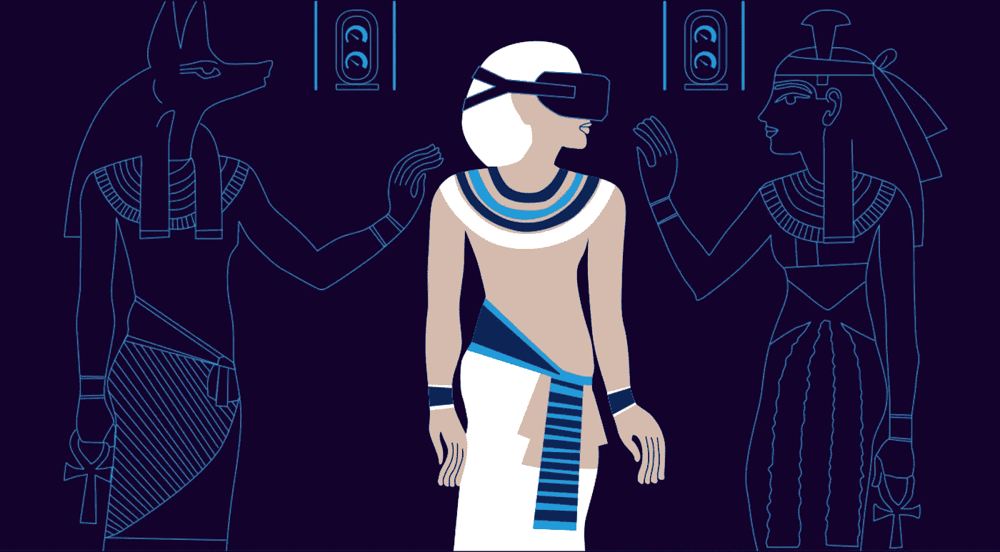
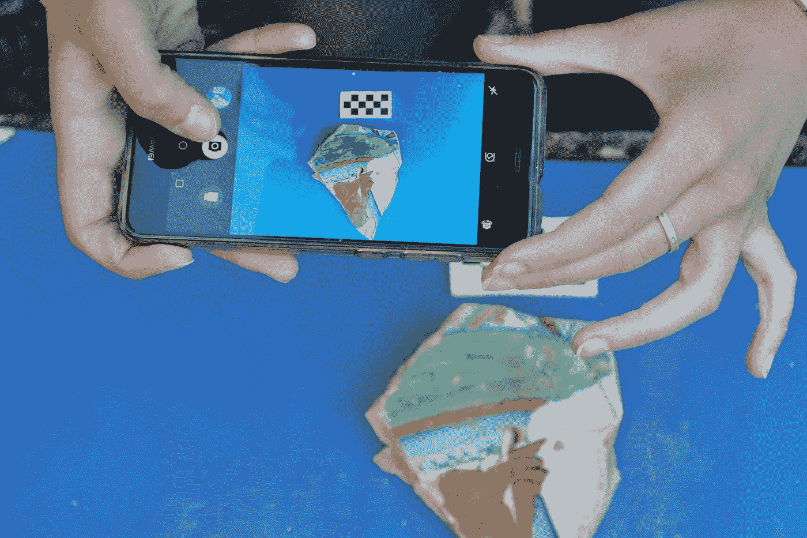
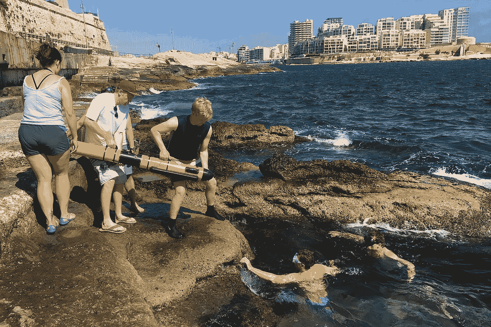
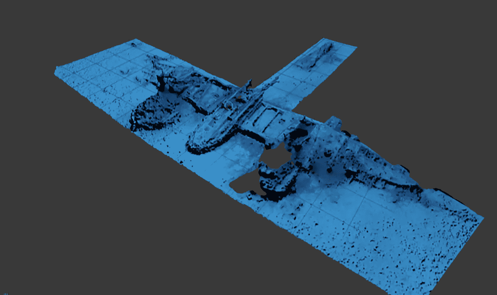
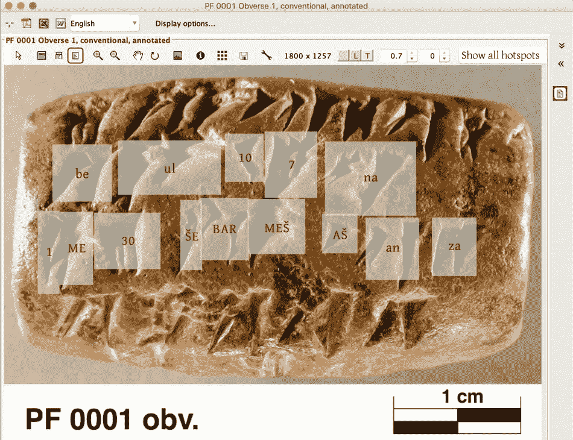
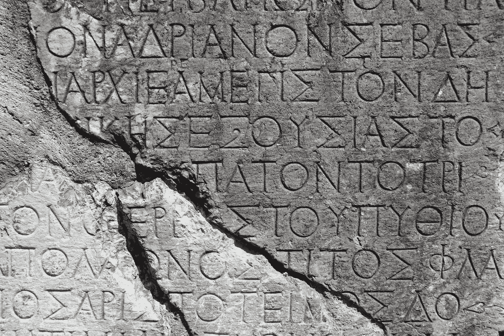
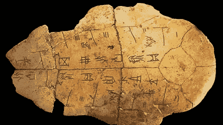
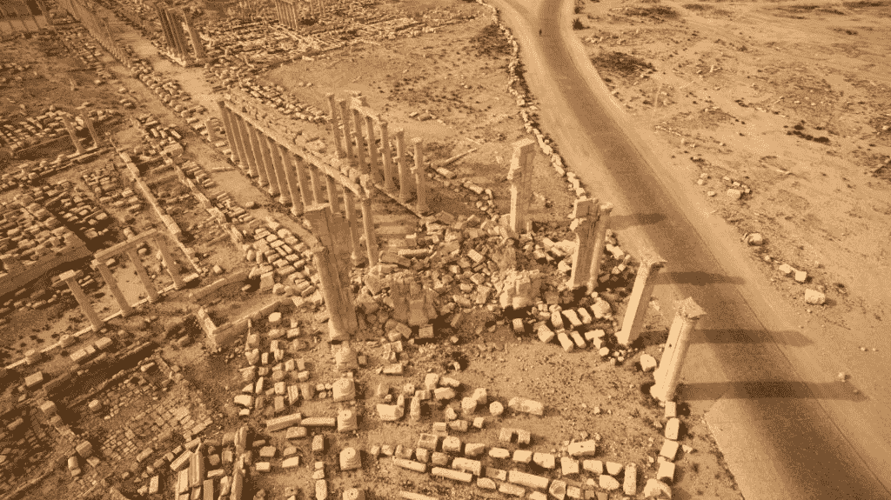
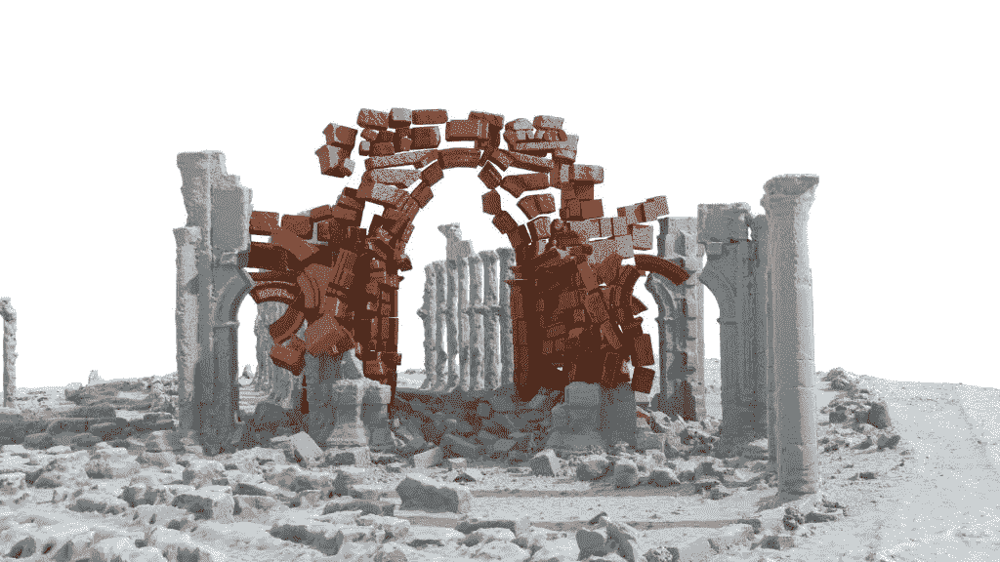

# 考古学家使用人工智能“挖掘更深”

> 原文：<https://medium.com/geekculture/archaeologists-use-ai-to-dig-deeper-58529d2f1b73?source=collection_archive---------1----------------------->

人工智能(AI)正在打开通往过去的新窗口。机器学习和 3D 建模正在彻底改变考古学领域，在卫星图像中识别埋葬地点，对古代陶器碎片进行分类，在声纳图像中定位沉船，创建历史遗址的 3D 数字重建，翻译古代语言，并找到在网络上非法出售的文物。

Image Credit: [Paessler](https://blog.paessler.com/augmented-reality-artificial-intelligence-and...-archeology-an-unexpected-combination)

## ***卫星成像辨认古墓***

吉诺·卡斯帕里博士是瑞士国家科学基金会的考古学家，他的工作重点是古代[斯基台人](https://www.britannica.com/topic/Scythian)，这是一个来自 3000 年前的游牧民族，拥有丰富的文化和指挥帝国，位于今天的克里米亚。斯基台王室成员的坟墓拥有巨大的财富，因此，他们是盗墓者的热门目标。卡斯帕里估计，超过 90%的埋葬地点现在已经被摧毁。

然而，卡斯帕里博士认为，欧亚大草原上仍有数千座坟墓，这些坟墓绵延数百万平方英里。他利用谷歌地球上的图像绘制了现今俄罗斯、蒙古和中国西部新疆地区的埋葬地点。“这本质上是一个愚蠢的任务，”卡斯帕里博士哀叹道。“这不是一个受过良好教育的学者应该做的。”

卡斯帕里博士求助于纽约城市大学经济学研究生帕布罗·克雷斯波(Pablo Crespo)，他使用人工智能(AI)来估计大宗商品价格的波动性。两人致力于建立一个卷积神经网络来整理和搜索卫星图像，这将使他们处于考古分析的前沿。

一个[卷积神经网络(CNN)](https://towardsdatascience.com/a-comprehensive-guide-to-convolutional-neural-networks-the-eli5-way-3bd2b1164a53) 分析可以作为网格处理的信息，所以它很适合分析照片和图像。克雷斯波和卡斯帕里的 CNN 根据红、绿、蓝的程度给网格中的每个像素打分。它先分析小组像素，然后分析大组像素，寻找与它被训练识别的数据匹配或近似匹配的像素。

Training Data of Tomb Images for CNN

这两位研究人员工作了几个月，通过 CNN 运行了 1212 幅卫星图像，寻找圆形石头坟墓，并避免其他类似的结构，如建筑碎片和灌溉池塘。在大约 2000 平方英里的面积上进行测试，该系统在 98%的时间内正确识别了已知的坟墓。

克雷斯波博士说，“创建网络很简单。”他用 Python 在不到一个月的时间里编写了代码。该团队希望 CNN 将成为考古学家军火库中的一个新工具，用来寻找新的坟墓和历史遗址，以获得对过去文明的新见解，并保护它们免受劫掠者的破坏。

## ***分类古代陶器碎片***

意大利比萨大学的两位考古学家 Gabriele Gattiglia 和 Francesca Anichini 挖掘了罗马帝国时期的遗址，分析了成千上万的陶器碎片。罗马人用粘土制造了几乎所有的容器，如烹饪器皿和用于在地中海周围运输货物的安瓶，因此陶器分析对于了解罗马人的生活和文化至关重要。

Gattiglia 博士和 Anichini 博士估计，他们只有 20%的时间花在挖掘遗址上，其余时间花在分析陶器、将碎片与目录中的图片进行比较上。“我们开始梦想一些神奇的工具来识别挖掘出的陶器，”Gattiglia 博士分享道。这个梦想在 ArchAIDE 项目中达到高潮，这是一个数字工具，由以色列特拉维夫大学的计算机科学家开发，由欧盟的 Horizon 2020 研究和创新计划资助，允许考古学家在实地拍摄一件陶器，并用神经网络进行识别。

Researcher Using ArchAIDE

ArchAIDE 项目包括数字化印刷目录和训练 CNN 识别不同类型的陶器。截至目前，该系统可以识别一些特定的陶器类型，但随着更多记录和照片的增加以及数据库的扩大，这个数字将会增长。

## ***激光雷达测绘发现马达加斯加考古遗址***

该技术[激光雷达](https://oceanservice.noaa.gov/facts/lidar.html)通过脉冲激光并利用特殊传感器测量其反射来测量距离和感知物体。宾夕法尼亚州立大学人类学系的博士生 Dylan Davis 开发了一种使用激光雷达数据绘制马达加斯加森林地面的算法。该系统在 1000 平方公里的区域内确认了 70 多个考古遗址，发现了史前北美人口创造的定居点和土墩。

## ***水下机器人寻找&数字化重建沉船***

在海洋考古中，前往现场往往既昂贵又困难，潜水员不能在水下呆太长时间，以免遭受严重的压力相关伤害。哈维·马德学院的工程师克里斯·克拉克解决了这两个挑战:水下机器人对海底进行声纳扫描，神经网络搜索沉船和其他重要水下地点的图像。

Team deploying an ‘autonomous underwater vehicle’ off the coast of Malta

在过去的几年里，克拉克和马耳他大学的考古学家蒂米·甘宾一起工作，扫描环绕该岛的地中海海底。2017 年，它在马耳他海岸发现了一架二战俯冲轰炸机，利用水下机器人的声纳扫描，克拉克和甘宾创建了该网站的 3D 数字重建。

3D Digital Reconstruction of World War II Plane Wreck

## ***AI 翻译古代语言***

芝加哥大学东方研究所和计算机科学系的研究人员合作开发了一个人工智能系统:DeepScribe，该系统可以解码古代文明的平板电脑。考古学家在 20 世纪 90 年代开始将计算机程序整合到古代文献的研究中，但复杂的楔形文字和平板电脑的 3D 形状限制了技术的有效性。芝加哥大学的计算机视觉模型接受了来自波斯波利斯设防档案馆的 6000 多幅带注释的图像和超过 100，000 个单独识别字符的“字典”的训练，现在，它可以以接近 80%的准确率解释古代平板电脑上的铭文。

DeepScribe Deciphers [Tablet](https://syncedreview.com/2020/03/26/ai-deciphers-persian-cuneiform-tablets-from-25-centuries-ago/) from Persia’s Achaemenid Empire

同样，谷歌的 DeepMind 开发了神经网络 PYTHIA，以“填充”石头和陶瓷文物受损表面上缺失的古希腊铭文。研究人员说，以特尔斐神谕命名的 PYTHIA“将一系列受损文本作为输入，并经过训练来预测包含古希腊铭文假设修复的字符序列”。

[Ancient Greek Tablet](https://www.ox.ac.uk/news/arts-blog/restoring-ancient-greek-inscriptions-using-ai-deep-learning)

最后，中国研究人员使用类似的 CNN 来理解在 3000 年前的龟甲和牛骨上发现的古代语言，并深入了解甲骨文形态学，这是中国古代文化的基石。

[Ancient Chinese Oracle Bone](https://news.cgtn.com/news/7841444d79637a6333566d54/share_p.html)

## ***识别网上非法出售人骨***

卡尔顿大学数字人文学科教授肖恩·格雷厄姆(Shawn Graham)修改了谷歌开发的 Inception 3.0，并在 8 万张人骨图像上对其进行了训练，现在可以扫描互联网，识别与人骨买卖相关的图像和信息。包括美国在内的许多国家都有法律规定，博物馆收藏的人骨应该归还给该人的后代，但有一个非法的在线市场违反了这些规定。

> “这些被买卖的人从未同意过这一点，”格雷厄姆博士说。“这对这些祖先被驱逐的社区来说是持续的暴力。作为考古学家，我们应该努力阻止这种情况。”

肖恩·格雷厄姆后来加入了打击网络犯罪联盟，这是一个识别非法网络活动和打击人权不公正的组织，如象牙贸易和性交易。

## ***三维数字建模保存历史***

2010 年，法国建筑师 Yves Ubelmann 拍摄了一张阿富汗小村庄的照片。两年后，当他回来的时候，网站已经被破坏了，一个记得 Ubelmann 的老人要了这张照片。“这张照片是我个人历史的唯一链接，”这名男子说，他鼓励乌贝尔曼与其他人分享这张照片。这种小小的互动催生了 Iconemn 的诞生，Iconemn 是一家总部位于巴黎的公司，为“受到战争、冲突、时间和自然威胁”的历史地标创建 3D 数字模型。

在叙利亚等国家，保存历史是当务之急。叙利亚的六大联合国教科文组织世界遗产，包括数百年历史的寺庙、清真寺、城堡、集市和坟墓，都被多年的战争和暴力破坏了。

Iconemn 的无人机在 20 个国家拍摄了数千张图像，由微软人工智能提供支持的机器学习算法将这些照片拼接成高分辨率的 3D 模型，以评估破坏程度，重建部分遗址，并使其历史不朽。

Aerial view of where a triple arch once stood in Palmyra, Syria, before it was destroyed in 2015

Iconem’s 3D model of how the arches could be rebuilt and restored

> 描述 Iconemn 的工作，“这是一种保持历史鲜活的方式，”Ubelmann 说。“如果你不知道你从哪里来，你就不知道你要去哪里。”

## ***撞击***

考古学家正在与人类活动、全球海平面上升、森林砍伐和气候变化的其他后果进行竞赛，以识别、保护和研究历史遗址。如果我们不能足够快地找到这些地点，这段历史可能会被摧毁，从而永远消失。算法可以一次整理成千上万的卫星图像，并识别新的历史发现，先进的 3D 建模可以数字化重建文物和考古遗址地图，并将它们保存下来。此外，虚拟现实可以让我们步入过去的世界，并设身处地地为我们古老的祖先着想。

**参考文献**

 [## 考古学家如何利用深度学习进行更深入的挖掘

### 用神经网络搜索古代史。找到一个古代国王的坟墓，里面装满了黄金制品、武器和…

www.nytimes.com](https://www.nytimes.com/2020/11/24/science/artificial-intelligence-archaeology-cnn.html)  [## 人工智能正在极大地改变考古学，发现新的遗址和文物。人工智能

### 人工智能正被用来帮助考古学家寻找新的挖掘地点和做出新的发现…

www.unite.ai](https://www.unite.ai/ai-is-dramatically-changing-archaeology-discovering-new-sites-and-artifacts/)  [## 科幻现实？人工智能与考古学-莱斯特大学

### 我时常会被问到这样的问题，“那么，你发现过恐龙吗？”虽然我真的很想遇到…

staffblogs.le.ac.uk](https://staffblogs.le.ac.uk/archiscan/2020/04/23/science-fiction-reality-artificial-intelligence-and-archaeology/)  [## 神经网络区分东部中晚期石器时代的石器组合。

### 石器时代中期到晚期的过渡标志着晚更新世非洲人口生产和生活方式的重大变化。

journals.plos.org](https://journals.plos.org/plosone/article?id=10.1371/journal.pone.0237528)  [## 遗产活动家的保护全球地标毁于战争，受到时间的威胁|改造

### 八年前，法国建筑师伊夫·尤伯曼在阿富汗工作时，拍下了一张看似不起眼的照片，是一座…

news.microsoft.com](https://news.microsoft.com/transform/heritage-activists-preserve-global-landmarks-ruined-in-war-threatened-by-time/)  [## 新的印第安纳琼斯？艾。这就是它如何革新考古学的

### 考古学家在马达加斯加沿海发现了几十个长期废弃的定居点，揭示了环境…

singularityhub.com](https://singularityhub.com/2020/05/07/the-new-indiana-jones-ai-heres-how-its-overhauling-archaeology/)  [## DeepScribe AI 可以帮助翻译古代碑文| Unite。人工智能

### 来自芝加哥大学东方学院和计算机科学系的研究人员…

www.unite.ai](https://www.unite.ai/deepscribe-ai-can-help-translate-ancient-tablets/)  [## 利用深度学习修复古代文本:以希腊金石学为例

### 古代史依赖于金石学等学科，即研究古代铭文的学科，来寻找…的证据

deepmind.com](https://deepmind.com/research/publications/Restoring-ancient-text-using-deep-learning-a-case-study-on-Greek-epigraphy)  [## 中国研究人员使用 CNN 对 3000 年前的甲骨文进行分类

### 一组中国研究人员最近应用多区域 CNN 对甲骨文拓片进行分类。

medium.com](/syncedreview/chinese-researchers-use-cnns-to-classify-3000-year-old-oracle-bone-scripts-b3404e3771d7)  [## 人工智能破译 25 个世纪前的波斯楔形文字

### 计算机视觉(CV)是机器学习研究中最热门的领域之一，它已经被广泛地应用于帮助机器学习

syncedreview.com](https://syncedreview.com/2020/03/26/ai-deciphers-persian-cuneiform-tablets-from-25-centuries-ago/)