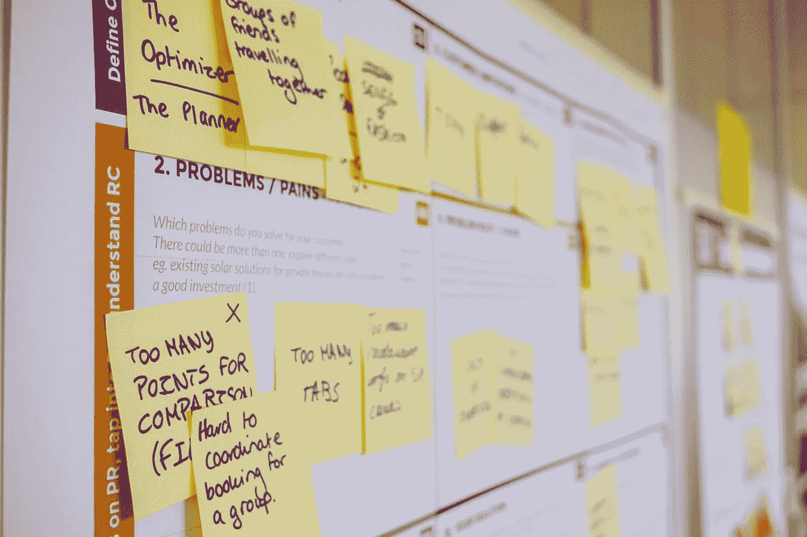

# 架构决策记录

> 原文：<https://medium.com/geekculture/architecture-decision-record-adr-f822e45dafcf?source=collection_archive---------9----------------------->

## ADR 作为一种决策工具，就像 RFC 一样

来自维基百科:

> 史蒂夫·克罗克于 1969 年首次引入 RFC 系统，以帮助记录阿帕网创建期间的非官方笔记。后来，Internet RFCs 建立起来，并被 Internet 工程任务组用作 Internet 规范、通信协议、程序和事件的官方文档。

我重视这种信任，并认为个人贡献者应该参与到架构和高层次的技术决策中。我认为每一行代码都是代表他人做出的决定，拥有一个快速发展的团队使得技术决策尤其难以管理。

> *ADR 是一个关键的文档和验证工具，用于归档您的主要架构决策。*

您应该使用这种流程来:

*   使个人贡献者能够为他们所负责的系统做出决策，
*   允许专家参与决策，
*   管理决策的风险，
*   包括队友成员，而不是由委员会设计，
*   对未来有一个大概的了解，
*   是异步的，
*   并行处理多个项目。

# ADR 流程

架构决策记录(ADR)以解释 ADR 目标的简短介绍开始。虽然引言部分是先读的，但应该在最后写。撰写概述可以让作者总结 ADR 的最终内容，而不是在不知道结果的情况下撰写介绍。

# 想法💡

如果您有以下情况，您应该撰写 ADR:

从头开始构建新的端点、组件、系统、库、应用程序等。,

正在影响不止一个系统或其他团队成员，

增加了新的技术依赖，

正在向堆栈中添加或替换语言或工具，

正在使用外部服务(外部服务在应用程序本身及其系统需求之外)，

添加新代码会触发，

从你的技术观察中，从行业协会中，从一个产品特性中，有了一个新的技术想法或主题，

正在改变 ADR 流程本身。

# 招募 ADR 发起人🏅

主办方是经验丰富的工程师，通常是员工/首席工程师或运营人员，负责确保 ADR 流程的最佳结果。具体而言，这包括:

倡导提议的设计

指导 ADR 遵守现有的设计和风格惯例

指导审查委员会达成富有成效的共识

获得批准后，确保建议的实施按优先顺序排列并分配给团队

人们需要在提交 ADR 之前确定赞助商。

# 使用模板✍️

为了让每个人都有相同的理解，使用相同的模板至关重要。以下模板旨在提议和验证新的 ADR。

*状态:[WIP |在审|批准|作废]*

*日期:2021 年 4 月 9 日上午 12 点(世界协调时)*

*审核人*

*   *首席技术官和/或首席采购官，*
*   *副总工程师，如果有的话，*
*   *首席工程师，*
*   *工程师……*

每个有代表性的利益相关方必须在 ADR 开始之前对其进行审查。

利益相关方的签准要求满足以下条件:

*   发布概要定义了哪些验收标准在范围内，
*   工程和产品管理部门就目标版本达成一致，
*   安排与工程和设计部门的会议，以审查 ADR。

# 背景

背景部分的目的是在深入问题领域之前为读者提供有用的背景。提供足够的细节，让读者正确了解问题领域。为了让读者理解 ADR 的内容，**他们必须首先理解上下文**。背景设置是背景部分的目标。如果可行的话，鼓励使用直观的解释。该上下文包括在高层次上描述提供给客户(最终用户、组件等)的功能。)，这与 OKR 有什么关系，或者为什么我们认为这个项目将有助于我们追求的业务目标？

# 目标

**产品目标**应该被形式化为“要被证明的假设”，我们应该总是问自己，“测试这个假设的绝对强制性是什么？”并且首先做到这一步。每个问题都应该清楚地映射到用户研究问题和下面定义的相应角色。人物角色应该是实际受访用户的通用版本。人物角色可能在开发这个问题、操作这个问题或保护这个问题上有困难。

**技术目标**还应包括流量假设、使用或正常运行时间要求等数字:

*   为客户提供本地用户体验，
*   使客户部署自动化，
*   使集群升级自动化，
*   确保集群级别的客户隔离，
*   与公司生态系统的整合，
*   …

# 非目标

列出项目的所有非目标(非强制性部分)

# 设计概述

用一两段话概括解决方案。

这不应该持续太久；它的意思是描绘一幅正在建造的东西的快速和容易获得的图画。

# 设计图和细节

此设计涉及的所有二进制文件、数据库和第三方服务的图表。拥有一个视觉帮助许多人获得高水平的图片，并更容易理解什么受到影响。

# 考虑备选方案/做出权衡

这是一个免责声明的好地方，这些免责声明涉及为什么要做出某些选择、任何负面影响可能是什么、考虑的限制、在此过程中可能产生的任何技术债务，以及最终可能需要做出的更改。

# 阶段

快速交付很重要；你不应该一步一步地思考；每一步不一定要持续三个月！这个问题被分解成几个阶段，以支持迭代实现。

每个阶段:

1.  在前一阶段建立价值，因此，它们是按价值的顺序定义的。没有必要定义优先级，因为这是从排序中推断出来的，
2.  直到所有的要求都得到满足，它才被认为是完整的，
3.  应该提供端到端的价值。即使它只能处理不同的阶段，这也应该提供价值，并且感觉像一个新的特性/解决方案。

有些 ADR 只会有一个阶段，完全没问题。

# 提交您的 ADR📤

最好是在公共渠道或邮件列表中发布你的新 ADR，在那里你可以获得最大的影响力。您的 ADR 实施建议提案至少在两天内、最多在一周内公开征求意见。然而，根据上下文，允许更短或更长。

社区成员必须:

*   尽快提供反馈，以便有足够的时间考虑，
*   在提供反馈之前，请仔细阅读 ADR，
*   要文明，要有建设性(确实！！).

# 验证您的 ADR ✅

在 ADR 公布后 2/3 周内，主办方将要求召开审查委员会会议。评审会议的目标是解决次要问题；应该在重大问题上事先达成共识。

审核委员会必须:

*   确保反馈的实质性项目已经考虑在内，
*   将他们的会议记录添加到 PR 上，
*   为他们的决定提供理由。

审查委员会可以批准 ADR，拒绝 ADR，或要求在考虑 ADR 之前进行修改。

我发现 ADR 方法是一种很好的沟通决策和保持历史背景的方式。发展成果评估没有取代传统的文件，但应该补充现有的文件，以丰富项目的参考框架。

希望这些见解对你有所帮助。感谢阅读。