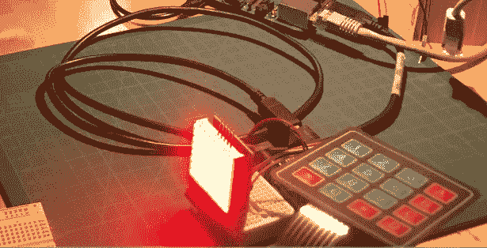

# Arduino:如何选择传感器/硬件库？

> 原文：<https://medium.com/geekculture/arduino-how-to-select-a-sensor-hardware-library-955cf38cb947?source=collection_archive---------17----------------------->

每个 Arduino 程序员都需要从某个地方开始。第一个 Arduino 设备是薄膜键盘和 8X8 矩阵的简单组合。当一个键被按下时，它显示在 8X8 矩阵上。只需检查膜的 API，找出如何处理按下的按钮。然后将这个字符发送到 LED 矩阵。这听起来很简单，对吗？

嗯，当你对 Arduino 编程有了扎实的经验时，就是了。但是当我开始这个开发者之旅时，很多事情我都不知道。我花了很长时间才明白我所面临的问题的根源。在这篇博文中，我反思了这些挑战，并确定了关键的经验。

*本文原载于我的博客【admantium.com】*。**

# *连接 LED 矩阵*

*使用 Arduino IDE 时，已经为您安装了许多附加库。因此，软件开发过程从识别您要连接到 Arduino 的硬件开始，然后选择合适的库。*

*我的初始设置是一个完整的套件，包括 Arduino Uno、大约 20 个传感器、一块试验板、4 个显示器和 4 个电机。按照教程，我使用了提供的驱动程序，我有点惭愧地说，只是将示例代码复制到 IDE 中，将程序烧录到引导加载程序中，并启动 Arduino。不出所料，小品每次都管用。*

*对于 LED 矩阵，我很好奇它的功能。于是，从我的 IDE 上，我看到有一个方法叫做`drawChar`。这个方法需要一条线和一个你想画的字符。无论我怎么尝试，我都无法让显示器显示这个角色...*

*隔天。我看了文档。该库将用于 LED 矩阵和分段矩阵。我使用的方法不是为简单的 LED 矩阵设计的。有了这个认识，我开始重新选择一个合适的图书馆。*

# *选择库—第 1 部分*

*来自 JavaScript 开发的世界，选择包意味着浏览中央 NPM 注册中心，阅读文档，并决定使用哪个库。在开发 Arduino 应用程序时，这种舒适并不容易实现。*

*第一个区别是 IDE 附带的库(Arduino Studio 或 PlattformIO)与可用库的总数不匹配。你可以在 Github、私人网页甚至论坛上找到库。*

*下一个区别是安装。已经捆绑在应用程序中的库可以导入到项目中。如果 IDE 可以访问源代码，还可以添加其他库。或者您需要直接下载源代码，并将它们添加到您的项目中。*

*第三个区别是文档。与您的 IDE 捆绑在一起的库显示了有用的描述，但只显示了指向附加信息的链接。如果您访问其他库，您会发现网页、带有自述文件的 GitLab repos 或带有注释的纯源代码的混合体。*

*最后一个难以选择的区别是，一个库没有“确定”的版本，无论是根据它的年龄，还是根据它的功能，你都无法做出区分。当我的 LED 矩阵不工作时，我在 GitHub 中找到了一个库，它是最近更新的。查看它的代码，我发现它与我的工具包中建议的库非常相似。经过进一步研究，我发现了一个 2013 年的库，它似乎是这两个新库的父库。*

*此时，我完全不知道如何做出一个好的选择。我又回到了起点。*

# *选择图书馆—第 2 部分*

*有了这些经验之后，我用以下步骤起草并测试了一个小的决策过程。*

# *1.了解硬件*

*您需要了解传感器或硬件的一般工作原理。你不需要理解电路图(最终你会获得这些知识)。但是你应该对操作流程有一个基本的了解。*

*回到 LED 矩阵，关键的一点是要了解电源管理、清除显示以及 LED 如何排列等方面。库将基于此描述与传感器/硬件一起运行。*

# *2.列出所有可用的库*

*接下来，浏览 IDE 的所有库，并在 Github 或互联网上搜索。重要的来源是:*

*   *[platform . io](https://platformio.org/lib)*
*   *[arduino.cc](https://www.arduino.cc/en/reference/libraries)*
*   *[Arduino 库列表](https://www.arduinolibraries.info/)*

# *3.评估图书馆*

*最明显的步骤是浏览库，获取一个示例程序，并尝试它。如果这个例子开箱即用，那么这个库是一个很好的候选库。*

*我强烈建议你努力去理解这个库，直到你对它的工作方式感到舒服为止。对自己诚实一点，复制&粘贴代码示例不会长久。*

*当我认为这个库基本上可用时，我将应用两个缩小范围的标准:特异性和质量。*

*第一个标准是特异性。比起支持多个版本或类似硬件的通用库，更喜欢与您的硬件/传感器特别匹配的库。这将更容易找到帮助，也更容易理解。*

*下一个标准是源代码和文档。你能大体理解源代码吗？是否简洁易读？如果有，记得硬件是怎么工作的，尽量在库中看到这些操作。越清晰越好。最后，检查文档(源代码、wiki、网页等)。)和例子。找到的越多越好。*

*所有在特异性和质量上得分高的库都应该被高度评价。*

# *4.尝试*

*最后一步是使用库。使用我的意思是明确不只是复制和粘贴源代码！给自己设定一个时间框架，打开一个空文件，从头开始编码。如果你能让图书馆在规定的时间内运行，你就找到了你的候选人。*

# *结论*

*当给你的 Arduino 项目添加一个新的传感器或其他硬件时，你身上懒惰的程序员可能会浮出水面，抓取下一个最好的库，复制粘贴一个例子并让它运行。但是这种方法不能长期有效。努力遵循您选择的库的选择过程。我的选择过程有 4 个步骤:了解硬件，制作库列表，评估库，并尝试它们。这个过程有助于构建知识、洞察力和技能:硬件如何工作的知识、库如何与硬件一起运行的洞察力，以及通过从头开始编写代码来使用库的技能。现在开始，让你的 Arduino 项目变得更好。*