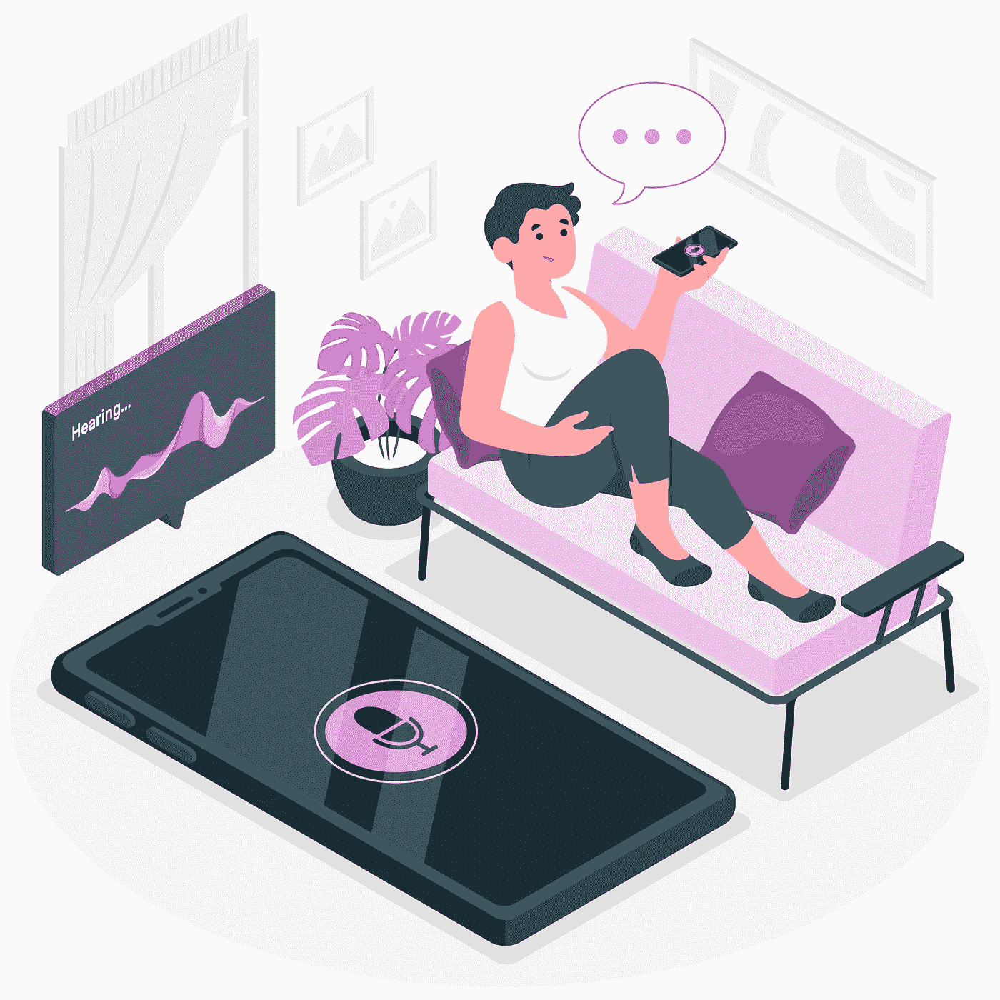

# 应用程序死了吗？语音是下一个大事件吗？

> 原文：<https://medium.com/geekculture/are-apps-dead-is-voice-the-next-big-thing-1305b183e1e6?source=collection_archive---------10----------------------->

我注意到网上有很多人说“移动应用已死”、“移动应用开发者不再受欢迎”等等。是的，我觉得有道理。如果你看看谷歌 Play 商店或苹果的应用程序商店，我们可以看到顶级应用程序的列表被价值数十亿美元的大公司运营的应用程序所主导。因此，对于独立开发者/企业来说，想出一个应用创意并与之竞争是很困难的。

还有，你觉得一个人一天能打开多少个 app？大多数人花 90%的时间在 YouTube、Instagram、脸书、Gmail、WhatsApp、Messenger、抖音、Snapchat 等十大应用之间来回切换。这些东西大部分都与信息或社交媒体有关，这几乎是人们一天中所有的时间。他们不会出去尝试访问你的应用或网站。

那么，如果移动应用已经死亡，那么下一个大事件是什么？语音应用会取代移动应用吗？作为一个开发过移动应用程序和语音应用程序的开发者，这里是我对这个热门话题的两点看法。

要分析这个，我们先来看看语音 app 的利弊。

Source: Designed by stories / Freepik

# **优点**

# **声音是新的触感**

语音只不过是与技术互动的新媒介。语音作为与技术互动的媒介越来越受欢迎，因为它比其他任何互动媒介都更人性化。我们从打字过渡到触摸，因为触摸感觉更直观和自然。语音是与科技互动的更自然的方式。

> “触摸屏给了我们一种与技术互动的新方式，而语音助手给了技术一种与我们互动的新方式。”

# **声音很快**

我们从打字过渡到触摸，不仅因为它更直观，而且更快。我这么说是什么意思？假设你想放大一张图片的右上角。用键盘的话，你必须先敲右箭头键，然后再敲上箭头键几次。但是触摸让我们能够以更快更人性化的方式做到这一点——斜向上滑动。现在语音让它变得更快。

每个人早上第一件事检查的第一个应用程序是电子邮件。对于智能手机，我们必须首先拿起手机，解锁，找到电子邮件应用程序，打开它，然后手动浏览收件箱中的每个项目。通过语音，这一切都可以通过一句简单的“Alexa，检查我的电子邮件”来完成。所以，就像我们从打字过渡到触摸一样，我们会慢慢地从触摸过渡到语音，因为它更快，感觉更像人类。

# **无需担心存储问题**

与传统的移动应用不同，语音应用是基于云的。这意味着用户不必下载每一个应用程序到他们的设备上来使用这项服务。今天，什么都有一个应用程序。在我们的手机上，我们有 3 或 4 个购物应用，2 或 3 个送餐应用，5 个或更多的社交媒体应用，生产力应用，游戏，等等。有了所有这些不同的应用程序，我们的手机存储空间很快就用完了。64 GB 存储被认为足够好的时代已经过去了。

幸运的是，语音应用都在云上，这意味着它们不在设备本身上，而是在需要时从云上访问。理论上，用户可以在语音助手上安装任意多的应用程序。如果你想点餐，只需说“Alexa，让多米诺点我平时吃的披萨”，Alexa 就会找到相应的技能(语音 app)，并将你的订单详情发送给多米诺。就这么简单。这种方法极大地减少了用户在决定使用某项服务时必须考虑的工作量和时间。

但并不全是阳光和玫瑰。声音也有一些缺点。这些不能被归类为缺点，而是声音的限制。

# **缺点**

# **缺乏对上下文的理解**

语言是复杂的。谷歌对话设计主管凯茜·珀尔对此做了最好的解释。如果一个语音助手问你“你要咖啡吗？”你的回答是“咖啡会让我保持清醒”，这是肯定还是否定？答案是两者都有。这取决于一天中的时间。如果是晚上，答案是否定的。如果是白天，答案可能是肯定的。这要看上下文和环境。人类真的很聪明，能够识别上下文和环境，理解对方在说什么，但对于计算机来说，这很难。人类不仅用声音交流，还用肢体语言、眼神、停顿等等。

在传统图形用户界面的情况下，如果用户点击一个按钮，我们确切地知道他们想要什么。即使用户点击了错误的按钮，我们也清楚地知道他们做了什么。但在 VUI(语音用户界面)的情况下，它总是一个有根据的猜测。这使得设计一致的无错 vui 变得困难。

# **VUI 缺乏标准**

如果你在智能手机上打开任何一款应用，不管是什么操作系统，你都可以轻松浏览。这是因为大多数应用程序都遵循一种设计模式(就像 android 中的材料设计)。你知道，如果你从侧面滑动，会打开一个汉堡菜单，如果有一个返回箭头，它可以用来返回到上一页。如果你看到一个设置图标，你马上就会明白它会把你带到应用程序的设置页面。到目前为止，语音还没有这种标准框架。

# **最小的用户参与度**

语音应用面临的另一个巨大的批评是肤浅的用户参与。首先，这不是一个缺点，因为语音应用程序旨在快速完成工作。其次，从消费者的角度来看，我认为这很好，因为我们可以快速完成事情，完成实际工作，而不是盲目地滚动应用程序提要。所以从生产力的角度来看，语音应用节省时间，减少屏幕时间，让你远离拖延症。

# **结论**

在移动应用的基准上，语音应用经常受到批评。在智能手机的早期，我们也看到了类似的趋势。当以台式机为基准时，智能手机被认为动力不足，除了简单的电子邮件之外很难用来做任何事情。我们现在都知道这是怎么回事了。同样，语音也处于婴儿阶段，现在下判断还为时过早。

移动应用没有取代网络应用，同样，语音应用也不会取代移动应用。语音永远不会取代移动应用或触摸，而是补充它们。是的，app 市场已经饱和，在当今这个时代，很难出现一个以 app 为中心的业务。但我们仍然需要所有新的智能家居/自动化/联网设备的应用程序，甚至今天的汽车也依赖于应用程序。因此，说应用已经死亡，不再需要应用开发者是不公平的。说到这里，我相信语音是进入 [**环境计算**](https://www.digitaltrends.com/computing/what-is-ambient-computing/) 世界的一个重要环节。随着亚马逊和谷歌等科技巨头成为环境计算的先锋，语音应用的未来看起来一片光明。