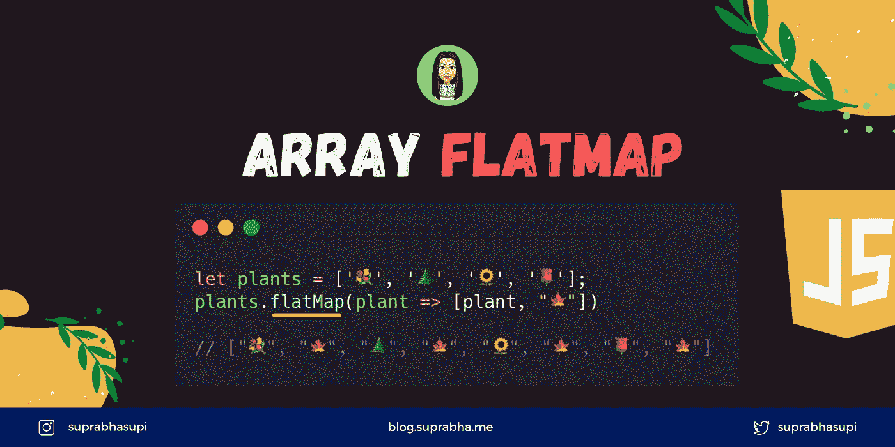

# 数组平面图

> 原文：<https://medium.com/geekculture/array-flatmap-c37ebf17c4f6?source=collection_archive---------20----------------------->



array flatmap

平面映射是一种可用于平面和映射方法的单一方法。

如你所知`flat()`，拉平 1 级深度和`map()`循环成一个数组。

如果我们把两者都包括在内，我们称之为`flatMap()`😉

所以，如果调用两个方法`flat()`和`map()`，你可以使用一个名为`flatMap()`的方法。

```
let plants = ['💐', '🌲', '🌻', '🌹'];// ❌ map + flat
plants.map(plant => [plant, '🍁']).flat();
// Output
//["💐", "🍁", "🌲", "🍁", "🌻", "🍁", "🌹", "🍁"]// ✅ flatMap
plants.flatMap(plant => [plant, "🍁"])// Output
// ["💐", "🍁", "🌲", "🍁", "🌻", "🍁", "🌹", "🍁"]
```

# flatMap()如何工作？

📝FlatMap()总是先做 Map()，然后再做 flat()。

在`flat()`中，我们使用参数来设置深度，参数定义嵌套数组应该展平的深度。

```
let plants = [[["🌻", "🌹"]]];
plants.flat(2);// ["🌻", "🌹"]
```

## `flatMap()`只做 1 级深度展平。

```
let plants = [[["🌻", "🌹"]]];
plants.flatMap(plant => [plant]);// [["🌻", "🌹"]]
```

# 使用平面图过滤😉

是的，你也可以在这里使用`flatMap()`进行过滤。

```
let arr = [5, 4, -3, 20, -4, 18]
arr.flatMap(i => {
  return i < 0 ? [] : [i];
})// [5, 4, 20, 18]
```

# 参考🧐

*   [平台地图的 MDN 文档](https://developer.mozilla.org/en-US/docs/Web/JavaScript/Reference/Global_Objects/Array/flatMap)

# 总结#

如果你想同时使用 map 和 flat 方法，method 总是有用的。

感谢您阅读❤️这篇文章

🌟[推特](https://twitter.com/suprabhasupi)👩🏻‍💻suprabha.me 🌟 [Instagram](https://www.instagram.com/suprabhasupi/)