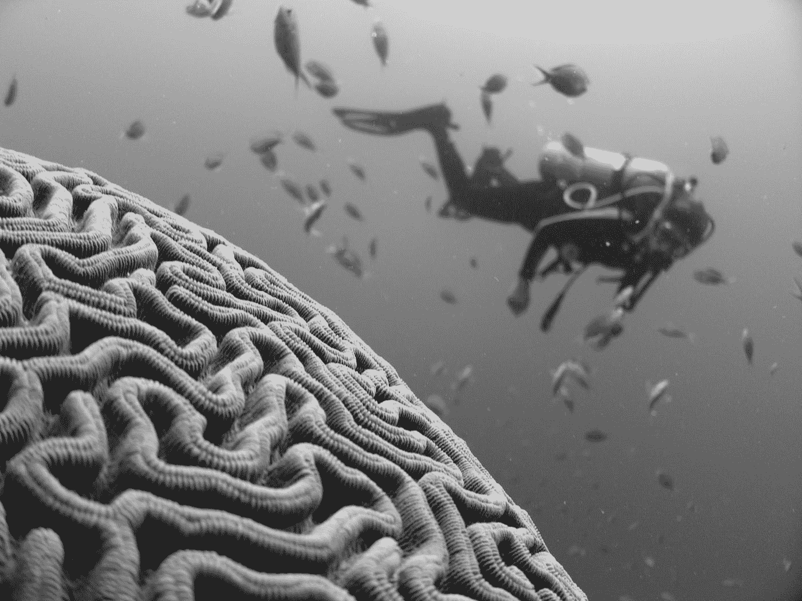

# 人工智能和深度学习为我爷爷讲解

> 原文：<https://medium.com/geekculture/artificial-intelligence-explained-for-my-grandpa-1e85b98011ed?source=collection_archive---------12----------------------->

Photo by [Vlad Tchompalov](https://unsplash.com/@tchompalov?utm_source=medium&utm_medium=referral) on [Unsplash](https://unsplash.com?utm_source=medium&utm_medium=referral)

我爷爷最近发现我一直在写中等文章。在读了一些我写的关于艾的文章后，他给我发了一条短信，让我写一篇文章向像他这样的“前辈”解释一下。这是我最大的努力。

## 什么是人工智能？

人工智能(AI)是计算机科学家使用的一个短语，用来描述可以做需要应用知识的事情的程序。但是，难道没有一个计算机程序在自己的编程中“应用”了赋予它的知识吗？例如，一个从一数到十的程序只是运用它对数字排序的知识。实际上，我们把人工智能这个术语保留给那些不仅需要智能，而且特别需要类似人类的智能的程序。这包括更难的问题，这些问题通常过于复杂，简单的机器无法解决。

## 有什么意义？

我认为要完全理解人工智能的精神，需要知道一件重要的事情，那就是所谓的**图灵测试**(也被称为模仿游戏)。艾伦·图灵在 1950 年计算机科学即将诞生时开发的，它测试机器展示类似人类智能的能力。这个想法是，你把一个人和一台机器放在不同的房间里，并与它们进行数字通信。如果你不能可靠地分辨出哪个房间有机器，哪个房间有人，那么可以说机器已经“通过”了图灵测试。自那以后，许多人工智能研究都旨在最终开发能够“通过”这一测试的机器。

尽管如此，还有一整类不涉及语言的任务，但仍然需要应用一些人类水平的知识。整个人工智能领域植根于对人类思维能力的深深迷恋，这种能力可以做各种各样的事情。我们可以识别我们周围的所有事物，想象它们是如何相互作用的，并以多种方式交流我们对所有这些事物的想法。计算机科学家称之为**人工通用智能** (AGI)的任务是解决能够复制人类所有这些不同能力的机器的整个问题。为了最终能够制造出这些 AGI 机器，我们首先需要能够独立解决所有这些挑战。这就是为什么今天的大多数研究都是针对不同的“任务”的。

人工智能研究人员正在研究一系列需要智能的任务。然而，最大的两个类别是**自然语言处理** (NLP)和**计算机视觉**。NLP 专注于构建能够阅读、理解和书写人类语言的人工智能。这包括可以总结文章、在语言之间进行翻译或自动检测 facebook 上的错误信息的 AI。计算机视觉专注于解决与数字图像或视频相关的问题。在这个领域最受关注的问题是自动驾驶汽车，它拍摄世界的照片，试图做出如何驾驶的决定。

## 我们如何制造人工智能机器？

从图灵提出他的测试一直到 2010 年，我们让机器变得“智能”的方式与你自己学习一项新技能的方式非常相似:请专家解释。你可能听说过 1997 年著名的[国际象棋比赛，由 IBM 公司的深蓝对世界冠军加里·卡斯帕罗夫。IBM 的计算机在一定程度上是通过根据国际象棋大师提供的规则对每一步棋进行评级来工作的。同样，2016 年之前的谷歌翻译是通过阅读一堆翻译文本并提出模式来输入计算机的。基于规则和统计的程序(像早期的谷歌翻译)无处不在，它们是人类再造智能的最佳尝试。但是什么改变了呢？](https://en.wikipedia.org/wiki/Deep_Blue_(chess_computer))

大约在 2010 年，一种称为**机器学习**的创建人工智能程序的方法突然开始让所有这些程序浮出水面。机器学习是一组可以利用数据变得更聪明的计算机程序。这些程序基本上接受并研究大量信息以学习模式，然后接受新数据并应用他们学习的模式以做出预测。

为了更清楚地说明机器学习真正需要什么，想象一下你拥有一个柠檬水摊位。一杯柠檬水卖 3 美元，三杯卖 9 美元。如果有人将这些数据交给一个机器学习算法，然后问它两杯柠檬水应该卖多少钱，它应该说 6 美元。这个例子并不太复杂，但是你可以想象这些问题会很快变得很难。想象一下，让一台电脑预测一栋房子要卖多少钱(Zillow 确实做到了！).现在有更多的因素需要考虑:位置、面积、建筑年代等。但是好的机器学习模型，有足够的数据可以研究，可以学习模式并做出预测。

## 深度学习

具体来说，推动机器学习进程最近大部分爆发的程序类型被称为**深度学习**。这种类型的程序已经变得如此之好，以至于它基本上完全接管了人工智能和机器学习领域(因此，这三个术语几乎可以互换使用)。深度学习的工作方式相当复杂，深入研究其背后的数学足以让任何人都非常头疼。但是让深度学习如此强大的是猜测和检查能力非常好。

在高层次上，深度学习程序接受数字，然后将它们彼此相加、相减和相乘，并与其他数字进行比较，这些数字被称为**参数**。然后他们再做一些加法和乘法，得到一个代表程序信念的数字。例如，Zillow 房价模型可能会获取关于房子的所有已知信息，然后将这些信息与*参数*相加并相乘，从而得到一个代表房子预计价格的最终数字。我知道你在想什么…我们怎么能通过做一堆随机的数学运算得到任何有意义的东西呢？秘密在于参数以及我们如何选择它们；这就是*学习*发挥作用的地方。

我们从参数的随机数开始，开始进行相当随机的猜测。然后我们做一些数学运算来找出我们错了多少，以及我们如何改变我们的参数来接近正确的答案。继续我们的房子类比，假设我们的第一个猜测告诉我们，一个价值 100 万美元的房子只值 5 美元。然后，我们会回过头来更新一些我们要放大的参数，试图让我们的答案更接近正确的答案。通过用大量的例子一遍又一遍地重复这个过程，这些参数最终会惊人地擅长于做出准确的猜测。

## 为什么这一切如此重要？

我在另一篇文章中写了为什么我认为这是一件大事。但基本上，深度学习已经变得非常非常好了。这主要是因为我们每年都能使用更快的计算机和更多的数据。我们现在可以制造出可以做各种事情的算法，从[写书](https://www.nytimes.com/2021/11/21/books/review/the-age-of-ai-henry-kissinger-eric-schmidt-daniel-huttenlocher.html)到[驾驶汽车](https://waymo.com/)。尽管还不清楚我们是否能最终使用这些程序通过图灵测试或实现人工智能，但想想这些程序能以多少种方式帮助我们过上更好的生活和完成更多的工作，仍然令人兴奋。

还有一种观点认为，能够复制某物的她必须理解它。科学家们还不确定深度学习的工作方式是否真的类似于人脑，但这很有吸引力，因为更接近复制类似人类的智能也可能给我们提供关于我们自己的大脑如何运作的秘密的答案。我们可能要先向外看才能向内看。

显然，我认为这是一件大事。这就是为什么我希望我已经帮助了我的爷爷——以及任何决定阅读这篇文章的人——理解人工智能及其对世界的许多含义。