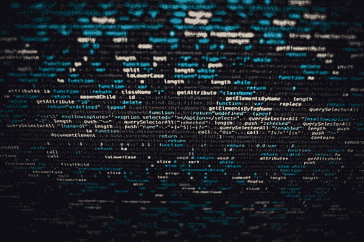

# 人工智能有一个隐含的偏见多样性困境

> 原文：<https://medium.com/geekculture/artificial-intelligence-has-an-implicit-bias-diversity-dilemma-812f0392dead?source=collection_archive---------43----------------------->

Image credit: [Piqsels](https://www.piqsels.com/en/public-domain-photo-jcunm)

人工智能有可能改变我们的日常生活。它提高了效率，并用新的能力武装了社会。这项技术不再是科幻电影中的遥远愿景，而是越来越成为日常现实。随着自动驾驶汽车、更好地理解人类语言和面部识别等应用的出现，人工智能似乎可以带来许多积极的社会进步。然而，人工智能的变革性影响也有负面后果。一个主要的关注领域是多样性和包容性。

## 越来越担心隐性偏见

人们越来越担心人工智能系统中的隐性偏见。这些偏见可能导致不公平的结果。这些系统的基础是数据输入和设计技术的人。如果构建技术的人的隐性偏见扭曲了数据，这将带来扭曲的输出。毕竟，机器学习算法仅限于它们可用的数据集。

## 人工智能研究中的女性很少，黑人更少

AI Now Institute 是一个研究人工智能社会影响的研究智库。它发现，在脸书大学的人工智能研究人员中，女性仅占 15%。在谷歌，这个数字只有 10%。从事研究工作的黑人雇员数量更是惊人。在脸书、谷歌和微软，不到 5%的人工智能研究人员是黑人。

这对正在开发的产品有影响。缺乏多样化的工程师和研究人员会导致产品带有固有的性别和种族偏见。这反过来会导致偏见大规模传播。脸书、谷歌和微软等科技巨头对人工智能发展的未来进程施加了重大控制。因此，这些结构性不平等会蔓延到数十亿人。

## 人工智能让奥巴马总统变白

2020 年 6 月，推特上出现了一场重大争议。它凸显了人工智能研究中根深蒂固的偏见。一个将人的像素化照片转换成高分辨率图像的工具显示了一些惊人的结果。输入一张巴拉克·奥巴马的低分辨率照片，该算法产生了一张明显是白人的高分辨率图像。当算法使用其他少数民族的低分辨率图像时，就会产生明显是白人的高分辨率图像。

这一事件充分说明了有偏见的人工智能系统的潜在危险。领先技术公司英伟达的研究人员开发了导致扭曲结果的算法。该算法通过放大和想象更高分辨率的版本来处理低分辨率的照片。NVIDIA 发现，与它接收的照片输入相比，该算法生成具有高加索人特征的人脸的速度要高得多。这种偏见很可能是从机器学习算法被训练使用的数据集继承来的。

## 算法必须有不同的输入

没有来自不同观点、背景和生活经历的人的输入而构建的算法可能导致不完整的数据被输入到算法中。例如，该算法可能不考虑某些数据点，因为工程师对将哪些数据输入提供给该算法做出了短视的决定。因此，机器随后做出的决定将受到数据丢失部分的限制。用于训练机器学习算法的数据通常是倾斜的，以反映开发人员的人口统计数据。由于白人男性主导了人工智能研究和工程职位，因此产出默认这一人口特征也就不足为奇了。

一些公司暂停了面部识别技术的使用，因为担心其中存在性别和种族偏见。随着滥用的可能性变得越来越明显，许多大型科技公司不再向警方出售面部识别技术。IBM、微软和亚马逊宣布，在通过联邦立法以提供更好的技术监管之前，他们不会向警方出售面部识别技术。

## 前进的道路

有许多潜在的方法来解决人工智能的隐形偏见问题。对这个问题的认识可以导致人工智能研究人员在训练机器学习算法时更有可能考虑多样化的数据输入。这也意味着要注意检查人工智能技术的内在公平性，不仅仅是在个人层面，也要在组织层面。

与此相关的是，领导力的多样性也很重要。随着职业变得更加多样化，思想也会更加多样化。这反过来将导致设计人工智能技术的更大范围的想法和方法。然而，招募和留住多样化的人才需要时间，人工智能正在快速发展。虽然从长期来看，这是一个令人钦佩的目标，但要在近期解决偏见问题，重要的是让构建该技术的工程师对该问题有更好的认识。