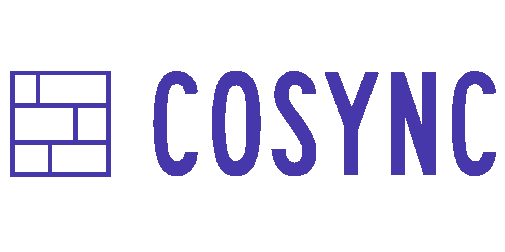
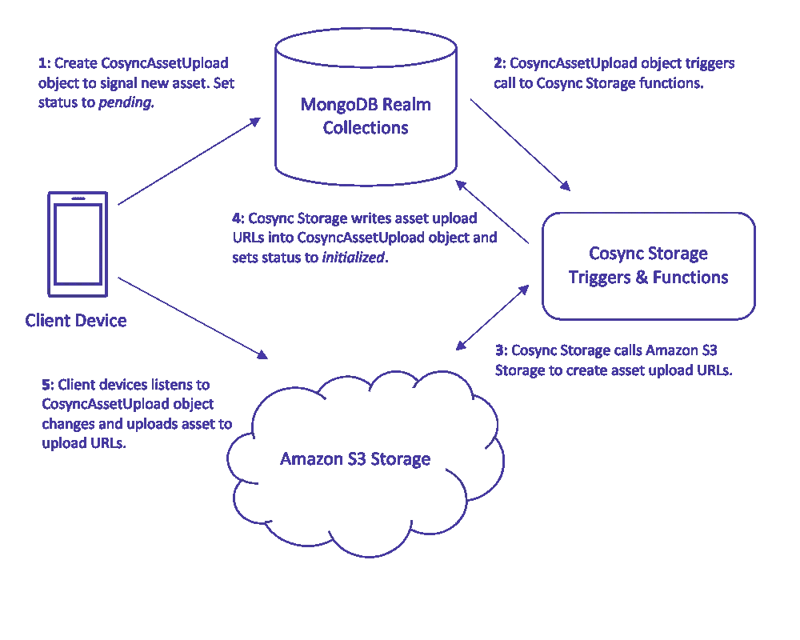
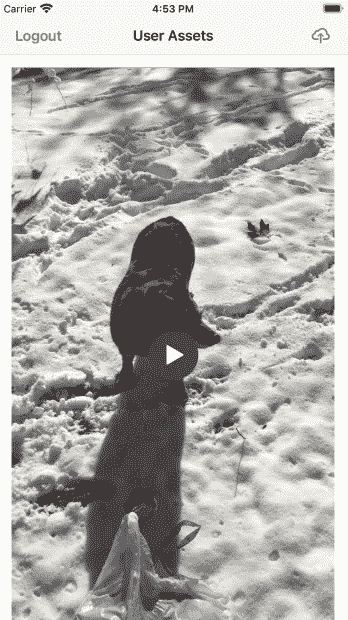

# MongoDB 领域的资产存储

> 原文：<https://medium.com/geekculture/asset-storage-for-mongodb-realm-75fe179313c8?source=collection_archive---------2----------------------->

随着 2020 年 Covid 疫情的出现，对于世界上很大一部分人来说，远程工作已经成为事实上的现实。现在很明显，通勤到共享办公室可能永远不会恢复到以前的水平。这反过来导致了协作软件开发的爆炸式增长，以满足这种新的专业散居群体的需求。MongoDB Realm 是世界领先的实时*移动/云*同步数据库，是这场数字化转型的核心。该产品解决了一个极其重要的问题，即如何通过共享云基础设施实时、大规模地将客户端设备(移动设备、桌面设备和网络设备)生成和编辑的数据相互同步。它还通过在该产品类别中独一无二的*离线优先*架构，处理连接间歇性的客户端设备的同步。

Realm 公司最初于 2011 年在丹麦成立，目标是为移动设备(iOS 和 Android)构建一个轻量级的对象数据库。他们的解决方案很快被移动开发者采用，并被部署在全球数十亿台设备中。Realm 获得了巨大的成功，部分原因是它是免费的，但也因为苹果和谷歌都没有提供有竞争力的替代品。2017 年，Realm 推出了一项新的付费服务 Realm Cloud 允许开发者将本地 Realm 数据库同步到主云数据库。该产品直接与其他后端即服务 BAAS 产品竞争，如 Google Firebase 和 Parse。Realm Cloud 相对于其竞争对手的优势在于，它在客户端设备上缓存了数据库的本地副本，并且只将增量与云版本同步。这种效率不仅简化了代码，因为应用程序将所有数据都视为本地数据，还提供了内置的离线模式支持，因为一旦设备重新连接，同步就在后台进行。

Realm 公司于 2019 年 4 月被 MongoDB 收购。大约一年时间，两家公司的工程团队重新架构了该产品，用 MongoDB Atlas(世界领先的开源对象数据库)取代了 Realm Cloud 的后端。名为 MongoDB Realm 的新产品于 2020 年 6 月在虚拟的 MongoDB Live 大会上发布了 Beta 版。这款新产品通过 GraphQL 支持 iOS、Android、Mac 桌面、Windows 以及 web 界面。从数据的角度来看，MongoDB 领域是协作计算的操作系统平台。

MongoDB Realm 现在可能是当今世界领先的*离线优先*实时协作编程数据库。它是唯一一个真正可扩展的解决方案，用于跨多种平台(包括 iOS、OS/X、Android、Windows 和 Web)的客户端数据同步，运行在统一的无服务器后端之上。

然而，对于协作编程，数据同步通常只是挑战的一半。通常，应用程序包括需要在用户之间共享的数据和资产。资产被定义为大型不可变文件，例如图像、音乐、视频和/或文档。目前，MongoDB Realm 对支持的最大对象大小有 4MB 的限制——这意味着它实际上没有提供资产管理的解决方案(即使它们是 base 64 编码的)。这并不是说资产不能分解成多个 4MB 的对象，但是这需要在客户端应用程序中添加额外的管理代码来实现。最后，因为 MongoDB Realm 不提供视频或音频流功能——资产分块策略可能不起作用。

由于这些限制，除了 MongoDB Realm 之外，大多数应用程序开发人员都求助于使用像亚马逊 AWS S3 这样的资产存储服务来解决存储问题。同样，这需要额外的客户端代码来充分实现跨平台解决方案。更重要的是，它通常需要在客户端代码中存储敏感的存储服务凭据，这是一个额外的安全风险。

目前，MongoDB Realm 工程团队试图通过名为 [AWS S3 片段](https://docs.mongodb.com/realm/services/snippets/s3/)的第三方服务来解决这个问题。然而，这种解决方案要求应用程序将资产数据上传到 MongoDB 应用服务器，然后由服务器将数据发送到亚马逊 S3 服务。但是，由于 base 64 编码，资产存储大小有 4MB 的限制！此外，在将资产上传到存储服务之前，必须首先将资产上传到 MongoDB Realm 服务器，这种想法有些低效，因为没有内在的理由不将资产从客户端设备直接上传到 S3。

从应用程序开发人员的角度来看，资产需要一个 HTTPS URL(统一资源定位符)才能在客户端程序中得到正确处理。这是因为图像缓存服务(如 Kingfisher)通常需要 URL 来操作。此外，对于图像数据，通常需要针对不同的性能场景处理图像的不同大小的剪切(小、中、大和原始)。任何资产管理策略都应包括对不同大小的图像剪切的支持。最后，视频和音频资产要求存储服务能够在应用程序中传输数据。这只能通过支持 CDN 类型功能的存储服务的 URL 来实现，比如亚马逊 S3。

为了应对这一挑战，我们公司 Cosync 在 MongoDB Realm 上构建了一个存储服务，以弥合与亚马逊 S3 的差距。这个服务叫做**同步存储**模块。就 MongoDB 领域而言，资产处理需要数据结构来跟踪存储服务中的资产，并包括计算写入 URL 以上传资产数据的功能。它还应该提供对图像资产剪切和视频预览的支持。我们的*存储*服务在一个简单的包中向开发人员提供所有这些功能，该包可以与任何 MongoDB 领域应用程序无缝集成。

用于 MongoDB 应用内资产管理的 *Cosync 存储*解决方案有三个组件:

*   一个 MongoDB Realm 应用程序，配置了 Amazon S3 凭证以及一组用于计算资产 URL 的触发器和函数
*   一组数据模型和函数，用于建模资产、资产上传和过期资产 URL
*   用于处理资产初始化、图像资产剪切、视频预览、上传进度和 HTTPS 上传的客户端代码

用于建模资产的数据模型如下:

*   CosyncAssetUpload
*   协同卡塞特

这些数据模型的模式将在下一节讨论。 *Cosync 存储*示例应用程序代码为 Swift、Kotlin 和 React-Native 提供了这些数据模型的版本。所有这些数据模型都假设一个名为 *_partition* 的分区键。作为推荐的最佳实践，我们建议*CosyncAssetUpload*存在于用户的私有分区中，以最大化可伸缩性。

客户端应用程序使用 *CosyncAssetUpload* 对象向亚马逊 S3 存储服务上传资产。 *CosyncAsset* 对象用于记录 MongoDB 领域中上传的资产。这个对象是由 MongoDB 领域应用服务器上运行的后端代码自动创建的。

**到期资产**

为了安全起见， *Cosync 存储*模块允许开发者控制资产的 URL 是否过期。过期 URL 用于保护敏感资产不被互联网共享。资产 URL 可能在几小时(默认为 24 小时)或几分钟后过期，具体取决于信息的敏感程度。

在上传过程中，通过 *CosyncAssetUpload* 对象中的 *expirationHours* 属性来控制资产到期。如果资产过期， *CosyncAsset* 对象上的 *expirationHours* 属性将设置为大于零的值，并且 *expiration* 属性将指定资产 URL 过期的 UTC 日期。如果资产已经过期，客户端代码可以调用函数**CosyncRefreshAsset(asset id)**来强制后端刷新资产的 URL。计算出的新 URL 将在调用函数后的*到期小时*内到期。

*Cosync* 存储模块也支持不会过期的资产。然而，开发人员应该记住，如果将非过期资产的 URL 泄露给更广泛的互联网，就会带来安全风险。另一方面，处理未到期资产的管理步骤减少了一个。

**资产上传流程**

客户端应用程序通过首先在领域分区内创建一个 *CosyncAssetUpload* 对象来启动资产上传。我们的建议是将 *_partition* 键值设置为私有用户域，以获得最佳的安全性——这样其他人就无法轻易删除正在上传的内容。

为了继续进行资产上传，客户端应用程序代码必须使用上传资产的用户 id 填写 *uid* 字段，它必须设置一个唯一的 *sessionId* 来标识上传资产的设备，并且它必须在亚马逊 S3 存储桶中设置一个 *filePath* 来存放资产。API 还提供了两个属性: *extra* 和 *assetPartition* ，这两个属性用于存储关于资产的额外信息，并且可以选择最终的 *CosyncAsset* 对象应该在哪个分区中创建。 *expirationHours* 属性指定资产将在多少小时后到期(浮点值)。如果此属性设置为零，则资产永不过期。当 *CosyncAssetUpload* 对象被创建时，其*状态*属性被设置为*挂起*。

一旦客户端应用程序在 Realm 中创建了 *CosyncAssetUpload* 对象，连接到服务器上 MongoDB Realm 应用程序的后端触发器 *CosyncAssetUploadTrigger* 将被触发。该触发器将计算亚马逊 S3 存储服务中的 *read* 和*write*URL，客户端可以使用这些 URL 上传资产。一旦计算发生，触发函数将设置 *CosyncAssetUpload* 对象的*状态*属性为*初始化*。应用程序客户端代码将依次监听对 *CosyncAssetUpload* 对象的任何更改。在接收到*初始化的*上传对象后，客户端将继续上传资产到*写*URL，这些 URL 由后端在 *CosyncAssetUpload* 对象中设置。当上传过程完成时，应用客户端将设置*状态*属性为*已上传*。注意，客户端将只监听 *CosyncAssetUpload* 对象，这些对象的 *sessionId* 对应于正在运行客户端应用程序的相关设备。由*同步存储*服务返回的*写入*URL 必须始终与 HTTPS *上传*命令结合使用。该服务目前没有实现支持多部分 HTTPS *POST* 命令的 URL。

下图展示了资产上传流程的视觉效果:

Cosync Storage MongoDB Realm Interface

注意: *Cosync 存储*模块使用 MongoDB Realm 第三方 [AWS 服务](https://docs.mongodb.com/realm/services/aws)来实现该功能。它只是使用这个服务来计算上传和读取资产信息所需的预先签名的 URL。第三方服务只是充当 MongoDB Realm 和亚马逊 S3 之间的代理，而 *Cosync Storage* 模块将所有这些打包成一个可理解的包，可以无缝集成到工作客户端应用程序中。

**到期资产 URL**

在与 *CosyncAssetUpload* 对象相关的上传过程完成后，客户端创建 *CosyncAsset* 对象。一旦 *CosyncAssetUpload* 的 *status* 属性被设置为 *uploaded* ， *Cosync 样本代码*实际上会自动创建 *CosyncAsset* 对象。 *CosyncAsset* 对象只是在 MongoDB 领域中提供上传资产的分类账记录——实际资产本身驻留在亚马逊 S3 存储系统中。客户端应用程序代码需要一个 *CosyncAsset* 对象来检索与资产相关联的 URL。

*CosyncAsset* 对象不需要与 *CosyncAssetUpload* 放在同一个领域分区中。事实上，最佳实践是始终将 *CosyncAssetUpload* 对象放在私有用户分区中。 *CosyncAssetUpload* 对象具有一个名为 *assetPartition* 的属性，该属性指定将在其中创建 *CosyncAsset* 对象的分区。记住:是 *CosyncAsset* 对象使客户端应用程序代码能够找到存储在亚马逊 S3 中的资产。一旦客户端通过将 *CosyncAssetUpload* 对象的 *status* 属性设置为 *uploaded* 而发出上传完成的信号，该对象就由附加到 MongoDB Realm 应用程序的 Cosync 后端服务器端代码创建。

就 Cosync 而言，资产是不可变的对象，也就是说，一旦上传，它们就不会改变。对资产的任何更改都需要第二次上传和第二个资产。 *CosyncAsset* 对象将记录多个*readUrl*，这些 readUrl 允许应用程序访问亚马逊 S3 上的资产。非到期资产的*到期小时*属性将设置为零。即将到期的资产将有一个名为 *expiration* 的属性，它记录资产的 readUrl 到期的 UTC 日期。

函数 *CosyncRefreshAsset()* 用于更新已过期资产的 *readUrl(s)* 。客户端应用程序应该调用这个函数，并传递过期资产的*资产 Id* 来更新它。

Expiring Assets

**样本应用**

我们为 *Cosync 存储*模块和 *CosyncJWT* 服务提供了许多示例应用程序。所有的 Cosync *示例应用程序代码*都是开源的，并在 Apache 2.0 [许可](https://www.apache.org/licenses/LICENSE-2.0)下发布。

第一步是访问我们的公共 GitHub 资源库，从链接 [CosyncSamples](https://github.com/Cosync/CosyncSamples.git) 下载代码示例到您的机器上。

这个示例应用程序提供了一个简单的 iOS 示例，展示了如何在 MongoDB Realm 应用程序中使用 *Cosync 存储*模块。为了让这个例子运行起来，开发人员首先必须用本文档的[co sync Storage/Configure Application](https://cosync.net/cosync-storage/configure-application/)部分解释的 *Cosync Storage* 模块配置一个 MongoDB Realm 应用程序。为了运行示例应用程序，开发人员还应该在 MongoDB Realm 实例上配置一个简单的电子邮件/密码身份验证提供程序。

*CosyncStorageSample* 应用程序相对简单。用户注册并登录后，他/她会看到一个已经上传到 *public* 分区的可滚动视图图像。

Cosync Storage Sample — Asset View

上传图像时，示例应用程序将在用户界面的顶部显示上传进度。

Cosync Storage Sample — Progress upload

*CosyncStorageSample* 应用程序支持图像和视频资产类型。视频可以直接在可滚动的资产视图中播放。

Cosync Storage Sample — Video Assets

我们的开发人员可以以每月 6 美元的价格获得 Cosync 存储模块。要注册这项服务，请访问我们的网站:www.cosync.io。在 Apache 2.0 许可下，与开发人员的应用程序捆绑在一起的所有客户端代码都是开源的。

快乐现实