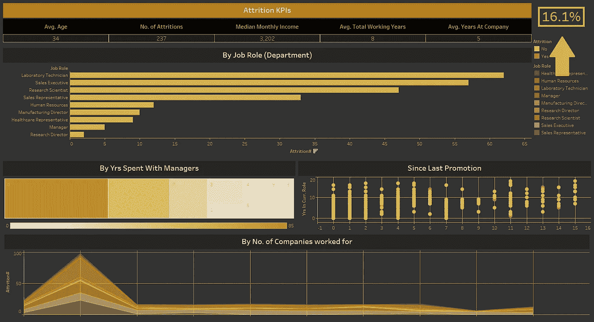

# 减员！你为什么要用一个令人震惊的仪表盘来跟踪它呢？！

> 原文：<https://medium.com/geekculture/attrition-why-should-you-track-it-with-a-dashboard-that-stuns-2e50663f0e21?source=collection_archive---------42----------------------->

我的一个朋友在制药行业的一家大公司工作，当他决定离开时，他被这样打发:“谢谢你的离开，伙计！”

尽管事实上我的朋友是他所在地区的西格玛，让我们假设最坏的情况，他不适合他的位置，所以他的离开是受欢迎的。

事实上，这是你嘲笑整个组织和丑化其招聘过程的地方。

无论如何，这是一出戏的自然减员术语，为什么作为雇主你应该关心它，作为雇员它对你意味着什么？

损耗抽象地意味着某物的逐渐减少/缩小。它可能发生在工作人员或客户层，因为我们从内部采取它来帮助制定更智能的数据驱动的业务决策，所以当员工决定退出并离开您的公司时，就会发生这种情况。

现在，我们应该恳求他留下来还是急切地把他赶走？

就尊重而言，一个人不能两样都做，为什么呢？首先，公司应该尊重他/她的离职决定，并为他们的职业生涯开辟新的舞台。
第二，公司要尊重其系统整体，考虑其组织图景。那么更好的方法是什么呢？

这是感谢上帝问的问题。但要回答这个问题，你需要问另一个问题，并作为一个有根的人更深入。**为什么**一名员工会离开我的公司？—这是一个价值百万的问题。

事实上，员工离职的原因有很多，但最常见的是:

1.  退休了。
2.  更好的机会。
3.  其他原因。
4.  或者你！

所以，是你吃了我的午夜蛋糕？！啊！

这就是为什么你需要追踪流失和离职的原因，不仅仅是为了知道原因，而是为了更多地了解你的公司、流程、氛围和员工。从技术上来说，有大量的指标可以看出损耗，并衡量它对你正在进行的业务的影响。

**流失率**是你应该考虑的基本且重要的指标之一。它反映了你的员工有多少百分比离开了你，这就是定义。我喜欢用我自己的方式来解释:一个员工离开你的可能性有多大？*有意思！* 这是因为如果你的公司还有一部分人留下来，而你并没有看到或改变太多，那么将来很可能会有更多的人离开。

Attrition Dashboard to track down employees leaves

这是你在右上角看到的数字，它是这样计算的:

> ***流失率(%) =(离职人数÷员工人数)x 100***

由于你可以执行**招聘冻结**，这意味着你不会去寻找新的替代者，从而削减你的劳动力成本，你也可以决定经历一个招聘过程来填补你的空缺职位，一个新的独立指标将填补你的计划中的空间，**流失率**表明在一段特定时间内你替换了你的劳动力的多少百分比？

对于要跟踪的许多不同的比率和指标，您需要一个动态的分析工具，以便您可以探索相关性并处理数据以获得更新的见解，它必须是一个专注的一体化助手。

您可以看到操作面板:

Attrition dashboard in Action

流失指标是关键的业务比率，可以通过更好地利用员工并留住他们来更好地推动业务。

那么，如何降低流失率呢？

*   **保留是否对成功至关重要:**通过提供有竞争力的薪酬待遇、个人和职业发展机会，以及这种价值文化，表现为“我希望你不要离开我的身边”。这是欣赏，这是信任！
*   一个热情的离职计划:友好地离开一些在一些公司看起来过于天使般的东西，一位经理说“我们是人”！这就像是对你的前任雇主说了一句正面的话。带着感激和最美好的祝愿说再见是在你的公司中体现诚信的一个很好的方式。现在，除了我们的经理，你认为值得计划吗？
*   让门开着:从之前的热情离开中，这绝对比让你的员工因一个谣言而羞愧或尴尬要好，这确实反映了公司的情况，并取决于它的文化。你是否考虑制定政策和公司文化，欢迎回旋镖员工，尤其是如果他/她是高质量的？

这就是这一轮的内容，希望在下一个主题中看到您的新仪表板，它可以帮助您改善您的业务。再见了！