# AutoAI —自动化人工智能工作流以构建和部署机器学习模型

> 原文：<https://medium.com/geekculture/autoai-automating-the-ai-workflow-to-build-deploy-machine-learning-model-bb2b727cda28?source=collection_archive---------22----------------------->

*IBM Cloud Pak 在 IBM Cloud 上使用 Watson 机器学习和云对象存储进行数据存储*

[**安迪·萨马**](https://id.linkedin.com/in/andisama)**——*CIO，* [*辛尔吉·瓦哈纳·格米朗*](http://www.swgemilang.com/) *同* [***卡亚提·桑加吉***](https://www.linkedin.com/in/cahyati-supriyati-sangaji-463a80b5/) ，[***努尔霍利斯·塞哈***](https://www.linkedin.com/in/nurholis-seha-376422211/) ***，*****

**# SWG # SinergiWahanaGemilang # IBM # CloudPakforData # CP4D # AutoAI # IBMAutoAI # MaximoVisualInspection**

```
TLDR;
*- Build and Deploy a Machine Learning model using AutoAI (text-based dataset).
- Illustrated on a use case for predicting customer satisfaction for airline passengers (Kaggle dataset).
- Implemented with IBM AutoAI, as part of IBM Cloud Pak for Data on IBM Cloud.*
```

**建立人工智能(或机器学习)模型是一项复杂的任务。机器学习和深度学习框架，如 Sklearn、TensorFlow 或 Pytorch，可以自动完成大部分工作，但对于没有实际编程经验的人来说仍然非常复杂。我们还需要考虑其他任务，如数据预处理(在构建模型之前)和安排必要的基础设施，以可扩展的方式将训练好的模型部署到生产中。**

**AutoAI 通过批量或在线自动化数据预处理、模型选择、特征工程、超参数优化和模型部署等大多数流程，为您提供帮助。我们需要提供的只是数据集。**

**下图显示了一个典型的 AutoAI 工作流程，从准备数据到部署 AI 模型。**

**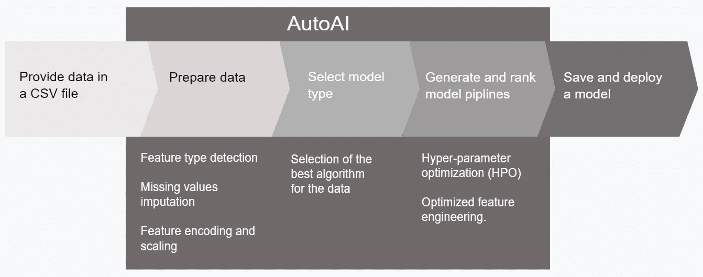**

**Build and deploy a machine learning model with the IBM AutoAI platform, with no coding (IBM, 2021a).**

**我们使用 IBM Cloud Pak 作为 IBM Cloud 上的数据平台，其中 AutoAI 是受支持功能的一部分。AutoAI 自动化平台基于非文本数据集构建和部署 AI 模型。IBM Maximo Visual Inspection(以前称为 IBM PowerAI Vision)支持类似的工作流来处理图像和视频数据源。**

**IBM AutoAI 支持用于监督学习的基于文本的数据集，这意味着我们需要一个带标签的数据集，其中有输入要素和目标带标签的要素。在本文中，features & columns 具有相同的含义。**

**我们可以将默认预测类型(目标标注要素)更改为二元分类、多类分类或回归。二元分类只有两个可能的值。多类分类具有 3 个或更多可能值的离散集合。相比之下，回归有一个连续的数值变量。**

**通过使用实际数据集和实际用例，我们可以欣赏 AutoAI 平台自动化人工智能工作流程的能力。**

# **资料组**

**作为一个示例用例，我们使用 Kaggle 数据集(TJ Klein，2020 年)基于 22 个可用输入特征来预测*航空公司乘客满意度*。**

**我们可以看到数据集“航空旅客 sat —火车*”的预览。* csv”，总共包含 25 个特征。**

****

**Dataset — A filename “airline passenger sat — train*.csv” is listed as one of the data assets in the IBM AutoAI platform on IBM Cloud.***

**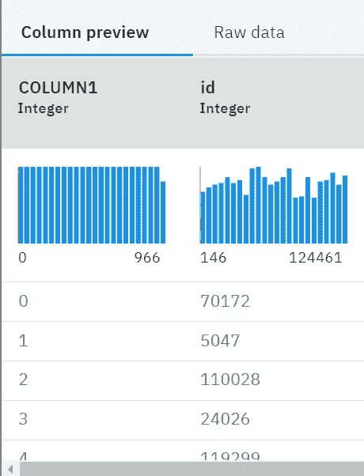**

**Dataset — “airline passenger sat — train*.csv*” (1 of 4) dataset. These are the first two features/columns to drop.**

**有 24 个输入要素和一个标记为要素的目标。我们放弃了前两个输入特征( *COLUMN1* 和 *id，*不包括在训练中)，因为它们似乎与我们的预测无关。 *COLUMN1* 只是一个序列号，而 *id* 似乎是引用个人数据档案详细信息的唯一编号。**

**然后，我们设置*满意度*作为预测的特征。该标注要素只能有二进制值“中性或不满意”或“满意”**

****

**Dataset — “airline passenger sat — train*.csv*” (2 of 4).**

****

**Dataset — “airline passenger sat — train*.csv*” (3 of 4).**

****

**Dataset — “airline passenger sat — train*.csv*” (4 of 4).**

**为了生成一个好的人工智能模型，理想情况下，我们需要平衡所有特征的数据。实际上，这很难实现。如果我们很快看到数据集的一部分，*性别*几乎完全平衡，而标记为特征的目标(*满意度*)在某种程度上平衡为 56%:44%“中性或不满意”:“满意。”极端情况下，*客户类型*、*出发延误分钟*和*到达延误分钟*不平衡。**

# **建模(训练，生成人工智能模型)**

**AutoAI 自动选择*预测类型*为“二元分类*”，因为目标特征只有两个可能值。*根据数据集“精确度*”自动选择*优化指标**我们的目标特征(要预测的)是*满意度，*并且 AutoAI 设置肯定的 class = "中性或不满意。"这不是我们想要的肯定类的值，所以我们将肯定类的值改为特性*满意度* =“满意”**

**支持的优化指标包括 ROC AUC(曲线下接收器操作特征面积)、平均精度、精度、召回率、F1、对数损失等。**

****

**Auto AI Experiment — Verify our target feature (to predict), prediction type, optimization metric, and positive class value.**

**默认情况下，AutoAI 会删除重复的行，除非我们禁用“实验设置”中的设置对于大型数据集，对数据集进行子采样(仅使用数据集的子集，按照一定的百分比或行数)可以加快训练时间。二次采样可能会影响精度。**

**我们的数据集有 103，904 行。对于我们的环境来说，处理所有这些数据可能需要一些时间。对于这个用例，我们将*子样本设置为* = "20% "，以将训练数据减少到大约 20，000 多行，以获得足够的训练时间，同时仍然被认为足以获得良好的结果。**

**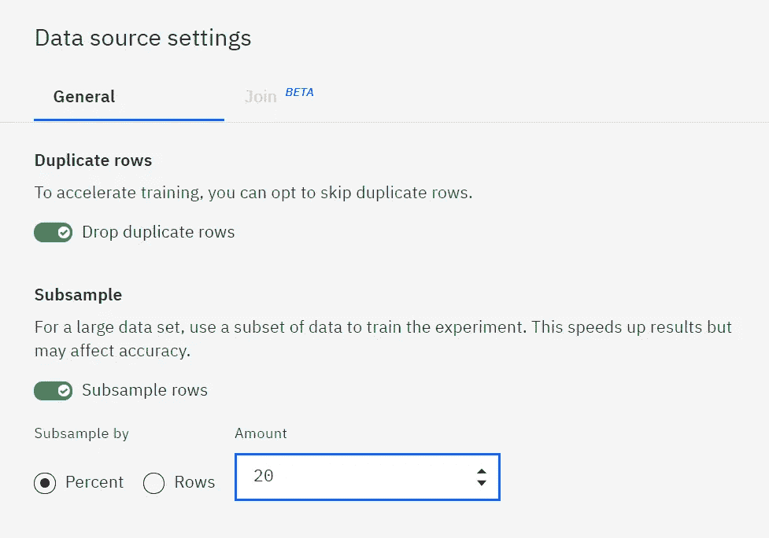**

**Auto AI Experiment— Use only 20% of available data for training the AI model.**

**默认情况下，AutoAI 保留 90%的数据集用于训练(*训练数据拆分*)，10%用于验证(*维持数据拆分*)。如果我们有一个大的数据集，我们可以将它调整为 85%:15%。我们将此作为默认设置。**

**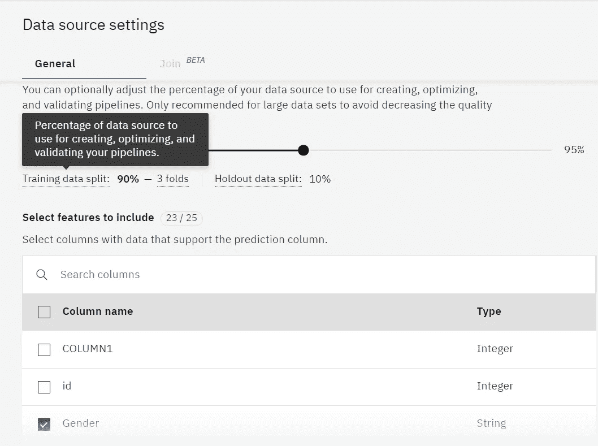**

**Auto AI Experiment— Split the data for training:validation to be 90%:10%. Drop the 1st two columns.**

**AutoAI 会根据数据集自动选择要包含在训练过程中的算法。高级用户可以修改(选择/取消选择)这些选择的算法。**

**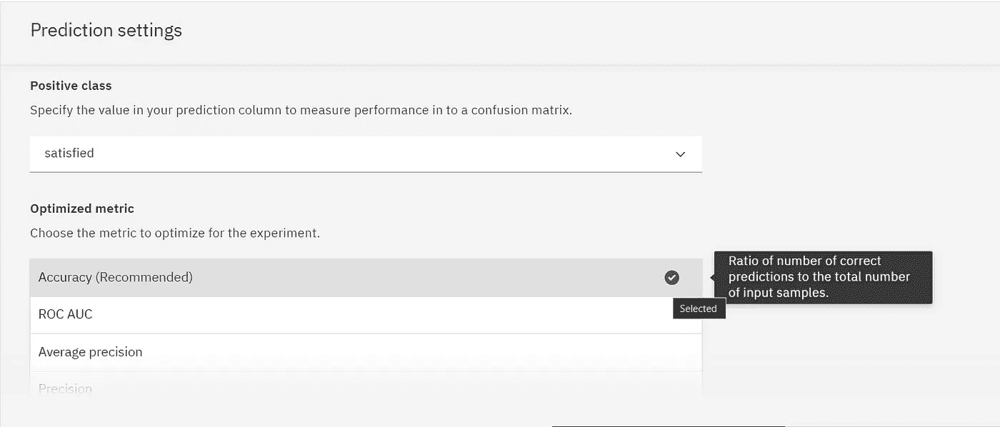**

**Auto AI Experiment — Prediction settings, with a list of selected algorithms for generating the AI model.**

**我们可以将默认*算法的数量从 1 更改为 4，以便在训练的模型结果上有更多的选择(但是，这会影响训练时间——更长)。我们保留默认值= 2。***

****

**如果我们还没有配置运行时环境，我们也需要这样做。它包括配置“沃森机器学习服务”——创建、训练、部署机器学习和深度学习模型，以及“计算配置”——CPU/GPU 和内存配置。在我们的计算配置中使用 GPU 将显著加快培训过程，但会增加成本。**

**请注意，与使用机器学习框架时的灵活性不同，我们可以调整最小的超参数。大多数设置都是预定义的，将在以后的培训过程中自动调整。因此，名为奥塔伊。**

**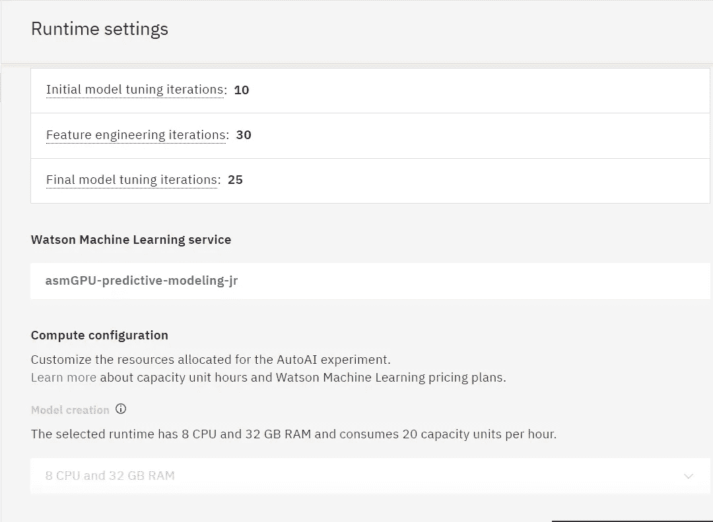**

**Auto AI Experiment - Runtime environment.**

****

**Auto AI Experiment — “Airline Passenger Satisfaction” experiment, before the training.**

**一旦一切都设置好了，我们就可以开始训练了(“运行实验”)。**

**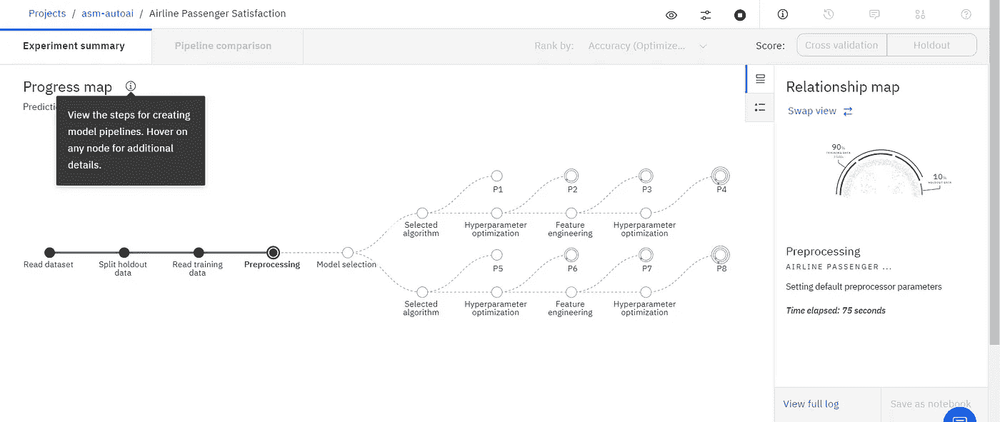**

**AutoAI Experiment: Starting the experiment by first reading the dataset (progress map view).**

**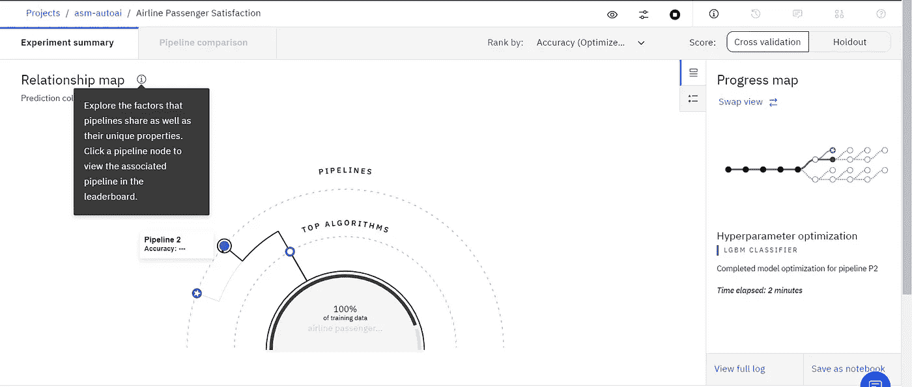**

**AutoAI Experiment: Experiment in progress (relationship map view), 1 of 2.**

**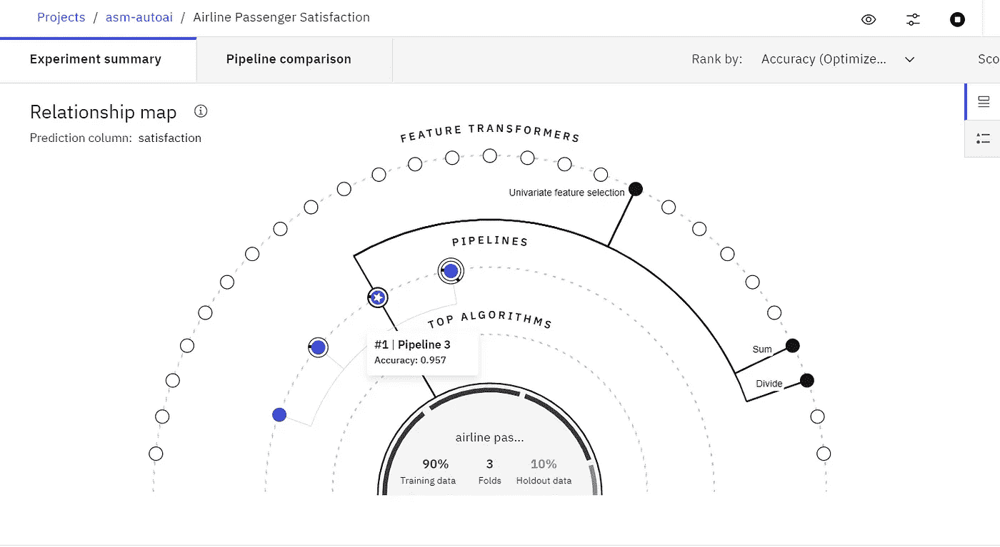**

**AutoAI Experiment: Experiment in progress (relationship map view), 2 of 2.**

****

**AutoAI Experiment: A completed experiment with P4 selected as the top performer pipeline (95.7% accuracy), 1of 2.**

**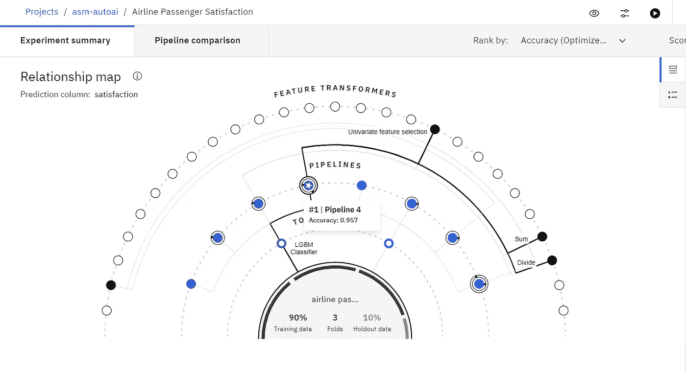**

**AutoAI Experiment: A completed experiment with P4 selected as the top performer pipeline (95.7% accuracy), 2 of 2.**

**在我们的配置中，使用 AutoAI 的前两个选定算法(LGBM 分类器和随机森林分类器)的训练只需 18 分钟即可完成。每个算法生成四条管线，总共产生 8 条备选管线。**

**竣工时，管道 4 (P4)以 95.7%的准确率被选为最佳执行者。**

****

**AutoAI Experiment result: Pipeline leaderboard with Pipeline 4 has been selected as the Top Performer, following the AI model building’s completion.**

****

**AutoAI Experiment result: The status of a completed AutoAI experiment on April 4, 2021.**

**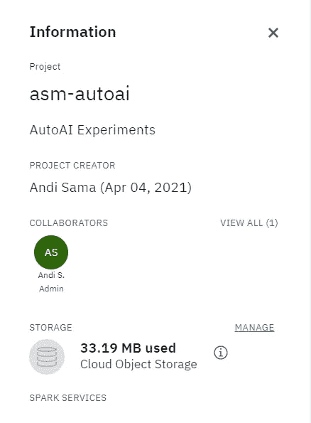****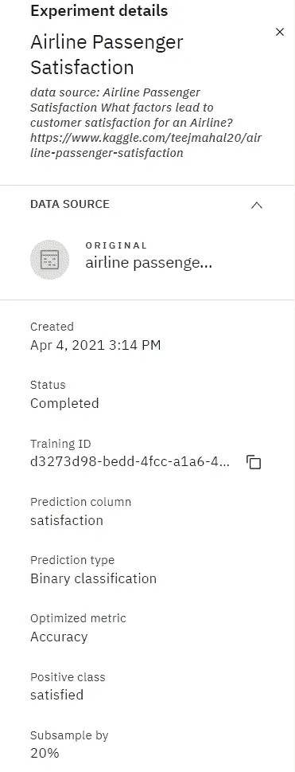**

**AutoAI Experiment: Information Summary on the Experiment.**

**AutoAI 提供了每条管道的更详细信息。让我们来看看几个被选为最佳表现者的管道 4 (P4)的模型评估。在这里，AutoAI 显示了 ROC 曲线、混淆矩阵和 PR 曲线(精确召回曲线)。**

**根据(Jason Brownlee，2018) ROC 曲线"*总结了使用不同概率阈值的预测模型的真阳性率和假阳性率之间的权衡。*”**

**此外，PR 曲线"*总结了使用不同概率阈值* s 的预测模型的真实阳性率和阳性预测值之间的权衡。然后，" *ROC 曲线适用于各类之间的观察值平衡的情况，而精确召回曲线适用于不平衡数据集*。"**

**观察值是我们数据集中的实际数据。**

**由于我们的数据集大体上是平衡的(并非所有特征)，我们可以使用 ROC 曲线来评估我们的模型。对于维持和交叉验证，曲线下面积(AUC)为 99.5%和 99.3%。这是一个很高的数字，接近 100%。我们可以认为这个生成的 AI 模型(非常)好(有技巧)。**

**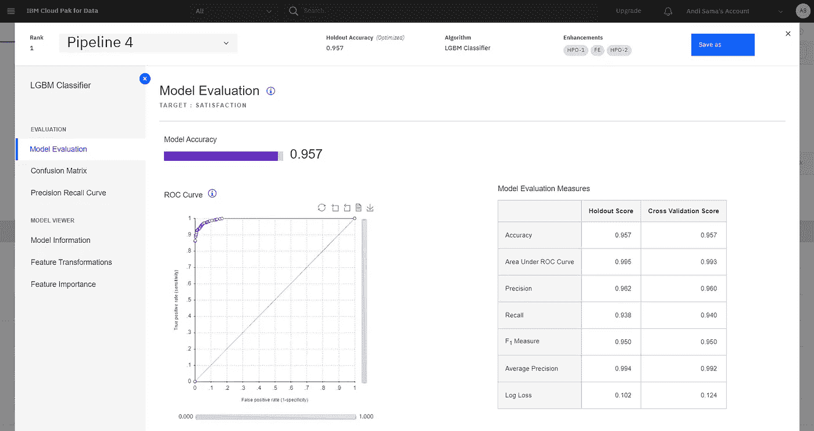**

**AutoAI Experiment result: Model Evaluation for Pipeline 4 (ROC Curve).**

**IBM AutoAI 文档(IBM，2021b)对混淆矩阵陈述如下:“*显示了适当模型的正确和不正确分类的数量和比例。***

**一个好的混淆矩阵在*预测*列和*观察*行的主对角线单元(从左上到右下)中显示高且平衡的值，而在其余单元中显示低值。**

****

**AutoAI Experiment result: Model Evaluation for Pipeline 4 (Confusion Matrix).**

**根据(Jason Brownlee，2018)的说法，当存在中等至较大的阶层失衡时，应使用 PR 曲线“*”*此外，“*在信息检索中经常使用的精确回忆(PR)曲线，已经被引用作为类别分布中具有大偏斜的任务的 ROC 曲线的替代物。”***

****

**AutoAI Experiment result: Model Evaluation for Pipeline 4 (PR Curve).**

**AutoAI 也提供 f *特征重要性*的报告。它显示了主要对生成的 AI 模型有贡献的原始(或生成的)特征的列表。我们看到*年龄、飞行距离、*和*行李处理*对航空公司乘客的满意度贡献最大。**

***NewFeature_10* 在*飞行距离*和*行李处理*之间是生成的特征之一。我们可以在*特征转换*报告中查看所有生成的特征。**

**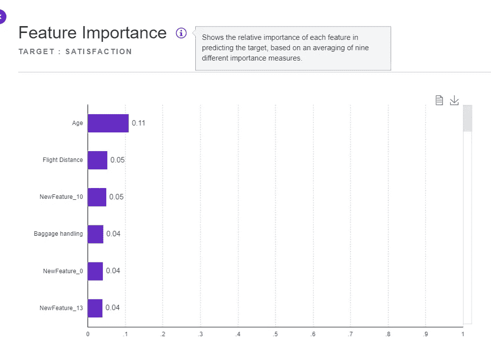**

**AutoAI Experiment report: Model Viewer for “feature importance” features in the top list.**

**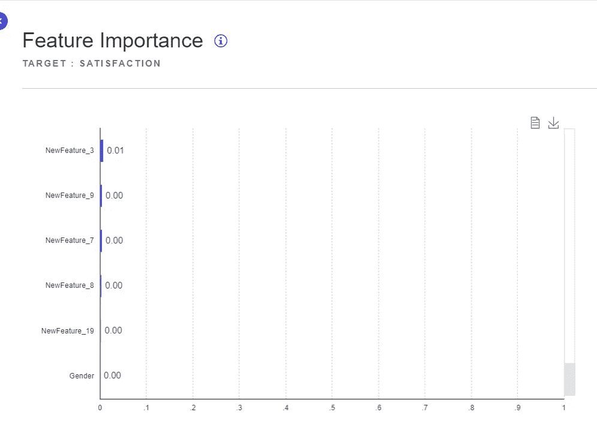**

**AutoAI Experiment report: Model Viewer for “feature importance” features in the bottom list.**

**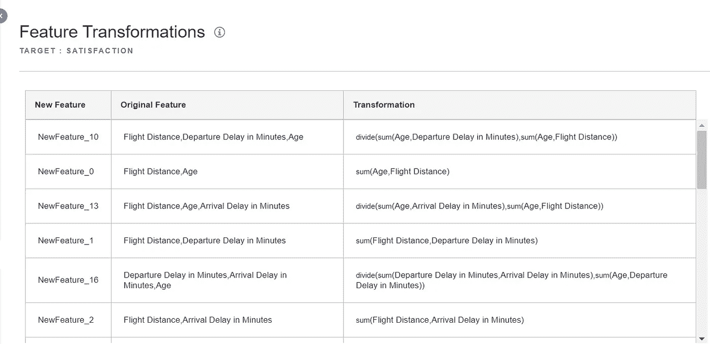**

**AutoAI Experiment report: Generated features.**

**我们可以考虑去掉不太重要的功能，进行再培训。例如，重要性低于或高达 1%的已识别特征(即*性别*和四个其他特征:*客户类型*，T *旅行类型*，*到达延迟分钟数*，*出发延迟分钟数*)。**

**此外，我们可能会考虑删除更多重要性超过 2%的功能。AutoAI 在这一类别中确定了四个特征:*食品和饮料、机上娱乐、舱位、*和*在线预订的便利性*。**

**只需注意，我们可以通过删除所有这九个已识别特征重要性小于或等于我们训练的人工智能模型的 2%的输入特征，来尝试重新训练我们的人工智能模型。我们之前删除了两个输入要素，通过再添加九个要移除的要素，我们移除了 24 个输入要素中的 11 个。**

****

**AutoAI Experiment report: Model Viewer for “feature importance” features, starting from 0.2% importance to lower importance.**

**建立模型后，我们可以生成并保存一个 Jupyter 笔记本文件(用 Python 编程语言)作为将来的参考。在这个笔记本文件中，我们可以查看创建所有实验管道的完整代码。**

**然后，我们可以将表现最佳的渠道(P4)保存为准备部署的模型。由于这是模型的云版本，生成的 AI 模型文件不可离线下载。然而，我们可以下载训练过程的完整日志和生成的 Python 笔记本代码。**

****

**AutoAI Experiment: The generated AI model (trained).**

# **部署(运行时)**

**为了部署一个训练模型(P4)，我们需要将选择的训练模型保存为一个模型，然后将保存的模型提升到一个部署空间。空间(如果还不存在，则需要创建具有关联存储服务的空间)。**

****

**AutoAI Deploying Model — Promoted trained model in the assigned space, ready for deployment.**

**一旦训练好的模型被提升到分配的空间，它就可以部署了。我们可以选择部署类型为在线(当 web 服务接收数据时，对数据实时运行模型)或批处理(作为批处理对数据运行模型)。对于这个用例，我们选择“在线”。**

****

**AutoAI Deployed Model — Status of deployed trained model in the assigned space, ready to accept a request.**

**从训练数据之外的两个测试数据(只是随机选取的)中，我们已经以 99.57%的概率预测了“中性或不满意”，以 85.98%的概率预测了“满意”。**

**注意到(Jason Brownlee，2018)，"*在二元分类中，类 0 是负/多数类，类 1 总是正/少数类。这是惯例*。”在这种情况下，我们的否定/多数类是“中立或不满意”(第一概率序列)，而“满意”属于肯定/少数类。**

****

**AutoAI Deployed Model — Results with test data.**

# **下一步是什么**

**通过使用开源框架构建和部署机器学习模型来实现人工智能可能具有挑战性，即使对于有经验的人来说也是如此。还有一些额外的任务，比如数据预处理和为模型部署安排必要的基础设施。**

**AutoAI，如作为 IBM Cloud Pak for Data 的一部分的 IBM AutoAI，可以通过自动化从数据预处理、模型选择、特征工程、超参数优化和模型部署的大部分过程，显著加快端到端 AI 工作流过程。我们需要提供的只是数据集。**

**您对使用自己的数据集探索 AutoAI 感兴趣吗？登录 IBM Cloud 上的 [IBM Cloud Pak 数据平台](http://dataplatform.cloud.ibm.com)，开始您的 AutoAI 之旅。**

# **参考**

*   **Andi Sama，Davin Ardian，2020 年*“*[*一瞥数据争论:在数据科学中进行分析的基本辅助技能*](https://andisama.medium.com/a-brief-look-into-data-wrangling-c2dbf2e2f865) *。”***
*   **Andi Sama 等，2020*[*开源工具的图像预处理:计算机视觉中做 AI 的图像预处理一瞥*](https://andisama.medium.com/image-preprocessing-with-open-source-tools-36dfac683c22) *。”****
*   ***安迪 Sama，2019，*[*AI 模型推理，实际部署方法&注意事项*](/@andisama/ai-model-inferencing-b42ca041d106) *，* 2019 SWG Insight — Edisi Q4。****
*   ****Andi Sama 等人，2019，*“*[*像数据科学家一样思考*](/@andisama/think-like-a-data-scientist-d5d13c4d82fe) *。”*****
*   ****IBM，2021a，“ [*AutoAI 概述(沃森机器学习)*](https://www.ibm.com/support/producthub/icpdata/docs/content/SSQNUZ_latest/wsj/analyze-data/autoai-overview.html) ”****
*   ****IBM，2021b，“[*IBM Cloud Pak for Data*](https://dataplatform.cloud.ibm.com/)*:云上的综合数据平台*”****
*   ****Jason Brownlee，2018，《Python 中如何使用 ROC 曲线和 Precision-Recall 曲线进行分类 *。*****
*   ****TJ Klein，2020，“ [*航空公司乘客满意度:对于一家航空公司来说，是什么因素导致了客户满意度？*](https://www.kaggle.com/teejmahal20/airline-passenger-satisfaction)****