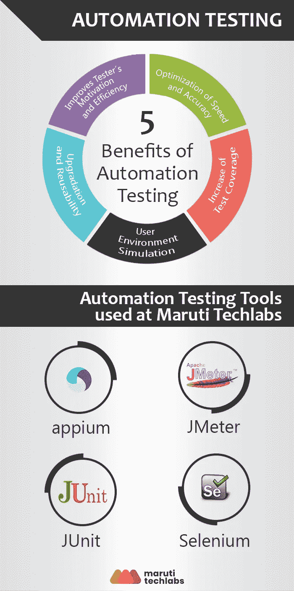

# 自动化测试——加快产品发布的途径

> 原文：<https://medium.com/geekculture/automation-testing-your-way-to-quicker-product-release-66e8c7e006f2?source=collection_archive---------22----------------------->

## 测试是软件开发生命周期的成败阶段之一。

随着对更快交付高质量软件的需求的增加，企业正在采用 DevOps 和敏捷的软件开发方法。

采用 DevOps 需要自动化测试的知识，以增加软件测试的有效性、效率和覆盖面。自动化测试是测试活动的管理和执行，包括测试脚本的开发和执行，以便使用自动化测试工具来验证测试需求。

它有助于比较实际结果和预测结果。因此，自动化测试已经成为质量保证不可或缺的一部分。

# 自动化测试的好处

# 1.速度和精度的优化

一旦测试被记录下来，自动化测试比相应的手工测试花费更少的时间。对于彻底和频繁的执行，在更大的系统上手动测试需要更多的时间。测试自动化是一种使测试过程非常有效的方法。

测试团队可以被战略性地部署来处理棘手的、案例特定的测试，而自动化软件可以处理每个软件都必须经历的重复的、耗时的测试。这提高了准确性，因为自动化测试在每次执行时都会精确地执行相同的步骤，并创建详细的报告。因此，这不仅是节省时间、金钱和资源的好方法，也是产生高投资回报率的好方法。

# 2.提高测试人员的积极性和效率

手动测试可能是平凡的，容易出错，因此变得令人恼火。测试自动化减轻了测试人员的挫折感，并允许在没有用户交互的情况下执行测试，同时保证可重复性和准确性。相反，测试人员现在可以专注于更困难的测试场景。

# 3.测试覆盖率的增加

自动化软件测试可以增加测试的深度和范围，从而帮助提高软件质量。冗长的测试可以在多台配置不同的计算机上运行。自动化软件测试可以检查应用程序，调查内存内容、数据表、文件内容和内部程序状态，以确定产品是否按预期运行。

自动化软件测试可以在测试运行期间轻松地执行数千个不同的复杂测试用例，提供手工测试不可能提供的覆盖范围。从重复的手工测试中解放出来的测试人员有更多的时间来创建新的自动化软件测试和处理复杂的特性。

# 4.升级和可重用性

软件中的测试脚本是可重用的，这有许多后续好处。随着每个新的测试和缺陷的发现，测试软件目录可以被升级并保持最新。因此，即使测试自动化在初始阶段看起来很昂贵，人们也必须认识到自动化软件是一个持久的、可重用的产品，能够证明它的成本是值得的。

# 5.用户环境模拟

[自动化测试](https://marutitech.com/quality-engineering-services/)用于使用分类部署的鼠标点击和按键来模拟典型的用户环境。这为未来的测试场景提供了一个平台。内部自动化软件被建模为具有足够的灵活性来处理独特的产品，同时遵守最新的安全和测试协议。

这使得测试自动化成为节省时间、足智多谋和一流结果的强大工具。例如，对于自动化测试，像 GUI 测试这样耗时且冗余的过程变得非常容易。

# 自动化测试工具

# 硒

[Selenium](http://www.seleniumhq.org/) 是一个流行的自动化 web 测试工具，可以帮助你在不同平台上自动化 web 浏览器。Selenium 在大型浏览器供应商中非常流行，是他们浏览器的原生部分。 [Webdriver](http://www.seleniumhq.org/projects/webdriver/) 是 selenium 的最新版本，改进了功能测试覆盖率，比如文件上传或下载、弹出窗口和对话框屏障。

WebDriver 设计在一个更简单、更简洁的编程接口中，并解决了 Selenium API 中的一些限制。Selenium 与 [Hudson](http://hudson-ci.org/) 一起使用时，可用于持续集成。

# JMeter

[JMeter](http://jmeter.apache.org/) 是一款开源测试软件。这是一个 Java 应用程序，旨在涵盖负载、功能、性能、回归等测试类别。，它需要 Java 开发工具包(JDK) 5 或更高版本。JMeter 可用于测试静态和动态资源的性能，如 Web 服务(SOAP/REST)、Web 动态语言(PHP、Java、ASP。NET)、Java 对象、数据库和查询、FTP 服务器等。

它可用于模拟服务器、服务器组、网络或对象上的重负载，以测试其强度或分析不同负载类型下的整体性能。它提供了性能的图形化分析，或者测试您的服务器/脚本/对象在高并发负载下的行为。

# Appium

[Appium](http://appium.io/) 是一款开源工具，用于在 iOS 和 Android 平台上自动化本地、移动 web 和混合应用。Appium 是“跨平台”的，它允许你使用同一个 API 针对多个平台(iOS，Android)编写测试。这支持 iOS 和 Android 测试套件之间的代码重用。

Appium 的理念是，测试原生应用不需要 SDK 或重新编译应用，应该能够使用您喜欢的测试实践、框架和工具。

# 朱尼特

JUnit 是一个简单的单元测试框架，用 Java 编写可重复的测试。JUnit 是 Java 开发人员的标准测试框架之一，也有助于测试驱动的开发。类似地， [NUnit](http://www.nunit.org/) 是一个面向所有人的单元测试框架。

Net 语言和 xUnit 家族中的一个程序。它最初是从 JUnit 移植到。NET，并且已经过重新设计以利用许多。NET 语言特性。

测试是每个软件交付周期的支柱。缺陷的检测和预防对于软件行业的测试团队来说是一个重大的挑战。

软件开发成本的很大一部分包括项目中的错误消除和返工。缺陷的早期检测需要在整个产品生命周期中进行质量控制活动。这需要采用 DevOps 和自动化测试。

在[马鲁蒂技术实验室](https://marutitech.com/)，我们遵循测试自动化最佳实践，并使用企业级工具和软件来高效实施。[联系](https://marutitech.com/contact-us/)我们不仅可以简化您的测试过程，还可以简化整个软件开发周期。