# AWS 颤振放大器

> 原文：<https://medium.com/geekculture/aws-amplify-for-flutter-613c1c07b0e2?source=collection_archive---------5----------------------->

*AWS Amplify 是一套工具和服务，可以一起使用或单独使用，帮助前端 web 和移动开发者构建可扩展的全栈应用，由 AWS 提供支持。使用 Amplify，您可以在几分钟内配置应用后端并连接您的应用，只需几次点击即可部署静态 web 应用，并在 AWS 控制台外轻松管理应用内容。*

*Amplify 支持包括 JavaScript、React、Angular、Vue、Next.js 在内的流行 web 框架，以及包括 Android、iOS、React Native、Ionic、Flutter 在内的移动平台。借助 AWS Amplify 更快上市。*

在本文中，我将按照本页的[中介绍的步骤配置 AWS Amplify，使其与 Flutter 一起使用，以**添加认证支持**。我们将了解使用 Amplify CLI 时会发生什么，以及在 AWS 中创建了哪些资源。](https://docs.amplify.aws/start/getting-started/installation/q/integration/flutter)

# #1 放大 CLI

Amplify 命令行界面(CLI)是一个统一的工具链，用于为您的应用程序创建 AWS 云服务。

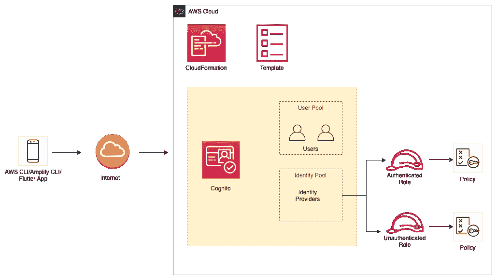

# 安装并验证依赖关系

放大 CLI 需要节点和 npm。首先安装这些并验证它们。为了查看在 AWS 中创建的资源，我们将使用 [AWS CLI](https://docs.aws.amazon.com/cli/latest/userguide/install-cliv2.html) 。

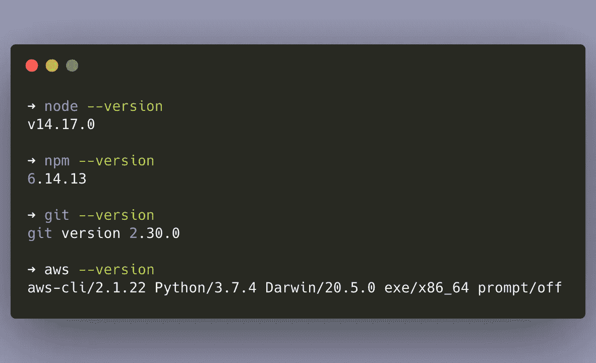

# 安装 Amplify CLI

```
➜ curl -sL [https://aws-amplify.github.io/amplify-cli/install](https://aws-amplify.github.io/amplify-cli/install) | bash && $SHELL
```

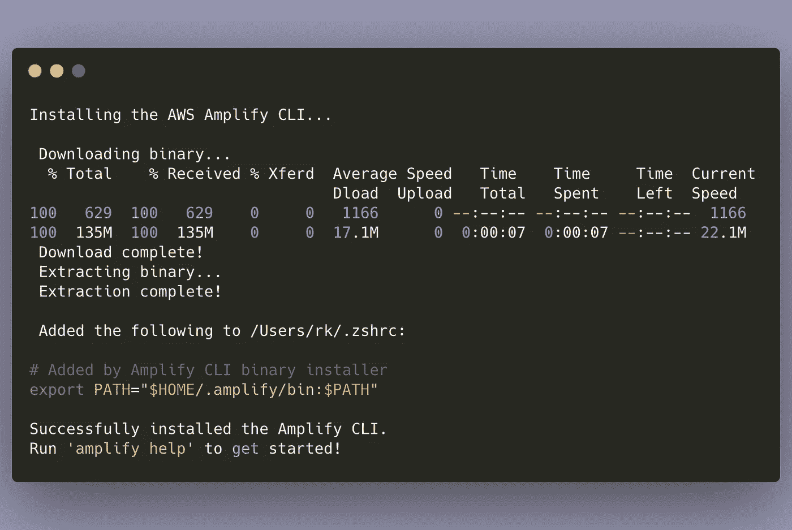

# 核实

```
➜ amplify --version
5.1.0➜ amplify help
```

# #2 配置

此步骤通过打开 AWS Web 控制台创建一个 AWS IAM(身份和访问管理)用户，并配置本地机器使用 AWS。

```
➜ amplify configure
```

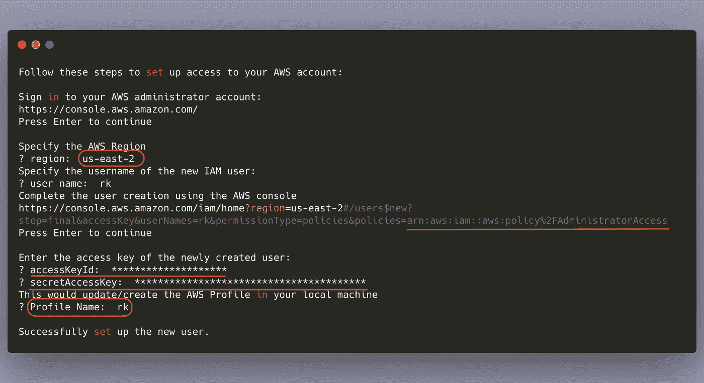

**这一步会发生什么？**

*   区域-区域是创建 AWS 资源的地方。
*   用户名 IAM 用户的名称
*   注意，IAM 用户是使用 **AdministratorAccess 创建的。**这使用户可以无限制地访问 aws 帐户。
*   一旦用户被创建，网络控制台为用户显示**访问键**和**秘书访问键**。这些是以编程方式(使用 SDK/CLI)访问 AWS 所必需的。
*   最后它要求**档案名称**。默认情况下，它使用配置文件**默认值。**但是，如果我们需要从 CLI 访问多个用户/帐户，我们需要有不同的配置文件名。在这种情况下，我将 **rk** 作为我的配置文件名。
*   如果该步骤完成，用户配置将存储在本地的两个文件中。文件是`~/.aws/config` 和`~/.aws/credentials.`

# 核实

```
➜ aws configure list --profile rk
```

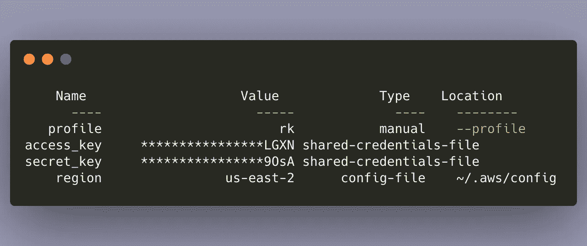

> 访问密钥和秘密密钥非常敏感。不要与任何人共享，也不要将它们包含在代码库中。

# #3 创建一个颤振应用

```
➜ flutter create my_amplify_app
```

**更新** `**pubspec.yaml**` **以包括放大依赖关系。**

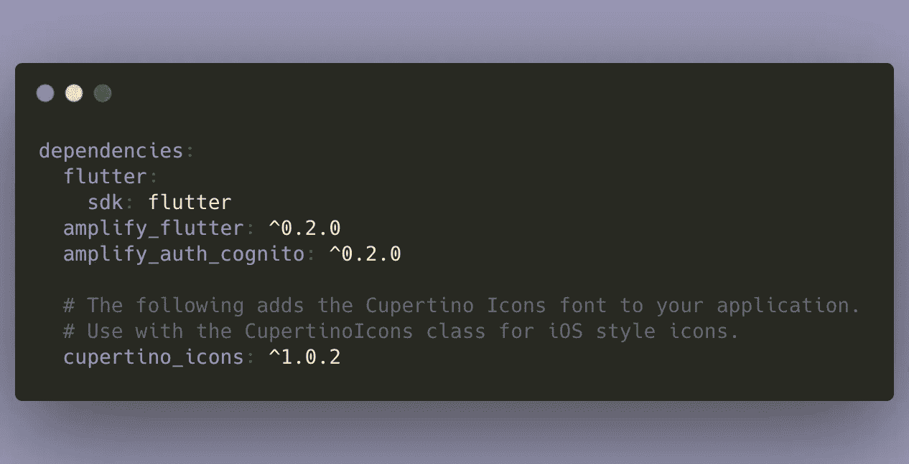

```
➜ cd ~/desktop/my_amplify_app
➜ flutter pub get
```

# Mac OS 特定的更改

按照步骤配置 Mac OS 特定的更改@[https://docs . amplify . AWS/lib/project-setup/create-application/q/platform/flutter](https://docs.amplify.aws/lib/project-setup/create-application/q/platform/flutter)。

# #4 调配后端(创建 AWS 资源)

这一步使用 **AWS CloudFormation** 来创建两个角色。

```
➜ cd ~/desktop/my_amplify_app
➜ amplify init
```

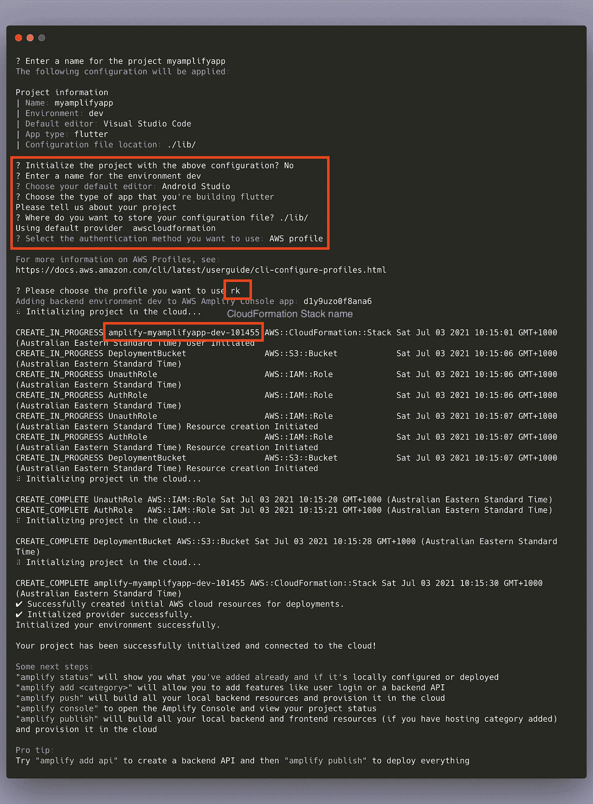

**这一步会发生什么？**

*   这一步使用 AWS CloudFormation 创建两个 IAM 角色。
*   它使用在步骤 2 中配置的 AWS 概要文件。
*   **AWS CloudFormation** 通过将基础设施视为代码，提供了一种简单的方法来对相关 AWS 和第三方资源的集合进行建模，快速一致地提供它们，并在它们的整个生命周期中对它们进行管理。
*   **cloud formation 模板**描述了所需的资源及其依赖关系，因此它们可以作为一个堆栈一起启动和配置。

**验证资源**

*   在 **lib** 文件夹中创建一个文件**amplify configuration . dart**。它将包含 Flutter 应用程序连接到 AWS 所需的细节。在这一点上，它没有任何细节。

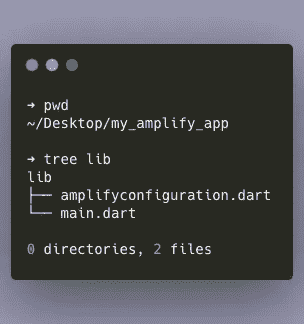

```
➜ cat lib/amplifyconfiguration.dart
```

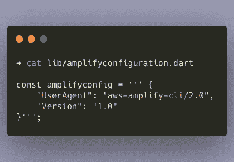

# 显示创建的 AWS 资源

*   查看所创建资源的一种方法是使用步骤 2 中创建的 IAM 用户和密码登录 AWS Web 控制台。
*   另一种方法是使用 AWS CLI。

这里，我们使用第二个选项。

```
# Update the stack name.
# Get the stack name from the log created above.➜ stack_name='amplify-myamplifyapp-dev-101455'
```

## 堆栈资源

```
➜ aws --profile rk cloudformation list-stack-resources \
      --stack-name ${stack_name} \
      --query 'StackResourceSummaries[].[LogicalResourceId, PhysicalResourceId, ResourceType, ResourceStatus]' \
      --output table
```


## 已验证用户、未验证用户的角色


*   请注意，还没有 IAM 附加到角色。
*   到目前为止，我们只创建了几个角色，没有其他资源可供 Flutter 应用程序使用。我们将在下一步中这样做。

# #5 使用 AWS Cognito 为 Flutter 应用程序添加身份验证支持

> **什么是 AWS Cognito？**
> 
> Amazon Cognito 为您的 web 和移动应用程序提供认证、授权和用户管理。你的用户可以用用户名和密码直接登录，或者通过第三方，如脸书、亚马逊、谷歌或苹果。
> 
> Amazon Cognito 的两个主要组件是用户池和身份池。用户池是为应用程序用户提供注册和登录选项的用户目录。身份池使您能够授予用户对其他 AWS 服务的访问权限。您可以单独或一起使用身份池和用户池。

什么是用户池？

*   用户池只不过是用户的集合。
*   AWS Cognito 存储用户凭证并支持用户管理，如注册/登录/密码重置等。
*   使用用户池不是强制性的。AWS Cognito 还支持**社交登录，**已经拥有谷歌/脸书/etc 账户的用户可以通过认证使用 Flutter 应用。

**什么是身份池？**

*   仅仅提供认证是不够的。用户登录后，可以访问哪些 AWS 服务？
*   要访问任何 AWS 服务，用户/应用程序需要凭据(永久/临时)。
*   AWS 安全令牌服务(STS)提供这些凭据。
*   获得它们的一种方法是使用角色。角色有与之相关联的策略。
*   一个身份池有两个附属角色—一个角色用于经过身份验证的用户，另一个角色用于来宾用户(未经身份验证的用户)。

```
➜ cd ~/desktop/my_amplify_app
➜ amplify add auth
```


```
➜ amplify push
```

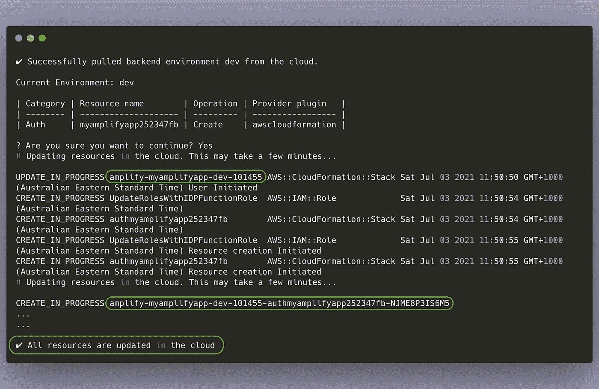

**这一步会发生什么？**

*   这一步更新了第 4 步中部署的 CloudFormation 模板
*   还部署了一个新的 CloudFormation 模板。

**让我们回顾一下在此步骤中更新/创建的资源**

```
# Update the template names
# Refer the log file above to get these names.➜ stack_name1='amplify-myamplifyapp-dev-101455'
➜ stack_name2='amplify-myamplifyapp-dev-101455-authmyamplifyapp252347fb-NJME8P3IS6M5'
```

**对堆栈#1 进行了更新**

注意最后一行。这个堆栈创建另一个堆栈。

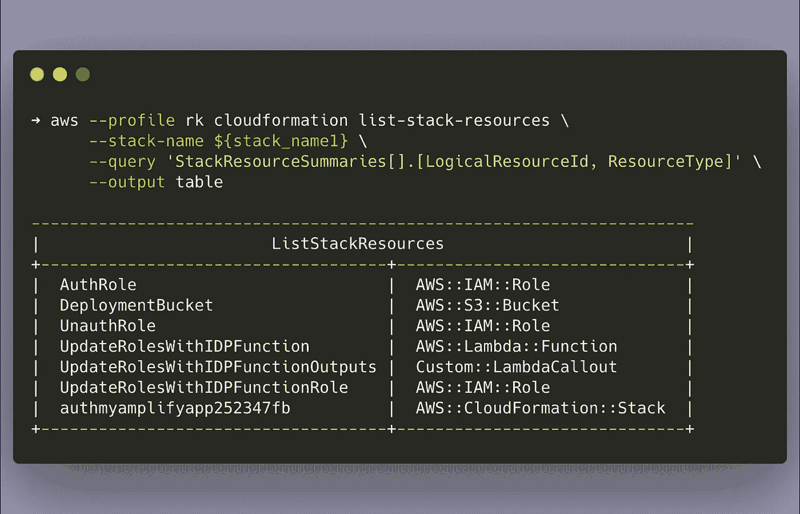

**堆栈#2 创建的资源**

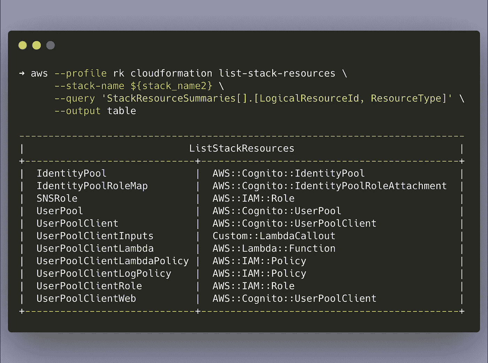

**如何查看用于创建资源的云信息模板**

```
➜ aws cloudformation get-template --profile rk --stack-name ${stack_name1}➜ aws cloudformation get-template --profile rk --stack-name ${stack_name2}
```

**列出用户池**

```
➜ aws --profile rk cognito-idp list-user-pools --max-results 20 \
      --query 'UserPools[].[Id, Name, CreationDate]' \
      --output table
```

**列出身份池**

```
➜ aws --profile rk cognito-identity list-identity-pools --max-results 20 \
      --query 'IdentityPools[].[IdentityPoolId, IdentityPoolName]' \
      --output table
```

**列出与身份池相关的角色**

```
➜ aws --profile rk cognito-identity get-identity-pool-roles \
      --identity-pool-id "us-east-2:xxxxxxx-b706-xxxx-xxxx-b14e9b1d9b22"
```

## `amplifyconfiguration.dart`

CLI 工具使用用户池和身份池详细信息更新`lib/amplifyconfiguration.dart`文件。Flutter 应用程序将读取此内容以连接 AWS。


## `Resources used for Backend`

AWS Amplify CLI 使用的模板和文件存储在 Flutter 应用程序的 **amplify** 文件夹中。请注意，这些并不是 Flutter 应用程序工作所必需的。这些仅用于 AWS 资源创建。

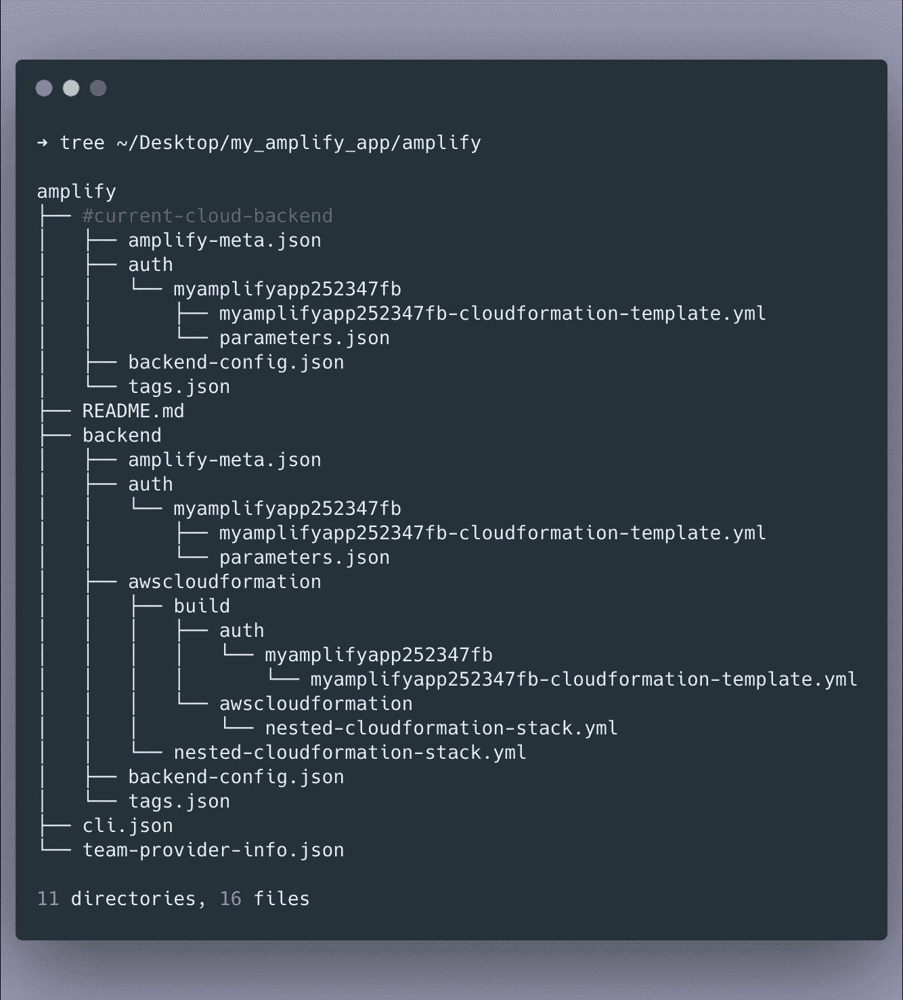

# #6 为 Flutter 应用程序添加认证支持

既然已经创建了后端资源，是时候对 Flutter 应用程序进行更改以使用 Cognito 服务了。

**初始化**

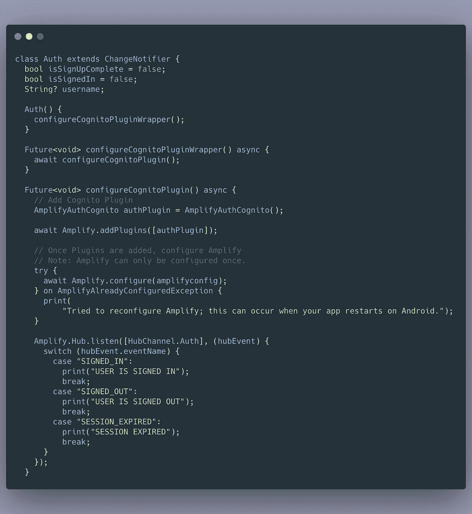

**注册功能**

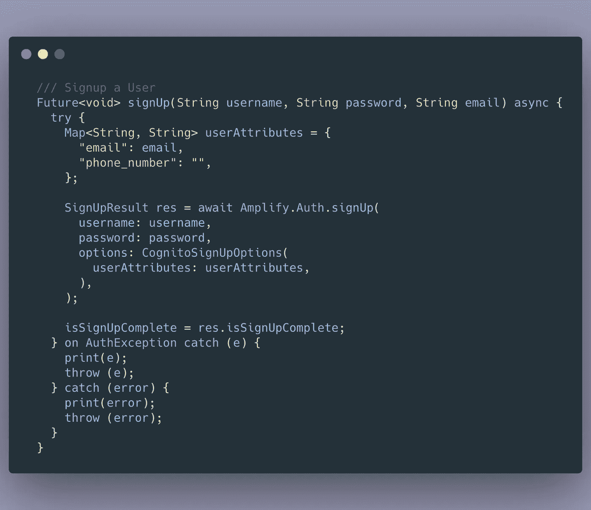

**确认用户功能**

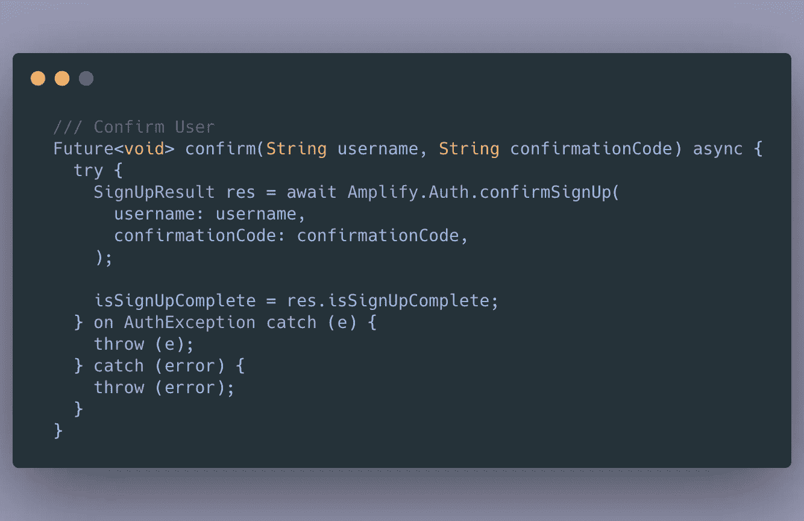

**登录功能**

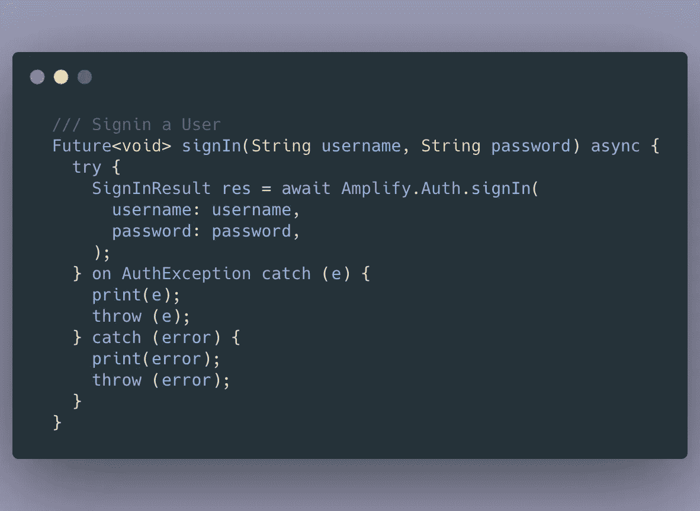

**其他**

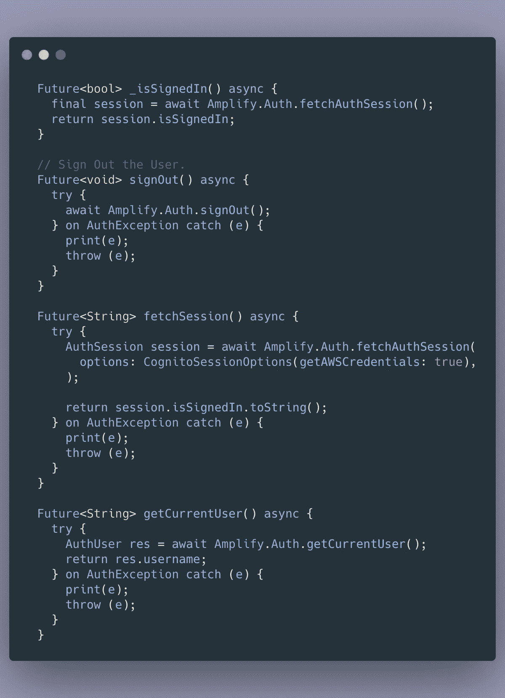

# #7 示例应用程序

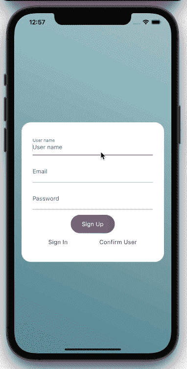

这就是经过身份验证的用户在 Cognito 用户池中的存储方式。


# #7 最终注释

*   我用`[https://carbon.now.sh/](https://carbon.now.sh/)`美化了代码。
*   示例应用 GitHub 链接在这里是。
*   除了支持身份验证，这款应用没有太多功能。Amplify 还支持添加休息服务，S3，等等。
*   AWS Amplify Github page—[https://github.com/aws-amplify/amplify-flutter](https://github.com/aws-amplify/amplify-flutter)。
*   不需要使用 Amplify CLI 设置 Cognito 用户池和身份池。也可以使用 AWS Web 控制台/其他方式创建它们，然后可以在`lib/amplifyconfiguration.dart.`中更新用户池/身份池 id
*   我的博客—[https://ryandam.net](https://ryandam.net)