# Azure DevOps:用板设置 Sprints

> 原文：<https://medium.com/geekculture/azure-devops-setting-up-sprints-with-boards-97572ea3c4a0?source=collection_archive---------1----------------------->

## 组织、执行和评审你所有的用户故事和任务需求

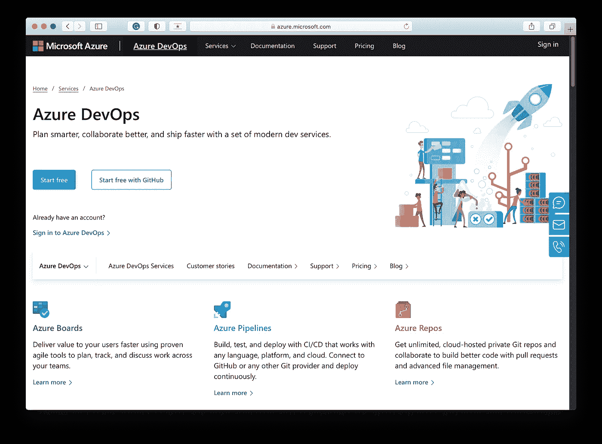

# 介绍

工作流是管理软件项目活动的起点。工作流板使团队能够跟踪任务，了解目标和任务的进展情况。

在本教程中，我将解释如何用**sprint、用户故事和任务建立一个 **Azure DevOps 板**。**

# **入门指南**

**访问 https://dev.azure.com[注册一个免费的 Azure DevOps 账户，然后添加一个名为 *Floral Force* 的新项目。](https://dev.azure.com)**

**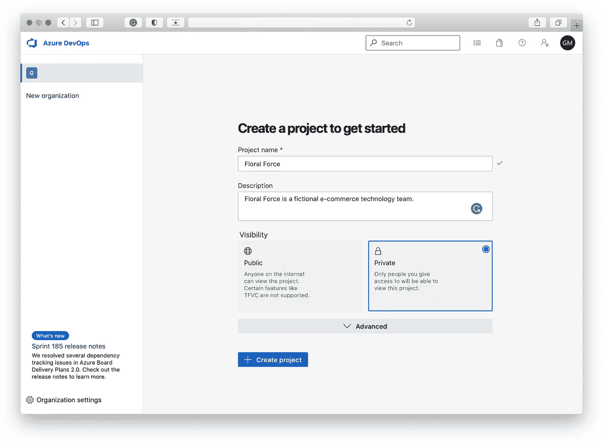**

**一旦我们的项目被创建，我们就被重定向到*概述*部分，这给了我们一个整个项目的高级视图。**

**我们将在左侧看到选项:**

*   ***电路板***
*   ***回购***
*   ***管道***
*   ***测试计划***
*   ***工件***

**对于本教程，我们将只关注*板*。**

**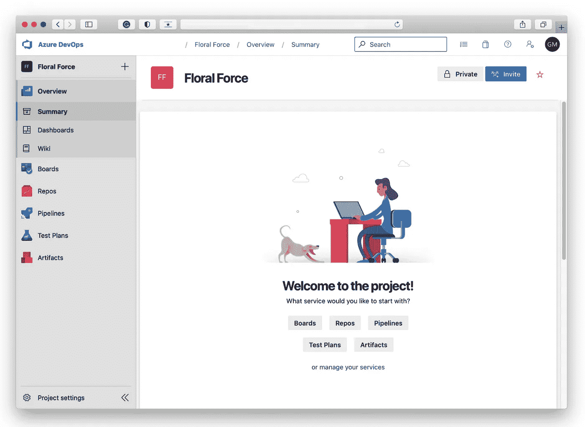**

# **添加用户**

**在*项目设置* → *团队*中，将用户添加到团队，这允许我们将用户分配到我们稍后将创建的任务。**

**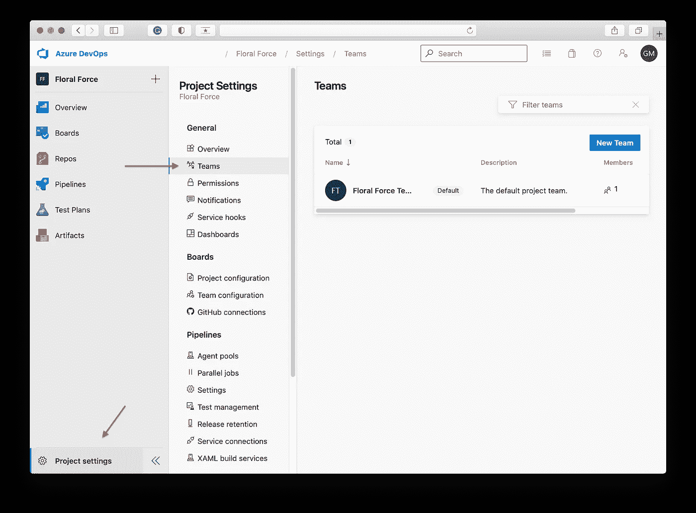**

**点击团队*花力*，点击*添加*按钮，通过邮箱地址添加用户:**

**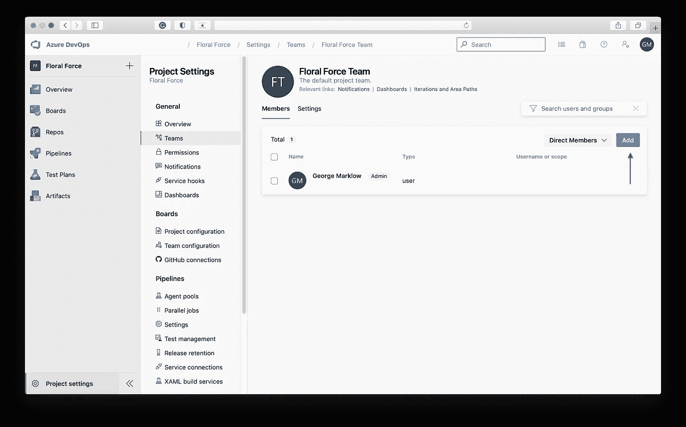**

**目前，我是一个*管理员*用户，有两个常规团队用户:**

**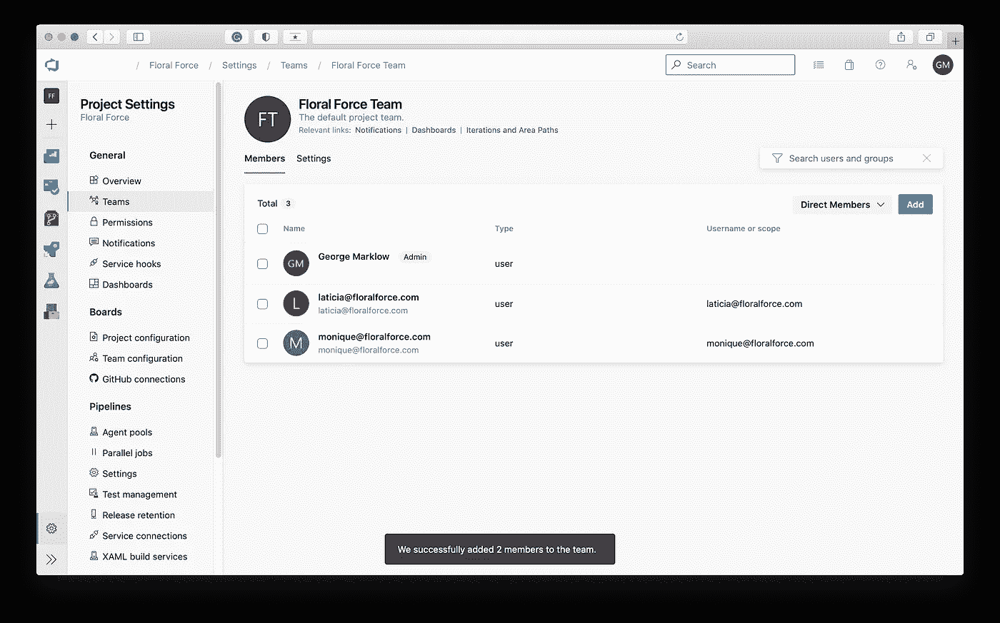**

**对于一个团队来说，在您的项目中拥有多个具有管理权限的用户是明智的。团队经理可以组织员工、定制团队资源和管理计划。**

**在*团队* → *管理员*中，从我们当前的用户列表中添加管理员:**

****

# **创造冲刺**

**配置完 *Floral Force* 项目后，我们可以开始计划我们的冲刺了。Azure DevOps Boards 帮助您委派任务，并跟踪您和您的员工之间的到期日期和状态。**

**在*板* → *项目设置*下，你会看到 Floral Force 项目下列出了三个迭代。一个**迭代**一个有时间限制的增量开发步骤，通常持续**一到四周**。**

**一个 **Sprint** 是一个短暂的、有时间限制的周期，在这个周期中，敏捷团队致力于更快、更一致地交付应用程序。所有的冲刺都是迭代，但不是所有的迭代都是冲刺。为了在本教程中保持简单，让我们坚持使用 sprints，将*迭代 1* 重命名为 *Sprint 1* ，如下所示。此外，删除剩余的迭代。**

**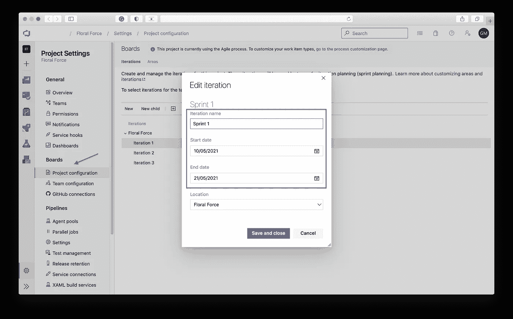**

**我们假设每个冲刺持续**两周**，从周一开始，到下周五结束。**

**同意并坚持设定的迭代长度为团队提供了一种简单的方法来实现对项目剩余时间的粗略估计。这是通过使用*速度—**您的员工在给定时间内完成的工作量—以及剩余工作量来计算的。***

# ***积压***

***一个**待办事项**是为了维持一个更广泛的行动策略而必须完成的活动列表。它用一个*优先级*数字列出了团队选择下一步关注的任务。***

***活动包括:***

*   *****用户故事** : 客户对某个软件特性的需求。这些记录了描述、对话和测试，以决定何时交付需求。***
*   *****特性**:为用户带来价值的功能。***
*   *****bug**:需要修复的缺陷。***

***点击 backlog 屏幕上的 *+New Work Item* 按钮，开始构建产品 Backlog:***

***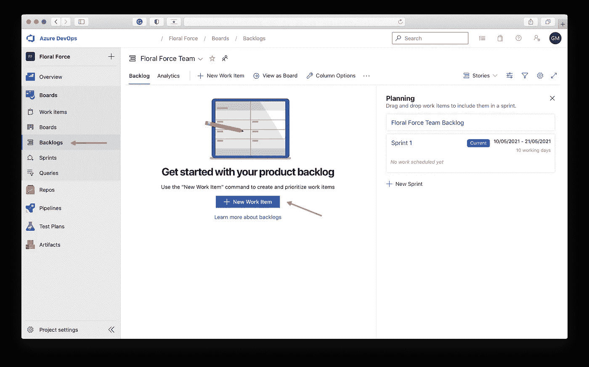***

***单击每个用户故事旁边下拉菜单中的*…编辑*链接，开始添加一些详细信息:***

***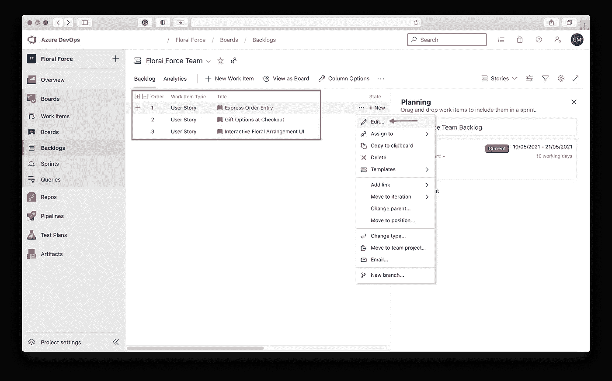***

***在每个用户故事里面，请写一个*描述*，描述用户故事使命，我们的客户想要什么，以及什么将帮助公司成长。***

***写下*验收标准，*这是我们必须满足的要求，以便产品所有者/利益相关者批准。***

***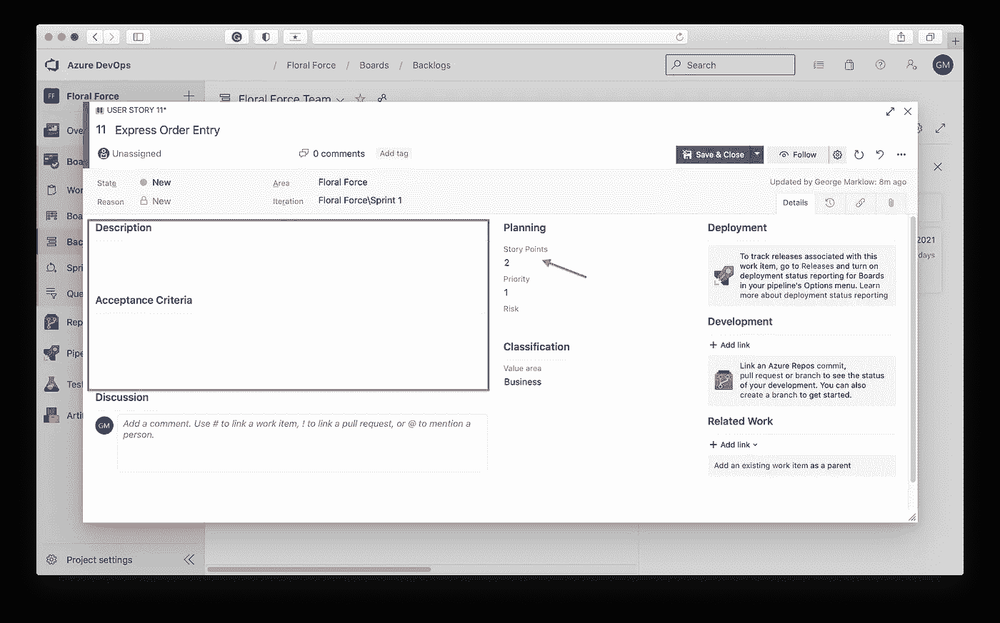***

***同样，为这个用户故事选择*故事点*，用来比较每个故事在相对点而不是绝对时间上的大小和复杂程度。最简单的思考方式是，一个 4 分的故事将会比一个 2 分的故事花费大约两倍的时间。***

***最后，分配一个*优先级*，这允许我们从待办事项列表中排序下一个应该处理的活动。***

***我们的 backlog 现在有三个用户故事，都分配给了 *Sprint 1* :***

******

# ***任务板***

***点击菜单栏中的*任务板*可以看到*冲刺 1* 的三个故事。***

***我还突出显示了 *Sprint* 菜单，这有助于切换到以前和将来的 Sprint:***

***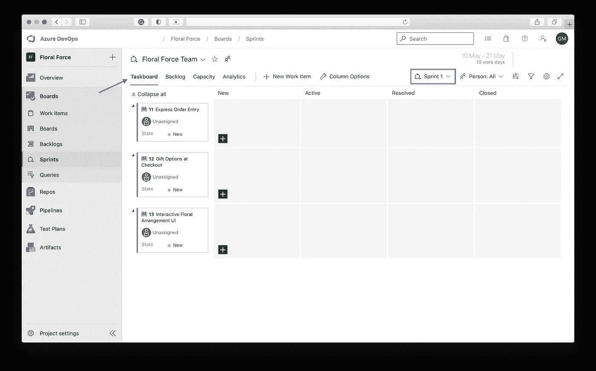***

***在 [*列选项*](https://docs.microsoft.com/en-us/azure/devops/boards/backlogs/set-column-options?view=azure-devops) 中，根据您的要求更改列名。***

***此外，将字段拖放到所选字段范围内您喜欢的位置，以调整字段的顺序:***

***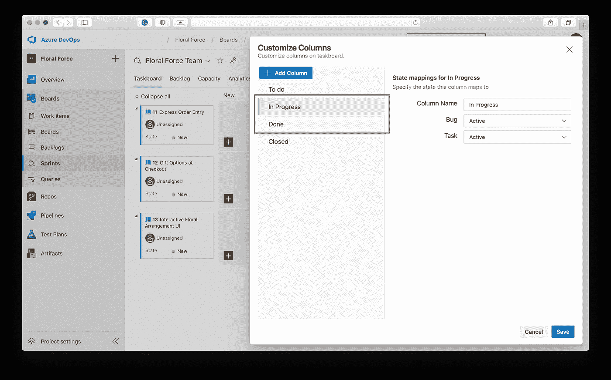***

***点击*保存*，刷新板卡，更新列名:***

***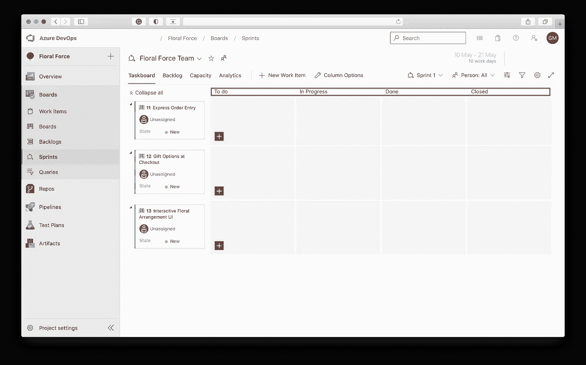***

# ***添加任务***

***我们的第一个 sprint 正确地设置了三个用户故事；是时候加任务了。***

***在*快递订单输入*故事内，点击绿色+按钮，点击*任务*:***

***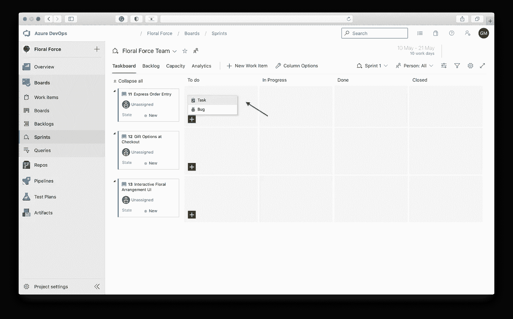***

***添加三个任务，如下所示:***

******

***我们可以从以下选项中为每个任务选择一个*活动*类别:***

*   ****部署****
*   ****设计****
*   ****开发****
*   ****文档****
*   ****要求****
*   ****测试****

***我们的前三项任务需要编码工作。因此，对于每个*任务*，将*活动*更改为*开发*:***

***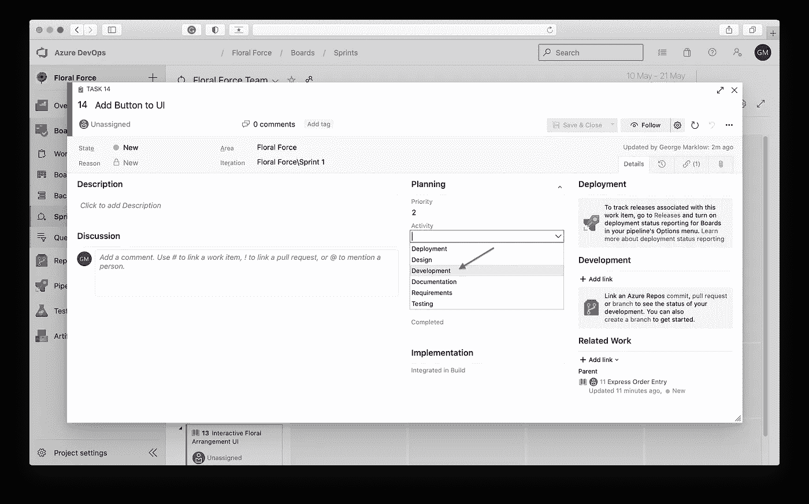***

***使用[小黄瓜语法](https://cucumber.io/docs/gherkin/reference/)添加一个*描述*:***

***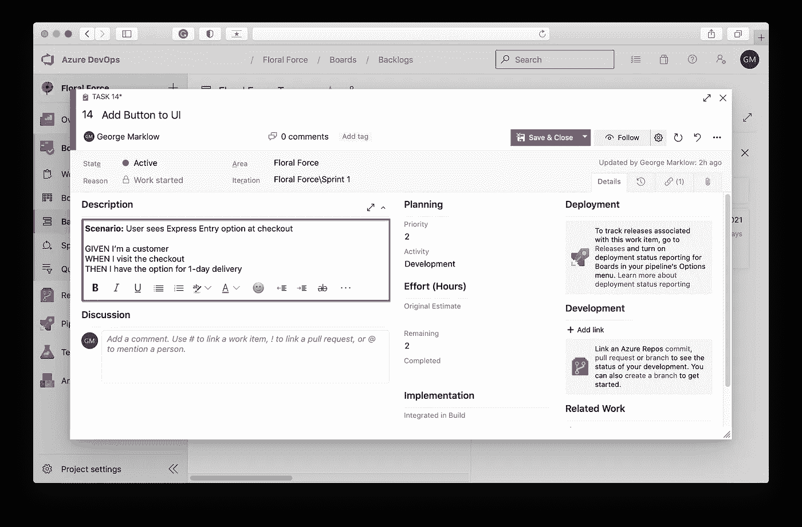***

# ***造型卡片***

***再添加两个任务，并将*活动*下拉列表设置如下:***

*   ****手动测试*(测试)***
*   ****测试用例*(需求)***

***QA 分析师将创建测试用例，开发人员使用这些测试用例在编码完成后从业务角度检查他/她的工作是否正确。稍后，这些相同的测试用例将被测试人员在手动测试中遵循。***

***现在，sprint 板看起来平淡无奇，而且不能立即看出哪些任务是需求收集，哪些是开发任务，哪些是测试任务。***

***要解决这个问题，请转到*设置* → *样式*来更改 Azure DevOps 板中的*样式*设置:***

***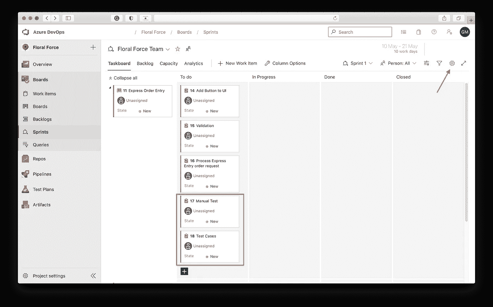***

***让我们将一种风格应用于开发任务。***

***创建一个新的*样式规则*，选择绿卡颜色——从*值*的选项中选择*活动*用于*字段*和*开发*。对*测试用例*和*手动测试*重复相同的过程，分别选择蓝色和橙色。***

******

# ***添加努力***

***点击每张卡片的中间右侧，将时间/故事点评估添加到任务中。你可以在这里阅读更多关于*冲刺估算* [。](https://marklowg.medium.com/leading-agile-project-estimation-with-planitpoker-de87198ddcf1)***

***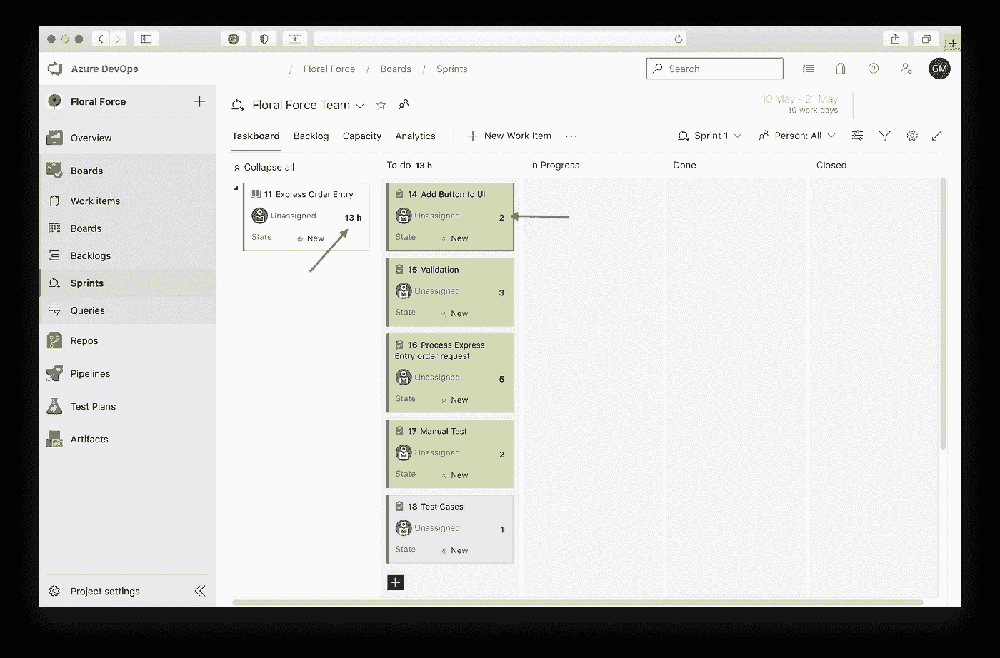***

# ***额外收获:为 bug 定制样式***

***如果在冲刺阶段发现问题，点击+图标并选择 *Bug* 来提出 Bug。***

***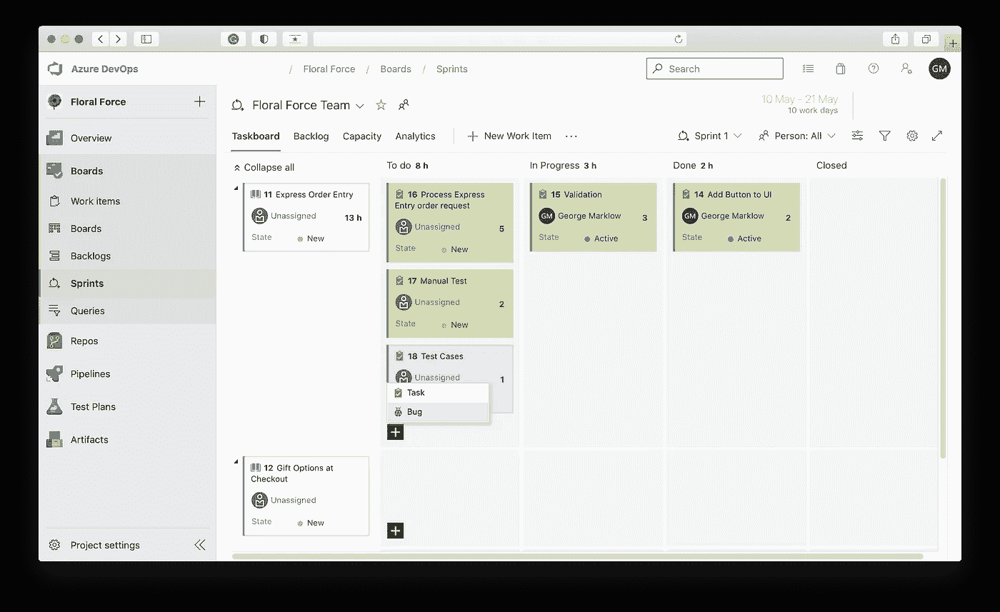***

***例如，QA 分析师发现按钮的样式有问题:***

***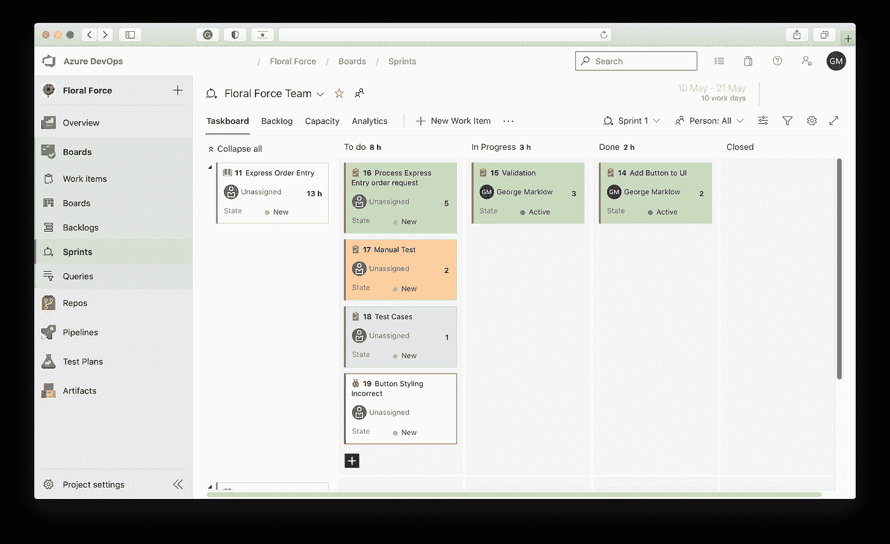***

***然而，我们可能会认为红色背景更有利于突出 bug。由于 *Bug* 不是*活动*任务，我们需要找到另一种方法来改变被认为是 Bug 的任务的风格。***

***为此，我们可以采用一个规则，如果*标题*包含文本'*Bug:【T63]，'使用红色背景，如下所示:****

***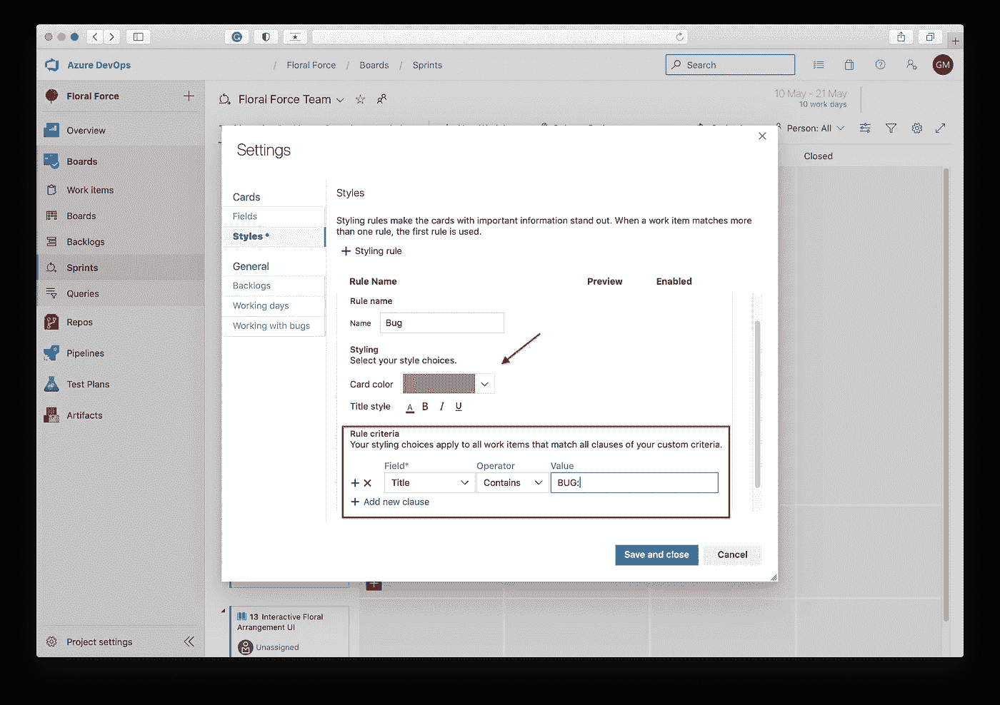***

***现在重命名按钮样式 bug 的*标题*，从*Bug:*开始，点击保存。***

***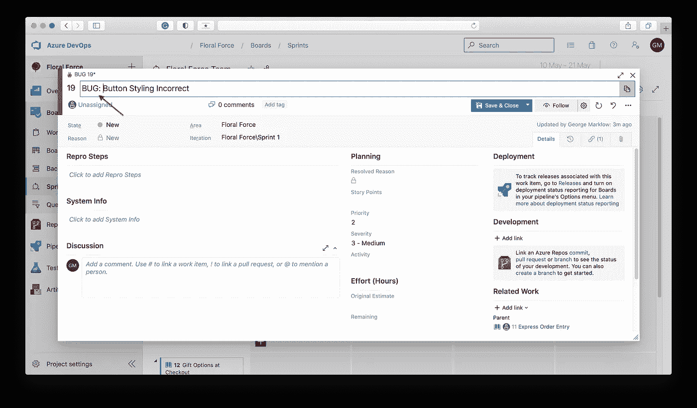***

***该板获得标题更改，将其与一个样式规则匹配，并刷新，用所需的颜色显示 bug。***

***点击查看更多风格定制[。](https://docs.microsoft.com/en-us/azure/devops/boards/boards/customize-cards?view=azure-devops)***

***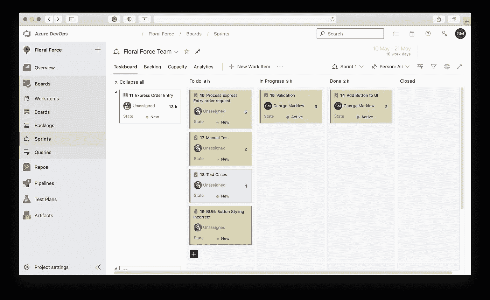***

***感谢阅读！在下面的评论区让我知道你的想法，别忘了订阅。👍***