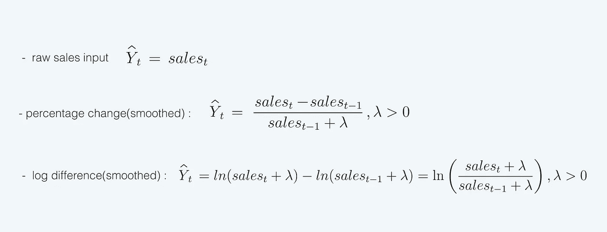
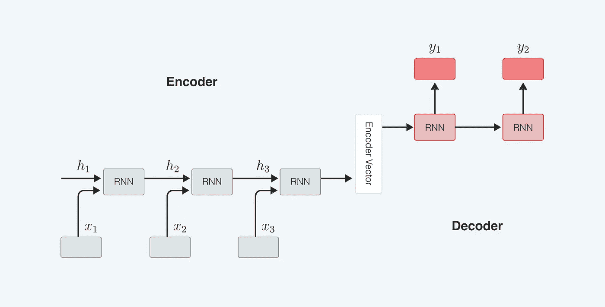
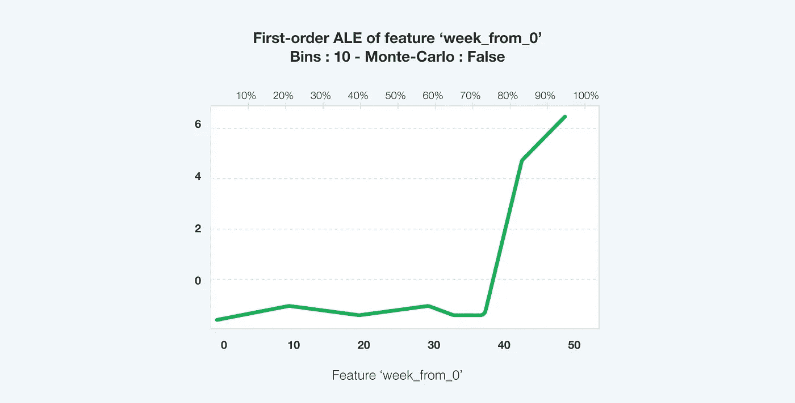
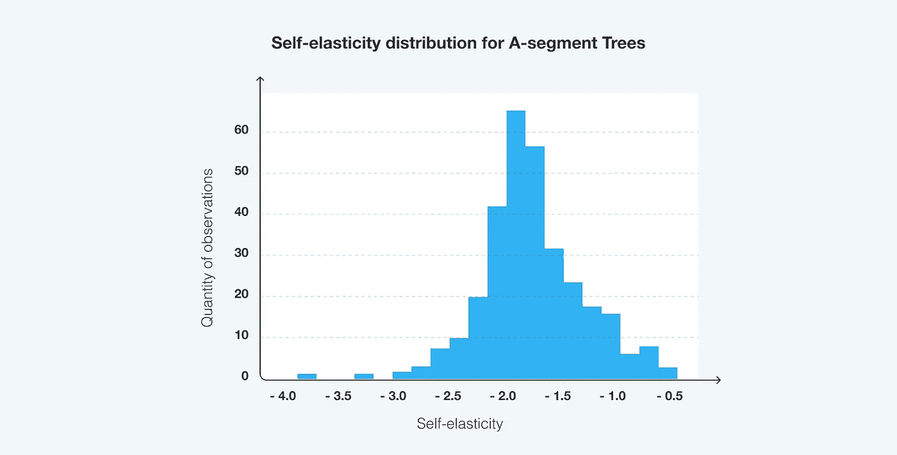

# 回溯预测:为你的业务建立一个准确的预测模型

> 原文：<https://medium.com/geekculture/backcasting-building-an-accurate-forecasting-model-for-your-business-6ead71cacea0?source=collection_archive---------3----------------------->

我们经常从商业角度谈论机器学习进行价格管理，而忽略了技术部分。这篇文章很独特。我们的数据科学团队将以商业案例为例，阐明基于 ML 的解决方案下发生的**流程，在商业案例中，未来的成功直接取决于从过去预测未知值的能力。**

# 介绍

让我们想象一下，你是一个零售商，想要实现机器学习算法来定价。这可能有许多原因:

*   过程自动化节省了劳动力和时间。
*   它有助于避免人为因素造成的错误。
*   现代技术允许你快速、动态地处理大量数据，使你的决策比任何人都快。

好处听起来很有希望，但你是一个聪明的企业，所以在实施新方法之前，你需要确保它与现有流程相比是有效的。最简单的方法是用类似商品的测试和控制组进行一个 **A/B 测试。**第一组将使用新方法，第二组将使用旧方法。你做一个测试，分析结果，看看提议的方法在统计上是否比现有的方法更好。理论上，一切看起来都是相当简单的任务，但是**你可能不得不处理你业务的细节**，所以 A/B 测试的运行会很复杂。

对于 Competera 的客户之一 Balsam Brands 来说，具体情况是 80%的年销售额发生在一年的最后 3 个月，因此今天进行传统的 A/B 测试意味着在下一年推广新的价格管理方法。在这种情况下，你可以通过所谓的[回测](https://en.wikipedia.org/wiki/Backcasting)或者“一种规划方法，涉及对可能存在的自变量的未知值的预测，以解释因变量的已知值”来检查算法的准确性。

# 第一步:建立你的预测模型

为了证明基于 ML 的解决方案的有效性，你需要两样东西:模型和数据。客户向我们提供了:

*   事务数据
*   价格清单
*   促销日历
*   产品参考
*   股票
*   营销活动数据

虽然香脂品牌案件发生在 2020 年，但完整的历史数据涵盖了两个销售季节(2017 年至 2018 年)，交易数据为 2008 年至 2018 年。我们的任务是预测 2019 年的销售，尽管零售商已经知道这一时期的实际销售数据，但由于回播要求，没有发送给我们。换句话说，我们的**模型必须做出一个预测，好像它不是在 2020 年推出，而是在 2019 年初推出。**

Balsam Brands 销售预测模型的主要评估标准是在类别级别的总测试期(8 周的旺季销售)内销售和收入预测的**准确性——分别针对一个类别(约占总产品组合的 30%,约占总收入的 75%),并针对其余产品组合进行汇总。它可以用公式来描述:**

使用以下计算来评估百分比误差:

# 如何达到准确度阈值

为了根据给定的标准实现高精度，您可以在每周级别为这两个类别中的每一个建立一个统计自回归模型。在模型训练之后，您应该能够汇总 8 周测试期的预测，并获得最终结果。此外，历史交易数据包含超过 10 年的观察，这足以研究季节性。

于是，我们构建了 [**萨里玛**](/@kfoofw/seasonal-lags-sarima-model-fa671a858729) **模型**进行预测。在获得真实的销售数据后，我们测试了该模型的准确性，并获得了较高的结果:对于每个类别，测试中的 APE 误差值为< 5%。虽然结果不错，但这种模式不适合真正的商业。

# 为什么萨里玛是不够的

在这种情况下，最佳价格推荐解决方案是成功回播的结果。也就是说，该模型不仅要满足精度要求，而且要有利于价格优化。

**上述模型的类型没有考虑价格的影响，只能在类别级别进行预测，**即不允许您在单个 SKU 级别估计销售变化。当然，你可以在每个产品的层面建立一个单独的模型，但首先，这将是低效的，其次，这将阻止特定模型使用封装在其他模型中的知识和产品范围的交叉依赖。

现在假设您正在使用前面提到的需求预测模型运行价格优化。您将价格限制设置为当前产品价格的+- 50%,您的目标是优化收入。由于您的模型无法估计 SKU 水平上的销售变化，因此它预测价格上涨时销售不变。为了使收益最大化，它会将所有产品的价格提高到上限。大概，你已经猜到这样优化的结果了。

这个例子并不像乍看起来那样夸张。即使当需求预测模型使用价格特征时，类似的问题也经常发生。如果它们对模型预测的影响很小(低特征重要性)，价格弹性将接近于零，价格优化的质量将很低。

# 理想的预测模型

既准确又适合应对业务挑战的模型必须满足多项要求:

*   该模型必须做出**准确的长期预测**，这样你才能管理长期策略；
*   在**产品层面**的预测必须准确，因为它允许你在任何给定的层面操作策略；
*   该模型必须能够在重新定价**时间段**(例如，1 周)的水平上进行预测；
*   它应考虑**交叉产品关系**，例如替代品和补充产品的问题；
*   它应该**考虑绝对和相对价格特征**(例如，产品的价格、其随时间的变化等。).您的模型对价格特征的影响估计得越准确，价格建议就越合理。

# 时间序列预测的经典方法

除了 SARIMA 之外，还有其他满足特定要求的自回归模型。例如，使用 **(S)ARIMAX** 可以考虑外部因素的影响(如价格或促销)。 **VARMA(X)** 模型允许您评估产品之间的相互联系。最后，**经典统计方法**在数学上是有充分依据的，并且易于解释。你可以在这里阅读更多关于他们的内容。

然而，这种方法有许多缺点。它们是非适应性的，因此您需要定期重新训练模型。它们对输入数据格式([静止](https://en.wikipedia.org/wiki/Stationary_process)条件等很敏感。).当处理大量不同但相关的时间序列(参数化问题)时，它们是次优的。它们不适用于新的时间序列预测(“冷启动”问题)，也不适用于长期预测(MA 分量减弱)。此外，每次出现新的产品组合时，您都需要重新培训模型。

# 递归预测方法

从预测时间序列的任务到构建回归的过渡(“放松”)可以解决这些问题。时间轴的特征(例如自相关)通过直接将时间变量的滞后传输到模型来编码，而时间特征以特征的形式传输。

使用**循环预测**方法可以获得未来几个时期的预测。也就是说，基本模型预测未来一个时期，而预测几个时期的经常性以前的预测被使用。

基线模型可以基于传统的线性回归、神经网络或基于回归的梯度推进，后者目前最适合异类(表格)数据。[更多详情点击这里](https://statweb.stanford.edu/~jhf/ftp/trebst.pdf)。

我们已经实现了几个 **boosting 框架**，允许用户处理跳过的值、分类变量，以及利用定制的目标函数:LightGBM、XGBoost、CatBoost。递归预测方法易于实施，但在预测时需要对数据集进行动态重新计算(未来的一项功能)。检测隐含的时间依赖性也是困难的。

# RNN 模型

循环预测方法的一个替代方法是使用 RNN 模型。它们可以更好地检测时间相关性，并允许您提前几个时间点进行预测(seq2seq 模型)。

例如，预测的目标可以是:

有关这些目标转化方法的利弊和使用 seq2seq 模型的更多详细信息，请参见[此处](https://devfest.withgoogle.com/events/seq2seqmodels)。

我们建立了一个具有 Luong 注意机制的 seq2seq LSTM 模型，用于预测销售数据中的对数差异。

为了捕捉类别级依赖关系的影响，我们使用了**静态类别嵌入**。时间特征(如周数和月数)以动态时间嵌入的形式拟合到模型中，由于数据中存在较高的季节性因素，这显著提高了模型的准确性。时间特征的累积局部效应反映了初始销售数据分布。

*(Detailed: Apley, Daniel W., and Jingyu Zhu. 2016\. Visualizing the Effects of Predictor Variables in Black Box Supervised Learning Models.* [*https://arxiv.org/abs/1612.08468*](https://arxiv.org/abs/1612.08468)*; Molnar, Christoph. 2020\. Interpretable Machine Learning.* [*https://christophm.github.io/interpretable-ml-book/*](https://christophm.github.io/interpretable-ml-book/)*)*

为了更好地使模型适应业务需求，我们根据产品价格、销售动态和时间段使用了样本权重。这让我们能够在旺季对 A 段产品进行更准确的预测。

# 决赛成绩

在测试期间，模型预测对总收入预测的准确率达到 **96.0%，对树木类别收入预测的准确率达到**99.6%。因此，最终指标是:

该模型显示了其在产品和周级别上的准确性。维持数据集的总体 WAPE 为 66.7%。这使得算法能够准确地恢复产品自身的弹性和交叉弹性，并在产品和周级别上操作定价策略，以实现全球目标。您可以在下图中看到为 A 段树计算的自身弹性示例:

本文中描述的发现将主要引起数据科学家和分析人员的兴趣。