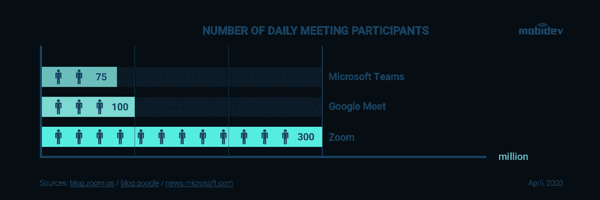
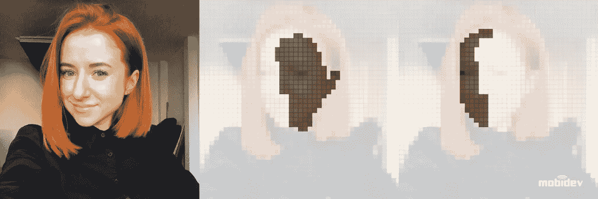
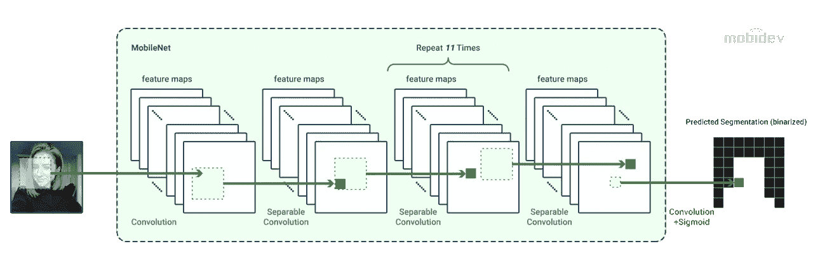
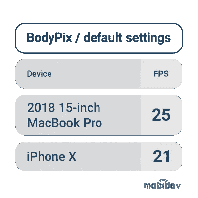
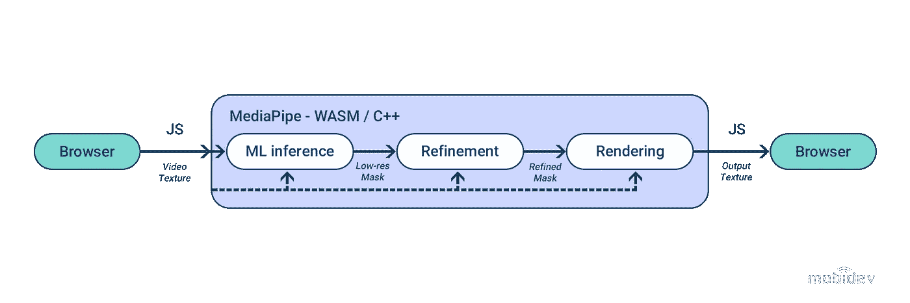
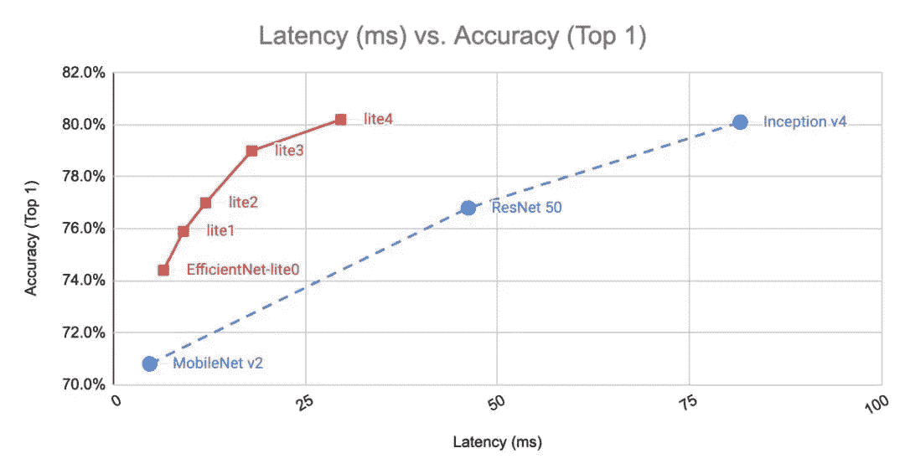
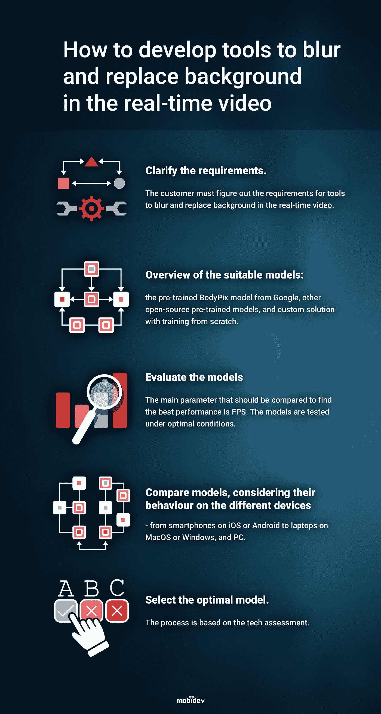

# 实时视频中的背景去除和模糊

> 原文：<https://medium.com/geekculture/background-removal-and-blur-in-a-real-time-video-ca091f971697?source=collection_archive---------16----------------------->

[Image credit](https://unsplash.com/)

2021 年，实时视频中的背景去除和模糊需求很高。它们的实施可以与滚雪球效应相媲美。这场雪崩最终将席卷所有视频会议平台。这一事实被已经实施了这种工具的市场领导者的经验所证实。例如，谷歌在它广泛的增强现实服务中加入了移动实时视频分割。自 2018 年以来，微软团队也一直在使用类似的工具。Skype 在 2020 年 4 月推出了这项功能。

让我们试着更深入地了解计算机视觉解决方案需求不断增长的原因，包括实时视频背景替换和模糊。统计数据显示了各种类型的视频会议水平的提高:一对多、一对一、多对多。

在会议期间，绝大多数与会者特别注意他们的外表以及他们所处的环境给人的印象。背景过滤器用于隐藏凌乱的房间和其他不合适的元素。因此，用户更喜欢拥有背景替换和模糊工具的实时视频平台。为用户提供此类平台和 WebRTC 视频聊天应用程序的公司必须包含此功能，以保持市场竞争力。

# 深度学习背景去除:主要方法

**实时人体分割**是基于人脸和身体部位识别的过程；主要目标是实现计算高效的语义分割(同时保持基本水平的准确性)。

以前，实时人体分割是借助硬件完成的。在过去，也可以将专用软件应用于该过程。这些技术，以及色度键控技术，正逐渐被人工智能工具所取代。

用于实时视频中背景模糊和替换的 AI 工具的开发根据所应用的方法而不同。

通常，动作的算法如下:

1.  接收视频。
2.  编码视频流。
3.  将视频分解成帧。
4.  将人从背景中分离出来。
5.  用新的背景替换没有描绘人的像素，或者模糊它们。
6.  解码视频流中的帧。

主要的挑战是创建一个能够将帧中的人从背景中分离出来的系统(第 4 项)。如果前景和背景之间的边界清晰，就有可能模糊背景或用特定的图像替换它。在每种情况下，都需要在浏览器中完成该过程。实时视频必须具有高 FPS，并且在用户端进行处理。在这个阶段，开发者面临着如何解决预设任务的选择。

有三种路径:不做任何改变地使用基于神经网络的现有库，通过额外的训练来改进它们，或者从头开始构建自定义模型。让我们来概述一下这些路径中与深度学习背景去除相关的最重要的路径:

**BodyPix**

BodyPix 是一个开源的 ML 模型。神经网络被教导从背景中区分面部和身体部位。处理在浏览器中进行。该模型由 TensorFlow.js 提供 TensorFlow 的 JavaScript 版本，与机器学习工具相关。

神经网络将像素分组到对象的语义区域。像素被分类，使得区分两类成为可能:人和非人。

视频流被处理为一系列图片。模型中的基础是由二维像素阵列组成的遮罩。每个像素的指示符是标称范围从 0 到 1 的浮点值。该值显示置信水平(阈值)。它有助于理解像素是否代表人。默认情况下，如果该值超过 0.7，则转换为二进制 1。否则，它会转换为二进制 0(用零表示的像素指的是背景)。

除了人和非人的分类之外，该模型还可以识别 23 个身体部位。图片穿过模型。每个像素得到一个标识身体部位的指示。构成背景的像素值为-1。每个身体部位都可以借助独特的颜色来表示。

选择 BodyPix 时，请考虑相互影响的相关功能参数:

*   架构:可以是 MobileNetV1，也可以是 ResNet50。MobileNetV1 适用于移动使用或使用低端或中档 GPU 的计算机，同时，ResNet50 架构跟上了拥有强大 GPU 的计算机。
*   帧的分辨率:在图像被输入模型之前，它会被调整大小，所以更高的分辨率意味着更好的准确性，但会降低工作速度。输入分辨率从 167 到 801 不等。
*   输出步幅:输出步幅是 8、16 或 32，这取决于所选的架构。较高的输出步幅会提高速度，但会降低精度。
*   QuantBytes:权重量化因字节数而异，字节数为 4、2 或 1。更高的字节数意味着更高的精度。
*   乘数:这是一个可选参数，从 0.5 到 1 不等，仅适用于 MobileNetV1 架构。此参数描述卷积运算的深度。

第一版的 BodyPix 只适合识别一个人，而库 BodyPix 2 适用于多人。

BodyPix 似乎是一个最佳模型。它非常灵活，对商业用途开放(Apache 许可)，但有时 BodyPix 不能提供足够的 FPS 性能。

Source: [TensorFlow Blog](https://blog.tensorflow.org/2019/11/updated-bodypix-2.html)

**媒体管道**

MediaPipe 是一种开源框架，可用于为实时视频准备 ML 解决方案。它是开放的商业用途(Apache 2.0 许可)。

用于实时视频中背景去除和模糊的 Google Meet 工具基于 MediaPipe。为了在 web 浏览器中处理复杂的任务，MediaPipe 与 WebAssembly 相结合。这种方法提高了速度，因为指令被转换成快速加载的机器代码。

关键步骤包括分割人，准备低分辨率的掩模，并考虑图像边界来改进该掩模及其对准。当这些任务完成后，模型进一步移动。视频输出被渲染，背景在蒙版的帮助下被模糊或改变。

WebML Pipeline

客户端的 CPU 帮助执行模型推理。它支持最全面的设备覆盖，并降低能耗。此外，分段模型通过 XNNPACK 库加速。这个库加速了机器学习框架。

Mediapipe 的解决方案非常灵活。这意味着实时视频中的背景替换与设备特征相对应。如果可能的话，用户有顶级的图片。否则，跳过遮罩细化。

用于分段的 ML 模型必须是轻量级的，尤其是在浏览器中运行时。轻量级主干允许减少能量消耗和加速推断。帧处理的步骤数取决于输入分辨率。因此，在集成到模型中之前，我们应该缩小图像的尺寸。

分割过程的主要步骤如下图所示。

MobileNetV3 充当编码器。它有助于在资源需求较低时提高性能。TFLite 将模型大小缩小了一半。此外，还应用了浮点 16 量化。所有这些提供了模型的微小尺寸——400 kb。参数总数达到 193K。

分割完成后，[视频处理](https://mobidev.biz/blog/ai-computer-vision-real-time-video-processing)和渲染开始。在这种特殊情况下，OpenGL 有助于解决这些任务。之后，根据分割掩模对每个像素进行模糊处理。

名为光线包裹的合成技术正在为实时背景去除和模糊化而实现。它将分割的人物与选定的背景混合在一起。背景光延伸到前景，以柔化分段边缘并最小化光晕伪影的数量。背景和前景之间的对比越来越不明显，这使得实时视频更加真实。

在视频通话过程中，用户体验到的背景模糊或变化与设备类型及其硬件资源有关。我们可以使用不同的设备，比较推理的速度和端到端的流水线。同样值得注意的是，如果设备的技术特性低于要求，Google Meet 中的背景移除和模糊工具甚至无法工作。例如，如果设备的 RAM 少于 3 GB，或者处理器的时钟速度低于 1.6 GHz，则 Google Meet 中的背景移除和模糊不可用。

MediaPipe 的问题是发布的解决方案隐藏了初始源代码。这对于开发新模型来说风险很大。没有关于模型训练所依据的数据的信息。

**PixelLib 等机型**

使用深度学习的背景减法可以用 PixelLib 实现。它执行语义分割。该库对视频和图像都有用。PixelLib 有助于分离背景和前景。有两种类型的 Deeplabv3+模型可用于使用 PixelLib 执行语义分割:

1.  以 xception 为网络主干的 Deeplabv3+模型在 Ade20k 数据集上进行训练，该数据集有 150 类对象。
2.  以 xception 为网络主干的 Deeplabv3+模型在 Pascalvoc 数据集上进行训练，该数据集有 20 类对象。它能够移除和创建虚拟背景。

缺乏关于 PixelLib 和其他模型如何被训练的信息。因此，它们比 MediaPipe 或 BodyPix 用得少。

**学习定制 ML 模型**

有两种方法来开发将处理实时人物分割的 ML 模型:从头开始构建，或者使用预先训练的模型，如 MobileNet、U2-Net、DeepLab 等。

**从零开始训练模型**

我们可以使用像 COCO 数据集，人体分割数据集，AISegment，Supervisely Person，图像风格化自动人像分割这样的开源工具来从头开始训练模型。

模型体系结构可以包括一个轻量级主干，如 EfficientNet 或 MobileNet，具有数量减少的通道和分段头。它可以被训练、调整，最重要的是，被修剪以减少参数的数量，同时提高推理速度。在这种情况下，为了实现整条线的高质量和高速度，接下来的步骤是强制性的:调整图像的大小和去噪、几何变换、傅立叶变换等。

训练完成后，在 Python 和 PyTorch 的帮助下执行的结果可以转换为 TensorFlow.js。这是因为 TensorFlow 是应用程序的生产后端。为培训所做的所有准备工作必须整合到 JS 实施中。

**基于预训练模型的定制训练**

您可以使用预先训练的模型作为自定义训练的起点。例如，应用预先训练的 EfficientNet 模型。下面，你可以看到它与其他选项的对比。

Models comparison. [Source](https://www.programmersought.com/article/47623207795/)

根据研究，从头开始开发一个实时的人物分割模型并不是最好的选择。只有当我们需要准备适合特定场景的模型时，例如，检测耳机，它才是有用的。无论如何，你可以在下面看到技术选择的所有特性。

# 如何为实时视频选择合适的背景替换技术

在任何情况下，通信平台和应用程序都必须包括一个能够将人从背景中分离出来，并用任何图像替换背景的系统。额外的要求是，系统应该在浏览器中以足够高的 FPS 运行，用于实时处理和在用户侧。解决这项任务最合适的方法是通过深度学习模型进行语义分割，该模型经过训练可以区分两类人:人和非人。

选择模型必须基于客观参数，考虑不同方法的利弊。注意 Bodypix 上的即用型解决方案，因为它们对浏览器选择很敏感。在相同的条件下，同一台设备上的 FPS 可以从谷歌 Chrome 的 40 到 Mozilla 的 15 不等。

MediaPipe 上的替代解决方案隐藏了初始源代码。训练一个自定义模型既昂贵又耗时。这个决定必须在先前研究的帮助下做出。

**为实时背景去除选择正确技术的算法如下:**

该系统将来可以改进。例如，为了提高系统的性能，可以使用 Tensorflow Lite 将模型部署在本地移动应用程序中。这几乎肯定会提高速度，因为与 Tensorflow.js 相比，Tensorflow Lite 得到了更好的优化。对于采用英特尔 CPU 的台式机， [oneDNN](https://github.com/oneapi-src/oneDNN) 库可用于速度优化。

# 综上

实时视频中背景替换的主要挑战是找到性能、准确性和正确平台的最佳组合。

最合理的解决方案是优先考虑预先训练的模型，特别注意它与浏览器(WebAssembly、WebGL 或 WebGPU)中的框架和执行过程的结合。

技术选择的方法是清楚的，但是主要的问题仍然是开放的。它们都去哪里了？由于定制解决方案，视频背景替换和模糊的工具将变得更好。例如，如果我们找到一种解决方案，能够快速处理帧并与现有架构兼容，那么它们可以工作得更快，没有延迟。

为了使算法更准确，我们需要在额外数据和更多学习时期的帮助下改进模型。它将有助于实时背景消除和模糊工具的繁荣。正在开发的 ML 解决方案将显示出巨大的收益，这些收益来自分割线和布局的精确定义、高 FPS 以及快速、自动地选择最前面的对象，而不管阴影的颜色、纹理和数量。

所以，文章开头提到的雪崩已经开始了。这将走向何方？只有时间能证明一切。

由 [MobiDev](https://mobidev.biz/services/machine-learning-consulting) 的 AI 工程师 Liubov Zatolokina 撰写。

*全文原载于*[*https://mobidev . biz*](https://mobidev.biz/blog/background-removal-and-blur-in-a-real-time-video)*基于 mobi dev 技术研究。*