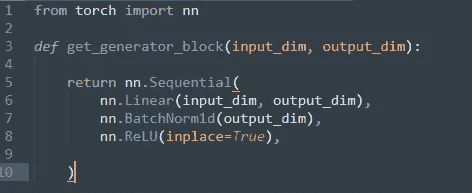
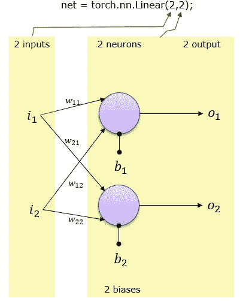
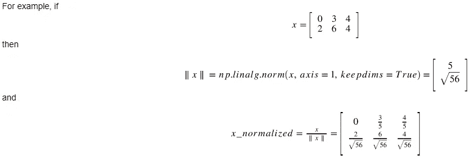

# 甘的基本成名之作:生成性对抗网络(一)

> 原文：<https://medium.com/geekculture/basic-fame-work-of-gan-generative-adversarial-network-part-1-5a80d0990e2d?source=collection_archive---------29----------------------->

img src: [Sedki Alimam](https://society6.com/sedkialimam2) [https://society6.com/product/spy-vs-spy-ma7_print](https://society6.com/product/spy-vs-spy-ma7_print)

像历史上的许多突破一样，甘并不复杂。太棒了。如果你熟悉面向对象的编程和基本的机器学习，GAN 是显而易见的下一步:多模型协同工作的动力学。甘不仅创造了惊人的成绩，还教会了我们有效的学习方法:良性竞争。这只是分类器模型与生成器模型对抗的冰山一角。想象一下使用两个以上的模型和不同的关系集来代替竞争的可能性。寓意无限。

## 发生器、鉴别器和损耗函数

我来打个比方。细胞由分子组成，分子本身由化学元素组成，一直到亚原子粒子。GAN 是类似的，它由模型组成，它本身由深度神经网络组成，一直到单行代码。我希望你明白我在这里想做什么。我想说的是，至少对于非常简单的 GAN 来说，GAN 只不过是一堆深度神经模型之间的交互:生成器、鉴别器和损失函数。明白了这些，就明白了 GAN 的基本架构。当然，在现实中，甘已经发展了许多细微差别，以改善其结果，就像 2021 年奥迪发动机不会与第一个可燃发动机相同，但该系列将专注于最简单的可燃发动机。如果我有时间，我可能会写更多的当代甘。

## 发电机

生成器有两个组件:get_generator_block 和 Generator。让我们仔细看看 get_generator_block 类中有什么。

Img source: Coursera, Generative Adversarial Networks (GANs) Specialization

我们首先从第一行导入 pytorch，这将节省我们很多时间。当然 sklearn 和张量流可以达到同样的效果。pytorch 的唯一问题是它隐藏了许多对理解很关键的部分，所以我将一行一行地介绍它。

Img src: [http://www.sharetechnote.com/html/Python_PyTorch_nn_Linear_01.html](http://www.sharetechnote.com/html/Python_PyTorch_nn_Linear_01.html)

这就是神经网络线性(p1，p2)层的外观。第一个参数控制线性节点(紫色圆圈)加上偏置项(也称为 y 轴截距)的系数数量。在可视数据中，与系数交互的输入是像素值。第二个参数控制网络中有多少线性节点。

Img src: Coursera Deep learning specialization

第二层 nn。BatchNorm1d()对每个值进行归一化，如上所示:将每个值除以其对应的范数。每一行都有不同的规范。每行的范数通过将该行的所有平方值相加来计算。如上图所示，0*0 + 3*3 + 4*4 的平方根等于 5。标准化数据将通过显著加快收敛速度来加快训练过程。

Img src: [https://towardsdatascience.com/gradient-descent-algorithm-and-its-variants-10f652806a3](https://towardsdatascience.com/gradient-descent-algorithm-and-its-variants-10f652806a3)

我们用 nn。Relu()，因为其他替代函数(如 sigmoid 和 tanh 函数)会产生消失/爆炸渐变问题。由于这个问题不在讨论范围之内，我将在下面发布两个视频的链接，这两个视频很好地解释了这个问题。

## 结论

请记住，虽然 get_generator_block 为我们提供了深度神经网络中的一层，但它本身由 3 层组成:线性、批处理和 Relu。我知道这可能会令人困惑，这就是为什么你会看到一些文献称它为块而不是层，例如类本身的名字是 get_generator_block。但我确实相信称之为层是有价值的，因为对于人们来说，这是一个更容易的类比，可以想象某物穿过一层而不是一个块。这就是课程的全部内容，我将在下一篇博客中完成发电机模型，敬请关注。

[https://www.youtube.com/watch?v=JIWXbzRXk1I](https://www.youtube.com/watch?v=JIWXbzRXk1I)