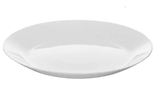

# 基础 JavaScript 第 3 部分:变量

> 原文：<https://medium.com/geekculture/basic-javascript-part-3-variables-94c49273b622?source=collection_archive---------23----------------------->


你好，朋友们你们好吗，希望你们永远健康成功。这一次我们将继续上一个教程如何使用 JavaScript 创建简单的代码和注释。

这次我们将讨论 JavaScript 中的变量。基本上编程中所有的变量都是一样的，只是写的有点不一样。

我们将介绍几个例子:

1.  可变的
2.  常数

在继续之前，请先学习上一个教程:

[基础 JavaScript 第 1 部分:什么是 JavaScript？](https://temanngoding.com/en/basic-javascript-part-1-what-is-javascript/)

[基础 JavaScript 第二部分:第一段代码和注释](https://temanngoding.com/en/basic-javascript-part-2-first-code-and-comments/)

# 可变的

变量是包含值的名称。变量可以填充各种值，如字符串、数字、对象、数组等。下面我们可以看到一个例子:



Plate = Variable


The plate when there is content, then that person already has a value. An example here is a plate containing food.

当一个变量已经有一个值时，我们可以使用那个变量。

在 JavaScript 中，至少有三种方法来声明变量，即使用 var、let 和 const 关键字。ECMAScript 2015 (ES6)版本引入了带有 let 和 const 的变量声明，以取代被认为有争议且容易出现 bug 的 var。

现在我们将直接练习如何在 JavaScript 中创建变量。

```
let lastName;
```

我们创建了一个名为“姓氏”的变量，我们可以通过*声明语句*的名称来识别这个变量。要填充一个值，可以使用等号(=)。

```
lastName = "Mantan Programmer";
console.log(lastName);/*Output
Mantan Programmer
*/
```

我们已经使用 console.log 在变量中输出了一个值。

当你使用等号(=)将一个值初始化为变量时，它被称为*赋值表达式*。

我们已经创建了一个姓变量。我们可以想象变量是一个空盒子，在盒子里我们填入商品，盒子已经有值了


已经有值的变量将被存储在计算机的内存中。

变量可以取任何名字，但是要确保变量名易于理解和维护。使用变量名有几个规则。

*   必须以字母或下划线(_)开头。
*   可以由字母、数字和下划线(_)以各种组合形式组成。
*   不能包含空白。如果变量名多于两个单词，用 camelCase 写。例如名、姓、名等。
*   不得包含特殊字符(！。，/ \ + * =等。)

我举一些变量的例子:

```
var firstName = "Mantan";
var _lastName = "Programmer";
var full_name = "Mantan Programmer";
var Full_name = "Mantan Programmer";
var visitorCount = 5921;
```

“变量值不填会怎么样？”

那么这将是“未定义的”。例如:

```
var x;//undefined
```

# 重新填充变量

变量可以重新填充，这意味着值可以改变。不像常数。你会学会的。

示例:

```
// variable
var age = 18;// Refilling Variables
age = 21;
```

当您创建第二个变量时，您不必使用“var ”,因为创建第一个变量时需要 var 代码。

# 常数

我们可以用 const 这个名字。Constant 是一个变量，它有一个固定的值，在初始化它的值后不能改变。例如，当我们有一个已经填充并密封的盒子时，值就不能改变。


如果我们使用 const 重新初始化变量值，我们将得到错误“TypeError:赋值给常量变量。”。代码示例如下

```
const z = 100;
console.log(z);z = 200;
console.log(z)/* TypeError: Assignment to constant variable. */
```

以上是我这次可以传达的教程，希望有用。

谢谢。