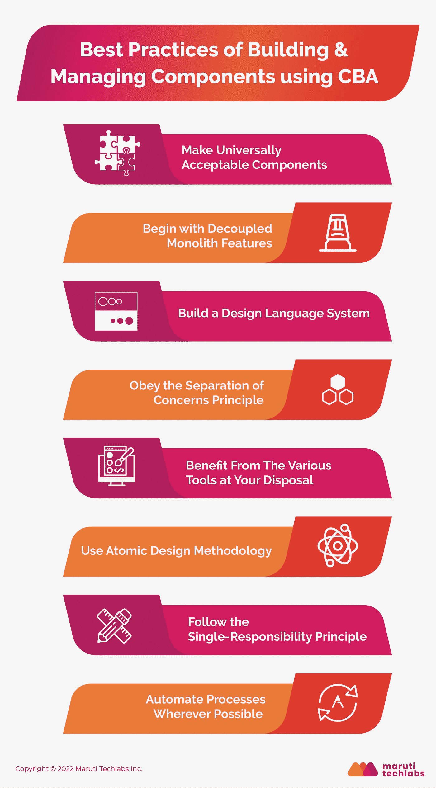

# 基于组件的架构:构建和管理组件的 8 个最佳实践

> 原文：<https://medium.com/geekculture/best-practices-of-building-managing-components-using-cba-143c87b00ac9?source=collection_archive---------11----------------------->

了解基于组件的开发的好处是为未来创建前端结构的最佳方式之一。如果您仍然必须处理一个前端整体，现在是开始向这种模块化方法转移的正确时机。以下是实现该架构时需要记住的一些基本实践:

*   **制造普遍接受的组件**

您将在几个应用程序中使用您创建的组件，而不仅仅是为一个应用程序设计的组件。因此，向您的工程师传达这些组件的更大用途是至关重要的，因为其他团队和个人可能会使用它们。

*   **从分离的整体特征开始**

使用 monolith 应用程序很有挑战性，因为这里的功能是高度相互依赖的。通过将整体结构分解成一个模块化系统，尝试确定可以分离和存在的特征。

*   **构建设计语言系统**

设计系统是用于创建品牌标识的开发指南。设计师用来构建网站结构的不同方法被称为设计系统，可以帮助确定组件如何从一个平台启用到另一个平台。

这些标准帮助您创建一个与页面布局、页面格式和整体信息架构相关的综合理论和实践的基础。他们可以在日常工作中极大地帮助您的团队成员，同时整合工作，以便其他部门或第三方供应商在销售您的产品或服务时了解他们的管辖范围。

*   **遵守关注点分离原则**

为了实现组件的真正可重用性，您必须坚持关注点分离原则。保持这两个逻辑的不同可以让您保持灵活性，同时让参与组件的其他团队的工作变得更容易。当设计和业务逻辑同时应用于一个元素时，对于前端组件来说尤其如此。

*   **从您可以使用的各种工具中获益**

有许多工具可以帮助前端开发人员简化工作。从管理依赖关系到测试环境，下面列出了一些对您开发下一个应用程序有帮助的内容:

*   故事书:它允许你完全独立地为你的项目设计组件，让你专注于组件的可测试性和可重用性。
*   Styleguidist:这个动态文档帮助您对不同组件的多种变体进行简要概述。
*   测试:可以使用各种工具为您的应用程序执行不同的测试策略，例如单元测试、集成测试和端到端测试。为此，您可以使用 Postman、Cypress.io 和 Jest。
*   Linters:它通过突出编程缺陷、bug、美学问题和可疑的结构使编码变得更容易。
*   **使用原子设计方法学**

Brad Frost 介绍了原子设计，这是一种受化学启发开发界面的实用方法。它建议使用一致的词汇表来引用组件和标签结构。

原子设计的不同阶段是:

*   原子
*   分子
*   有机体
*   模板
*   页

通过将这种技术与基于组件的架构相结合，您也采用了一种被全世界的原子设计社区普遍认可的语言。

*   **遵循单一责任原则**

随着时间的推移，甚至一个组件也会变得臃肿，不同的成员会为不同的用例添加更多的功能。在这种情况下，单一责任原则会有所帮助。当一个组件包含许多负责太多元素的道具时，我们可以将这些道具分成多个更细粒度的组件，这样每个组件只服务于一个单独的目的。

*   **尽可能实现流程自动化**

自动化在任何开发中的重要性，尤其是基于组件的开发，怎么强调都不为过。鼓励识别各种方法来自动化您的开发过程，因为这样做将使遵循已建立的指导方针变得更简单。

您是否希望扩展您的前端开发？在这个[实践教程](https://marutitech.com/scale-front-end-development-with-component-based-architecture/)中，您可以了解基于组件的架构如何帮助构建可伸缩的应用程序。