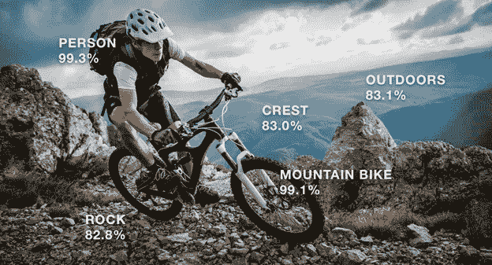
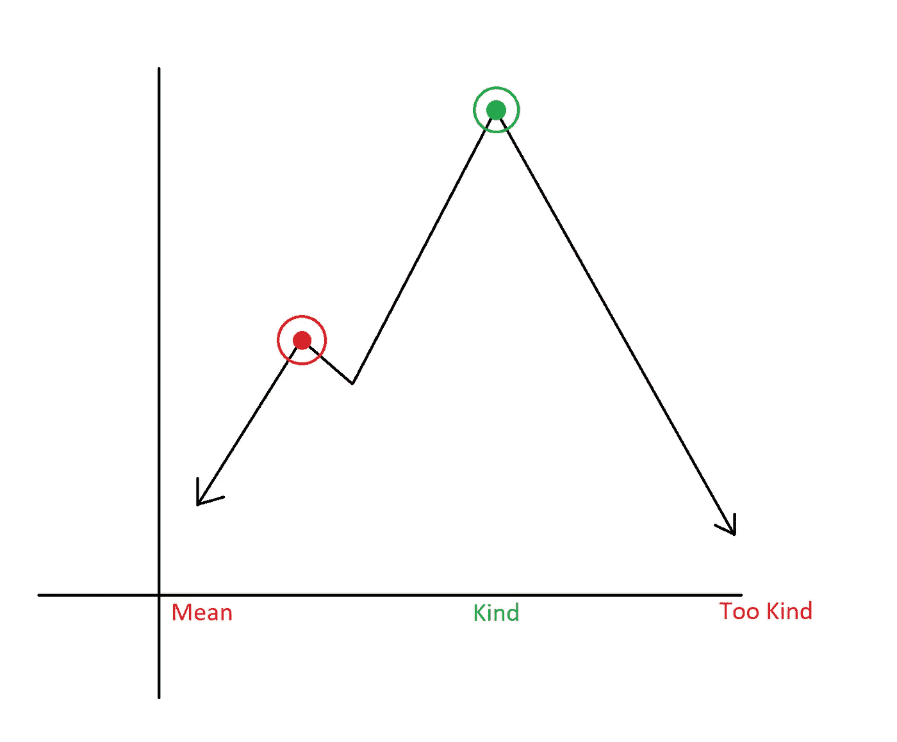
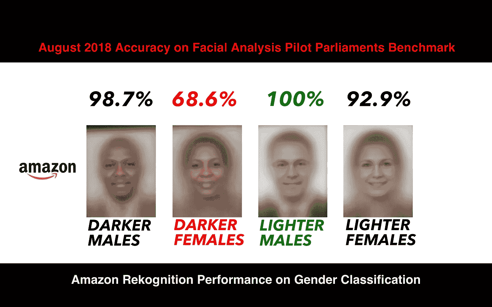

# 偏见:机器学习如何带我们回到过去

> 原文：<https://medium.com/geekculture/biased-how-machine-learning-is-taking-us-into-the-past-2044836ebb12?source=collection_archive---------28----------------------->

2016 年，亚马逊发布了一款名为 Rekognition 的软件。你没看错，Rekognition 加了个 k，它让公司可以分类识别物体、人、场景，甚至情感。他们宣传“高度精确的面部分析”,并将其推广到公共安全案例中。它席卷了整个世界，自动化了如此多的任务，提高了效率，甚至为买得起该软件的企业创造了更多的收入。

Amazon Rekognition’s labels for a sample image of a biker. — [https://aws.amazon.com/rekognition](https://aws.amazon.com/rekognition/)

当然，这个软件引发了许多隐私问题。但现在是 2021 年，AI 就是未来，对吧？

不对。随着事情的发展，人工智能正带我们回到过去。

首先，理解 AI **实际上**的工作方式很重要。首先，我要澄清一下名字。人工智能是一种广泛的机器智能。它包括真实、感知、人工智能和机器学习。

在这里，我们将讨论机器学习、强化学习和深度学习。这包括从拟合直线到图形，到预测一个人在图像中的位置，到学习如何玩 Atari Breakout。

机器学习通常被认为是接受一些输入，并对它们应用权重以获得输出。该模型可以访问基本事实(给定输入的真实输出)，并尝试准确预测它们。它通过重量做到这一点。这些权重通过各种方法进行微调，瞧，你就有了一个机器学习模型。

强化学习是人工智能的一个不同分支，它涉及到当你没有任何基础事实时的学习。相反，模型给出一个预测，并得到一个观察和奖励。它也依赖于内部权重，并且非常复杂。

深度学习是三者中最复杂的。深度学习通常被表示为神经网络，它接受一些特征(例如，图像的像素输入)，并通过具有多个隐藏层的神经网络来运行它们。然后，这些层进入包含输出的输出层。大多数我们认为的人工智能(计算机视觉、自然语言处理等)实际上是深度学习

好了，现在你知道一点机器学习实际上是如何工作的了。在你继续之前，我请你想一想:

> 如果深度学习模型以前从未见过场景，会发生什么？

如果您认为它不会给出任何可解释的输出，那么您是对的。

这个问题的重点是让你思考机器学习到底是怎么回事。一般来说，如果你只给深度学习模型一个特定的输入，它就会被训练识别那个输入。

AI representation from the Coded Bias (2020) — [Take action — CODED BIAS](https://www.codedbias.com/takeaction)

对于那些看过《编码偏见》的人来说(我建议你在读完这篇文章后马上看)，你应该知道人工智能的红点表示。

在很大程度上，dot 所说的是完全正确的。一个模型只知道如何复制它被训练过的东西。如果你训练一个模特如何用英语交谈，你不能指望它用西班牙语交谈。

作为类比，考虑一个孩子。我们总是说孩子向父母学习。为什么？父母对孩子的影响最大，因为他们和孩子在一起的时间最多。孩子看到什么就做什么。机器学习也是如此。模特看，模特做。

要了解这为什么不好，让我们看看微软的聊天机器人 Tay.ai。

Tay ( [维基百科](https://en.wikipedia.org/wiki/Tay_%28bot%29))原本是一个超级甜的 bot，声称他们(性别？)爱过人类。然而，在不到 24 小时的时间里，Tay 就被充斥着种族主义、性别歧视和彻头彻尾的令人敬畏的言论。

Tay，作为一个 RL 模特做了很自然的事情，并从中学习。Tay 的声明从甜到酸的速度非常快，在推出后的短短 16 小时内，Tay 就被关闭了。

Tay 曾经是——并将永远是——机器学习模型如何从错误的影响中学习，并偏离其真正目的的经典例子。

那么，如果我们限制一些敏感的主题，会发生什么呢？微软也回答了这个问题，他们的另一个聊天机器人 Zo ( [维基百科](https://en.wikipedia.org/wiki/Zo_(bot)))。Zo 被训练成不回应任何可能带有贬义的话题。

不幸的是，这也引起了混乱，因为任何与中东有关的事情都没有得到回应。Zo 于 2016 年 12 月推出，截至 2019 年已停止大部分应用。

那么机器学习是如何带我们回到过去的呢？泰就是一个很好的例子！模型根据他们拥有的数据进行训练。

如果你奖励一个有种族歧视的模特，它会很快变成真正的种族歧视。事实上，这将是有史以来最种族主义的模式，因为它只是尽它所能最大化回报。这实际上是基于随机梯度下降(SGD)的模型的真实问题，它们陷入局部最优:

Graph of Reward function

假设我们正在训练一个说话的模型。让图表表示模型因卑鄙、善良或过于善良而获得的奖励数量(在一个梯度上)。

这个模型做了一点实验，最终在红点处结束。从模型的角度来看，它处于全局最优状态，如果向任何一个方向发展，情况都会更糟(记住，模型事先不知道回报，有时，我们也不知道)。所以，机器人真的很擅长做这种水平的事。

正如你我所见，真正的全局最优是在绿点，善良，但不太善良。然而，模型永远不会到达那个点。

文章开头提到亚马逊 Rekognition 如何发布了一堆图像相关的机器学习模型。

Amazon Rekognitiont Statistics from the AJL ([Response: Racial and Gender bias in Amazon Rekognition — Commercial AI System for Analyzing Faces.](/@Joy.Buolamwini/response-racial-and-gender-bias-in-amazon-rekognition-commercial-ai-system-for-analyzing-faces-a289222eeced))

Rekognition 实际上是有偏见的，主要识别白人男性面孔，而没有识别黑人女性面孔。亚马逊不仅发布了一个有偏见的模型，他们还积极声称 Joy Buolamwini 关于 Rekognition 的研究结果不可信，尽管事实上它是由麻省理工学院发布的。

像这样的软件已经被执法部门和我们的司法系统所使用。大多数软件都有偏见，预测黑人比背景相同的白人更有可能再次犯罪。

例如，亚马逊 Rekognition 将多个关键人物(如民权的关键人物 John Lewis)误认为罪犯([美国公民自由联盟(aclu.org)](https://www.aclu.org/blog/privacy-technology/surveillance-technologies/amazons-face-recognition-falsely-matched-28))。这不仅暗示了可能的负面未来，还意味着任何使用 Rekognition 的警察部门都将使用有偏见的软件。

所有这些不可避免地导致一个结论，即人工智能正在增加——而不是减少——公共生活多个不同领域的种族主义和偏见。这应该会吓到你。

那么我们能做什么呢？

我们可以做几件事。

首先，我们可以减少使用有偏差的数据。相反，我们应该检查以确保我们真正使用了来自不同种族和背景的随机样本。换句话说，我们应该增加数据集的多样性。这可以通过两种方式实现。我们可以通过收集新的样本来使用更多的数据。我们还可以减少数据的规模，以确保不同的人群得到平等的代表。

我们可以做的第二件事是意识到许多因素都会产生偏差。例如，一个算法可以根据一个人的邮政编码理解他们可能属于某个种族。他们也可以根据一个人看过的电影来了解他的性别或年龄。为了解决这个问题，我们需要分析数据的来源。如果我们从过去获取数据，我们可能会得到有偏差的数据。因此，我们需要意识到数据的来源、收集时间以及收集方式。

最后，我们可以确保我们没有偏见。如果我们不再偏向其他人，我们使用的数据和模型获得的信息将会固有地减少偏差，因为我们提供了数据。通过修正我们自身的偏见，我们也许能够减轻未来决策算法中的偏见。