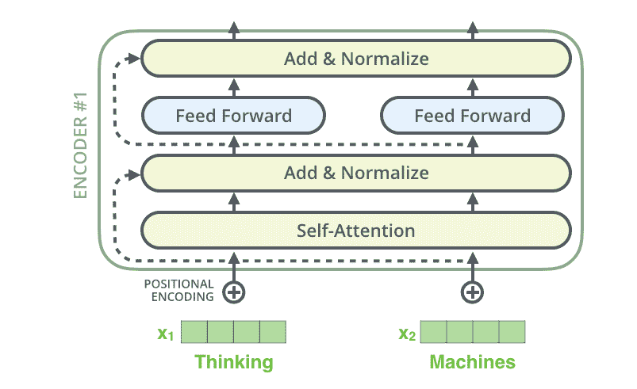
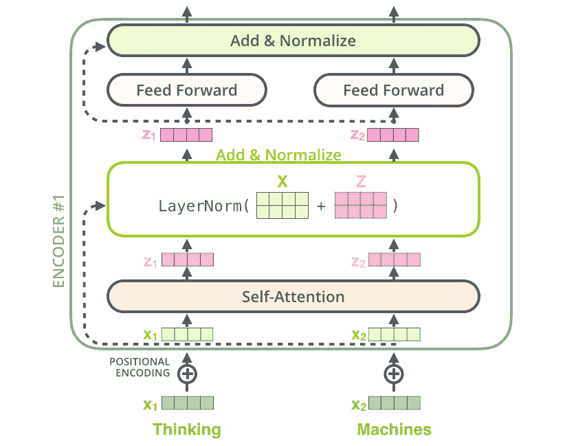
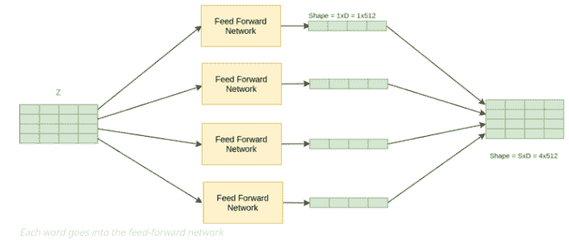
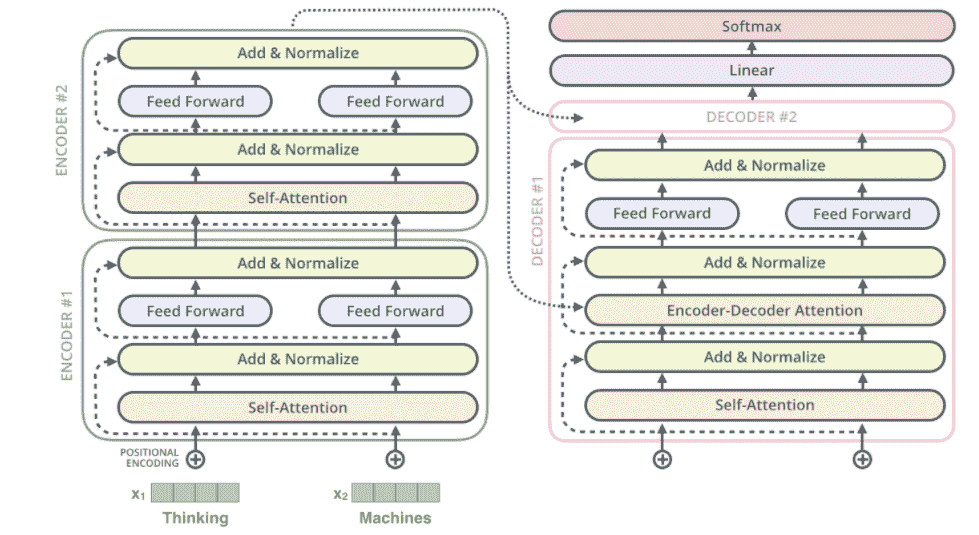
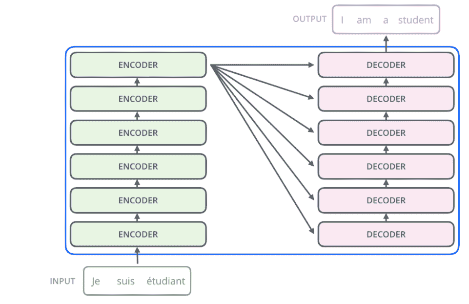
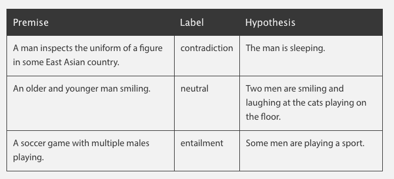

# 人工智能、机器学习、神经网络和语言的鸟瞰图第三部分

> 原文：<https://medium.com/geekculture/birds-eye-view-of-artificial-intelligence-machine-learning-neural-networks-language-part-3-96dacf9ba74b?source=collection_archive---------21----------------------->

Photo by [Dmitry Ratushny](https://unsplash.com/@ratushny?utm_source=medium&utm_medium=referral) on [Unsplash](https://unsplash.com?utm_source=medium&utm_medium=referral)

在上一篇文章中，我们讨论了各种神经网络模型&它们比传统的 ML 模型更强大。在这篇文章中，我们将研究机器如何解释语言，以及如何使用一些模型尤其是神经网络来实现这一点。让我们开始吧。

*第一部分:*[*https://tafydas . medium . com/birds-eye-view-of-artificial-intelligence-machine-learning-neural-networks-language-Part-1-802 b 35 cf 1873*](https://taffydas.medium.com/birds-eye-view-of-artificial-intelligence-machine-learning-neural-networks-language-part-1-802b35cf1873)

*第二部分:*[*https://tafydas . medium . com/birds-eye-view-of-artificial-intelligence-machine-learning-neural-networks-language-Part-2-a53d 93495 de 1*](https://taffydas.medium.com/birds-eye-view-of-artificial-intelligence-machine-learning-neural-networks-language-part-2-a53d93495de1)

# 自然语言处理

自然语言处理是人工智能的一个分支，以文本或语音的形式处理人类语言。它包括两个主要分支:自然语言理解(NLU)和自然语言生成(NLG)。NLU 涉及分析自然语言，以便理解它。NLG 是将自然语言生成有意义的短语或句子。

自然语言带来了很多挑战，比如:

**词汇歧义**:词汇的低级角色。单词*‘board’*是名词还是动词

语法歧义:这些句子可能有多种意思。例句:“我看见一头穿着睡衣的大象”

**指称模糊**:这些是处理所指的是谁/什么的挑战。例句:汤姆在外面遇到了亚历克斯。他很惊讶。”

NLP 的其他挑战包括能够识别讽刺、笑话等

# 单词表示

单词表示是将单词编码成机器可读格式的方法。基于单词表示，可以创建映射到单词表示的特征向量。这些特征可以包括词频、词干等。

# 一键编码

这是在矩阵中表示文档单词的基本方式。每个唯一的单词在矩阵中被编入索引，并且单词被标识为在句子/文档中存在或不存在，分别用数字 1>=或 0。这有时也被称为单词包。通过将单词的词形变化转换为其词根形式，可以使单词包更加独特，例如:*‘tables’*到*‘table’*或*‘eat’*到*‘eat’*。这防止了矩阵中出现的某些单词以它们的各种变化重复出现。一键编码的一个挑战是，对于大型文档，它往往会产生巨大的矩阵，通常用 0 填充，称为稀疏向量。这不是储存大量单词的有效方法。

# 单词嵌入

词在向量空间中的分布表示，它模拟相似的词和在同一上下文中经常一起出现的词。这些嵌入通常基于模型学习的几个特征/维度。已知相同向量空间内的单词具有更强的相似性。Google 的 Word2Vec 或 Stanford 的 Glove 是两种常用的单词嵌入模型。

**Word2Vec**

Word2Vec 嵌入有两种不同的训练方法。它们是:

*CBOW(Continuous Bag Of Words)*:该方法以上下文为输入，预测中心词。例如“国王统治着他们”这句话将拆分为“The”、“king”、“over”、“them”作为输入，将“rules”作为预测字。

*Skip-Gram* :这与 CBOW 相反，它将中心单词作为输入，将上下文单词作为预测值。

可以调整不同的参数和超参数来改进系统，包括上下文窗口。在上面的例子中，窗口将是 5，中间的单词计为 1，并且在中间单词的相对侧有 2 个单词。一个规则是，较小的窗口(~ 2–15)提供可以在句子中互换的相关单词，例如同义词或反义词，而较大的窗口提供大得多的上下文中的相关单词，而不必在句子中互换。

根据 Mikolov 的说法，Skip-Gram 和 CBOW 都有自己的优势，这取决于几个因素，Skip-Gram 似乎更适合长句、小样本/数据集和罕见单词。另一方面，CBOW 似乎在处理短句、大样本/数据集和常用词时效果更好。Word2Vec 还能够识别线性/关联属性。比如(男人和男孩)或者(女人和女孩)的关系。他们还能够根据矩阵加减运算识别类比。一个通俗的例子就是公式王——男+女~=女王。得到的矩阵与 Queen 非常接近。相关单词的聚类在领域文档分类中非常有用。

**手套**

与使用神经网络的 word2vec 不同，GloVe 使用共现矩阵来解释其语义类比。这个想法是单词概率的比率比单词概率本身具有更强的意义。Word2vec 是一个预测监督模型，通过减少其损失函数进行学习，而 Glove 是一个基于计数的无监督系统，观察单词如何频繁出现在彼此周围(概率得分)。由此产生的矩阵是巨大的，缩小它的一种方法(降维)是分解它。通过最小化重建损失，得到的矩阵是缩小的版本。较低维度的矩阵仍然能够解释原始维度数据中的差异。Glove 考虑的是整个语料库，而 word2vec 只考虑基于所选窗口的局部分组。Glove 还能够显示关系，例如冰与固体共现的概率(高概率)、蒸汽与气体共现的概率(高概率)、以及水在冰和蒸汽之间共现的概率(高概率)。冰和蒸汽之间的计算比率将抵消固体(值> 1)，气体(值<1) and maintain closely contextual words like water, with values close to 1 (value ~1). Glove has fast training however the challenge is the huge amounts of computer memory required to initially create the co-occurrence matrix. The vector results for context are better than traditional word representation models like word analogies, word similarities and named entity recognition tasks.

# Language Model

A language model involves the probability distribution over a sequence of tokens. It’s usually used to predict the next token item and order usually matters.

*注*:单词嵌入本身不是语言模型，它们只是单词的空间表示。在这些嵌入中，顺序并不重要，它们通常是神经网络第一层的一部分，称为嵌入层。然而，单词嵌入的训练实现语言模型来执行单词预测。Skip-Gram 和 CBOW(连续单词包)是用于训练 word2vec 嵌入的语言模型。然而，单词嵌入的训练不仅对过去的标记感兴趣以预测未来的标记，它还使用周围的单词作为上下文来预测中心单词，反之亦然。换句话说，它是双向的。基于序列预测下一个记号的其他方法是 N 元语法和双向模型。

# n 元语法

这是单词的顺序表示，其中 n 是顺序单词的数量。最常用的是二元模型——两个连续的单词，三元模型——三个连续的单词。n 元语法越高，就越难对数据进行建模，因为语言不是静态的，这意味着有不同的方式来格式化一个句子以表达相同的意思。查看 5 克的单词对于模型来说可能太多了，这将倾向于过度拟合模型，而不是将其一般化。单词包可以被认为是一个单字，因为在每个位置只有一个单词被索引。

*二元模型*:序列中的两个单词，其中前一个单词预测下一个单词

*三元模型*:连续三个单词，其中前两个单词用于预测下一个单词

*Ngram* :序列中的 N 个字，其中前 n-1 个字用于预测下一个字

*限制*

*   由于语言中单词的长期依赖性，ngram 方法并不适合，因为它只取决于一个人追溯到多远。对于需要大量计算时间的模型来说，回溯太远可能是矫枉过正，并且用于训练模型的太少的先前单词可能无法获得必要的学习信息。
*   大多数情况下，只有当测试数据看起来像训练数据时才起作用，但现实生活中并非如此。
*   n 元语法是语言的一种稀疏表示。这是因为我们基于单词共现的概率来建立模型。这将使所有不存在于训练语料库中的单词的概率为零，这对于存储来说是一个巨大的代价。

# 高级语言模型

## 注意力

LSTMs 和 GRUs 是对 RNN 系统的改进，能够保存信息更长时间，尽管计算成本可能很高。注意是另一种神经网络方法，其中产生的输出仅基于最相关的部分，而不是整个序列，因此注意输入中被认为相关的部分。例如，考虑附加到语言模型中的输入向量的大注意力权重向量 a3，2。为了预测第三个输出标记，对第二个输入标记的关注度很高。简而言之，注意力指示输入序列的哪一部分需要更多的关注来进行下一次预测。注意力通常被归一化，使得输入的所有权重可以在分布上加和为 1。注意力的一些应用包括语言翻译，其中注意力机制被应用于每个迭代序列的部分输入。对于会话模式，注意力被应用于会话的先前部分，以提供响应。总的来说。注意力有不同的变化，包括局部和整体注意力。全局注意在产生输出之前注意包含所有单词的所有隐藏状态，而局部注意在产生输出之前注意给定的单词窗口。全局注意力的缺点是需要大量的计算时间，这非常昂贵。分层注意力以分层格式对注意力进行建模，该分层格式基于较低层的单词和较高层的句子来显示注意力的相关性。以下是其他类型的关注:

**自我关注**

它是一种将序列中的不同标记相关联的机制，以计算它们的内部表示以及它们彼此之间的相关程度。在自我关注中，输入是用于决定关注输入的哪些其他部分的查询。它不同于一般注意力，一般注意力使用查询输入来决定另一组数据点的哪些部分是重要的。自我注意对于语言翻译或句子解析这样的任务非常有用——在这些任务中，单词是相互依赖的，并且与同一序列中的其他几个单词相关联。例子:拿着*艺术品*的*男孩*说*他*画了*它*。在这个例子中，你可以看到，相对于男孩*和男孩*而言，男孩*和男孩*更受关注。

**软注意**

软注意是确定性的，这意味着所有的隐藏状态被用来生成总是产生相同结果输出的上下文向量。另一个优点是，软注意是可微分的。一个可微函数是连续的，没有间断的，光滑的。

**努力关注**

聚焦于一个隐藏状态以生成上下文向量。硬注意是随机的，这意味着隐藏状态的选择取决于用来生成隐藏向量的函数。

## 变压器

转换器就像 rnn 一样处理顺序数据，但是该模型不要求按顺序处理输入。与 RNNs 相比，这允许更多的并行化，因此转换器能够在更大的训练数据集上运行。变形金刚是建立在一种关注机制上的，在这种机制下，模型能够关注给定任务中更重要的表征。注意机制解决了在 RNNs 中可以看到的消失梯度问题。当 RNN 中的所有输入被处理以生成上下文向量时，旧的输入项往往会被忽略，因此 RNNs 最初与注意机制相结合。经过几次改进后，观察到当与 RNN 结合时，注意机制本身产生类似的结果，因此对仅注意模型的关注增加了。

每个转换器由编码器和解码器组成。编码器将输入处理成编码信息，该编码信息指示彼此相关的输入部分。每个编码器的输出进入下一组编码器，然后进入解码器。解码器做相反的事情，将编码信息解码成输出序列。编码器和解码器有一个注意机制来指定输入的哪些部分是相关的，并对它们进行加权。解码器有一个额外的注意层，用于在为当前解码器产生输出之前，在先前的输出序列中查找相关信息。变形金刚有多个注意力头，每个注意力头关注不同的“相关”项目，如关注下一个单词或动词的主要对象等。这种方法在计算上是高效的，因为句子的不同部分被分析用于可能的连接，并且其他相关的表征比一个注意力头能够更好地被揭示。来自每个多注意力头部的输出被结合并乘以权重输出向量，以生成计算所需的正确维度大小。产生的输出矩阵被传递给前馈神经网络。前馈网络由两个隐藏层组成。第一层由 4 倍于输入大小的隐藏单元组成。这允许模型容纳足够的令牌表示。第二层将巨大的隐藏单元尺寸缩放回原始模型尺寸。

编码器

每个编码器由一个自关注机制和一个前馈网络组成。这意味着在解码器阶段进行预测之前，比普通嵌入更好地为单词提供丰富的上下文。自我关注层权衡来自先前编码器的编码之间的相关性，并输出新的编码。输出编码被传送到前馈网络，该网络处理编码并将它们传送到下一个编码器和解码器。第一个编码器获取输入的位置信息和单词嵌入，称为输入层。简单的一键编码可以用来表示位置信息，但更高级的策略是使用正弦或余弦函数，因为它们可以在范围 1 到-1 之间平滑地处理更长的句子。单词嵌入和位置向量的组合最终将信息传递给下一个编码器进行处理。变形金刚中实现的自我关注使用*查询*和*键值*对来计算关注度。*查询*是待分析序列中的标记，*键*是可用于训练数据集的匹配标记，并且*值*被映射到*键*。*值*包含令牌本身的表示，以及它们出现的上下文。*查询*和*键*之间的点积提供了一个矩阵，该矩阵突出显示焦点记号的高分和所有其他记号的低分。这是一种计算关键字与查询相似程度的相似性度量。通过将分数除以查询和关键维度的平方根来缩小分数，这样做是为了避免维度变得太大时的爆炸梯度问题。将 softmax 应用于所得到的按比例缩小的矩阵，该矩阵提供了注意力得分。然后，将得到的矩阵与*值*相乘，以基于关键字提供最受关注的令牌。在自我关注中，键和值通常是相同的。关注值输出向量与被称为*剩余连接*的原始位置输入嵌入相结合。这是为了确保反向传播时单词的位置信息不会丢失。剩余连接的输出通过归一化以更快收敛，然后通过前馈网络作为进一步处理的输入。剩余连接对于非常深的网络来说特别重要，因为一些信息可能会在途中丢失，因此这是确保信息在整个网络中传递的一种方式。前馈网络由通过 ReLU 激活连接的线性层组成。在前馈网络之后执行另一轮剩余连接和归一化。编码器可以相互堆叠，每个都有自己的重量。所有编码器的最终输出应该包含丰富的上下文，然后可以提供给解码器进行预测。例如，变压器有六个编码器，之后信息被传输到解码器。

总而言之:

From Jay Alammar’s post ([http://jalammar.github.io/illustrated-transformer/](http://jalammar.github.io/illustrated-transformer/)) below are image descriptions

*编码器的子层*

From Jay Alammar’s post ([http://jalammar.github.io/illustrated-transformer/](http://jalammar.github.io/illustrated-transformer/)) below are image descriptions

*编码器的深入子层*

编码层的其他图示如下所示:

1.  使用级联多头将层输入到关注层

Source: [https://lionbridge.ai/articles/what-are-transformer-models-in-machine-learning/](https://lionbridge.ai/articles/what-are-transformer-models-in-machine-learning/)

2.注意层到前馈网络的归一化输出

Source: [https://lionbridge.ai/articles/what-are-transformer-models-in-machine-learning/](https://lionbridge.ai/articles/what-are-transformer-models-in-machine-learning/)

解码器

解码器有三个部分，自我关注机制，前馈网络和关注层，以关注编码器的编码输出。解码器堆栈的最终输出一次产生一个，并反馈到解码器堆栈中作为下一次预测的输入，这称为自动回归。就像编码器一样，第一个解码器将来自输出序列的位置信息和嵌入作为其输入。解码器中的自我关注略有不同。因为单词是一次一个单独生成的，所以自我注意机制在注意其他单词时无法访问未来的单词。例如，当在短语“我是”中实现自我关注时，模型不能访问单词“好”。这种方法被称为屏蔽(前瞻屏蔽)。掩码是一个向量，由从下面的三角形矩阵开始的 0 和从上面的三角形矩阵开始的负无穷大组成。当与缩放的编码器注意分数结合时，顶部的三角形矩阵被屏蔽。在执行 softmax 和缩放分数之前应用遮罩。负无穷大值的柔化蒙版产生 0。掩蔽也具有多个头部，并且每个头部的值在被传递到第二解码器层之前被连接。解码器还基于编码器生成的当前上下文进行预测。编码器的输出被用作第二解码器层的关键字和值，而第一解码器层的输出被用作查询。第二解码器中的多头自关注的输出被处理，然后被传递到前馈网络。最终解码器实现线性变换和 softmax 层以产生输出。编码器和解码器都可以堆叠多次，在谷歌*的研究论文中*，研究人员决定为变压器使用 6 个编码器和 6 个解码器，尽管这个数字可以进行实验。堆叠的目的是尽可能地捕捉语言的复杂性，揭示语言的层次特征。

From Jay Alammar’s post ([http://jalammar.github.io/illustrated-transformer/](http://jalammar.github.io/illustrated-transformer/)) below are image descriptions

*编码器和解码器的子层及其连接*

From Jay Alammar’s post ([http://jalammar.github.io/illustrated-transformer/](http://jalammar.github.io/illustrated-transformer/)) below are image descriptions

*6 组编码器和解码器及其连接*

另一个被称为**重整器**的模型据称是 transformer 的更高效版本，由于哈希等某些改进，可以处理更多的数据，从而减少了 transformer 在自我关注阶段面临的计算负载。

Google Brain 团队已经提供了一个 API， **Tensor2Tensor** ,它为图像字幕、机器翻译、解析等各种模块实现了 transformer 模型。这个 API 可以很容易地实现和调整，以解决前面提到的特定类型的问题。

## 变压器 XL

普通变压器虽然非常强大，但仍然存在一些挑战。它解决了消失梯度的问题，但是，它仍然有长相关性的问题，因为输入一次只接受 512 个标记。对于大型文档，这将意味着拆分文档并训练模型。这导致了**上下文碎片**和**受限** **上下文依赖**，因为文档早期部分的一些非常重要的信息无法访问。转换器试图通过以这样的方式训练模型来合并这些输入，即在模型处理了分割的输入段之后，这些段移动一步，并且整个过程再次重新运行。TransformerXL 通过引入递归机制解决了**上下文碎片**和**受限** **上下文依赖**。递归机制的工作原理是将信息从前一段的输出转移到当前段的输入。这些信息被连接起来，因此我们不会失去对长句子的注意力依赖。然而，这种方法不允许绝对位置编码，因为对于每一轮输入段，都有具有相同位置的标记。相对位置编码被引入每个注意片段，而不是仅在输入开始时引入位置编码。与普通变压器或 rnn 相比，TransformerXL 实现了更高的指标。

## Seq2Seq 模型

序列到序列模型是一种模型，它接受像句子这样的序列输入，并输出相应的一组序列。它最常见于机器翻译、文本摘要、会话建模和图像字幕。该模型由编码器和解码器组成，每个都包含 RNN 实现。编码器产生上下文向量，并将其发送到解码器以输出预测的序列。RNN 接受当前单词嵌入和前一个隐藏状态，在当前时间步上操作。用长句消除梯度的挑战通过增加自我关注推动了 seq2seq 的创新。在这个修改的 seq2seq 模型中，解码器从编码器获取所有隐藏状态，而不是最后一个隐藏状态，因此我们现在有更多的信息进入解码器。在解码器产生每个输出之前，它会关注编码器的所有隐藏状态，并预测下一个序列。

## 半监督序列模型

随着 NLP 的发展，单词序列的上下文在这个领域变得更加重要。单词嵌入不能完全捕捉单词的含义，因此各种模型试图捕捉单词的真实上下文含义。半监督序列模型试图训练序列信息，该序列信息被自动编码以产生与其输出相同的输入序列。训练自动编码器将数据压缩到变量/特征仍然可区分的程度，然后将值解压缩到原始输入值的近似值。与线性自动编码器相比，非线性自动编码器产生更精细的解压缩。这使得该模型能够在巨大的文本数据集上运行，以压缩格式生成合适的上下文，即使对于较长的句子也是如此。基于非监督训练，可以使用像 LSTM 这样的模型来应用像文档分类这样的特定监督训练任务。这个具体的例子被称为 SA-LSTM(序列自动编码器-LSTM)。

# 预训练模型

伯特

BERT 代表来自变压器的双向编码器表示。BERT 是基于以前对其他语言模型的改进。这些包括半监督序列模型、ELMo、ULIMFiT、Transformer 和 OpenAI Transformer。BERT 的应用多种多样，其中一些是情感分析、事实检查或句子分类。这些模型通常通过最小程度地修改 BERT 模型并主要训练分类器来训练。这个过程被称为微调，它源于半监督序列模型和 ULMFiT。

BERT 是一个经过训练的 Transformer 编码器堆栈，有两种大小— BERT Base 和 BERT Large。编码器层有时被称为变换器块。基地有 *12 个编码器*，是之前讨论的变压器的两倍。基地在前馈网络中还有 *768 个隐藏单元*和 *12 个注意力头*。原变压器有 *512 个隐藏单元*和 *8 个注意头*。BERT Large *有 24 个编码器*、 *1024 个隐藏单元*和 *16 个注意头*。

就像变形金刚一样，伯特接受文字表达。BERT 输入向量的开始被记录为代表分类的 CLS。在每个编码器中应用自关注机制，然后将其传递给前馈网络。一个编码器的输出然后被传递到下一个编码器。所有编码器操作的输出向量(例如，BERT 基中的 768 向量大小)被传递给分类器用于训练，其中 CLS 令牌被用于反映分类器标签。对于多标签分类，向量可以针对 CLS 进行调整，以适应向量中的其他可能的索引。

由于其体系结构，BERT 可能不被认为是一个完整的语言模型。例如，它在预测下一个单词方面不太有效，因此在语言生成方面不太好。编码器中的训练旨在获得单词的丰富上下文感，因此它对于文本分类等其他任务非常有用。它对下一句话的预测也很有用，因为它在一定程度上接受了这方面的训练。如前所述，BERT 从其他创新的语言模型中借用了一些概念，因为它很快意识到，单靠单词嵌入并不能捕捉句子中的全部**语境**、**语义**或**共指**。这些模型包括:

***ELMo*** : ELMo 因素在句子中给定单词的上下文中，因此单词将基于句子中的上下文具有给定的向量表示。ELMo 在一个巨大的语料库上实现了双向 LSTM，该语料库被训练来预测序列中的下一个单词以及前一个单词。LSTM 的输出隐藏状态是所有隐藏状态的串联，乘以给定手边任务的权重，以及所有向量的最终总和。

***ulm fit***:ulm fit 高级迁移学习，通过创建方法来有效地使用模型在预训练过程中学习的内容，而不仅仅是单词嵌入。它提供了对预训练模型进行微调的方法，以便在特定语言任务中有效使用。

***OpenAI GPT(生成式预训练变形金刚:*** 变形金刚的引入被视为 LSTMs 的替代品，尤其是因为变形金刚能够更好地处理更长的句子。OpenAI transformers 找到了一种实现原始转换器的方法，并使模型可以针对各种语言特定的任务进行微调。OpenAI transformer 仅使用 12 个 transformer 解码器堆栈来训练预测任务中的模型。它不需要编码器部分，因为解码器在预测下一个字时足够理想。没有编码器-解码器关注层，但是在每个解码器中有一个自我关注层。OpenAI transformer 的输出可以用于下游任务，如句子生成&机器翻译。然而，OpenAI transformer 是前瞻性的，虽然使用了注意力机制，而 ELMo 是双向 LSTM。

伯特的创新源于双向变压器，这是出于训练目的掩盖。

在 BERT 的训练过程中，它屏蔽了 15%的单词。80%的屏蔽字被分配了字*屏蔽，* 10%的屏蔽字被随机替换为错误的字，以便模型预测正确的字。剩下的 10%的屏蔽字保持不变。除了掩蔽语言建模，BERT 还接受下一句预测的训练，以学习句子之间的关系。50%的句子被分配实际对应的第二句，而语料库的另外 50%被随机分配其他对应的第二句。标签 *Next* 和 *isNotNext* 分别分配给前者和后者。BERT 可以针对特定的任务进行微调，例如:改变输入向量。它还可以用于为监督训练创建上下文向量。

**GPT-2**

GPT-2 是对开放的 GPT 模型的改进，除了最小的架构差异，GPT-2 在更大的语料库上训练并产生更准确的结果。BERT 和 GPT-2 的主要区别之一是前者使用编码器堆栈，而后者使用解码器堆栈。BERT 使用其编码器基于双向训练产生丰富的上下文向量。GPT-2 使用其解码器堆栈以自回归方式顺序预测其输出。像 **XLNet** 这样的模型已经找到了使用自回归方法的方法，同时仍然专注于双向上下文化输入信息。

该模型首先接受一个以句子标签开头的输入。输入向量中的每个值用于预测当前记号路径上的下一个记号，因为它经过所有的解码器层。可以调整该参数，以便模型可以选择前 k 个预测，而不是使用最高的预测概率。这有时有助于模型避免陷入叙述循环。给定当前令牌，GPT-2 不会重新解释以前的令牌。当计算自我关注度以预测下一个单词时，为每次迭代保存先前单词的计算值和关键字。这是为了避免每次迭代时都要重新计算这些值。GPT-2 在机器翻译、摘要和音乐生成等应用中显示出巨大的前景。

# 推理

自然语言中的推理涉及包含一对句子的问题集——前提和假设。给定前提的 nlp 模型预测一个假设是否为真，这被称为蕴涵。如果假设是假的，那就是矛盾，或者如果结果是不确定的，那就是中性的。

*Source:* [*http://nlpprogress.com/english/natural_language_inference.html*](http://nlpprogress.com/english/natural_language_inference.html)

这是关于机器学习、神经网络和 NLP(NLU)/NLG 的三部分系列。还有更多令人兴奋的东西我们无法在文章中涵盖，但我希望这至少让你开始&打开你的眼睛，看看自然语言周围的可能性世界。期待你对此的想法和评论！谢谢你