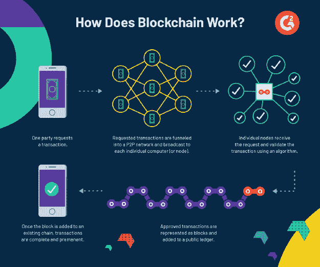
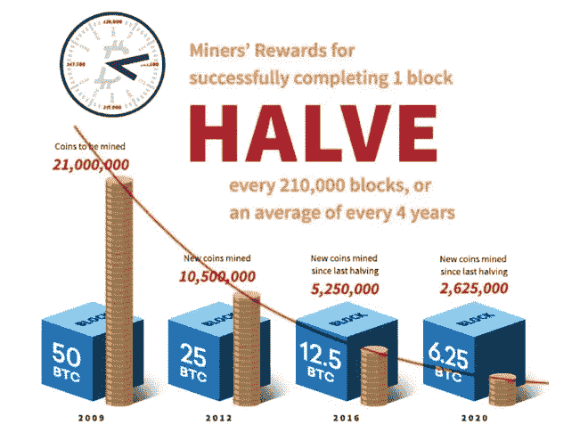
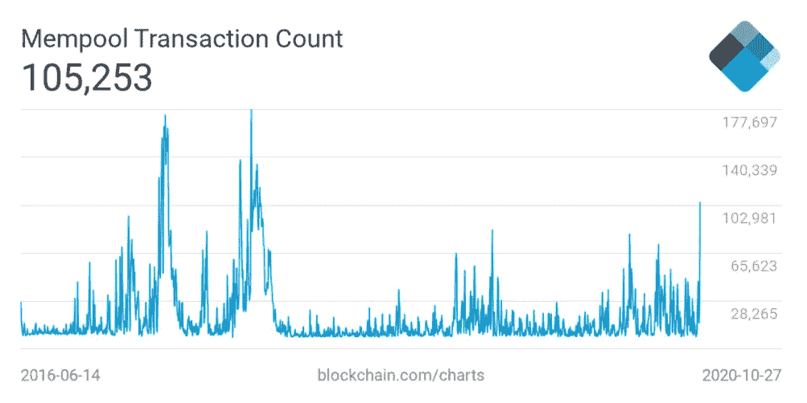
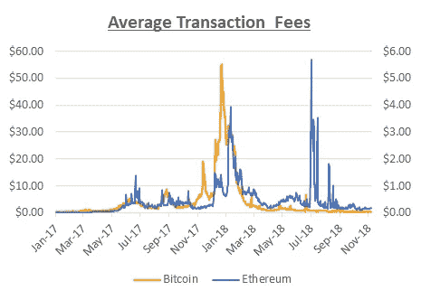

# 比特币交易速度慢，成本高。我们来解释一下原因。

> 原文：<https://medium.com/geekculture/bitcoin-transactions-are-slow-and-costly-lets-explain-why-a3f6f2e326db?source=collection_archive---------2----------------------->

如果网络上的每一笔交易都很慢而且成本很高，比特币真的能取代现金吗？

Photo by [Bermix Studio](https://unsplash.com/@bermixstudio?utm_source=medium&utm_medium=referral) on [Unsplash](https://unsplash.com?utm_source=medium&utm_medium=referral)

# 介绍

比特币最近经常出现在新闻中，原因有很多。虽然许多人不相信比特币热潮除了泡沫之外还有什么，但比特币每天都被越来越多的机构采用，这让许多人怀疑比特币是否可以在法定货币中存在，甚至取代法定货币，成为大规模交易的合法手段。

从表面上看，或者至少在主流新闻中，比特币听起来和看起来都像是交易的未来。因为它是如此新颖和数字化，人们可能会给这个概念贴上高效、快速和低成本的标签。事实上，许多人最初吹捧比特币是一种优越的货币，因为它很低，甚至是零费用的模式。虽然许多其他加密货币可以真正实现快速高效的宣传，但比特币(BTC 而非 BCH)却不行——至少今天不行。

在这篇文章中，我将解释为什么比特币交易会比传统的交易方式花费更长的时间和更多的成本。理解比特币费用和交易时间如何工作的关键是理解整个比特币网络如何以块为单位处理交易。

# 比特币的工作原理

我在本文的[中写了关于比特币开采和交易的环境影响。在文章的一段中，我尽力解释了区块链是如何在一个较高的水平上。对于那些懒得跟随我的文章链接的人，我将在这里复制并粘贴该部分。因为我可以。它节省了我的时间。](/geekculture/bitcoin-mining-is-terrible-for-the-environment-crypto-doesnt-have-to-be-590a40bd2a84)

I even used the same picture from the other article.

区块链是帮助加密货币运行的核心协议，并确保比特币和其他加密货币交易可以被信任，而无需经过任何中央管理机构的验证。去中心化本身就是加密货币相对于传统货币的关键优势之一。

那么，区块链协议是如何确保交易不是欺诈性的呢？比特币网络上的每一笔交易都要经过一个“矿工”网络的验证。简而言之，矿工们使用计算机来破解复杂的数学问题，以验证网络上的交易。但并不是每个验证这些交易的人都能得到回报。只有第一个成功“破解谜题”以验证一个“区块”或一组交易的矿工才能获得奖励。比特币挖矿基本上是一场在网络上处理交易的比赛，你可以通过为这场比赛贡献计算能力来赚取比特币。你的计算能力越强，你赢得这场比赛的机会就越大。

因此，采矿的全部目的就是处理区块，并将它们添加到区块链中，这样你就可以因此获得比特币奖励。如果有人在挖掘比特币，他们本质上是在利用强大的硬件来验证比特币交易，并收取费用。

那么我们能从中得到什么呢？两件事:

# 矿商竞相成为第一个解决和验证下一笔交易的人

在给定时间内可以添加的积木数量受限于解决一个拼图所需的平均时间。解决其中一个谜题的平均时间也被称为“阻塞时间”，平均需要 10 分钟。每个区块的交易量也有限制。无需深入了解这一限制(称为“块大小”)的具体细节，只需知道这两个限制决定了比特币交易的最大速率，约为每秒 7 次交易。从这个数字来看，Visa 允许每秒 2000 笔交易。

# 矿工因验证交易而获得奖励

他们获得奖励的一种方式是街区奖励。通过区块奖励，矿工每正确验证一个区块可获得 12.5 个比特币的奖励。区块奖励从 2009 年开始，每区块 50 个比特币，每 210，000 个区块减半。当可用比特币的数量达到 2100 万时——这是系统设定的上限——就不会再有比特币被创造出来。但这不是矿工获得奖励的唯一方式。

**我来介绍一下:比特币交易费。**

## 比特币交易费

比特币矿工验证交易的另一种激励方式来自于他们验证任何交易所获得的费用。这些费用可以由用户在发送资金时添加到交易中，或者可以由矿工在他们的节点上确认交易时接收。理论上，交易费是发送者附加到每笔交易的自愿费用，以补偿矿工验证他们的交易。因此，从理论上讲，如果你愿意，你可以对你的交易不收取任何费用。虽然如果区块空间超过出价就会出现这种情况，但在实践中，费用已经成为比特币可用性和便利性的重要考虑因素。这有两个原因:

1.  鉴于比特币网络平均每秒仅允许 7 笔交易，对比特币的需求可能会大大超过区块空间。因此，在特定交易中接受何种费用方面，矿商有相当大的自由裁量权。矿商受到激励，将任何费用大于零的交易纳入其中，并优先选择出价最高的区块。网络变得越拥挤，人们就越愿意付费，以激励矿商将他们的交易添加到下一个区块，从而推高交易费的市场价格。
2.  为了维护基础设施和激励矿工继续采矿，必须给予矿工高于成本的补偿。这些成本包括运行采矿硬件的电力成本、带宽成本以及保持有竞争力的散列率的成本。这些交易的外部化成本估计约为 10 亿美元。目前，比特币矿工在很大程度上受到了验证交易的激励，因为大宗奖励的支付金额很大。这笔奖励足以支付开采比特币的成本。然而，一旦所有的比特币都被开采出来，向比特币链添加新区块的唯一动力将来自交易费。因此，仅交易费就必须涵盖这种验证交易的外部化成本。

# 这一切在实践中意味着什么？

## 缓慢的交易

Unconfirmed transactions sit in the Mempool which can spike in times of heavy congestion

鉴于一秒钟内可以处理的交易量相对有限，在某些情况下，网络可能会很快拥塞，例如当货币受欢迎程度飙升，更多投资者开始要求比特币时。在这种时候，比特币交易可能需要长达几天的时间，如果发送者没有附上足够高的交易费，甚至可能永远无法兑现。这是所有交易的情况，无论大小。想象一下，为了给你的朋友寄 20 美元，你得等上好几天。这使得比特币作为法定货币替代品的可行性大大降低，并影响了基于比特币的企业的用户体验。

## 高额费用

在网络足够拥挤的情况下，费用可能会高到使交易变得不经济。为了说明这种情况会变得多么糟糕，我们可以看看 2017 年加密热潮中的交易费有多高。平均比特币交易费用飙升至近 60 美元。截至 2020 年 4 月 15 日，比特币交易费平均为 21 美元，仍比传统支付方式高出一个数量级。

## 高费用波动性

在同一天内，比特币交易费的波动幅度高达 10%，这是很常见的。这使得商家接受比特币作为支付方式非常不可行，并给他们的业务增加了显著的波动性。

# 有什么解决办法？

现在，在我开始列出潜在的“解决方案”和对比特币协议做出的改变之前，我要说的是。有些人认为这些都不是问题。在比特币作为长期价值储存手段的支持者看来，这个问题并不存在。这些支持者将比特币的效用与黄金进行了比较。在这种情况下，比特币不需要辜负快速高效的期望。

然而，许多其他人希望有一天比特币能够取代现金作为交易媒介。需要说明的是，比特币的有用性与交易费用最终对所有用户来说都足够低的预期密不可分。这些用户面临的问题是:比特币(BTC)无法满足这些期望。那么有哪些选择呢？

## 比特币现金

比特币现金(BCH)是比特币的一个硬分支，旨在解决比特币的上述一些问题。本质上是 2017 年创造的比特币的衍生产品。在比特币现金协议中，块大小限制从 1MB 增加到 8MB，这允许每个块处理更多的交易。

## 闪电网络

闪电网络是一种运行在比特币之上的协议。你可以把闪电网络想象成比特币的第二层支付基础设施。它主要是为了解决上面“交易缓慢”和“费用高”一节中讨论的问题。块大小限制的直接结果是，许多事务可以在链外处理，而不必依赖于矿工。然而，一些人认为这违背了区块链的目的，它允许在没有第三方授权的情况下进行分散的、无信任的交易。Lightning Network 本质上充当了第三方权威机构的角色，负责验证和处理链外交易。

## 更快的共识机制

更快、更有效的共识算法，如利害关系证明协议，放弃了对“矿工”的需求。取而代之的是，在每个块的开始选择一个随机的“验证器节点”池来处理和验证事务。这允许更快的交易处理，并且在理论上，更低的交易费用。我又要把我关于它的文章[塞到这里](/geekculture/bitcoin-mining-is-terrible-for-the-environment-crypto-doesnt-have-to-be-590a40bd2a84)。我更深入地了解它是如何工作的，以及它如何能比比特币的工作证明协议更好地保护环境。为 NBA Top Shot 等受欢迎的 DApps 提供支持的区块链 Flow 区块链使用股权证明，每秒可以处理高达 1000 笔交易，预计将升级到每秒 10，000 笔交易。以太坊 2.0 也有望采用该协议。

对于比特币的局限性，还有很多潜在的解决方案，比一篇帖子所能讨论的还要多。然而，这篇文章的目的是让人们注意到这些固有的局限性。许多人高度评价比特币成为未来交易媒介的潜力，但实际上并没有考虑到这些局限性。虽然存在比特币现金等替代解决方案，但这些货币没有得到比特币那样的关注和投资。