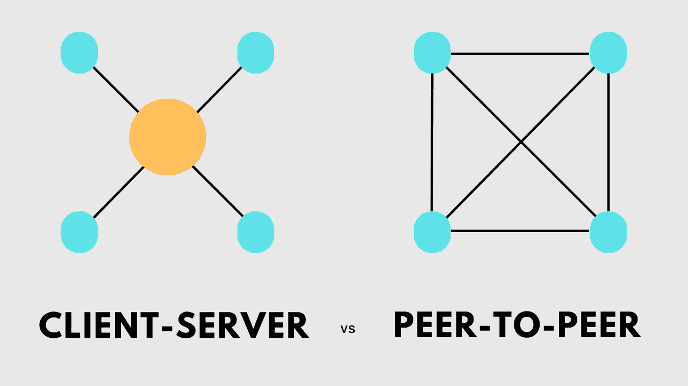
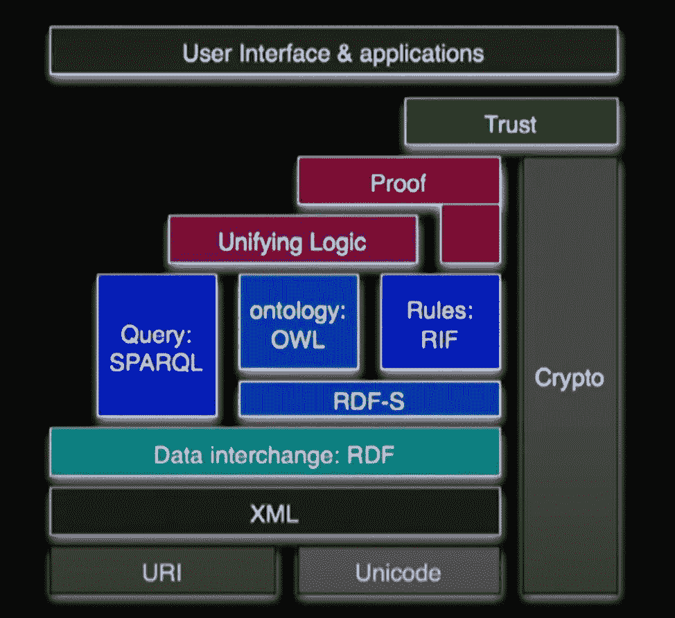

# 区块链基础知识第 1 部分:Web3 &去中心化、技术栈、比特币协议

> 原文：<https://medium.com/geekculture/blockchain-basics-part-1-web3-decentralization-tech-stack-bitcoin-protocol-ebc5df816d15?source=collection_archive---------18----------------------->

在比特币或加密这些术语进入人们的日常词汇之前，NFTs 已经风靡一时。2021 年 2 月，[Nyan Cat](https://en.wikipedia.org/wiki/Nyan_Cat)——一只背后有彩虹的猫的 gif，售价 300 ETH，相当于 58.7 万美元。从那时起，NFTs 就成了一个时髦的词，在加密社区内外都有不断增长的热情。

对许多人来说，将图像作为非功能性图像出售的想法听起来有利可图。然而，投入时间和精力来理解支持加密货币交易、购买 NFT 和为社交媒体或科学的分散平台提供动力的底层区块链技术是至关重要的。

在这个“区块链基础知识”系列中，我的目标是简化外行人心中的概念。这些主题旨在概述不同的作品如何适应这个不断发展的空间。

# Web1 与 Web2 和 Web3 的对比

如果你听说过 NFTs 和区块链，你可能会遇到这个术语——web 3。让我们先来探索这一点。

技术的进步是分阶段和分阶段的——web 3 和区块链齐头并进。有必要了解一点互联网的历史，以理解各种网络版本的含义以及 Web3 承诺提供什么。

网络的最早版本是人们从个人电脑上访问的静态页面。这个阶段通常被称为 Web1。人们可以访问不同的网站，只阅读网页上的内容。这种交流是单向的。

Web2 通过提供与内容互动的方式改变了这一点。人们可以阅读、发表评论、填写表格或通过在线论坛与其他人互动。交流不再是单向的。

在 Web2 中发展的平台和服务本质上是集中式的，这意味着单个公司/机构为您提供了一个平台来消费内容、与之交互、生产内容、使用产品和服务、存储数据，然后处理您直接或间接提供给他们的数据。像政府机构、金融机构和公司这样的实体在本质上很大程度上是集中的。

社交媒体平台也是 Web2 的一个很好的例子。像脸书和推特这样的平台运行在各自独立的用户数据库上。谷歌或亚马逊等公司为全球用户提供独立的免费或付费服务。这些组织还可以访问用户数据，并实施人工智能，以提供个性化的平台体验。这是 Web2we 通过我们的互联网连接访问的高级版本。

Web3 的目标是重新构想产品和服务，而不需要集中的系统或它们的许可。Web3 through 区块链技术旨在通过给予网络用户内在的信任和基础设施共享来支持他们运行区块链，这是一个由安全链接的交易数据块组成的网络。我将在以后的文章中详细介绍这一点。

现在，把区块链支持的 Web3 想象成一个由不同计算机共享的公共数据库，记录网络上的每一笔交易。这里的区别在于，不像 Web 2 的数据库也可以存储图像和视频，区块链目前只登记交易，因此经常被称为分布式账本。虽然存储图像是可能的，但这是一件昂贵的事情。我将在以后的文章中对此做更多的介绍。

区块链致力于一种共识机制，这意味着区块链网络中的任何改变都必须得到其余计算机的批准。这使得区块链状态相同，即数据对于任何用户都是相同的数据。

这个版本的 Web3 目前在许多区块链网络中实现。除了流行的以太坊之外，其他网络如 Hyperledger Fabric、Ripple 等也有特定的目标。

为了更深入地了解网页版本、广告模式的引入、数据隐私和保护等伦理问题以及 Web3 的未来，您可能需要观看 Web3 基金会制作的视频—[web 3 到底是什么？由 Juan Benet 在 Web3 Summit 2018](https://www.youtube.com/watch?v=l44z35vabvA) 发表。

# 分布式与分散式

现在我们已经对 web 版本和我们日常交互的集中式系统有了一个公平的理解，让我们对去中心化有一个更清晰的理解。

虽然许多人很快就会使用加密货币交易或销售 NFT 的应用程序和平台，但也有一些人会研究他们使用的平台的性质。公司可以选择将其数据库的一部分放在不同的物理位置和网络上。它仍然**拥有** it，并拥有对数据库操作的所有控制权。它是分布式设置。

另一方面，一个分散的数据库**将所有权**分配给管理区块链的社区。虽然区块链网络表明它是分散的，但如果所有权属于一个人或一家公司，一些建立在区块链上的应用或服务在本质上可以是集中的。

这是许多加密爱好者在参与加密货币交易和设置适当的加密钱包时忽略的一个关键概念。我将在未来关于分散金融(DeFi)和交易应用的文章中详细介绍这一点。

这里的要点是，这一切都归结为所有权——谁拥有区块链网络？在处理 DeFi 应用程序时，这一点尤为重要。

# 区块链技术栈

现在这一部分会有一点技术性，但坚持住。我保持简单扼要。

区块链的实现方式与我们习惯使用互联网的方式不同。典型的集中式系统使用客户机-服务器体系结构。公司完全或部分拥有基础设施，保存数据，并为通过手机或个人电脑访问数据的用户提供服务。最简单的例子是你在谷歌上查询，结果谷歌会提供给你。数百万人每天都在与谷歌互动。

区块链的工作方式不同于这种模式。链中的所有块可以相互通信，而不是向单个集中式客户端发出多个请求。这使得区块链成为一个对等网络。

Created with Canva.

所以理想情况下，不像与谷歌互动寻找信息或发送邮件，你可以直接与另一个人交流。目前，在区块链网络上，P2P 活动主要是加密货币交换或向人们的钱包发送 NFT。

此外，区块链也是分层的。请参考下图:

Screenshot from “What exactly is Web3” video mentioned above.

上图描绘了一个典型的区块链建筑。它有一个基础层，数据层，网络层，共识层，最后是应用层。它们被描绘成不同的颜色。然而，区块链层被称为第 0 层到第 3 层，每一层负责特定的任务。

[这个 YouTube 视频](https://www.youtube.com/watch?v=qniz6h2fYuc)很好地解释了架构和层。

您还会注意到,“Crypto”是架构中的一个常见组件。“加密”通常作为加密货币的同义词使用。实际上，“crypto”指的是密码学——计算机科学的一个分支，处理加密和解密消息，因此它在双方之间安全地传递。你的 WhatsApp 信息也使用加密技术加密。区块链采用一种基于数学的机制，称为加密哈希，使块安全链接，几乎不可行的黑客攻击。

对于技术读者来说，YouTube 上有一个 Web3 区块链基础 MOOC by Web3 Foundations，你可以观看以获得更深入的理解:[链接](https://www.youtube.com/watch?v=y8YyZELnVaw&list=PLxVihxZC42nF_MCN9PTvZMIifRjx9cZ2J)

# 比特币协议

这是本系列中这一部分的结论部分，理解这一点有助于您深入了解货币和加密货币。

当一个中央集权的机构(在这种情况下像政府)发行货币时，它被称为法定货币。全球范围内各种政府发行的法定货币都被规范化，其价值由汇率决定。但是，需要对各方之间的交易进行合法性验证。

当货币被数字化作为现金交易的替代品时，银行系统遇到了双重花费问题，简单地说就是怀疑同一种数字货币是否被使用了两次。这样，数字货币可能会被滥用，银行系统必须在双方之间进行货币交易之前验证每笔交易。注意到中央金融机构的参与了吗？上面提到的 Web3 区块链基础 MOOC 第 1 集详细解释了双花问题。

比特币协议通过引入交易历史和计算作为货币消除了双重花费问题，并通过使用加密技术增加了系统的可验证性。它改变了用传统的支持资产来兑换货币的想法，用计算来代替它们。

这段视频[——“但是比特币实际上是如何工作的？”到 3Blue1Brown](https://www.youtube.com/watch?v=bBC-nXj3Ng4) 在解释比特币协议方面做得非常好。它很难理解，你可能不得不经常观看，但它为自下而上地理解区块链提供了坚实的基础。

比特币协议催生了加密货币。[以太坊的网站](https://ethereum.org/en/developers/docs/intro-to-ether/)将加密货币定义为一种交易媒介，可以作为支付商品和服务的货币。虽然比特币协议解决了可验证支付的问题，而不需要中央权威机构，但以太坊基于这一想法，并扩展其网络，以纳入更多第三方元素和功能，更像是一个可以用来进一步构建东西的图书馆。

# 最后的想法

区块链技术在许多方面都很有前途，就像任何新兴技术一样，它也在经历优化。不同于容易上手的社交媒体平台，区块链网络或建立在其上的应用令许多人望而生畏。

因此，明智的做法是自己调查事情。你不需要了解区块链的架构，也不需要知道加密货币是如何被创造出来进行交易的，但是，努力观察幕后可以帮助你区分事实和炒作，并避免严重的损失。