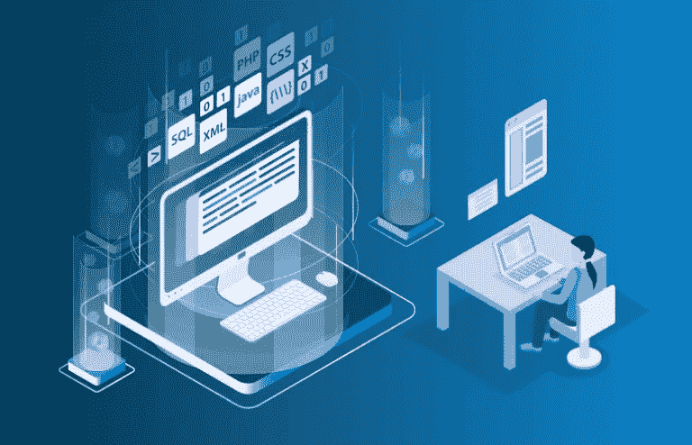
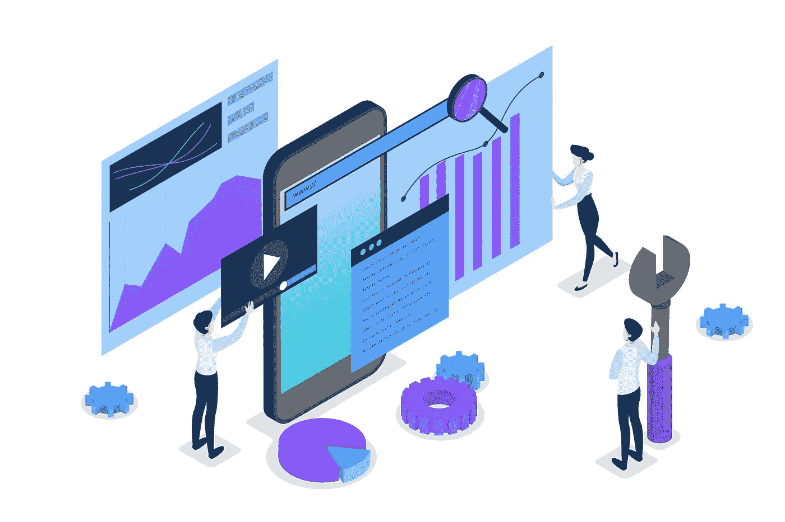

# 区块链工程师 Vs 区块链开发者:他们有什么不同？

> 原文：<https://medium.com/geekculture/blockchain-engineers-vs-blockchain-developers-how-do-they-differ-9ad4f72ac9db?source=collection_archive---------9----------------------->

收入最高的领域之一是区块链技术，这是一种分布式账本，已在许多行业得到应用。自从它为许多创新开辟了道路，各种各样的企业都在不断寻找熟练的区块链员工。如果你也对有前途的职业道路感兴趣，有高薪和晋升空间，区块链是适合你的行业。一个人拿到 [**区块链认证**](https://www.cbcamerica.org/blockchain-certifications/) 后就业前景可以改善。

许多与区块链相关的工作，如区块链架构师、区块链工程师、区块链分析师和区块链开发者，正在快速增长，并为职业成功提供了巨大的潜力，但近年来，焦点尤其集中在两个方面:区块链工程师和区块链开发者。这是业内最知名的两个角色。虽然它们都依赖于区块链基础设施，但它们并不相同。这里我们就来说说两者的关键区别。

# 区块链工程师:教育、工作描述和工作职责

一家公司的区块链工程师，做的是与网络、密码学、数据结构、算法开发相关的任务。他们了解以太坊和比特币等 [**区块链技术**](https://www.cbcamerica.org/blockchain-technologies) ，在创建和实施数字区块链以提供客户特定解决方案方面拥有丰富的知识和经验。他们的职责不仅仅是编写代码。他们必须在关注改进或创建新的开源解决方案之前评估业务需求。

## 教育资格

一个 [**区块链工程师**](https://www.cbcamerica.org/blockchain-certifications/certified-blockchain-engineer) 的最低学历是 CS 或 IT 分支的工程学士学位。一些企业优先考虑硕士学位的申请者。在分布式数据库和单点登录(SSO)安全协议方面有丰富经验的申请者将具有优势。组织可能会向获得区块链认证的员工提供奖金；通过参加区块链委员会的在线培训课程，你也可以成为其中一员。

## 工作说明

区块链工程师是该领域的全能专家，拥有管理区块链网络及其节点以及设计、创建、分析、实施和支持区块链基础设施的技能。他们需要能够处理涉及区块链技术的特定商业模式。

## 工作职责

区块链工程师的职责因企业或组织而异。虽然存在一些细微的差异，但根据行业规范，大多数基本职责是相同的。如果你想成为一名区块链工程师，确保你拥有这里列出的技能。

*   借助区块链技术创造新软件。
*   维护应用程序的服务器端和客户端。
*   验证和修复使用区块链技术的应用程序。
*   调查特定区块链应用所需的高质量资源的可用性。
*   区块链技术的用例分析。
*   完全功能化并集成到区块链环境中，以便可以纳入最新的增强功能。
*   协助项目文档并指导团队改进当前区块链基础设施的解决方案。
*   开发基于区块链的应用程序或系统来解决业务问题的能力。

# 区块链开发者:教育、工作描述和工作职责

区块链开发者是专门为区块链编写代码的计算机程序员。软件和系统开发人员创建并测试新代码。区块链程序员主要有两种类型:

*   核心区块链开发者负责整个网络的协议设计、安全模式开发和管理。
*   区块链软件开发人员通常会创建区块链应用程序，在预先存在的网络上运行。他们负责前端和后端，这意味着他们构建和维护这些功能。

## 教育资格

希望找到区块链开发者工作的有志之士绝对必须拥有高超的编程技能。像 C++、Java 和 Python 这样的多种编程语言的坚实基础是必不可少的。非常需要密码学和相关区块链技术的专业知识，如比特币和以太坊。区块链的开发者应该是分析型思想家。为了与工程师和其他技术人员合作开发高效的解决方案，他们还应该具有很强的沟通技巧。

区块链开发者必须对数学和算法有基础的了解。他们需要熟悉在区块链生态系统中使用的 Mist 和 Geth 等工具。这份简历的需求量很大，大多数公司更喜欢拥有计算机科学或数学学士学位的候选人。

## 工作说明

区块链开发人员应该熟悉区块链的内部工作原理及其基本原理。他们应该在动态编程方面表现出实际能力，并且非常熟悉数据结构、Cryptonomicon 和其他相关主题。此外，他们应该了解网络和分布式系统的基础知识，以及 API 管理、分散式应用程序等方面的知识。

## 工作职责

区块链开发人员的一些工作职责包括:

*   对公司需求的透彻理解，对数据流的调查，以及在贸易伙伴之间建立联系。
*   跟上区块链和其他密码技术的发展。
*   开发可信的区块链基础设施。
*   分布式账本技术(区块链)有许多潜在的应用，对销售人员进行这方面的培训将是有益的。
*   使用加密方法保护数字交易数据免受入侵，如数据黑客和网络攻击。
*   利用计算机语言设计用户界面和程序功能。
*   更新前端和区块链后端。
*   法律和法规遵从性需要理解安全实践。