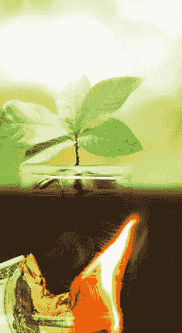

# 区块链是金钱的终结。

> 原文：<https://medium.com/geekculture/blockchain-is-the-end-of-money-85b0ad61876b?source=collection_archive---------34----------------------->

We can now look at what lies beyond money

在看过《卡达诺非洲特辑》后，我做了一个梦，梦见在非洲某地的一辆公共汽车上与另外三个人交谈；大概是这样的:

三个不同的虚构部落的人去一个由白人殖民者控制的市场卖他们的货物，这时他们被一个陌生人打断，说他们受到了殖民者的压力。神秘男子问 Wouha 部落男子他想在市场上买什么，他说 Arubari 奶油，而 Arubari 妇女来卖奶油，买面包和肉。他们最终意识到，在他们三人之间，他们都可以完成交易。该男子接着说:你可以在这个应用程序中跟踪这个，它可以跟踪你带了多少面包和多少阿鲁巴奶油，或者你可以指着第三个安静而怀疑的拿着面包的女人收回。交易所规则的动态由你们所有人控制，你们可以自由扩展系统，允许你们取出有限或无限数量的产品。每个人对该系统的使用或滥用都被跟踪，并且每个使用它的人都可以看到。你可以应用规则来暂时禁止那些不合作的人或者对他们进行限制。

具体来说，你可以使用 NFT 来表示独特的资产，如艺术品，以及我们生产的消费品的其他令牌，并在系统注册的交易总量中应用供求估值，或者更奇怪的是，通过人工智能预测数据来确定每个时间间隔内人均可用的数量。这一切都可以通过直接民主来决定，因为不同部落的成员可以就系统如何运行进行投票，结果可以立即得到验证，并被任何特定的人确认为防篡改。

区块链是一种新的方式来加强信任，并让我们对自己生产、消费和相互分享的资源负责。你也可以在世界的另一个角落想出类似的场景:

想象一下，怀俄明州的一个小镇决定在智能链上跟踪其所有活动。他们使用零知识证明来匿名跟踪每个人的贡献并投票。

公民的贡献通过零知识证明合并，并开始授权他们在社区投票时访问资源。每当小镇需要与外部世界互动时，小镇的账本就会跟踪外部工具，也就是所使用的货币，并通过一些算法对其进行明智的“投资”，使其可用于进一步的外部互动。

然后，该镇根据当前的需求和该镇的规划，保存了一份希望邀请市民参与其“实验”的个人资料列表；它是否在寻找木匠、软件工程师等。该镇当然可以邀请愿意用其外部现金系统支付的游客，这些钱将进入池中，但游客不会获得公民的利益，公民会因游客在他们的商店购物带来的价值而获得信贷。相反，每当一个城镇成员决定离开时，他也可以利用他向国外社区提供的产品和服务，因为所有公民都有一张借记卡，可以与外部世界的价值体系相结合，并支付自己的捐款。

该镇及其公民的福祉和目标都是民主选择的，定期举行关于短期、中期和长期目标的市政厅会议，讨论的主题包括治理本身以及他们希望如何权衡选票，或将他们的选票委托给不同主题的其他成员。

镇上的人们并不真的需要担心他们之间的竞争；即使它的成员拥有 NFL 中最好的足球队…

我坚信区块链最重要的特征是**分布式信任**。这就是*分权和控制*的能力。我听说传统公司中的区块链任务组未能找到实用工具或有用的例子，越来越明显的是，传统公司的结构要求控制和集中在他们的头上，这与这一关键原则和现在通过加密计算可能实现的转型方面根本不兼容。