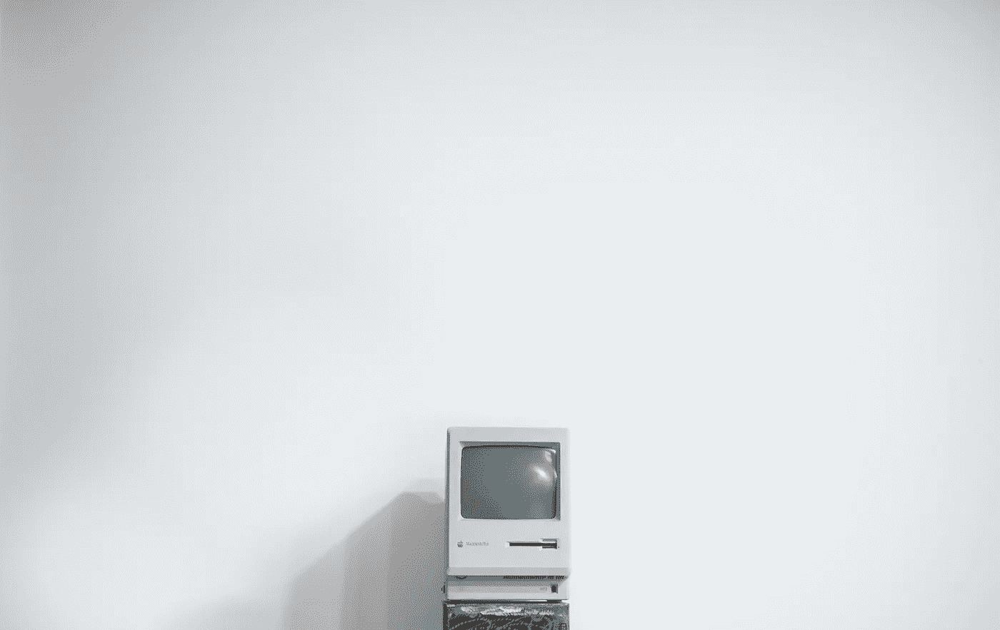

# 完全初学者眼中的区块链技术

> 原文：<https://medium.com/geekculture/blockchain-technology-through-the-eyes-of-a-complete-beginner-e106897b261d?source=collection_archive---------21----------------------->

## 修补 Web 3.0 中的信任鸿沟

Photo by [NASA](https://unsplash.com/@nasa?utm_source=unsplash&utm_medium=referral&utm_content=creditCopyText) on [Unsplash](https://unsplash.com/s/photos/world-network?utm_source=unsplash&utm_medium=referral&utm_content=creditCopyText)

这不会是一个“XX 到 Mooon”的帖子，不要担心。但是为了解释我来自哪里，我想我需要给你一点背景故事。

2017 年，我做了一件我平时像躲避瘟疫一样努力回避的事。

我跳上宣传列车，买下了这个叫做**加密货币的新玩意儿。**

事后看来，你可以称赞我是一个早期采用者。

但老实说，我不知道自己在做什么，几周前也不知道。我所做的只是在几个交易所创建了一个账户，然后购买了一堆基于花哨名字和随机社交媒体帖子的密码。

我是个白痴。

我也在两周内损失了超过 90%的投资。

固执到不承认失败，我没有卖掉它，只是把它留着。在未来的岁月里，这些资产将永远在我的投资组合书架上占据一个特殊的位置。不一定是因为我损失了钱(谢天谢地，我现在恢复了)。我投资了一些我完全不知道如何运作的东西。我完全违背了巴菲特的名言:

> 永远不要投资你不了解的行业。

当朋友们向我寻求投资建议时，我决定做我一直向他们宣扬的事情。我坐下来做了一些彻底的研究。因为在不知道它是如何工作的情况下买入某样东西通常会被认为是一个非常糟糕的主意。

因此，我利用假期的第一周深入研究了区块链的技术。

好家伙，我是在兜风。

# 那么区块链到底是什么？

> 区块链最好被描述为在网络中的许多计算机之间更新和共享的公共数据库。
> 
> “块”指的是数据和状态以连续的批次或< “blocks”. […]
> 
> “Chain” refers to the fact that each block cryptographically references its parent. A block’s data cannot be changed without changing all subsequent blocks, which would require the consensus of the entire network.
> 
> Each new block and the chain as a whole must be agreed upon by every computer in the network. These computers are known as “nodes”. This is so everyone has the same data. To accomplish this distributed agreement, blockchains need a consensus mechanism.
> 
> [以太坊简介](https://ethereum.org/en/developers/docs/intro-to-ethereum/)存储的事实

很好，继续。

Photo by [Federica Galli](https://unsplash.com/@fedechanw?utm_source=unsplash&utm_medium=referral&utm_content=creditCopyText) on [Unsplash](https://unsplash.com/s/photos/computer-vintage?utm_source=unsplash&utm_medium=referral&utm_content=creditCopyText)

# 它解决了什么现实世界的问题？

## 信任鸿沟

正如里奇·埃特瓦鲁在 [TED 演讲](https://www.youtube.com/watch?v=k53LUZxUF50&ab_channel=TEDxTalks)中所说，区块链技术弥补了互联网时代所谓的信任鸿沟。

在骗局和假冒产品的海洋中，我们不得不依赖第三方运营商来验证我们购买的是否实际上是我们得到的。虽然这比去市场和简单地相信所提供产品的真实性更安全，但它仍然为诈骗和欺诈性数据留下了很大的空间。这是因为数据通常存储在一个中心位置，或者至少有一个中心运营商。

如果我给一个朋友寄钱，我必须告诉我的银行把钱寄出去，并且相信一切都会按照我希望的方式执行。尽管这通常是一个经过验证的系统，但它仍然为[人为错误](https://www.bloomberg.com/news/articles/2020-08-15/citi-s-900-million-blunder-raises-stakes-in-revlon-showdown)留有余地。

现在，如果我通过区块链汇款，交易将在(最好的情况下)完全分散的计算机网络中进行验证和分配。

这消除了对第三方的需要，因为网络中的每个人都可以随时检查金额、去向和时间，从而使欺诈或错误几乎不可能发生。

[智能合同](https://www.coindesk.com/making-sense-smart-contracts)，基本上是运行在区块链上的计算机程序，根据编入其中的规则不带任何偏见地处理和执行任何请求。程序代码是不可变的。因此，不再需要像法官或律师这样的第三方实体来确保合同得到如实履行。

## 互联网的民主化

亚马逊、谷歌、脸书等全球企业集团有能力简单地关闭互联网的大部分，这是非常可怕的。

> 一个由提供服务以换取你的个人数据的公司主导的互联网。

这个版本的互联网通常被称为 Web 2.0。

信息存储在中央机构中，很容易被 T4 审查甚至删除。

区块链技术可以通过全球节点网络分发数据来帮助解决这个问题，使一个实体无法单独关闭它(Web 3.0)。

信息不能被审查，网络中的任何人都可以使用它的服务而没有被屏蔽的风险(假设你遵守网络协议的规则)。

网络越大，就越难关闭。

权力属于人民。

## 拆除假新闻

可悲的是,“假新闻”一词成了当今互联网文化中频繁使用的流行语。你可以点击一个按钮传播未经证实的阴谋论，而很少遭受任何现实世界的后果。

在社交媒体的世界里，这种“新闻”将迅速传播，社交网络试图赶上并删除它们，或者在帖子上发出某种警告。到那时，损害通常已经造成了。

另一种方法是简单地只选取一个故事的一部分，然后断章取义地重新分配，以扭曲事实(“替代事实”)。

> 密码术允许你加密数据，证明数据被某人签名，等等。另一方面，区块链允许你证明一个数据没有被公布。
> 
> -维塔利克·布特林

世界上最受欢迎的报纸之一《纽约时报》发起了一个解决这个问题的著名项目。

问题是，将元数据添加到照片中，保存在区块链中，并通过私人网络共享，以验证任何带有该照片的新帖子，是否有助于“打击新闻照片中的错误信息”。

结论是，它帮助用户能够追踪社交媒体源中照片的真实性。照片的来源和拍摄时间等元数据有助于用户对照片的真实性和上下文正确性做出明智的决定。

虽然在将新闻*保存到区块链之前，仍然很难透明地核实它们，但在数据存储到分布式分类账网络之后，就不可能篡改数据了。*

正如 Benjamin Gievis 在一次关于[类似的区块链项目](https://www.ibm.com/blogs/industries/blockchain-protection-fake-news-deep-fakes-safe-press/)的采访中指出的:

> 我们不是来说这是好消息还是假新闻，我们是来说这是真实的消息。它被记录，被追踪，这是它的来源，这是它的价值。这是看待这个故事的一种新方式。

因此，区块链本身不会拯救高质量的新闻，但它会让虚假信息的传播更加困难。

## 隐私的新时代

在 Web 2.0 中，互联网巨头基本上可以以他们认为合适的方式跟踪、使用和出售你的数据(我知道，这比那更复杂)。

在 Web 3.0 环境中，所有进入区块链网络的数据及其账户都是加密的，这使得追踪任何特定用户变得困难或不可能。虽然存储在块中的数据(如加密货币交易)可以被读取，但只要公钥保密，相关账户就是匿名的。这意味着您可以重新控制何时何地保存与您的数字身份相关的数据。

这有一个缺点，但我们稍后会谈到。

Photo by [Zbynek Burival](https://unsplash.com/@zburival?utm_source=unsplash&utm_medium=referral&utm_content=creditCopyText) on [Unsplash](https://unsplash.com/s/photos/oil?utm_source=unsplash&utm_medium=referral&utm_content=creditCopyText)

# 那么，加密货币是从哪里来的呢？

## 价值储存

一些最常见的加密货币已经被作为一种价值储存形式，类似于黄金。

该网络通过分布式和经核实的数据块确保现有市场资本的透明度。额外的硬币不可能[凭空印刷，](https://www.forbes.com/sites/williammeehan/2020/10/21/can-the-federal-reserve-print-money-forever-or-how-continuing-to-print-money-to-support-deficit-spending-may-end-badly-with-chinas-help/?sh=23e81a6c58d4)它们必须被开采或伪造并公开保存在区块链。不同于法定货币，各种方法，如每次交易都焚烧硬币或固定的最大供应量，确保了许多加密货币具有内在的通缩性，随着时间的推移会累计价值。

许多人仍然试图将代码形式的纯数字价值储存与黄金或白银等现实生活中的资产进行对比。他们认为一段代码不可能与现实生活中的对象具有相同的价值。

然而，一件物品的价值，无论是数字的还是“真实的”，都是由社会来衡量的。

黄金之所以成为今天的财富储存天堂，是因为有人在某个时候决定给它定价，而我们的全球社会适应了这种想法。

关于黄金，也有很多关于侵犯人权、奴役和勒索的问题。你可以很容易地熔化从战区等可疑来源开采的黄金，并假装它是合法的。

但对于比特币，你不能，因为每一枚创造出来的硬币都在一个分布式账本中。

## 燃料

在像以太坊、卡尔达诺或波尔卡多特这样的区块链项目中，货币被当作一种燃料来为网络提供动力。

本质上这只是预期用途的副作用。

以太(通常被称为以太坊)从来就不是一种可以用来支付燕麦牛奶的货币。它一直是对那些提供计算能力的人的奖励(或者很快他们的[股份](https://ethereum.org/en/developers/docs/consensus-mechanisms/pos/)极大地减少了它的能源消耗】,通过验证和记录数据块到链中来保持网络运行。

以太坊基本上是一个巨大的、分散的计算机，它将所有的状态转换保存到一个区块链中。

从逻辑上讲，由于供求关系的变化，网络使用得越多，潜在的加密货币就越值钱。

## 安全性

货币代币被用作保持网络安全和诚实的激励，因为持有网络的相应加密货币代币的任何人都会因为通过恶意攻击或实施欺诈性数据块破坏其真实性而损失大量金钱。

所谓的 [51%攻击](https://academy.binance.com/de/articles/what-is-a-51-percent-attack)，其中实体通过控制超过 51%的所有节点来获得对区块链的控制，这对于更大的网络来说几乎是不可能的，因为这将伴随着大量的投资进入采矿或赌注(这反过来又会激励节点尽可能保持网络的健全和安全，否则会损失大量金钱)。

攻击区块链网络的方式还有很多，但网络越成熟，更新协议越多，就越难找到漏洞。

所有这些真的改变了我对加密货币的看法。

在一个支持使用智能合约、不可替代令牌([NFT](https://www.coindesk.com/what-are-nfts)等等)的网络中，本地令牌被用来为其提供支持。

因此，尽管许多人认为加密货币不能与股票相比，但经济学非常相似。

持有代币，至少当你使用代币来帮助创建新的数据块时，意味着你确实在 [PoS 网络](https://www.kraken.com/features/staking-coins)中拥有股份。一个主要的区别是，不是一个董事会或首席执行官决定如何开发产品，而是整个网络的共识。

对于很多人(包括过去的我)来说，这些货币被视为一种资产投资形式，可以赚大钱并进行投机。

但从长远来看，货币本身不会通过猖獗的投机来决定它们的价值，而是由包罗万象的区块链网络提供的服务的应用来决定。

一种货币的价值将由使用它的网络的普遍接受程度来决定。网络为现实世界应用提供的价值越大，其本地加密货币令牌的价值就越大。