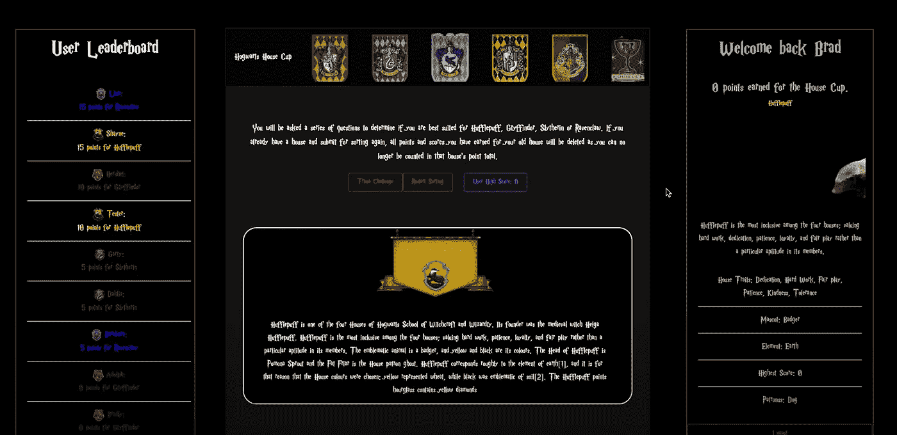

# 打破霍格沃茨考试的魔法:Javascript 和 Rails

> 原文：<https://medium.com/geekculture/breaking-down-the-magic-of-a-hogwarts-quiz-javascript-and-rails-bfe521f2b856?source=collection_archive---------26----------------------->

每年，我和我的朋友们都会举办哈利波特主题的万圣节派对。在这个聚会上，我们都要参加一个学院测试，并被分到霍格沃茨四所学院中的一所:格兰芬多、斯莱特林、拉文克劳和赫奇帕奇。然后，我们通宵玩棋盘游戏。每一个游戏都允许众议院成员有机会为他们的房子得分，在晚上结束时，四个房子中的一个将房子杯带回家。老实说，竞争变得相当激烈，当我头脑风暴一个 Javascript 应用程序的想法时，我想:“嘿，你为什么不做一些你和你的朋友实际上可以使用的东西？”在 COVID 期间，我们不能聚在一起参加任何哈利波特派对，因为我们都意识到了安全，所以我想我可以复制整理房子和玩游戏以在线为房子得分的魔法。于是，霍格沃茨分拣杯 App 诞生了。



# 构建测验

该应用程序最重要的组成部分是测验类，所以这是我在这篇文章中主要讨论的内容。理解测验类是这个小程序如何工作的关键。首先，有两个按钮附加到 DOM 中，它们具有事件侦听器，用于创建测验类的实例。

```
renderQuiz(quizid){  
      api.getQuiz(quizid).then(function(quiz){new Quiz(quiz)})
      }
```

使用我们在 index.js 中定义的 APIAdapter 类的实例作为 const 向 API 发出 fetch 请求，允许我们访问由序列化程序呈现的 JSON 数据，并使用该数据创建我们的测验类的实例。测验实例是用构造函数创建的，在构造函数中调用`this.pickTenQuestions(quiz)`。因为使用了它，使得函数的上下文成为它所引用的测验类的实例，而不是全局变量，所以在函数内部，测验类实例的变量是可访问的。

```
pickTenQuestions = (quiz) => { this.selectedQuestions = [] for (let i = 0; i < 10; i++) { let removedItem = quiz.questions.splice(this.getRandomIndex(quiz.questions), 1); this.selectedQuestions.push(removedItem[0]) } }
```

此方法的目的是将测验元素传递到测验构造函数中，然后传递到函数中，并选择将在此测验中显示的十个问题。在种子数据中，我为哈利波特琐事准备了大约 30 个问题，为分院帽准备了 20 个问题，但为了让用户猜测，我想尝试随机选择每次会显示哪些问题，这样就不会一遍又一遍地进行相同的测验。这就是为什么我想选择十个问题，并使它们成为测验实例的一个属性，这样我就可以在测验类的这个实例的显示和结果中只使用其中的十个。最初，当我尝试使用这个方法时

```
let selected = quiz.questions[Math.floor(Math.random() * quiz.questions.length)];
```

生成随机测验项目并将其添加到 selectedQuestions 数组中。我遇到了一些问题，因为通过使用这种随机化方法，有可能两次选择相同的元素，这在我的测验中不会起作用，因为当我用相同的问题创建一个 Question 类的实例时，这两个实例在 id 和其他属性上是相同的，这导致了我的单选按钮的许多问题。解决方案是，每当我选择一个元素时，从数组中移除随机元素，这样我就不会得到两次，因此使用了 splice。

在检索了我的 10 个问题之后，createQuestions 方法是下一站，在该方法中，我为我选择的每个问题创建了 Question 类的实例，并将它们附加到幻灯片上，这样我就可以一次显示一张幻灯片，而不是一次显示许多幻灯片的测验。

```
createQuestions = () => {
  console.log(this.selectedQuestions)

    this.selectedQuestions.forEach((currentQuestion) => {
        const question1 = new Question(currentQuestion)
       this.slides.push(question1.slide)
       this.questions.push(question1)
       this.quizElement.appendChild(question1.slide)
    })
}`
```

我创建了具有 createButtons 功能的按钮，具有点击时显示上一张幻灯片功能的 previous 按钮，具有点击时显示下一张幻灯片功能的 next 按钮，以及调用我的 resultQuiz 功能的 submit 按钮。

`resultQuiz = () => { this.submitBtn.disabled = true if (this.id === 1){ this.renderResults() } else if (this.id === 2){ this.renderHouseResults() } }`

resultQuiz 功能的独特之处在于，它首先禁用 submitBtn，因此它不能被持续按下，并且用户不能在不重新开始测验的情况下更改他们的答案。然后，它根据测验的 id 将提交定向到两个函数之一。小测验的 ID 为 1，它的评分不同于室内测验，评分的依据是“你是否得到了正确答案？”另一个按钮指向更复杂的评分系统，并为变量分配分数:

```
 this.gryffindorCount = 0
this.slytherinCount = 0 this.hufflepuffCount = 0; this.ravenclawCount = 0;
```

然后会有一个函数决定你选择了多少个与每栋房子有关的答案，计算出总分数，只要你有最多的房子分数，现在就是你分配的房子。

```
calculateHouseResults = () =>{
 let largestNumber = Math.max(this.gryffindorCount, this.slytherinCount, this.hufflepuffCount, this.ravenclawCount)
  let house = []
  console.log(largestNumber)
  if (this.gryffindorCount === largestNumber){ house.push("Gryffindor")}
  if (this.slytherinCount === largestNumber){ house.push("Slytherin")}
  if (this.ravenclawCount === largestNumber){ house.push("Ravenclaw")}
  if (this.hufflepuffCount === largestNumber){ house.push("Hufflepuff")}
  if (house.length === 1){
    return house[0]
  }
  else {
    return house[Math.floor(Math.random()*house.length)]
  }
  }
```

因为查找房屋测试的结果并不像“你是否得到了正确的答案”那样简单明了，所以有可能平手，并且有多个房屋具有相同的点值。假设你在拉文克劳拿了 5 分，在斯莱特林拿了 5 分。你是哪家的？这个函数知道你不能两者兼而有之，所以如果你的数组 house[]中有两个或更多的房子，它会收集你得分最多的房子的名字，它会随机选择一个——一个真正的分院帽！它使用`house[Math.floor(Math.random()*house.length)]`来实现这一点。

为小测验渲染结果的工作原理是，它只计算你答对了多少个问题—但与 renderHouseResults 函数不同，Render results 函数将创建 Score 类的一个新实例。这是因为尽管 renderHouseResults 将发送一个补丁请求并更改用户的房子，但该函数需要创建一个分数并将其附加到数据库中，以便它可以在排行榜中引用并计算房子杯的房子点数。

来自渲染结果:

```
api.postScore(this.numberCorrect, game.user.id).then(function(scoreObject){
      api.getUser(game.user.id).then(function(userObject){
        let userUpdated = new User(userObject)
        game.setUser(userUpdated)
        LoginDisplay.resetForm()
        LoginDisplay.login(game.user)
        LeaderboardDisplay.createLDisplay()
```

如果保存在游戏实例中的用户不是未排序的(在 index.js 中初始化的游戏类的实例和分配给该实例的用户是我们始终跟踪当前用户的方式)，那么我们将向 API 发送一个请求来创建一个分数。我们只需要提供带有 number_correct 和 user_id 的分数，而不是保存在分数中的 house_points，因为计算实际上是在后端完成的。在 Score 模型中，有一个实例方法将根据 number_correct 计算 house_points 值并将其分配给实例。

```
def check_score_for_house_points
    if self.number_correct == 10 
      self.house_points += 10
    elsif self.number_correct > 8 && self.number_correct < 10
      self.house_points += 5
    else
      self.house_points += 0
    end
  end
```

在我们发布了我们的分数之后，我们想要引用的用户对象发生了变化，因为根据 has_many Scores 关系，它有了一个新的分数。为此，我们发送一个 fetch 调用来获取更新后的用户，并将用户的游戏实例属性设置为新用户。然后，我们使用一个静态函数重置 LoginDisplay，然后使用另一个静态函数登录，将用户传递给该函数。我们还创建了另一个排行榜，因为如果分数更新了，排行榜也会更新。

在我们完成房屋分类测验后，如果我们有一个用户登录，现在可以为该用户分配新的房屋，我们将执行类似的工作流:

这在 renderHouseResults 中调用:

```
addHouseToUser = (user, house) => {
      game.user.removeScores()

      api.patchUserHouse(user, house)
      .then(function(userObject){
       let userUpdated = new User(userObject)
        game.setUser(userUpdated)
        LoginDisplay.resetForm()
        LoginDisplay.login(game.user)
        LeaderboardDisplay.createLDisplay()
       let results = document.getElementById('results')
        results.innerHTML = `${userObject.house.name} is your new House! ${userObject.house.house_information}`;
    })
    }
```

首先，我们通过调用一个向我们的 API 发送“删除”请求的方法来删除用户已经拥有的分数。我们这样做是因为如果我们的用户要换房子，他们不应该因为一所房子而获得一些积分，因为另一所房子而获得一些积分。你一次只能为一个学院赢得分数，否则如果一个用户被列为格兰芬多 5 分和斯莱特林 5 分，排行榜会变得非常混乱。然后，我们发送一个“修补”请求来修补我们的用户，并更改用户关联的房屋。然后，与 renderResults 一样，我们将更新后的用户设置为我们的游戏，重置登录显示和排行榜。

# 结论

总的来说，这个应用程序建立在核心测验类的基础上，它通过两个测验为用户提供更新 DOM 的功能。这可能不是与你的朋友们一起玩棋盘游戏的体验，以赚取你的哈利波特房子的积分，但这是我们目前最接近的体验，我希望这个应用程序能给你带来一些乐趣，就像它给我的朋友们带来的一样！感谢你的阅读，我希望你们中的一些人可以用它来玩一些霍格沃茨的游戏，完整的代码请看[库](https://github.com/hopegipson/House_Cup)。如果你们中的任何人对完整教程感兴趣或者有任何其他要求/建议，请留下评论或者通过我的链接树联系我！

# 演示

一个神奇的霍格沃茨问答游戏！