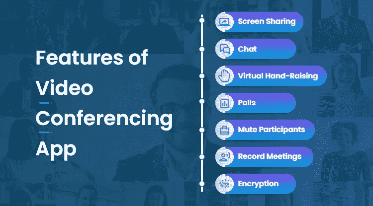

# 构建您的视频会议应用程序——逐步指南

> 原文：<https://medium.com/geekculture/build-your-video-conferencing-app-a-step-by-step-guide-6cfddeb84f51?source=collection_archive---------9----------------------->

Build a Video Conferencing App

疫情改善了远程工作环境，这反过来又使 Zoom 等视频会议应用程序变得非常流行、有效和成功。

各种类型和规模的企业家和企业都在适应[视频聊天应用，](https://www.mirrorfly.com/build-video-chat-app.php)因为他们认为这是一个加强沟通和节省基础设施的机会。尽管如此，从头开始构建一个视频会议应用程序可能具有挑战性。

***因此，在这篇文章中，我们引导开发者；***

→如何搭建视频会议 app？
→包括哪些功能？
→开发一个视频会议 app 有哪些步骤？
→适应什么样的后端技术和云原生基础设施？

然而，在我们进入技术问题之前，让我们先了解一下视频会议应用程序是如何工作的？

[**视频会议**](https://www.mirrorfly.com/video-conferencing-api.php) 是来自不同地点的两个或更多参与者虚拟地聚在一起开会。他们使用计算机、互联网连接、音频和视频进行连接。视频会议可用于会议、网络研讨会、演示、采访等。

视频会议系统在对视频图像和音频声音进行数字压缩后捕获并传输它们。互联网连接允许数据从一个参与者传输到另一个参与者的视频会议系统。在传输过程中，数据被解压缩，并以视频和音频的形式转换回模拟数据。

# **市场上最好的视频会议应用程序提供的一些功能**

**1。屏幕共享** 屏幕共享是一项创新功能，允许与会者在会议期间与其他与会者即时共享他们的计算机屏幕。引导会议变得更容易，因此，它通常被与会者用于演示目的。

**2。聊天** 聊天是视频会议应用提供的另一个重要功能。视频会议应用中的聊天为更好的沟通铺平了道路。在有大量参与者的会议中，参与者可以交换消息并创建个人对话或提出问题。

**3。虚拟举手** [视频会议应用](https://www.mirrorfly.com/blog/best-video-conferencing-app/)中的虚拟举手功能允许参与者、小组成员和主持人指明会议的主持人或主持人。在一些群组视频会议应用中，如果单个参与者使用虚拟举手功能，所有用户都会收到通知。

**4。投票** 作为会议主持人或主持人，可以为与会者创建投票，然后他们可以相应地投票。会议结束时，主持人会自动通过电子邮件收到一份投票结果报告。该功能在 Zoom 和 Google Meet 中被广泛使用。

**5。使参与者静音** 顾名思义，该功能使参与者静音后仍能参加会议。主要用于群组会议应用程序，静音参与者是一项有助于降低背景声音的功能。

**6。记录会议** 视频通讯 app 中一个很重要的功能就是记录会议。通过视频录制功能，主持人可以录制会议并保存会议供以后参考。它还可以帮助用户与错过聊天或想要回顾对话要点的参与者共享录音。

**7。加密** 最后但并非最不重要的一点是，为了构建视频会议应用程序，开发人员必须确保 128 位加密，因为这是一种[安全措施，使视频会议系统](https://blog.mirrorfly.com/secure-video-conferencing/)能够使用 128 位密钥来加密和解密系统之间的所有视频通话。

# **如何开发视频会议的 app？**

对于开发团队来说，开发一个像 Zoom 这样的视频会议应用程序是极具挑战性和高度紧张的。开发人员需要遵循许多参数才能使应用程序正常运行。然而，下面列出了开发视频会议应用程序的三个最基本的参数。

**后端开发** 开发者负责处理应用的后端，因为它是核心。后端开发人员确实需要适应并有经验，因为从头开始构建服务器总是比使用现成的技术更好。

视频会议应用程序的 UI(用户界面)必须由开发人员以这样一种方式构建，即它能够吸引用户并为所提供的服务创造积极的第一印象。

**iOS 和 Android 的兼容性** Android 和 iOS 的视频会议应用增加了覆盖面和目标市场。支持 iOS 和 android 设备这两个平台很容易，因为开发人员可以使用 Swift 创建 iOS 应用程序，使用 [WebRTC](https://www.mirrorfly.com/learn/what-is-webrtc.php) 创建 Android 视频会议应用程序。

# **云视频会议技术**

Cloud Video Conferencing

云视频会议是一种基于云的数字解决方案，为用户提供高清质量的实时视频会议，与任何连接到互联网的人进行视频会议。Zoom 视频会议应用程序也使用了与数据中心相同的云视频会议技术，通过私人连接相互连接。这些由云计算系统维护、监控和优化。它提供全球连接。由于云视频会议技术，Zoom 在全球拥有 15 个以上的共址数据中心。

# **视频架构**

开发人员需要确保在[开发视频会议应用](https://www.apptha.com/blog/build-a-video-conference-app/)时，他们必须优化处理视频的苛刻要求。

以下是后端技术和云原生基础架构的四大区别:

**分布式架构:**
Zoom 的数据中心遍布全球。这种分布式网络架构降低了延迟，无论与会者身在何处，都能在每次会议中获得高清质量的视频体验。

**多媒体路由:** Zoom 提供的多媒体路由负责主持会议和网络研讨会。这些服务器确保形成的语音、视频和内容在给定会话中的所有参与者之间适当地分发。

**多比特率编码:** 多比特率编码确保在视频会议期间每个流可以调整到多种分辨率。这忽略了为每个端点编码和解码流的需要，增强了性能和可伸缩性。

**应用层服务质量:** 确保服务质量，优化每个设备、每个带宽的视频、音频、屏幕共享体验是关键。所有这些都为我们提供了超越竞争对手的优势，并带来了最佳的用户体验。

**结论:** 视频会议应用极大地改变了我们在个人和职业层面的沟通方式。不仅仅是 Zoom，Google Meet、微软团队和市场上的其他几家领先公司都成功展示了如何构建视频会议应用程序。

因此，如果开发人员正在考虑构建一个视频会议应用程序，他们必须努力开发相同甚至更好版本的 Zoom。作为开发者的你是时候开始了！！！