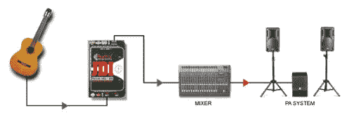
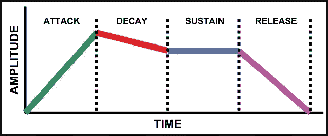

# 用 JavaScript 和 Web 音频 API 构建模块化 Synth

> 原文：<https://medium.com/geekculture/building-a-modular-synth-with-web-audio-api-and-javascript-d38ccdeca9ea?source=collection_archive---------1----------------------->

在过去的十年里，录音室录音技术的进步不可否认地改变了音乐行业的格局，允许制作人在更小的工作空间创作和发布音乐，工作流程接近思维的速度。

这种新文化的一个我最喜欢的副作用是这些生产技术是如何进入 web 开发世界的。一个主要的例子是现在内置在浏览器中的标准功能:Web Audio API 将音乐制作工具带到您的指尖，允许您只需普通的 JavaScript 就可以构建合成器和效果模拟器。更令人兴奋的是，Web Audio API 可以与其他包和工具一起使用，在 Web 上创建新的集成体验。

如果您曾经在音乐制作领域和/或编码和开发领域工作过，那么这篇文章就是为您准备的。我想当我发现这个神奇的工具所提供的一切时，你会和我一样兴奋。

**模块化合成器**是一种乐器，通常不用键盘或其他控制器来演奏，而是使用软件或硬件声音发生器和调制器通过参数和设置来创作音乐。制片人会用连接线将几个**模块**连接在一起，创造出前所未有的独特信号流和声音。


Photo by [Adi Goldstein](https://unsplash.com/@adigold1?utm_source=medium&utm_medium=referral) on [Unsplash](https://unsplash.com?utm_source=medium&utm_medium=referral)

Web Audio API 提供的工具模拟了这些模块中使用的技术，所以一旦我们奠定了基本的代码框架，我们就可以开始以同样的方式进行实验。我将向您展示如何开始，我们将在这里一起构建一个简单的模块化 synth。

## 1.让我们从基础开始

我坐下来，脑子里有一个 JavaScript 项目的想法，并且有一个主要的障碍要跨越:构建一个采样器，我可以将我自己的音频样本加载到其中，使它们可以用计算机键盘播放，并有一些基本的过滤器和延迟可以摆弄。

Web Audio API 出现在我的搜索中，最初看起来数量惊人的代码，我意识到实际上是由真实世界音频设备的信号流构成的。

我们从在 JS 文件中创建一个**音频上下文**开始。如果你熟悉 JS 中的**画布**的概念，音频环境就像是我们将要在其上构建音景的画布。每页通常只有一个音频上下文。我们可以从这段代码开始，这段代码允许它在所有浏览器上工作:

```
var AudioContext = window.AudioContext ||
  window.webkitAudioContext;const context = new AudioContext;
```

就像一个真实的音频系统一样，我们可以使用我们的`AudioContext`对象来创建一个声源。这可以是:

a)现场输入，如电脑麦克风

b)音频文件或样本

c)振荡器或软件声音发生器

就像任何其他音频信号链一样，该源音频经过一些效果或调制，最终连接到音频输出或目的设备。这就像音频最终到达一些扬声器:



让我们用主音量控制为模块化合成器构建基本框架:

```
const masterVolume = context.createGain();
masterVolume.connect(context.destination);
```

和作为声源的振荡器:

```
const oscillator = context.createOscillator();
oscillator.frequency.setValueAtTime(220, 0);
oscillator.connect(masterVolume);
```

我们使用`connect()`关键字在模块之间建立连接，就像将一个音频设备的输出连接到另一个音频设备的输入一样。在这个例子中，我们将振荡器的`frequency`属性设置为 220Hz，时间索引为 0(或者一旦调用`play()`方法)。看看振荡器节点的[文档](https://developer.mozilla.org/en-US/docs/Web/API/OscillatorNode)，看看它的所有功能。在以下示例中，我设置了一个简单的振荡器，带有一个开和关按钮，以及一些开关来选择要生成的基本波形:

好吧！我们有一些按钮来选择我们的波形(声音合成中的一个基本原理)，那个波形是由一个按钮触发的，我们正在通过浏览器输出声音！我们有了一个良好的开端！

## 2.添加信封

不是你寄信的那种。“什么是信？”你问？不要担心那个。在 music synth 中，包络是一种振幅效果，通常由 4 个值组成:(A)开始时间，(D)结束时间，(S)保持电平，以及(R)释放时间，或 ADSR。这些值通常适用于声音的振幅或响度随时间的变化。



起音是声音上升到最大音量所需的时间，衰减是声音达到延音水平所需的时间，延音持续一段时间，直到释放，这是声音逐渐消失到 0 所需的时间。对于 midi 键盘，我们通常通过按住一个键来控制衰减和延音时间，但大多数模块化合成器都有手动调整这些值的时间的方法。网络音频 API 没有内置的包络，但是我们可以使用增益节点来模拟效果。让我们用一个简单的包络构建一个单振荡器，它具有可调的起音和释音。为此，我们需要网络音频 API 工具箱中的一些工具:

`context.currentTime`让我们能够利用我们所处环境的精确时钟。这为我们的事件提供了更多的精确性，并允许我们在一个具体的时间线上触发几个事件。

`linearRampToValueAtTime()`的工作方式与`setValueAtTime()`类似，让我们随时间改变一个值。

让我们创建一个增益节点和振荡器，这样我们就可以独立控制我们弹奏的每个音符:

在这个例子中，我使用`stop()`方法将我们的音符长度设置为 1 秒，并设置滑块从 0 到 0.5 秒调整起奏和释放。这是一个简单的例子，说明如何在音频环境中播放的任何声源上实现包络滤波器。我们已经接近创建一个基本的模块化仪器的框架。

## 3.添加 LFO

LFO 或**低频振荡器**是音乐合成的另一个支柱。振荡器是简单的波形发生器，当一个物体(如扬声器的锥体)每秒振动 20 次至 20，000 次(20Hz 至 20kHz)时，我们的耳朵会将振动作为声音接收。例如，14kHz 的波会非常高(或者超出一些人的听觉范围)，而 80Hz 的波会被听到为低音。考虑到这一点，振荡器只是每秒钟产生许多数据，这些数据可以由扬声器**或**再现，用于不断更新另一个参数的值。例如，如果我们将振荡器的频率设置为 10Hz，我们将得到每秒 10 次在 2 个值之间移动的输出。这可以用来调整另一个振荡器的频率，或者一个增益节点的增益值…或者其他任何东西，如果我们想做实验的话。但是现在，让我们在代码中设置一些简单的东西。我们将使用 LFO(它只是一个振荡器)来调制另一个振荡器的频率，后者产生一个音调。这是一种音乐家称之为**颤音**的效果，音调的细微变化增加了音调的丰富性。

如你所见，我们简单地创建了一个振荡器，称为`lfo`，并将其输出设置为增益节点，增益节点设置为音符振荡器的频率输入。通过使用增益节点调整 LFO 的振幅，使用振荡器自身的频率属性调整振荡器的频率，我们现在可以控制声音的**颤音**效果。结果就像小提琴手在演奏时移动他们的左手腕，增加了音色的丰富性和表现力。

## 4.将这一切结合在一起

有了对我们想要构建到模块化 synth 中的效果的基本理解之后，让我们把我们到目前为止编写的所有代码结合起来！我想添加的最后一件事是一个步长音序器，它有 8 个步长，可以按顺序播放 8 个选定的音符并循环播放。我们将能够调整音符的起音、释音和颤音，以及音符播放的顺序。我还将添加一个简单的延迟，内置于网络音频 API 中。这将为我们的声音添加“重复”效果。

在不深入研究音乐理论的情况下，我将首先声明一组频率，这些频率将与一个八度分成 12 个半音的频率一致。然后，我们可以使用 html 选择对笔记进行排序，并使用几个按钮来开始和停止我们的序列:

这仅仅是网络音频 API 能力的冰山一角。使用映射的 HTML 工具，我们已经能够通过实验设置来创建一些有趣的声音纹理。这种类型的抽象是模块化综合的核心，在 JavaScript 中提供这些工具使得可能性无穷无尽。

请查看这些附加资源，了解更多信息！

[](https://developer.mozilla.org/en-US/docs/Web/API/Web_Audio_API) [## 网络音频 API

### Web Audio API 为控制 Web 上的音频提供了一个强大而通用的系统，允许开发人员…

developer.mozilla.org](https://developer.mozilla.org/en-US/docs/Web/API/Web_Audio_API) [](https://developer.mozilla.org/en-US/docs/Web/API/Web_Audio_API/Advanced_techniques) [## 高级技术:创建和排序音频

### 在本教程中，我们将涵盖声音创作和修改，以及时间和调度。我们要去…

developer.mozilla.org](https://developer.mozilla.org/en-US/docs/Web/API/Web_Audio_API/Advanced_techniques)