# 在 Angular-1 中构建食谱应用程序

> 原文：<https://medium.com/geekculture/building-a-recipe-book-app-in-angular-1-399be8991d85?source=collection_archive---------9----------------------->


Photo by [Sebastian Bednarek](https://unsplash.com/@abeso?utm_source=unsplash&utm_medium=referral&utm_content=creditCopyText) on [Unsplash](https://unsplash.com/s/photos/desktop-computer?utm_source=unsplash&utm_medium=referral&utm_content=creditCopyText)

我们将使用之前学到的角度概念来构建一个食谱应用程序。这个应用程序将建立在多个职位，所以继续寻找其他职位。

现在，转到你电脑中的任意文件夹，在终端中输入下面的命令来创建 Angular 项目。

```
ng new recipe-book --no-strict
```

它会问我们一堆问题。下面我们来回答一下。


recipe-book

接下来，我们将通过给出下面的命令在我们的项目中添加 bootstrap(版本 3)。

```
npm i bootstrap@3
```

接下来，我们需要在 **angular.json** 文件中为 bootstrap 添加样式。

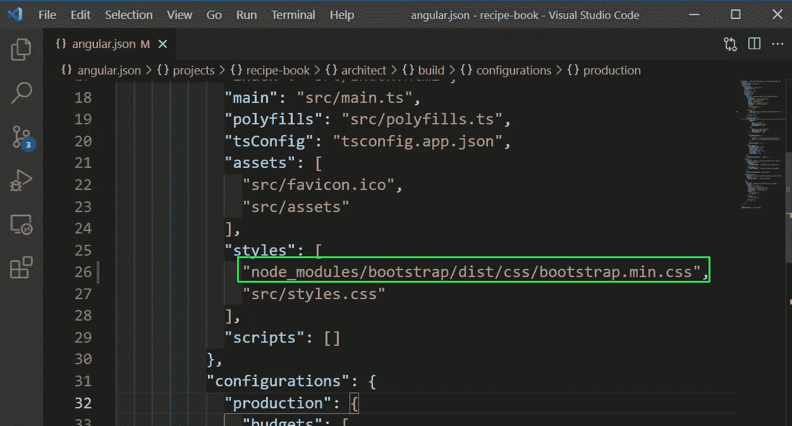

angular.json

现在，确保 **ng 发球**正在运行。使用下面的命令在 src- > app 文件夹中创建一个 header 组件。

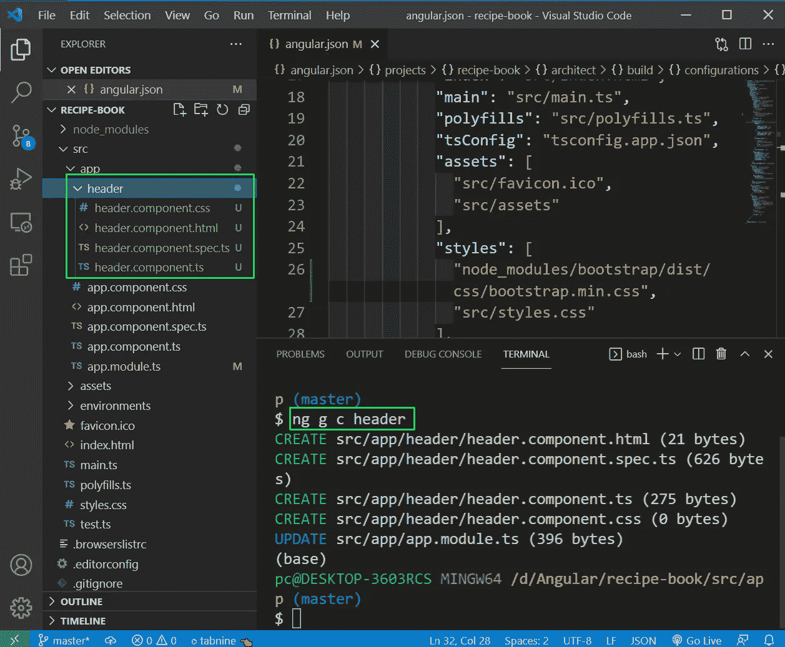

ng g c header

现在，转到 app.component.html 的**文件，删除所有内容，添加下面的代码。**

```
<app-header></app-header>
<div class="container">
  <div class="row">
    <div class="col-md-12">
      <p>App component</p>
    </div>
  </div>
</div>
```

现在，让我们通过给出下面的命令来创建完整的结构。

```
ng g c recipes
ng g c recipes/recipe-detail
ng g c recipes/recipe-list
ng g c recipes/recipe-list/recipe-item
ng g c shopping-list
ng g c shopping-list/shopping-edit
```

接下来，我们将得到项目的基本结构。首先在**中添加下面的 app.component.html**文件。

```
<app-header></app-header>
<div class="container">
  <div class="row">
    <div class="col-md-12">
      <app-recipes></app-recipes>
      <app-shopping-list></app-shopping-list>
    </div>
  </div>
</div>
```

接下来，在 recipes.component.html 的**文件中添加下面的**。

```
<div class="row">
    <div class="col-md-5">
        <app-recipe-list></app-recipe-list>
    </div>
    <div class="col-md-7">
        <app-recipe-detail></app-recipe-detail>
    </div>
</div>
```

现在，在**recipie-list.component.html**中添加以下内容。

```
<app-recipe-item></app-recipe-item>
```

最后在**shopping-list.component.html**中添加以下内容。

```
<div class="row">
    <div class="col-xs-10">
        <app-shopping-edit></app-shopping-edit>
        <hr>
        <p>The List</p>
    </div>
</div>
```

现在，我们带有引导风格的基本应用程序如下所示。

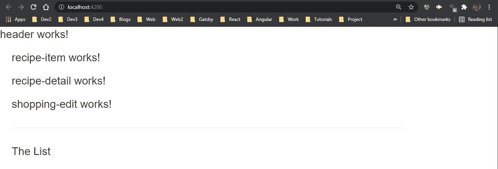

bootstrap

现在，首先，我们将工作的标题，使它看起来很好。在**header.component.html**文件中添加以下内容。它基本上取自 bootstrap，是一个 navbar 代码。


header.component.html

现在，我们将在 localhost 中看到这个漂亮的头。

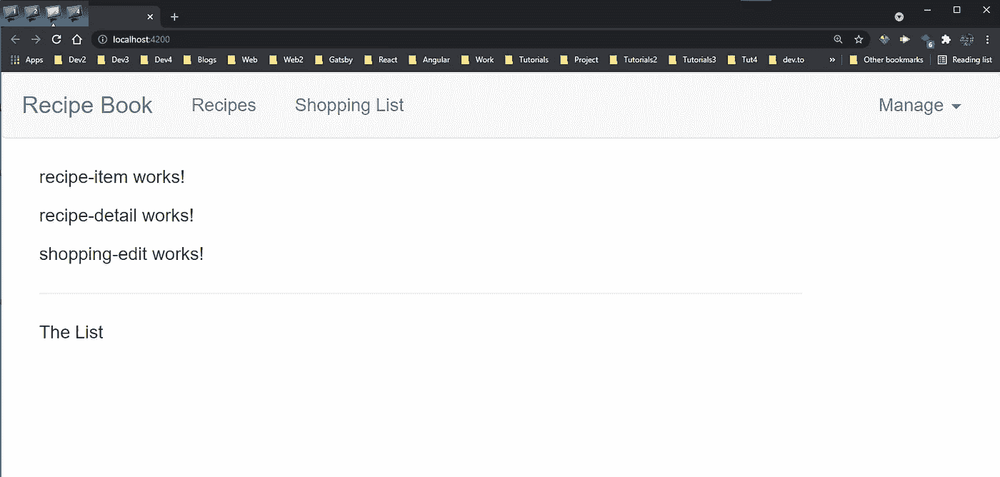

Header

我们的项目将有一个通用的配方模型。因此，在 **recipes** 文件夹中创建一个文件 **recipe.model.ts** ，并在其中添加以下内容。

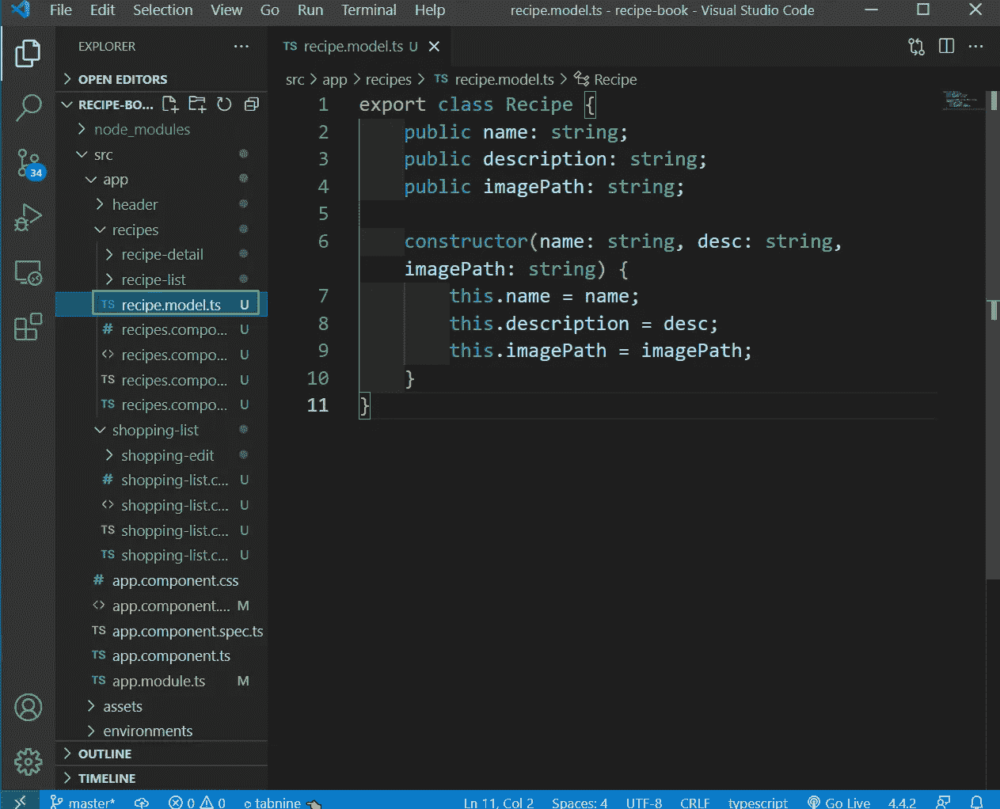

recipe.model.ts

接下来，我们将更新**recipe-list.component.html**文件的代码。在这里，我们只是添加框架来显示按钮、名称和食谱描述。

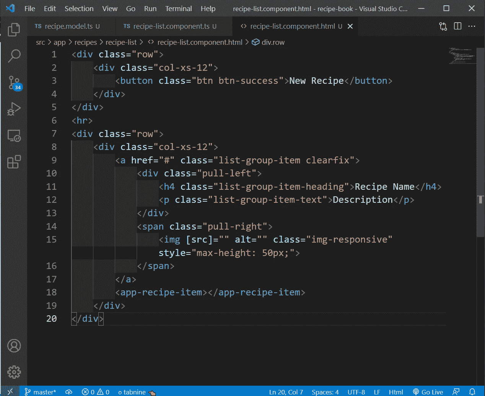

recipe-list.component.html

现在，我们将完成**recipe-list.component.html**文件的绑定。

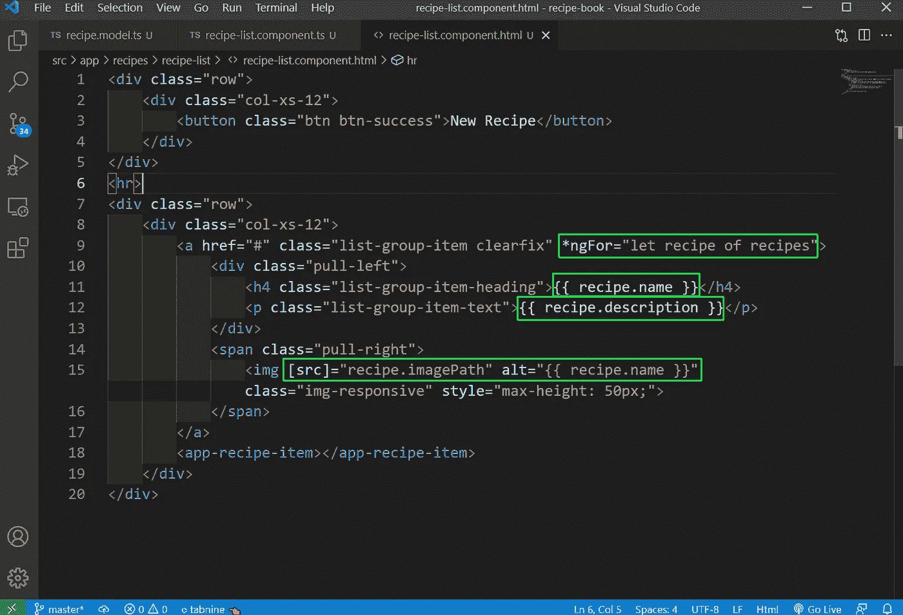

recipe-list.component.html

现在，我们的两个食谱显示正常。

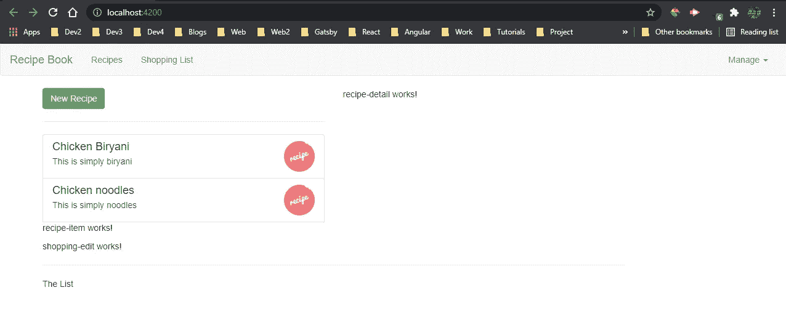

Two recipes

现在，我们将添加**recipe-detail.component.html**的代码，现在它也是一个静态代码。它包含每个食谱的细节。

```
<div class="row">
    <div class="col-xs-12">
        
    </div>
</div>
<div class="row">
    <div class="col-xs-12">
        <h1>Recipe Name</h1>
    </div>
</div>
<div class="row">
    <div class="col-xs-12">
        <div class="btn-group">
            <button type="button" class="btn btn-primary dropdown-toggle">Manage Recipe <span class="caret"></span></button>
            <ul class="dropdown-menu">
                <li><a href="#">To Shopping List</a></li>
                <li><a href="#">Edit Recipe</a></li>
                <li><a href="#">Delete Recipe</a></li>
            </ul>
        </div>
    </div>
</div>
<div class="row">
    <div class="col-xs-12">
        Description
    </div>
</div>
<div class="row">
    <div class="col-xs-12">
        Ingredients
    </div>
</div>
```

现在，我们的应用程序在食谱细节上看起来更完美了。

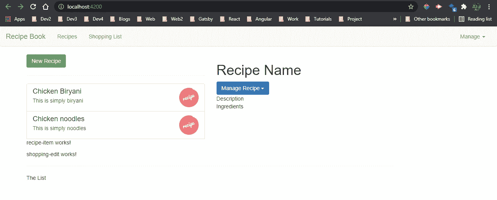

Details

现在，我们将处理包含配料的 shopping-list.component.html 文件。

但是首先我们需要创建模型文件。这些配料也会在食谱中使用，所以我们将在**应用**中的一个新的**共享**文件夹中创建 **ingredient.model.ts** 。

```
export class Ingredient {
    constructor(public name: string, public amount: number) { }
}
```

现在，我们将更新**shopping-list . component . ts**文件以使用配料。


shopping-list.component.ts

接下来，我们将更新**shopping-list.component.html**文件以显示成分。

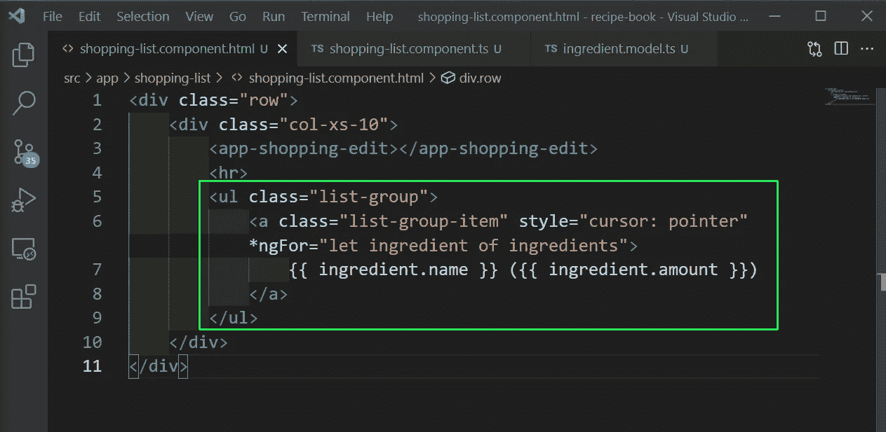

shopping-list.component.html

现在，我们的配料将在 localhost 中显示。


localhost

我们现在将制作**shopping-edit.component.html**文件，并将在其中添加两个输入框和三个按钮。

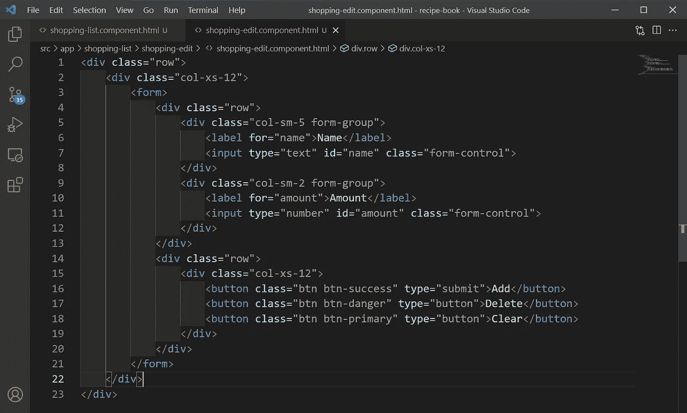

shopping-edit.component.html

我们的应用程序现在看起来如下。

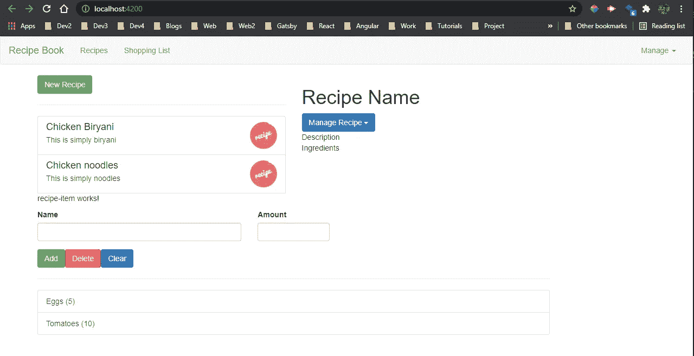

Our App

现在，我们将添加在导航栏中单击菜谱或购物清单组件时显示它的逻辑。因此，打开 header.component.html 的**文件并添加 eventlistener 到这两个文件中。**

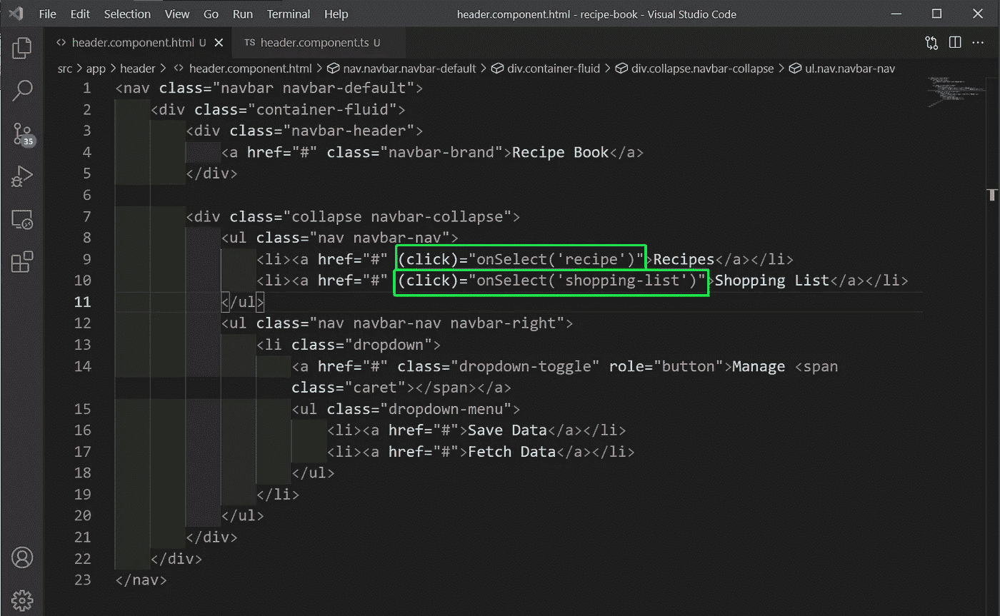

header.component.html

现在，在 **header.component.ts** 文件中，我们将添加一个 EventEmitter，它将在 onSelect()中被调用。


header.component.ts

现在，我们将转到父应用程序组件，并在 **app.component.ts** 文件中添加一个等于 recipe 的变量 **loadedFeature** 。另外，添加一个 onNavigate()，这将使这个 **loadedFeature** 等于从 header 组件传递的任何内容。

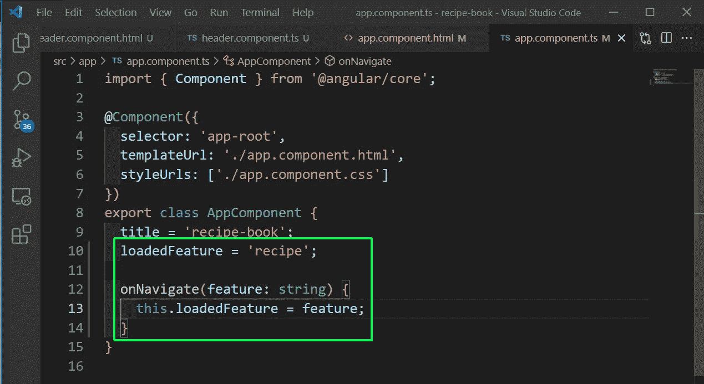

app.component.ts

现在，在**app.component.html**文件中，我们将从 header 组件中获取 featureSelected，并用事件调用 **onNavigate()** 。

现在，如果**食谱**通过，我们将显示应用程序食谱；如果**购物清单**通过，我们将显示应用程序购物。

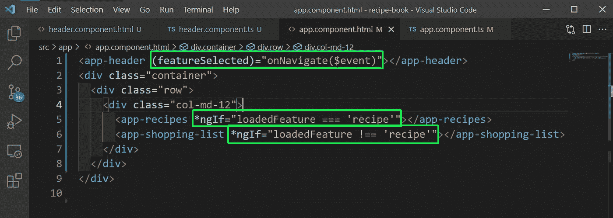

app.component.html

现在，我们的导航在 localhost 中工作正常，并在单击时显示相应的组件。


Working

现在，我们还将重构我们的代码。我们将从**recipe-list.component.html**文件中截取食谱的代码。

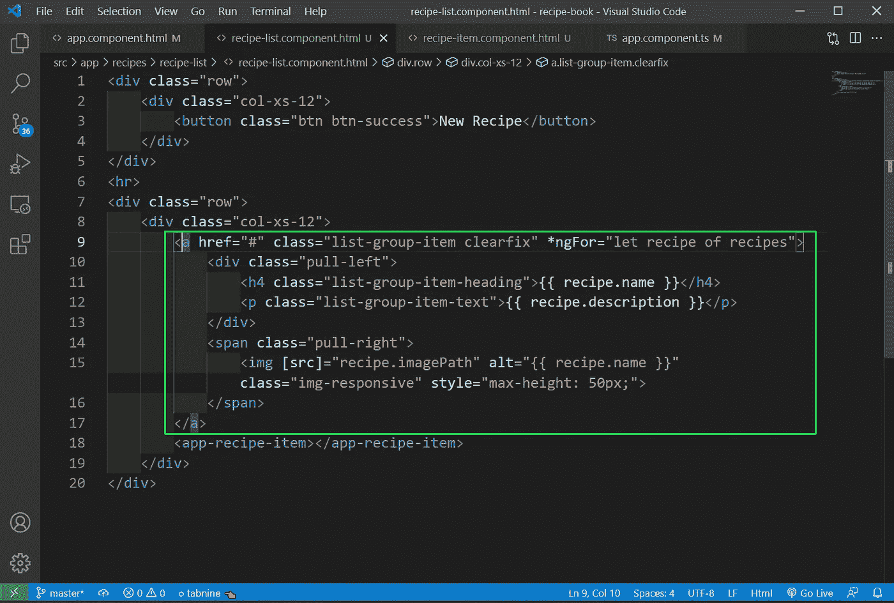

recipe-list.component.html

我们把代码放在**recipe-item.component.html**文件中，但是没有 ngFor。


recipe-item.component.html

现在，在**recipe-item . component . ts**文件中，我们正在添加 recipe 元素，它是一个输入类型，将从 recipe list 组件传递过来。

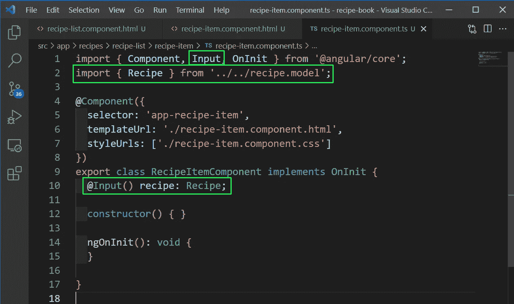

recipe-item.component.ts

现在，回到**recipe-list.component.html**文件中，我们通过循环食谱数组来传递单个食谱。

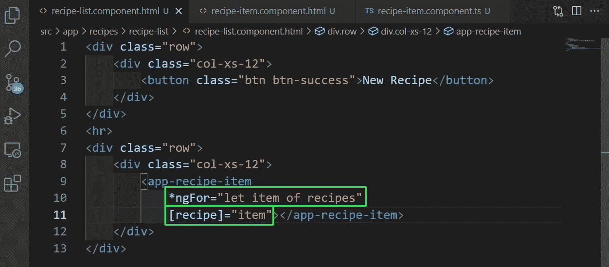

recipe-list.component.html

经过这次重构，我们的应用程序照常工作。现在，从配方项目组件，我们将通过点击配方细节组件，并显示一个单独的配方。

所以，首先在**recipe-item.component.html**文件中添加一个点击处理程序，它将在选中时调用函数**。**

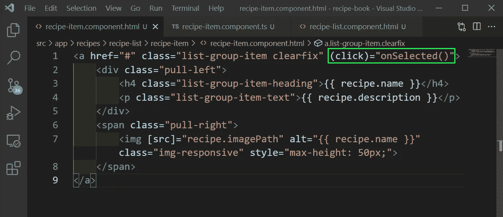

recipe-item.component.html

现在，在**recipe-item . component . ts**文件中，我们将添加一个输出装饰器并发出 **recipeSelected** 事件。


recipe-item.component.ts

现在，在**recipe-list.component.html**文件中，我们将绑定**recipes selected**事件来调用函数**onrecipes selected**，使用当前的配方。


recipe-list.component.html

现在，从**recipe-list . component . ts**文件中，我们必须再次发出这个配方，所以我们使用输出装饰器。

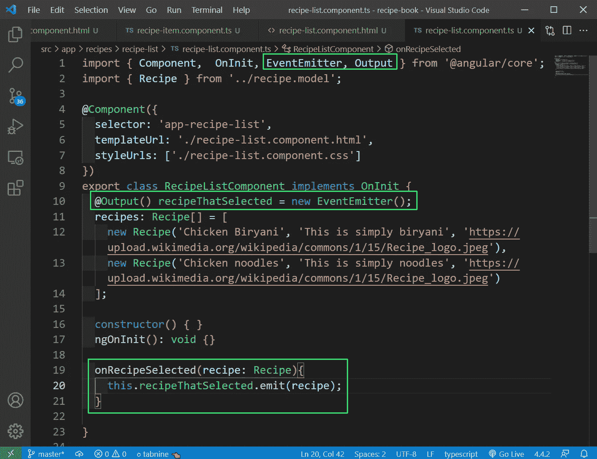

recipe-list.component.ts

现在，我们将**recipe-list.component.html**文件中被选中的**接收者绑定到 **selectedRecipe** 事件。**

之后，我们使用它来显示配方细节组件。

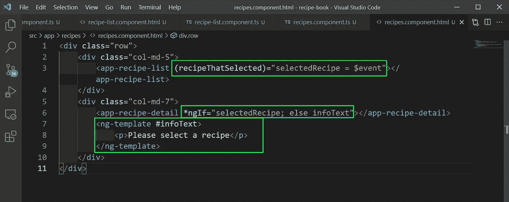

recipe-list.component.html

在**recipe-detail . component . ts**文件中添加 recipe 元素。

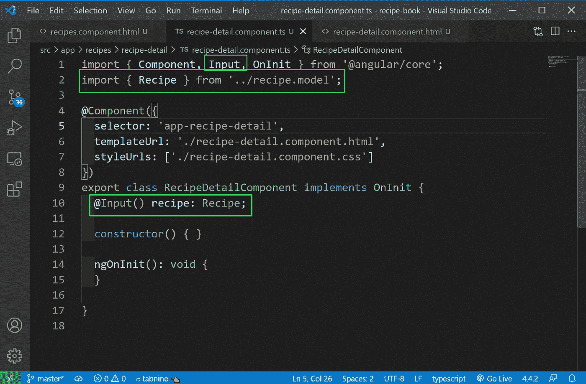

recipe-detail.component.ts

现在，在 recipe-detail.component.html 的**文件中，我们可以使用不同的配方值。**

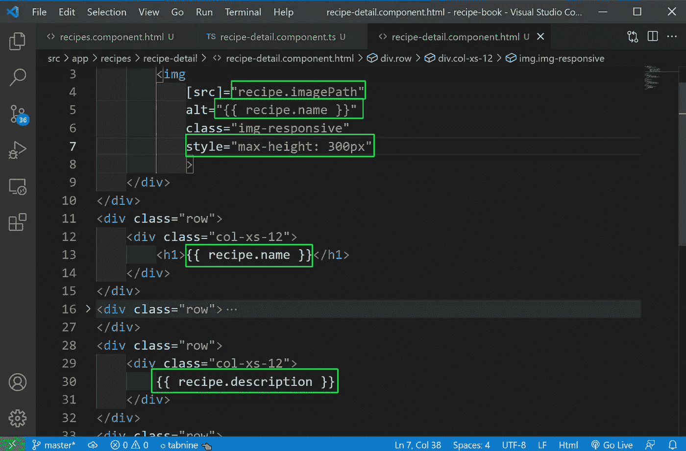

recipe-detail.component.html

现在，我把食谱完美地展示出来了。我也改变了图像链接。

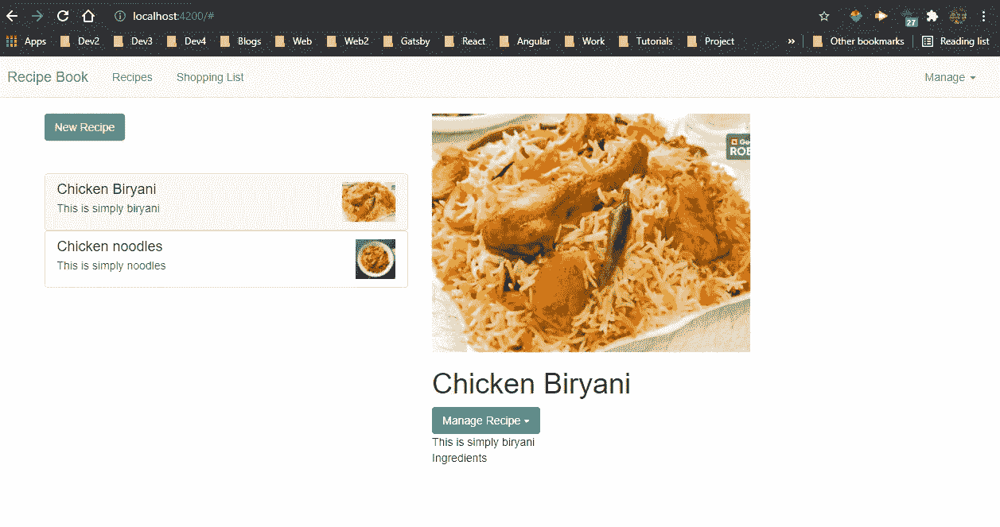

localhost

现在，我们将对在购物列表中添加 ingridients 的功能进行编码。为此，我们将参考相关资料。所以，首先在**shopping-edit . component . ts**文件中添加引用和一个点击事件。


shopping-edit.component.ts

现在，在**shopping-edit.component.html**文件中，我们将使用 ViewChild 指令来获取值，并在此之后发出它。

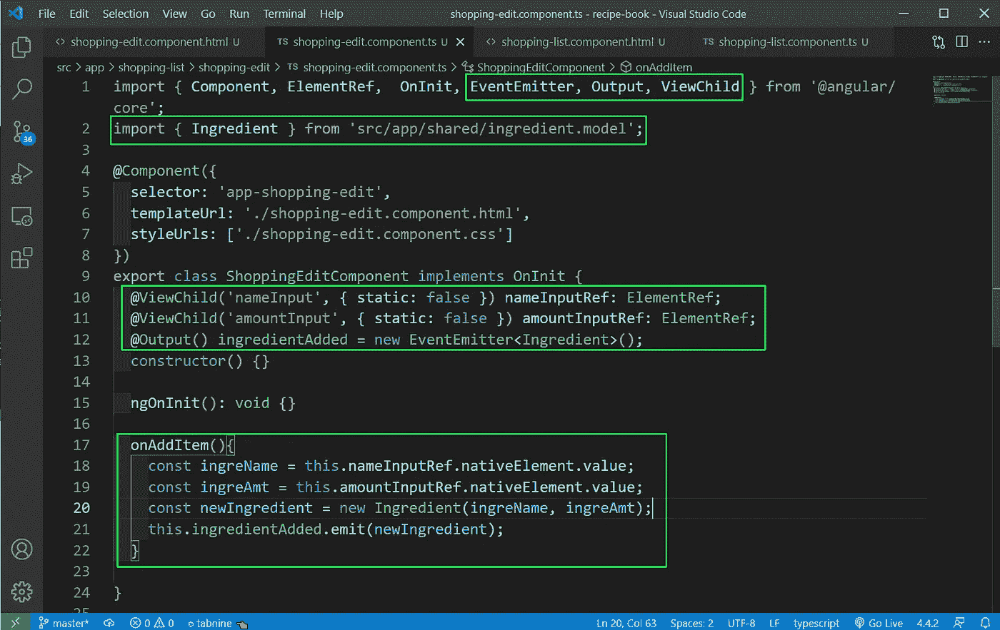

shopping-edit.component.html

现在，在**shopping-list.component.html**文件中，我们将绑定添加的组件并调用添加的组件。

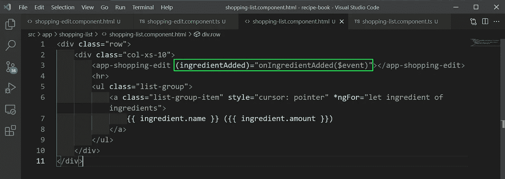

shopping-list.component.html

最后，在**shopping-list . component . ts**文件中，我们将向配料数组添加项目。

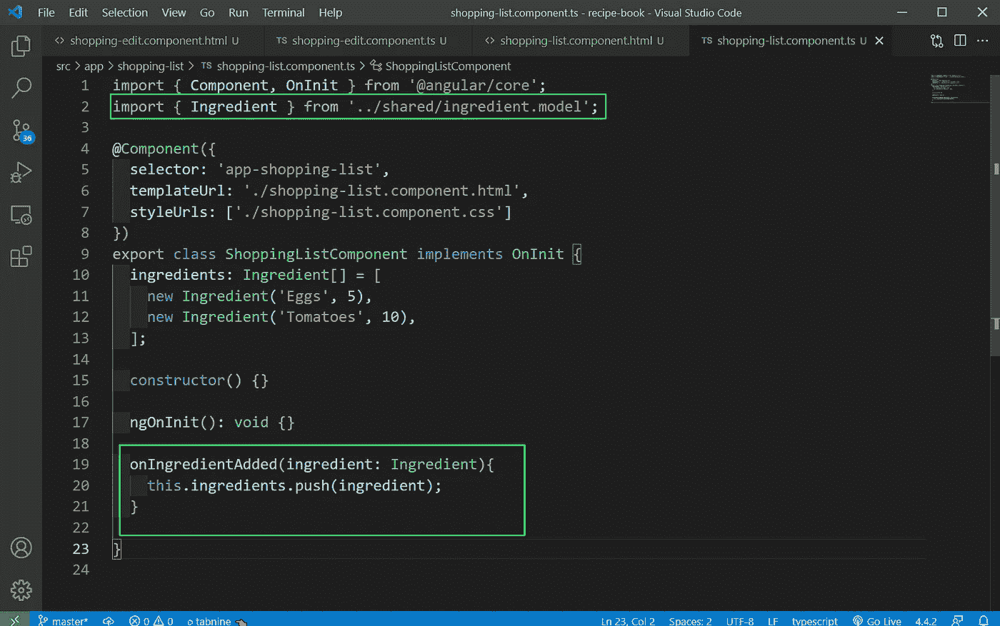

shopping-list.component.ts

我们已经创建了一个功能应用程序，但仍有许多改进需要做。我们将在第 2 部分中完成。你可以在[这个](https://github.com/nabendu82/recipe-book) github 链接中找到相同的代码。