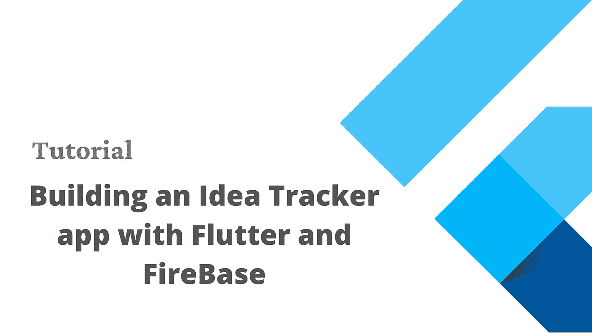
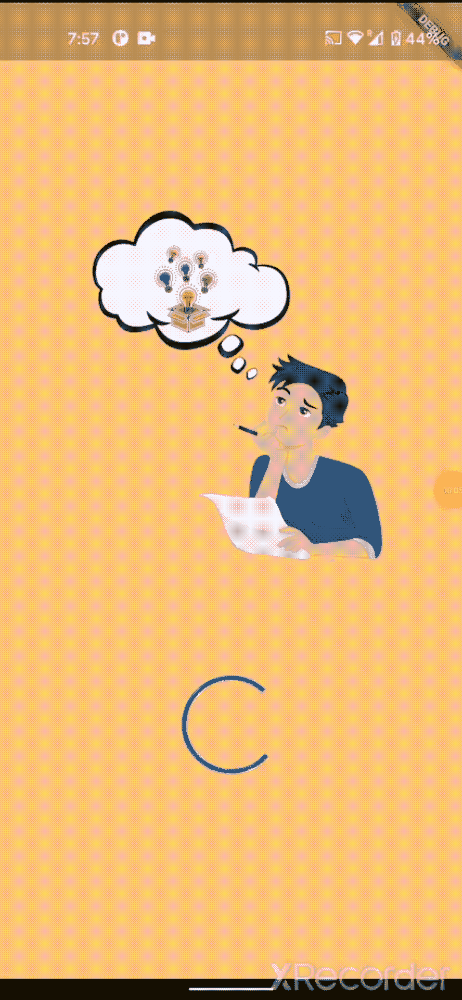
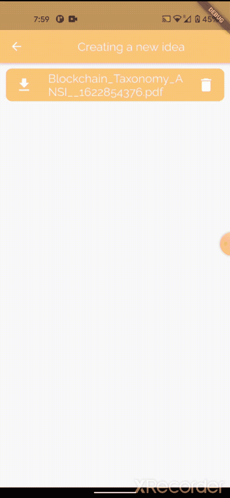

# 用 Flutter 和 Firebase 构建一个 Idea Tracker 应用程序

> 原文：<https://medium.com/geekculture/building-an-idea-tracker-application-with-flutter-and-firebase-4474a9f87ad6?source=collection_archive---------20----------------------->



了解如何在 Flutter 中实现 Firebase 组件，方法是构建一个 idea tracker 应用程序，帮助用户跟踪新的商业想法/机会，提供上传和获取特定于每个想法的文档的选项。

[Flutter](https://flutter.dev/) 是 Google 为轻松构建跨平台应用而制作的工具包。

Firebase 是谷歌的一款产品，可以帮助开发者轻松构建、管理和开发他们的应用。它附带了许多预打包的服务，为开发人员节省了很多麻烦和时间。FireBase 的一些特性有:使用 Firebase 认证的用户认证，使用云 FireStore 的 NoSQL 实时数据库，使用 Firebase 存储的文件存储等。我们将使用这些特性来构建我们的应用程序。

在本教程中，我将展示如何建立一个有 4 个屏幕的想法跟踪器应用程序:

1.  **闪屏:**这个自定义闪屏将被用作这个应用程序的闪屏。
2.  **欢迎屏幕:**该屏幕将用于输入用户电话号码，并使用 Firebase 身份验证对其进行身份验证。每次用户试图登录时，Firebase 都会向输入的电话号码发送一个唯一的 6 位验证码。身份验证后，用户将被重定向到他/她自己的控制面板。
3.  **DashBoard:** 这是默认屏幕，如果用户已经在任何以前的实例中登录到应用程序，就会显示该屏幕。用户可以选择查看现有的想法，添加新的想法，更新/删除现有的想法，并为每个想法上传新的文档到 Firebase 存储。
4.  **查看文件屏幕:**该屏幕将用于显示每个用户上传的文件。对于每个现有建议，每个查看文件屏幕都是唯一的。用户可以选择从该屏幕下载和删除文档。

# 1.先决条件

1.  在开始之前，请确保在您的机器上安装了 Flutter。你可以按照[颤振安装指南](https://flutter.dev/docs/get-started/install)来做。
2.  创建一个新的 Flutter 项目，删除所有不必要的代码。

```
flutter create idea_tracker
```

二。或者你可以从: [idea tracker 仓库](https://github.com/birat051/ideatracker)中克隆 GitHub 仓库。

3.添加步骤 1.2 中提到的包。到 pubspec.yaml 文件并运行:

```
flutter pub get
```

4.下一步是使用你的谷歌帐户登录 Firebase，并创建一个新的 Firebase 应用程序。您可以按照[firebase setup with flutter](https://firebase.google.com/docs/flutter/setup)中提到的步骤将 fire base 应用程序添加到您的 Flutter 项目中。

# 1.1.项目文件结构

```
Lib // root folder of all dart files in a Flutter app
|_ services
|____ dbservice.dart
|____ deleteanddownloadfiles.dart
|____ getcloudfiles.dart
|____ uploadfiles.dart|_ components
|____ addtask.dart
|____ cloudfiles.dart
|____ ideacount.dart
|____ idealist.dart
|____ rounded_button.dart
|____ select_priority.dart
|____ sidenavigation.dart
|____ updatetask.dart|_ screens
|____ chooselogin.dart
|____ dashboard.dart
|____ splash_screen.dart
|____ viewfiles.dart
|____ welcomescreen.dart|_ utilities
|____ constants.dart|_ main.dart
```

这就是我们的项目结构的样子。我们将通过在服务目录下创建单独的 dart 文件，将 UI 组件与 UI 屏幕分开，并创建单独的 directories.Reading/writing 来处理服务。所有可重复使用的常量(不同的文本样式)都将在 utilities 目录下的 constants.dart 文件中定义。

# 1.2.包和依赖项

在 Flutter 中，我们可以在项目中导入第三方包来添加额外的功能，而无需从头开始创建这些功能。 [pub.dev](https://pub.dev/) 网站包含一个你可以在你的项目中使用的 flutter 包列表。要使用一个包，我们只需在`pubspec.yaml`文件中添加包名和版本，如下所示。继续在您的文件中添加以下家属。

```
firebase_auth: ^1.2.0
cloud_firestore: ^2.2.0
firebase_core: ^1.2.0
animated_text_kit: ^4.2.1
loading_overlay: ^0.3.0
font_awesome_flutter: ^9.0.0
flutter_slidable: ^0.6.0
firebase_storage: ^8.1.1
file_picker: ^3.0.2+2
url_launcher: ^6.0.6
```

1.  [**firebase _ auth**](https://pub.dev/packages/firebase_auth)**:**这个包用于在 Flutter 中实现 Firebase 认证。我们将使用此包中的身份验证 API 使用我们的电话号码登录，并检查当前用户。
2.  [**Cloud _ firestore**](https://pub.dev/packages/cloud_firestore)**:**这个包用来实现 Flutter 中的云 FireStore。我们将使用 FireStore APIs 将想法以集合的形式存储在 FireStore DB 中，并对它们执行更新/删除操作。
3.  [**FireBase _ Core**](https://pub.dev/packages/firebase_core)**:**这个包用来实现 flutter 中的 FireBase Core API。我们将使用这个 API 来连接到我们的 FireBase 应用程序。
4.  [**animated _ text _ kit**](https://pub.dev/packages/animated_text_kit)**:**自带预打包的文字动画。我们将在欢迎屏幕中使用它来显示文本动画，而不是从头开始构建。
5.  [**loading _ overlay**](https://pub.dev/packages/loading_overlay)**:**提供了使用模态进度 HUD 的高级包装器。我们将用它来显示一个用户认证时的加载屏幕。
6.  [**Font _ Awesome _ flutter**](https://pub.dev/packages/font_awesome_flutter)**:**使我们能够使用 [Font Awesome](https://fontawesome.com/icons) 图标包。我们将使用仪表板中的图标在 AppBar 上显示一个非常棒的徽标。
7.  [**flutter _ slide**](https://pub.dev/packages/flutter_slidable)**:**可滑动列表项的 Flutter 实现，具有可解除的方向滑动动作。我们将实现每个想法作为一个可滑动的小工具，增加了更新，删除，查看和上传附件的选项。
8.  [**firebase _ Storage**](https://pub.dev/packages/firebase_storage)**:**这个包为我们提供了在 Flutter 中实现 Firebase 存储的高级 API。我们将使用这个 API 从 Firebase 存储中上传、删除和检索附件。
9.  [**file_picker:**](https://pub.dev/packages/file_picker) 我们将使用这个包来实现原生文件资源管理器，以选择添加了扩展名过滤支持的文件，即:PDF。
10.  [**url _ launcher:**](https://pub.dev/packages/url_launcher)我们将使用这个包将从 Firebase 存储器中获取的下载 URL 启动到浏览器中。浏览器会负责文件下载。

# 2.构建欢迎屏幕和电话号码认证

**2.1。在欢迎屏幕中显示应用程序名称的文本动画:**在欢迎屏幕中，我们将使用来自 [animated_text_kit](https://pub.dev/packages/animated_text_kit) 的 TypewriterAnimatedText 设置一个预打包的文本动画。下面是我们使用这个小部件显示文本动画的代码片段。

**2.2。构建电话认证系统:**在 Flutter 中使用 FireBase 设置电话认证在 [Flutter Fire](https://firebase.flutter.dev/docs/auth/phone/) 网站中有生动的记载。我们将使用“Firebaseauth.verifyPhoneNumber”来验证使用电话号码的用户。该过程需要四个参数:

> 2.1.电话号码:您提供电话号码。
> 
> 2.2.**验证完成:**定义验证完成后要遵循的步骤。
> 
> 2.3.**超时:**设置 OTP 的有效期。
> 
> 2.4. **codeSent:** 定义代码发送给用户进一步验证后的步骤。在 codeSent 中，我们将使用输入的验证码和电话号码创建一个 AuthCredential 对象来登录我们的应用程序。
> 
> 2.5.**codeAutoRetrievalTimeout:**处理超时，自动短信代码处理失败。

完整的代码片段可以在下面找到:

**2.3。验证用户身份时显示加载屏幕:**我们将使用 LoadingOverlay 小部件在验证用户身份时显示一个模态 HUD。小部件通过使用“_saving”变量呈现。在进行身份验证时，我们在 setState((){})中将该属性设置为 true，以呈现模式 HUD。

# 3.构建仪表板

**3.1。添加新想法:**将使用 BottomSheet 小部件添加新想法，其代码片段可以在:[添加任务小部件](https://github.com/birat051/ideatracker/blob/master/lib/components/addtask.dart)中找到。

**3.1.1。创建一个类来创建/更新和删除 FireStore 中的数据:**在继续下一步之前，请确保您已经在 Cloud FireStore 中创建了一个新集合。在我的例子中，这个集合的名称是“ideacollection”。

我们将在[services/dbservice . dart](https://github.com/birat051/ideatracker/blob/master/lib/services/dbservice.dart)中创建一个类来添加新想法，以及从“ideacollection”中删除/更新现有想法。我们将为“ideacollection”中的每个文档记录创建三个字段。这些字段是:

> 3.1.1.1.**创意:**创意名称。
> 
> 3.1.1.2.**优先级:**优先级可以是“高”、“正常”和“低”。这由用户在[添加任务小部件](https://github.com/birat051/ideatracker/blob/master/lib/components/addtask.dart)中的下拉菜单中选择。
> 
> 3.1.1.3.**用户:**用户的电话号码将被发送到该字段，以创建特定于用户的记录。

以下是在 FireStore collection 中添加、删除和更新创意的代码片段:

**3.2。查看想法:**我们将使用仪表板中的 StreamBuilder 从 FireStore Cloud 为我们的登录用户获取想法。这提供了所有想法的实时视图，包括对新想法的添加、删除或更新。使用 StreamBuilder 查看数据的代码片段如下:

**3.3。将每个想法实现为可滑动的小部件:**我们将每个想法实现为可滑动的小部件。滑动时，用户将看到 4 个选项:

3.3.1。更新想法:使用类似于[添加任务小部件](https://github.com/birat051/ideatracker/blob/master/lib/components/addtask.dart)的底部表单小部件来更新想法。点击此处进入[更新任务小工具](https://github.com/birat051/ideatracker/blob/master/lib/components/updatetask.dart)。将使用我们之前创建的 [DBStorage](https://github.com/birat051/ideatracker/blob/master/lib/services/dbservice.dart) 类中的 [updateIdea](https://github.com/birat051/ideatracker/blob/master/lib/services/dbservice.dart) 函数更新 FireStore 集合中的数据。

**3.3.2。删除想法:**点击此选项将从 [DBStorage](https://github.com/birat051/ideatracker/blob/master/lib/services/dbservice.dart) 类中调用 [deleteIdea](https://github.com/birat051/ideatracker/blob/master/lib/services/dbservice.dart) 函数，这将从“ideacollection”中删除文档记录。

**3.3.3。上传附件:**我们将使用类 [UploadFiles](https://github.com/birat051/ideatracker/blob/master/lib/services/uploadfiles.dart) 在 services 目录中创建一个新的 dart 文件，以提示用户从设备的 FileExplorer 中选择一个文档，然后该文档将被上传到 FirebaseStorage。

> 3.3.3.1.我们将使用 [file_picker](https://pub.dev/packages/file_picker) 包中的[file picker . platform . pick files](https://pub.dev/packages/file_picker)从文件资源管理器中选取文件。
> 
> 3.3.3.2.默认情况下，FireBaseStorage 没有为应用程序存储用户特定的数据。我们将使用自定义逻辑，为每个用户创建一个目录，为每个想法创建一个子目录，并在目录中上传与该想法相关的文档。文档将上传到以下目录:
> 
> / <user_name>/ <idea_name>/</idea_name></user_name>
> 
> 3.3.3.3.上传文件到 FirebaseStorage 不需要我们做额外的设置。为了上传获取的文件，我们将使用 storage.ref(您的目录名)。从 [firebase_storage](https://pub.dev/packages/firebase_storage) 包中放一个文件(文件名)到 firebase 存储器。

下面是 UploadFiles 类的代码片段:

3.3.4。查看上传的附件:点击此选项，用户将被重定向至查看文件屏幕，在此用户可以查看意见的所有上传附件。

下面是可滑动小部件实现的代码片段:

# 4.构建查看文件屏幕

我们将创建一个新的[视图文件](https://github.com/birat051/ideatracker/blob/master/lib/screens/viewfiles.dart)小部件，使用 FutureBuilder 从 Firebase 存储中检索上传的附件。现在为什么用 [FutureBuilder](https://api.flutter.dev/flutter/widgets/FutureBuilder-class.html) 而不是 StreamBuilder？这是因为 FirebaseStorage 不像 Cloud FireStore 那样提供实时数据。我们将使用一个 FutureBuilder 并从 [GetCloudFiles()](https://github.com/birat051/ideatracker/blob/master/lib/services/getcloudfiles.dart) 类(在 services 目录下创建)中调用 [getFileNames()](https://github.com/birat051/ideatracker/blob/master/lib/services/getcloudfiles.dart) 方法来检索每个文件的文件路径。

下面是 GetCloudFiles()类的代码片段:

使用 FutureBuilder 显示文件名的代码片段如下:

对于 ViewFiles 小部件中显示的每个附件，我们将为用户提供两个选项:

**4.1。下载附件:**我们将在 services 目录中创建一个新的 dart(deleteanddownloadfiles . dart)文件，使用 DeleteandDownloadFiles 类来删除和下载附件。

对于下载附件，我们将使用[firebase storage . instance . ref(<file path>)检索该附件的下载 URL。getDownloadURL()](https://firebase.flutter.dev/docs/storage/usage/) 。

然后我们将使用 [url_launcher](https://pub.dev/packages/url_launcher) 包中的 launch( <download url="">)函数在浏览器中打开这个 URL。浏览器将负责下载过程。</download>

下面是从 FireBase 存储中获取下载 URL 和下载文件的代码片段:

**4.2。删除附件:**在 DeleteandDownloadFiles 类中，我们将创建另一个方法 [deletefromStorage()](https://github.com/birat051/ideatracker/blob/master/lib/services/deleteanddownloadfiles.dart) ，使用 FireBase Storage . instance . ref(<file path>)从 FireBase 存储中删除附件。删除()。

下面是从 Firebase 存储中删除附件的代码片段:

> 我们现在已经学会了如何从 FireBase 存储中下载和删除文件。但是，您认为 ViewFiles widget 会完美地显示删除附件后的更新列表吗？简单的回答是不会。
> 
> [FutureBuilder](https://api.flutter.dev/flutter/widgets/FutureBuilder-class.html) 小部件将只监听一次异步数据并建立列表。附件列表是使用从 [FutureBuilder](https://api.flutter.dev/flutter/widgets/FutureBuilder-class.html) 接收的异步快照构建的。我们解决了这个问题，并通过定期调用附件列表的 setState(){ <变量名> }来强制 FutureBuilder 定期从 FireBase 存储中检索文件名并重建列表，从而使 [FutureBuilder](https://api.flutter.dev/flutter/widgets/FutureBuilder-class.html) 的行为类似于 [StreamBuilder](https://api.flutter.dev/flutter/widgets/StreamBuilder-class.html) 。

下面是定期侦听 FirebaseStorage 数据并重建列表的代码片段:

# 5.结论

*   这个项目的完整源代码可以在[这里](https://github.com/birat051/ideatracker)找到。
*   大多数复杂的后端工作，如身份验证、数据库管理和文件存储，只需很少的配置和调整就可以由 FireBase 处理。点击阅读更多关于 [Firebase 与 Flutter](https://firebase.flutter.dev/docs/overview) 的集成。
*   从官方 [Flutter 频道](https://www.youtube.com/channel/UCwXdFgeE9KYzlDdR7TG9cMw)的 youtube 视频中了解更多关于[流和未来](https://www.youtube.com/watch?v=nQBpOIHE4eE)的信息。