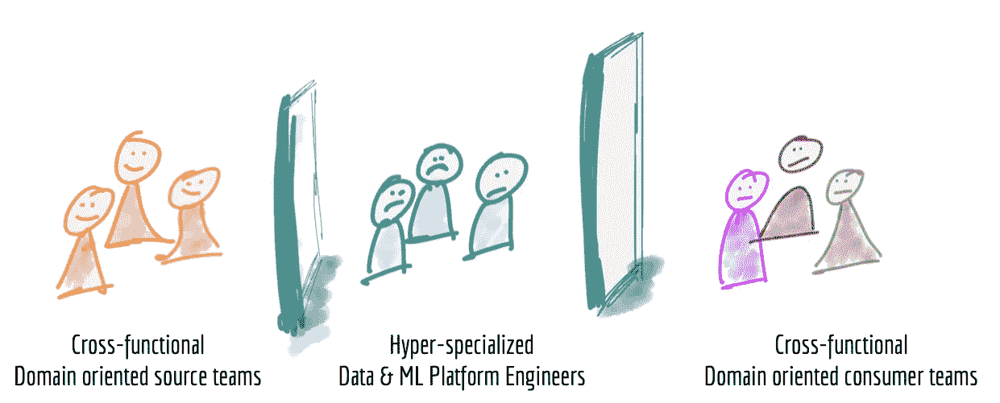

# 构建数据平台 II——水管工的时代已经结束

> 原文：<https://medium.com/geekculture/building-data-platforms-ii-the-age-of-the-plumber-is-over-11488420a39?source=collection_archive---------2----------------------->

[更新—第三部分现已发布[此处](https://joaovasques.medium.com/building-data-platforms-iii-the-evolution-of-the-software-engineer-bdb3d9c1dd71)

在本系列的[第一部分](https://joaovasques.medium.com/building-data-platforms-the-etl-bias-d589733ce4cc)中，我们讨论了 ETL 偏差以及它给公司感知和管理数据的方式带来的问题。第一章以下面的问题结束，这将是第二部分的动机。

> “如果数据是公司最宝贵的资产，那么只有一个团队负责数据有意义吗？”

答案当然是否定的，如果你在你的公司里四处打听，他们可能会有同样的感觉。然而，如果你环顾四周，你可能会发现一个数据团队被新 ETL、数据仓库模式升级甚至构建仪表板的请求淹没了。大多数人的直觉和他们的行为完全不一致。为了实现这一点，我认为必须做三件事:

1.  分布式数据所有权
2.  数据管道工成为数据工程师
3.  软件工程师的发展(将在下一章讨论)

# 分布式数据所有权

当今数据环境的根本问题不是工具，而是错位的所有权意识。微服务和领域驱动设计应用的全部目的是让团队致力于一个给定的问题，理解它并构建功能来解决它。在现代世界中，数据是公司用来领先于竞争对手的重要组成部分。如果这很重要，为什么我们要把它集中起来？为什么我们让数据工程师维护 ETL 管道，将来自域 X 的信息带入数据湖和/或数据仓库，以回答他们毫不知情的问题？这将数据团队置于了解领域的团队和对领域有疑问的内部涉众之间。这个问题在 ThoughtWorks 的伟大的[文章](https://martinfowler.com/articles/data-monolith-to-mesh.html)中得到了完美的描述，这篇文章介绍了数据网格的概念。

Example of silos due to centralization — original image from [Data Mesh blog post](https://martinfowler.com/articles/data-monolith-to-mesh/siloed-teams.png)

这个问题的高级解决方案很简单:去中心化。我们必须让团队拥有生成数据的系统，并了解数据消费者的特定领域。这个概念是如此清晰，如此有意义，而且一直就在那里，在我们面前。这说起来容易做起来难，因为权力下放带来了自身的挑战，比如治理，或者用更实际的话来说:如何确保事情有一定程度的一致性？

虽然去中心化对于公司更有效地使用数据至关重要，但我认为，在大多数公司中，你不需要完全接受像数据网格这样优雅而复杂的变化。我认为数据网格面临以下挑战:

> 如何让数据网格变得生动？

人们很容易相信数据网格将解决我们所有的问题。我强烈认为，我们必须从改变人们的思维方式开始，让他们开始以一种更分散的方式来看待和思考数据。这是必须完成的最难的一步，这要求我们作为一个行业，对数据工程师和软件工程师的看法发生重大转变。首先，我们需要完全重新定义他们的工作。其次，我们需要了解他们需要开始做什么。

# 数据管道工成为数据工程师

让我请你做一件简单的事情:打开你最喜欢的搜索引擎，键入以下内容:“数据工程技能”。您很可能会找到包含以下一些概念的结果

An example of hits you might find when searching for Data Engineering Skills

所有这些结果的共同点是什么？他们都是一种思维模式的一部分，在这种思维模式中，数据工程师负责编写某种 ETL，将数据从操作系统提取到其他地方。在这种思维模式下，数据工程师基本上是在管道周围传输数据，构建管道来满足各种各样的团队，他们对该领域一无所知。有多少数据团队做管道工作来支持分析，并为人工智能团队建立数据集来训练他们的机器学习模型？太多了，这也是为什么“数据让我们慢下来”的主要原因之一。

为了开始推动数据去中心化，我们需要澄清数据工程师应该**不应该**做什么。

> 数据工程师不应该构建 ETL 管道

这是一个强有力的声明，它与许多人对数据工程师在行业中的角色的看法相冲突。然而，如果我们要促进分权，就必须摧毁这个主要的集权点。当我们假设这一定会发生时，一个自然的后续问题出现了:*“一个数据工程师应该做什么？”*

顾名思义，数据工程师应该构建系统来管理数据。但是它到底是什么意思呢？如果他们不再构建 ETL，他们也不是管道工，那么在数据端还能做什么呢？他们需要构建能够回答以下问题的软件。

## 数据是否正确？

由于数据在当今世界的重要性，这是最重要的话题之一。让我们想象一下，你的公司有两条数据管道，一条用于内部分析，另一条用于生成数据集，这些数据集将用于训练机器学习模型。现在，让我们假设其中一个拥有关于任何重要属性(例如，一个动作的持续时间)的信息的源系统引入了一个错误，导致两个管道都生成有错误的数据。大多数时候，数据管道的可观察性度量集中于回答以下问题

1.  我可以连接到源系统吗？
2.  转型期间有什么例外吗？
3.  我能够写入输出目的地吗？

在这种情况下，尽管所有管道指标都是绿色的，但系统生成的数据是错误的。这些类型的错误通常需要一些时间来排除故障，并可能对公司产生非常糟糕的后果，因为大多数决策和系统(例如，特别是基于人工智能的系统)都是基于数据的质量。

因此，至关重要的是，数据工程师应专注于构建检测这些问题的系统，并提醒需要通知的团队某些事情不正确。像 [Cuelang](https://cuelang.org/) 、 [Great Expectactions](https://greatexpectations.io/) 或 [Pandas Profiling](https://pandas-profiling.github.io/pandas-profiling/docs/master/rtd/) 这样的工具，在这里可以提供很大的支持。

## 数据是最新的吗？

如今，拥有高质量的数据对一家公司来说是不够的。当今世界发展速度非常快，这意味着公司希望掌握业务发展的脉搏。这一点的真正重要性不在于处理的延迟(批处理与流处理)，而在于数据的新鲜度。根据不同的用例，我们可能需要为不同的数据项提供不同的服务级别。让我举个例子来证明为什么这很重要。产品的利润不需要在每次客户购买时都可用，但是如果每两周评估一次该数据，团队必须知道最新条目是 4 或 5 天前的。解决这个问题的更高级的方法是拥有一个理解数据流模式的系统，并在每次发生错误时触发警报。这个系统可以是任何东西，从离群点检测模型到一组硬编码规则。

## 数据是否可以访问和发现？

有多少次你问自己(或听到有人问)

> 在哪里可以找到关于 X 的信息，如何访问它？

这个问题的常见答案是各种各样的“去和 Y 谈谈”，“你有这些 API 端点”，“在电子表格上，我会发给你”(你打开它，最后一次编辑是在 2 个季度前..).事实证明，正确地做到这一点并保持更新比看起来更难。概念与不同层次的相关性有联系，它们可能存在于不止一个系统中。这带来了一个非常重要的方面，公司没有给予正确的关注:元数据。元数据是关于数据的数据。让我们以一篇关于媒介的文章为例。在它的元数据上，人们会看到它是由 ID 为 *I* 的用户编写的，需要大约 *Y* 的时间来阅读，发表于 *D* 日，它与主题 *A.B* 和 *C* 相关，并且有到其他文章或工具的链接。不读这篇文章，只看它的元数据，你就能很好地理解它。处理大规模数据的唯一方法是拥有良好的元数据。

数据工程师应该构建(或维护)管理元数据的系统，使数据消费者的生活更加轻松。这些消费者可以是财务团队中的人，一组数据科学家，产品经理或刚加入公司的软件工程师。他们都应该能够浏览公司的元数据，找到概念的定义以及它们之间的关系。Amundsen 是试图解决这个问题的一个很好的例子。

## 数据安全吗？

如今，数据安全对每个公司都变得至关重要。客户和总体受众更加了解公司如何处理他们的数据。如果我们想要促进数据去中心化，我们必须通过一些每个人都采用的规则和过程来实现。数据工程师应与产品经理、软件工程师和安全工程师合作，以:

1.  确保每个人都能访问他们工作所需的数据(不多也不少)
2.  确保公司有所有数据项的访问日志
3.  确保所有系统都有适当的数据保留政策
4.  控制和集中管理敏感数据(如 PII、客户合同等)

The 4 main things Data Engineers should be focusing one

# 后续步骤

促进数据去中心化的三个方面的最后一部分是软件工程师的发展。最初，我想把这一部分放在本文中，但是我决定把这个话题留到本系列的下一部分，因为这一部分已经很长了。在下一章中，我将介绍软件工程师需要如何发展，并举例说明如何以一种分散的、更有效的方式处理数据。