# 在 Java 中从头开始构建深度卷积神经网络，MNIST 实现—完整演练

> 原文：<https://medium.com/geekculture/building-deep-convolutional-neural-networks-from-scratch-in-java-583a780b56f2?source=collection_archive---------21----------------------->

这是一个广泛的教程和演练，展示了使用 OOP 来构建不同的卷积网络的方法，使用很少或没有主要的 ML 优化(即香草网络)。我还将在 MNIST 数据集上演示它们的用法，并解释获取图像的一种方法(编辑:该解释将在另一篇文章中给出)。就典型的神经网络操作而言，我假设熟悉矩阵卷积。我还假设熟悉 Java 这种面向对象的语言。

向前传球示例:

反向传递示例:

首先，我们需要一个对象来表示图像(例如，第一张图中左边的“I”列)。在这个例子中，我创造性地称我的为“图像”。此图像类将有多个通道可用于存储数据；例如红色、绿色、蓝色、阿尔法。它可以以几种方式构建，因为它将表示卷积前和卷积后的图像(即，卷积一个图像对象将创建另一个图像对象)，并将作为解决方案呈现在网络的远端。请注意，允许用户访问该对象会打开该对象已被更改的漏洞。我之所以注意到这一点，是因为我们通常使用训练期间的最新输出来计算损失，这可能发生在用户交互之后。如果这个对象在此期间被用户操纵了，我们可能会被扔在这里。因此，我们应该建立一种方式来快速制作对象的独立克隆，我们可以更舒服地发送给用户，你会看到这包括在内。还要注意，通道被设置为等于 1，并且不是动态的。如果不使用灰度图像，则必须更新。对 MNIST 来说，我们可以也应该不去管它。

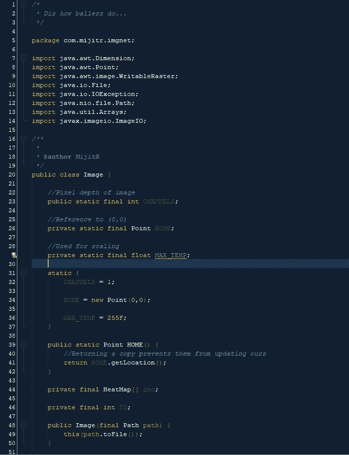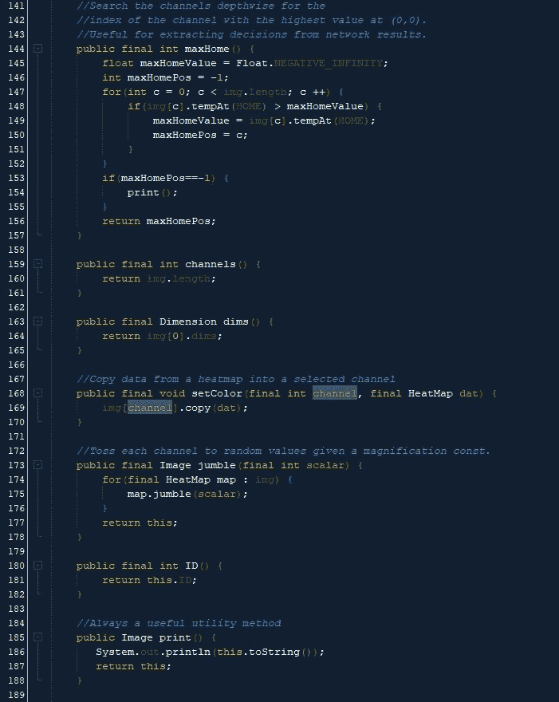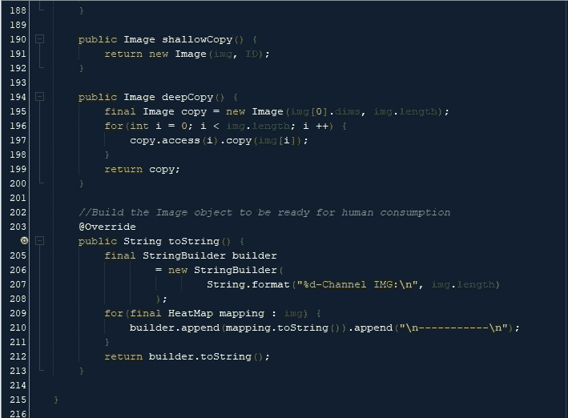

这个特殊的图像类利用特殊的矩阵类来填充它的通道，我称之为热图。它们包含一个私有数据矩阵，并为其他热图提供操作，如加法、点乘和减法。它们本质上用于代替网络的任何矩阵思想，如下所示:

现在我们应该有一个可操作的图像。我现在将演示如何从本地存储在您的计算机上的文件中加载几个图像(即，如果您要遵循本教程，您必须将所有 70000 个 MNIST 图像存储在您的计算机上的两个文件夹中:“测试”和“训练”)。关于如何实现这一点的更多信息将在后面提供)。你将不得不为你存储图片的地方写你自己的自定义路径。

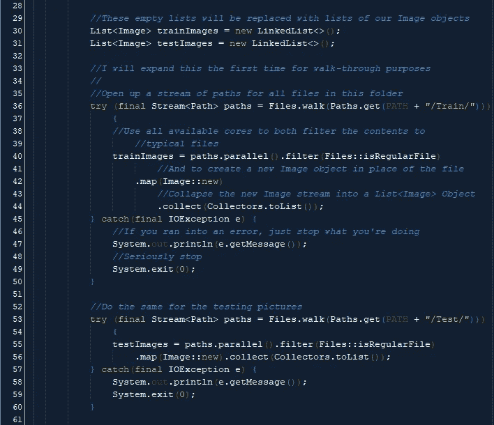

这被证明是一个非常快速的实现，但是它会在程序的第一秒使用你的整个 CPU。不管怎样，现在我们有了从真实图像创建的图像对象列表，我们可以开始从中获得各种乐趣。事实上，我们现在甚至可以概述当前的项目。下面是我运行项目的程序中的主方法。

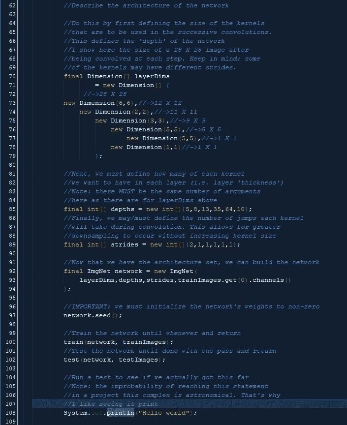

当我们从上面往下看时，我们看到我们实际上使用我还没有介绍的工具创建了一个网络。然而，我认为现在看到这一点是很重要的，因为它给了我们一个很好的概述，这正是我们试图完成的。首先，我们要自上而下地设计网络。这涉及到一点数学和前瞻性思维。关于这个过程，有几件事情需要注意，它可以让你的头脑足够简单，但是仍然有一个公式可以帮助选择你的内核大小。通过由内核 *K* 尺寸 *k* 和步距 *s* 卷积图像 *I、*宽度 *w0、*而创建的图像的新尺寸 *w* 由*给出

w=(w0-k)/s + 1

例如，MNIST 图像是 28 x 28 x 1 的图像(灰度)。在构建这个网络时，我设计它从五个 6 x 6 x 1 内核开始，使用 stride 2。这严重降低了图像采样。贯穿公式；

w =(28–6)/2+1 = 12

我们看到生成的图像，现在有效地称为“特征图”，是一个 12 x 12 x 5 的图像。此后，我们将把内核步长限制为一步，因为我们不再需要剧烈的下采样。对下一层再次这样做，尽管 s = 1，具有总共 8 个 2×2×5 内核，产生大小为 11×11×8 的特征图。我们再次看到，当 stride 保持为 1 时，3 x 3 x C 内核的应用将图像缩小 2 倍，当 stride 保持为 1 时，5 x 5 x C 内核的应用将图像缩小 4 倍。最后一层充当完全连接的网络层(也就是说，作为分类器)，因为 1 x 1 x C 输入上的 1 x 1 x C 内核是完全连接的。在卷积链的末端，我们得到 1 x 1 x 10 的图像作为输出。现在可以说，四个通道中的每一个都包含关于网络的确定性的信息，即给定的输入图像对象是 10 个类别之一的成员，这意味着未经训练的网络实际上只是一个随机猜测生成器。一旦我们记录了内核大小及其各自的步长和多样性(该层中“神经元”的数量)，我们就可以让 ImgNet 为我们构建一个网络。现在我们有了一个图像列表和一个可以利用的网络，我们可以在发送它进行测试之前训练网络。在所有这些复杂性的尽头，有一个快乐的小提示，荒谬是可能发生的:

“你好，世界”

我将借此机会深入该项目的培训和测试阶段。尽管还不知道幕后的齿轮，但我希望这能让我们更透彻地理解网络实际上是如何工作的。这种特定的实现利用了多遍方法，该方法允许网络根据需要多次在数据集上爬行，以满足退出要求。目前，该要求是，在完整的采样发生后，在 60000 个训练样本中，网络不正确的不超过 6100 个。此外，请注意，如果网络实际上回答正确，它将不会进行训练。这将导致训练最终显著加速，代价是整个“视觉时代”(即看到所有示例)的训练时间。虽然对正确性的限制是任意的，但我得出的结论是，这是一个很好的权衡，对于 90%以上的分数，我的跑步时间限制在大约 8-16 分钟。我最成功的一次通常在大约六分半钟内得分 92%，包括测试时间。(编辑注:体系结构的变化和退出条件的变化，再加上这个网络的发展势头，已经提供了能够在大约三个小时内获得 97%以上分数的网络)。请注意，在每个历元之间，数据集是混洗的。

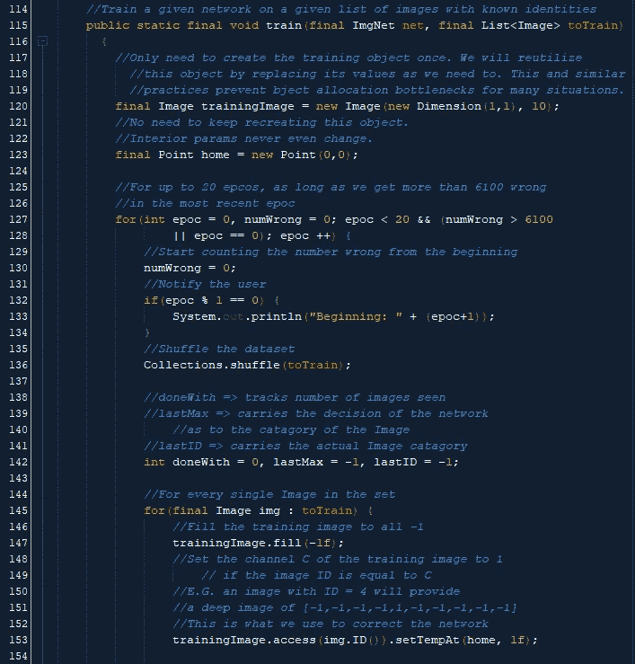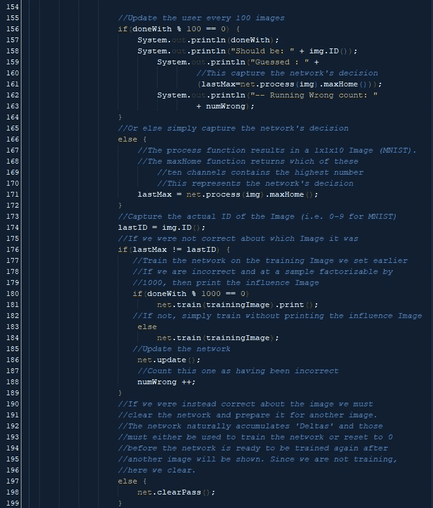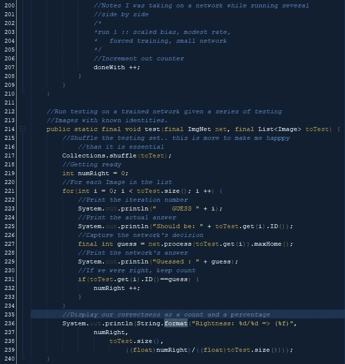

现在，我可以放心地继续讨论网络本身的内部操作和规范了。虽然很难说，但我确实相信 ImgNet 是我最喜欢的创作之一。然而，在一头扎进网络的核心之前，我认为展示一些被利用的外围设备并对它们进行深入的探讨是明智的。首先，我们可以先看看在卷积完成后，每一层内部的网络的节点或“神经元”所使用的激活函数。你可能知道，激活函数给网络增加了一层非线性，随着深度增加了它的表达能力。这里有一种优化方法值得注意。为了知道应用哪个激活，很简单，给每个“神经元”一个赋值，然后使用 if-then 在运行时检查如何应用激活。如果这没有意义，试着按照下面的例子:让我们说，在训练期间，一些网络有一层神经元准备激活它们的结果。每个神经元必须检查 if(激活==SIGMOID)然后计算激活，否则 if(激活==RELU)然后计算激活。我努力避免这种方法，因为它会产生过多的分支，而没有任何实际的收益。为了优化这种方法，我创建了一个定义所有激活的枚举常量，并选择在编译期间向每一层提供哪个枚举，这样就可以直接引用它，在运行时提供激活，而不会出现分支。简单地调用枚举就足够了。下面是我的 Neuron 类内部的样本(请原谅我的换行，因为不存在的代码对于网络的状态并不重要)。

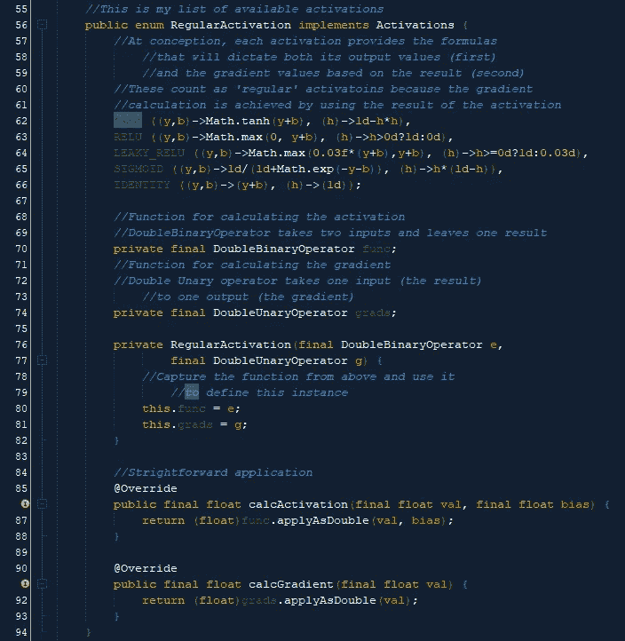

现在我们真的需要分解我们试图完成的事情(棘手的事情来了)。每个网络将由连续的采样“层”构成，每层将由一系列“神经元”组成每个神经元将具有多个“跨越核”,其数量等于前一层处理后的图像的深度。每个跨越内核将是一个“窗口”的控制器和管理器，它在这里充当热图的子类型，增加了具有源点(相对于另一个网格的位置，例如输入热图)的功能，以及包含窗口有效“权重”的增量数据的另一个嵌套热图这将允许窗口保存通过它的内容的记忆，并在被请求时相应地更新自己。请注意，更新会将始终累积的权重增量重置为零，并且有内置的功能可以在不更新的情况下重置增量。这允许在下一次运行中进行纯粹的累积，并且如果要考虑继续训练网络，则必须应用这两个函数中的一个来重置增量。在灰心丧气和陷入困境之前，让我们先看看 ImgNet 代码本身，看看它是如何构建和利用这些组件的，从而了解项目的范围。

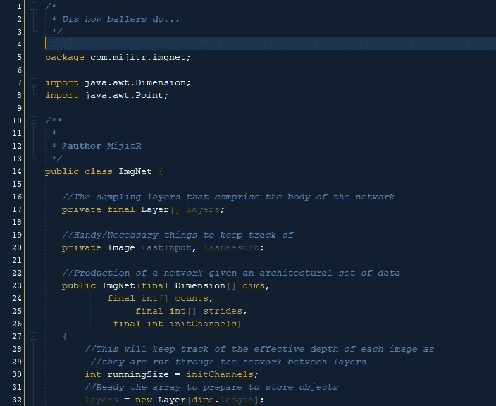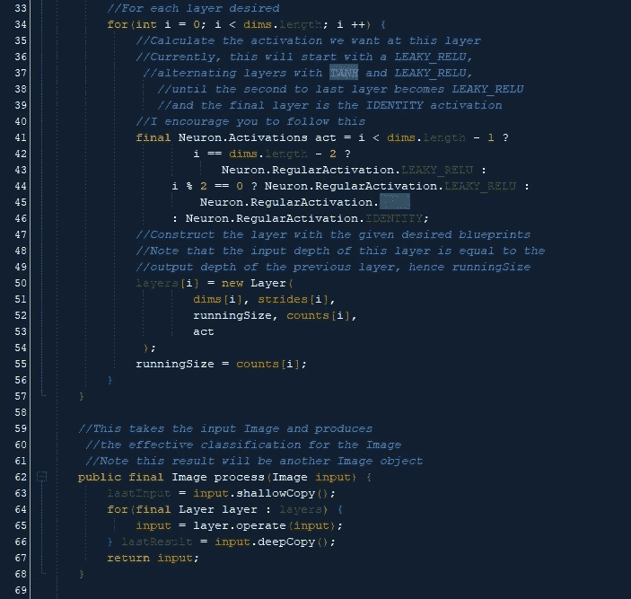

这里没有什么太复杂的事情。这只是管理通过网络在两个方向上查看图像，并在此过程中提供一些有用的 SoftMax 功能。我要注意的另外一件事是，到目前为止，我导入的包要么来自层次结构中使用的其他文件夹，要么来自 java 本身。我真正的意思是从零开始(自我鼓掌结束)。在这里，我们看到了对称为层的对象的需求。这一层将管理其神经元并报告它们的结论。这一层如下。

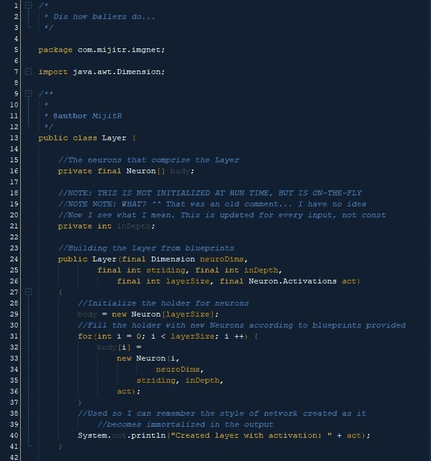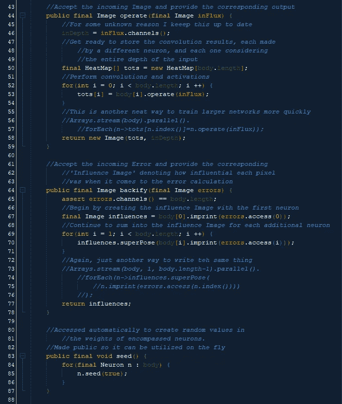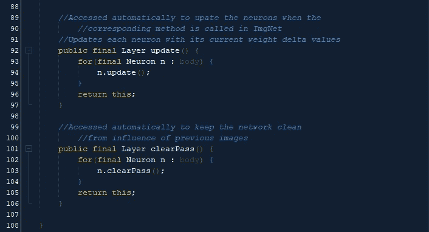

太好了！现在我们有了网络类需要的层。但是，正如你所看到的和前面所描述的，这个层类依赖于神经元类。神经元类通常完成繁重的工作，但是，正如我们将看到的，我已经将一些纯数学重新委托给了另一个类，只留下我的神经元作为一组滑动内核的管理器。让我们来看看:

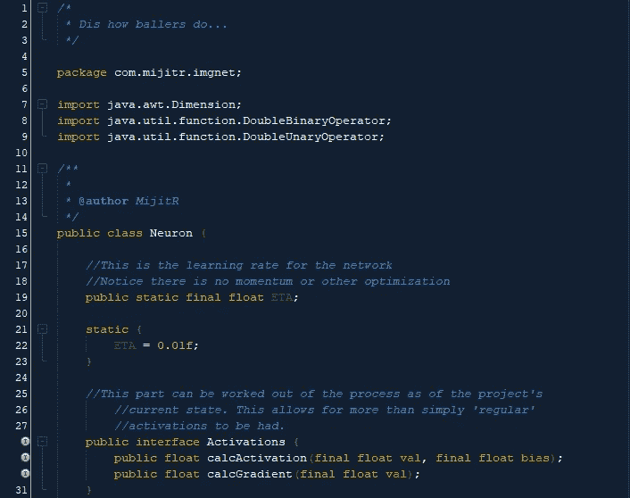

我将在这里暂停一下，指出我们已经看到了这段代码和下面描述我们的激活的嵌套枚举。我将简洁地跳过转贴相同的代码。

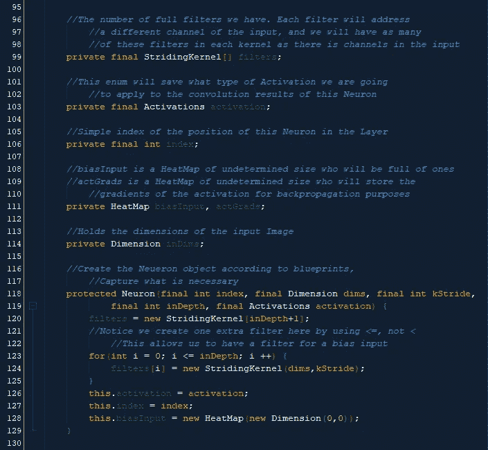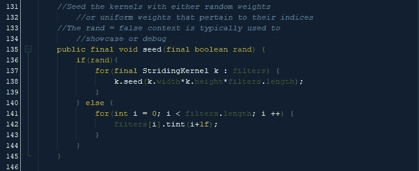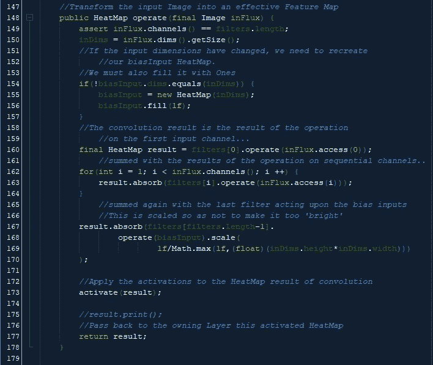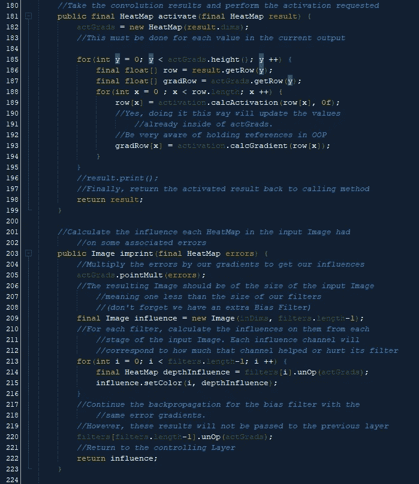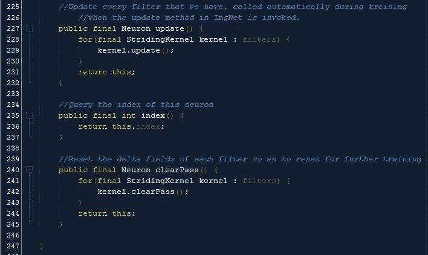

我们又有了一个我还没有提到的依赖。这就是神经元对我称之为滑动内核的依赖。我想我应该指出，我从来没有翻转卷积核，所以这个网络实际上更多地在互相关方面而不是卷积方面工作，但这种细微差别似乎经常丢失，所以我仍然坚持这个过程的通用名称。滑动内核包含在输入热图上重新定位其特殊热图(称为窗口)的逻辑，并在每次重叠时执行逐点乘法和求和。这是卷积的真实过程。

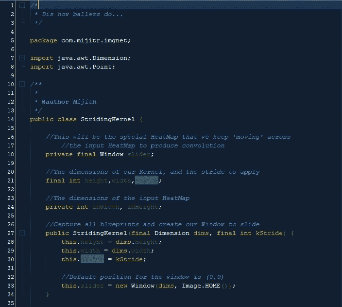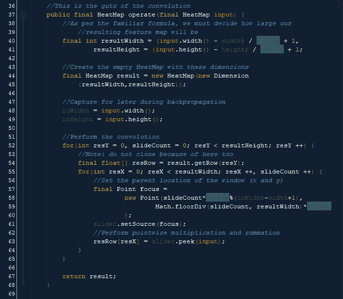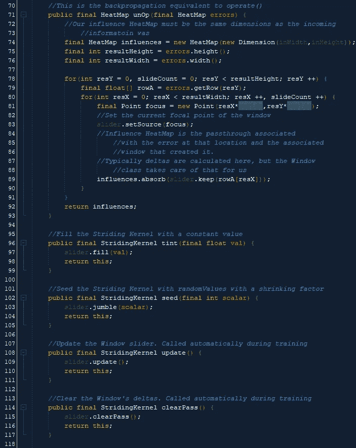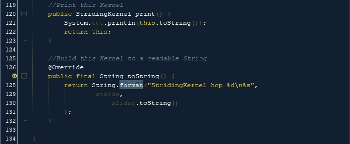

太棒了。快到了！我们还有一个依赖，我不会拖延太久。Window 类是一种特殊类型的热图，可以保存包含“通过”它的内容的信息。这是反向传播所必需的。也许更深入的写作将解决这个问题，但现在，这里是操作代码。

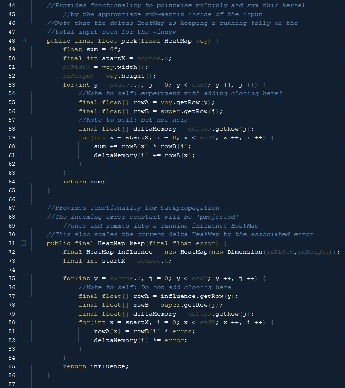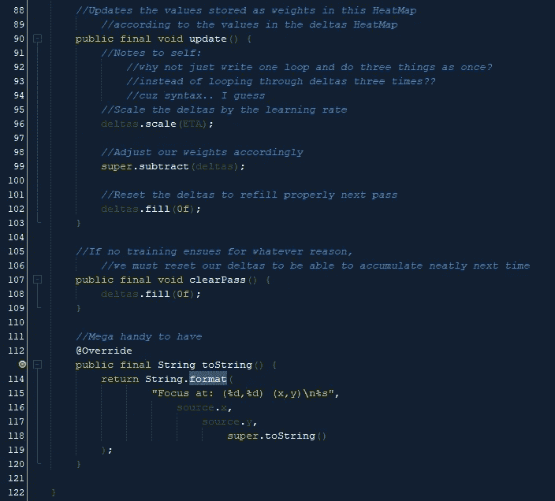

维奥拉。这就是了。现在，您应该能够在 MNIST 数据集上取得好成绩，或者简单地对图像进行一般分类。我会单独发一个帖子，具体说明我是如何把 MNIST 的图片保存到我的电脑上的。但是这个网络能够计算任何 Java 可以从中提取光栅的普通图像。如果你真的读了这篇文章，并有任何意见或问题，请随时联系我。感谢您的收看。合十礼。

*   请注意，这个公式不包括填充输入的概念，因为我还没有将它合并到这个构造中。