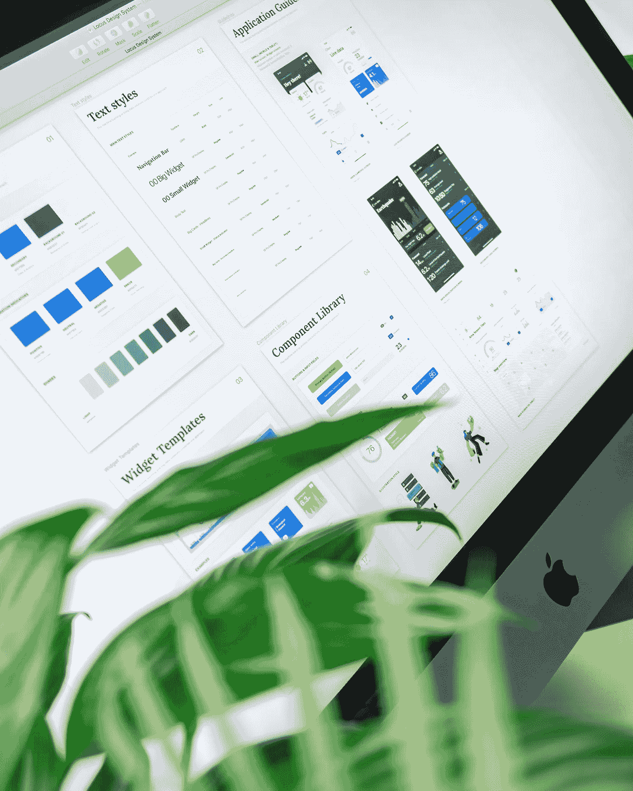

# 在顺风应用中使用设计系统进行构建。

> 原文：<https://medium.com/geekculture/building-with-a-design-system-in-a-tailwind-application-ac55fa929519?source=collection_archive---------7----------------------->

设计系统带来设计的一致性。前端设计系统的组织也鼓励设计系统的采用，并使其更容易接受变化。



Photo by [Balázs Kétyi](https://unsplash.com/@balazsketyi?utm_source=unsplash&utm_medium=referral&utm_content=creditCopyText) on [Unsplash](https://unsplash.com/s/photos/design-system?utm_source=unsplash&utm_medium=referral&utm_content=creditCopyText)

# 什么是设计系统？

一个**设计系统**是一个可重用组件的集合，由清晰的标准指导，可以组装在一起构建任意数量的应用程序。

GitHub 的设计系统经理 Diana Mounter 说:“设计系统总是在进化，你分享和鼓励采用新迭代的方式也会随之进化。”

考虑到设计系统总是在发展的，我相信以一种易于维护和易于改变的方式来实现它们才是正确的。例如，如果品牌颜色发生了变化，那么切换到新颜色应该几乎是无缝的，并且是在全局上下文中完成的，而不是在应用程序中编辑多行代码。

在这篇博文中，我将讲述我在设计系统中的工作过程。选择的样式框架是 [Tailwind](https://tailwindcss.com/) ，但是这些过程可以用任何样式框架甚至普通的 CSS/SCSS 来实现。

# 添加基本样式

基本样式是样式表开头的样式，为基本 HTML 元素设置有用的默认值。使用设计系统时，一些标签具有推荐或默认的样式。例如，设计系统可以表示默认情况下所有 h1 标签的字体粗细设置为粗体，字体系列设置为 nunito-sans。将 font-family 类添加到每个正在使用的 h1 标签中是重复的。为 h1 标签创建一个组件也是矫枉过正，我觉得这应该是渎职。最干净的解决方案是为 HTML 标记添加基本样式。

```
/****tailwind.css || a global css file(if tailwind is not being used).****/@tailwind base;@tailwind components;@tailwind utilities;@layer base {h1 {@apply font-nunito-sans text-3xl md:text-4xl font-bold}h2 {@apply font-nunito-sans text-2xl md:text-3xl font-bold}p {@apply font-nunito-sans text-xs md:text-xs font-bold}}
```

上面的代码设置了 h1、h2 和 p 标签的基本样式。这些 HTML 标签在使用时会有上面设置的默认样式。但是这个默认样式仍然可以被覆盖:

```
<h1 class="text-2xl font-bold text-left text-black font-halant">Sign In</h1>
```

# **添加自定义颜色**

设计系统自带定制颜色，有时，tailwind 并不提供所有甚至大部分所需的颜色。在这种情况下，最好去，流氓，😄并通过向 tailwind.config 的主题对象添加颜色对象来创建您自己的颜色:

```
// tailwind.config.jsmodule.exports = {purge: ["./index.html", "./src/**/*.{vue,js,ts,jsx,tsx}"],darkMode: false, // or 'media' or 'class'theme: {extend: {},// get colors subsequently.colors: {primary: "#06818F","primary-a10": "#06818F10","primary-a24": "#06818F24","primary-a75": "#06818F75","primary-a99": "#06818F99",secondary: "#E1F5F7","secondary-a10": "#E1F5F710",white: "#FFFEFF",success: "#22BF3E","success-a10": "#22BF3E10",danger: "#FF5F56","danger-a10": "#FF5F5610",warning: "#FEAD54","warning-a10": "#FEAD5410","warning-a24": "#FEAD5424",black: "#1E1E24","black-a50": "#1E1E2470",grey: "#C4CECF",}},variants: {extend: {},},plugins: [],};
```

这将用你的新颜色覆盖顺风的默认颜色。

命名颜色变量时，我遵循几个规则:

a.使用上下文名称，而不是直接的颜色名称:使用上下文名称的颜色，如原色、二次色、警告色等，比使用绿色、红色、白色等更容易维护。如果使用绿色代替原色，如果品牌颜色变为紫色，您不仅需要编辑变量值，还需要编辑名称，这意味着您需要在使用名称的任何地方编辑名称，这使得更改非常困难。

b.使用 alpha 这个术语来表示具有一定不透明度的颜色:在命名颜色时，我使用像 primary-a10 这样的名称，它表示具有 10%不透明度的原色。alpha 通道是一种颜色组件，表示颜色的透明度(或不透明度)。

# 创建基础组件

基本组件是行为类似 HTML 标签或应用特定于应用程序的样式和约定的组件。大多数情况下，最好是构建设计系统的组件，并在应用程序中使用它们，而不是在使用它们的任何地方单独设计它们。这样，一些行为可以被共享，例如向按钮添加加载器或者向输入添加错误/成功状态。

# 结论

这几个步骤让我更容易处理设计系统，也更容易维护前端代码库。