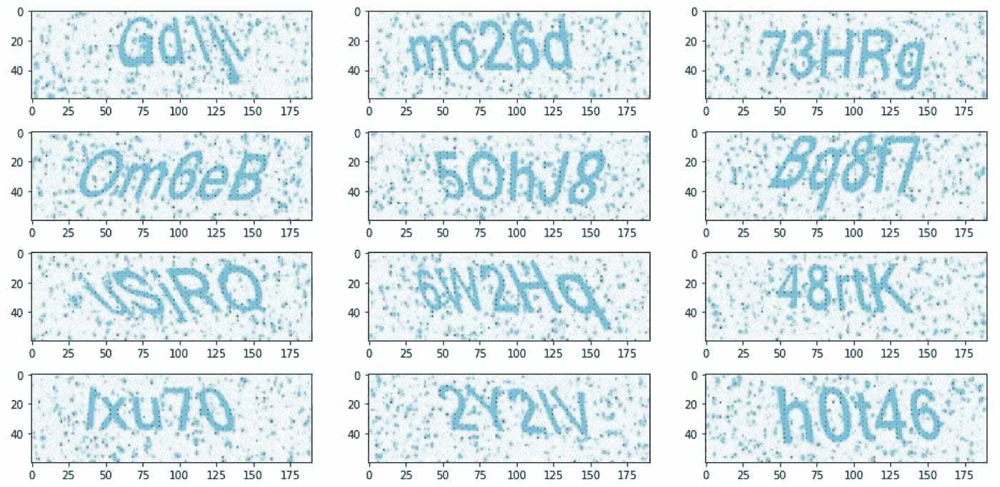
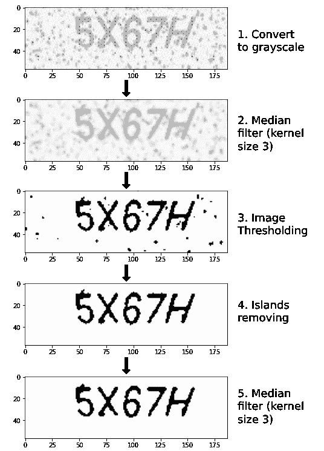
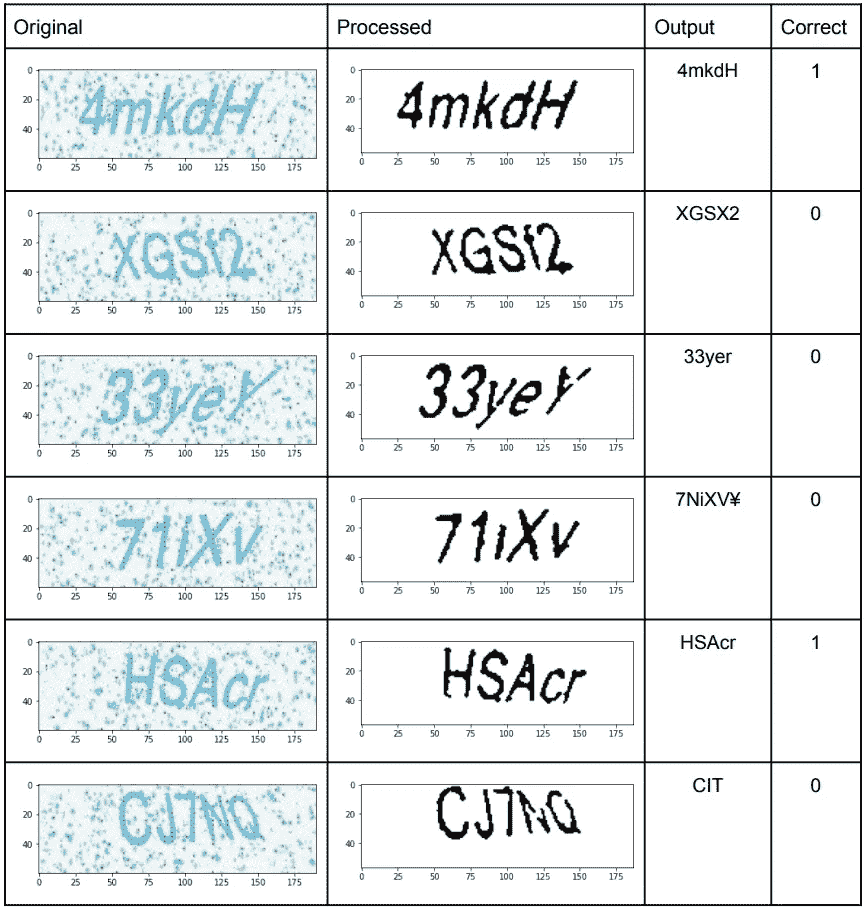

# 通过广度优先搜索、OpenCV 和 Tesseract 绕过验证码

> 原文：<https://medium.com/geekculture/bypassing-captcha-with-breadth-first-search-opencv-and-tesseract-8ea374ee1754?source=collection_archive---------5----------------------->

## 一种基于广度优先搜索算法的图像去噪绕过验证码的新方法

Take My Hand by [Possessed Photography](https://unsplash.com/@possessedphotography)

验证码被广泛用于确保对系统执行的操作是由人而不是机器人完成的。然而，这种方法并不是万无一失的，尤其是在当今这个 OCR 和计算机视觉技术如此发达的时代。让我们面对它，从用户的角度来看，每次你想访问某个网站时都必须解决一个验证码是一件非常痛苦的事情，尤其是当你每天都需要这样做的时候！

在这篇文章中，我将探索我自己的绕过特定类型的验证码的方法。该方法利用广度优先搜索(BFS)和 OpenCV 对图像进行降噪，然后将其传递给 OCR 引擎(Tesseract)。由于有太多不同类型的文本验证码，有不同形式的失真/增强，我的方法将只对我试图绕过的特定验证码源起作用。但是也许你会发现我的文章中的一些细节对你自己的验证码解决问题很有用！

# 验证码

Sample of the captcha I am targeting

正如我提到的，有许多不同类型的文本验证码。我试图绕过的 captcha 的变体对单词施加了倾斜的扭曲，同时用雪花状的图案覆盖图像。

从根本上说(幸运的是)，这种类型的验证码并不太难解决。这是因为验证码文本本身没有任何噪声，可以被 OCR 引擎识别。如果文本被进一步扭曲，像 Tesseract 这样的开源 OCR 库将无法读取文本。因此，我们现在需要做的是一系列的图像过滤，以消除所有的噪音，只保留验证码文本。

# 该方法

我将要讨论的方法具有概率特征，这意味着它不能保证在每次试验中都有效。然而，我们可以利用验证码和系统的一些先验知识来确保我们最大化验证码的成功概率。

但首先，我们来谈谈验证码图像的去噪方法。这个过程可以概括为以下几个步骤。转换为灰度级
2。中值滤波器(内核大小 3)
3。图像阈值处理
4。*群岛移除
5*。中值滤波器(内核大小 3)

Visualisation of the denoising steps

该图像首先被转换为灰度，以将通道数量减少到只有 1 个。

然后注意到，在现有的随机下雪噪声之上放置了一致的亮暗像素点图案。中值滤波器可以有效地消除这种密集和重复的噪声模式。

尽管有轻微的模糊，中值滤波后的图像要干净得多。下一步我们要做的是对图像进行阈值处理，将所有像素的亮度推至 1 或 0。通过反复试验对阈值进行微调，以确保保留文本的所有像素。

在这之后，我们剩下的是被点状噪声包围的验证码文本，点状噪声是来自阈值处理的残余。这些点分散在图像周围，但更多地集中在文本周围。这就是 BFS 的用武之地，因为我们要用这个方法，我称之为“去除岛屿”来去除所有的点状噪声。该方法访问了图像上的所有黑色像素。在每个黑色像素，它使用 BFS 找到所有的邻居也是黑色的。本质上，该函数识别图像上的所有黑色像素聚类，如果聚类大小小于预定阈值，则将其移除(即转换为白色像素)。
这种“去除孤岛”的方法受到了非常流行的编程问题[孤岛数量](https://leetcode.com/problems/number-of-islands/)的启发，在这个问题中，你应该使用 BFS 或 DFS 来计算 2D 数组中 1 的簇(即孤岛)的数量。

最后一步是应用另一个内核大小为 3 的中值滤波器来平滑图像的边缘。然后，它准备好被传递到 Tesseract OCR 中进行文本提取。

从上面的步骤图可以看出，去噪过程产生了非常积极的输出。最重要的是，它足以让 Tesseract 识别单词并输出正确的验证码文本。

下面是去噪的代码片段。

Bread first search helper function

Removing island functions

Denoising and passing it to tesseract OCR

# **结果**

上面显示的示例是该方法的一个性能较好的结果。就像我之前说的，这个方法是概率性的。因此，对于许多输入，它将无法输出正确的验证码。

Some examples of the possible output from the method

这就是关于验证码的先验知识派上用场的地方，因为我们可以使用它们来创建过滤检查，以确保预测的验证码文本满足这些基本标准。如果方法输出没有通过检查，我们肯定知道它预测错误，只需刷新以获得新的验证码样本。

我们可以通过查看验证码数据集获得的一些先验信息是:

*   它包含正常和大写的字母数字字符。
*   验证码字符串大小为 4 或 5。

因此，我们可以导出以下检查来确保预测的验证码:

1.  必须只包含字母数字字符。
2.  长度在 4 到 5 之间。

尽管这种过滤器检查不能保证预测的验证码总是正确的，但是它有助于增加预测的文本是正确的可能性。

Distribution of the number of trials before success

上面是这个方法在输出正确的验证码之前的尝试次数分布的直方图。这些数据是我自己记录的，因为我个人每天都使用这种方法已经超过 3 个月了。可以看出，大多数试验次数低于 20 次，确切的平均值为 9.02 次。

# 结论

本文中介绍的方法有一些优点和缺点。优点是该方法不需要任何训练，因此，标签数据集。它计算速度快，实现简单。然而，缺点是这种方法是随机的，因此对于系统来说，在用户多次错误尝试验证码后阻止用户，使用这种方法可能会锁定你的帐户。此外，该方法针对非常特定类型的验证码，并且将需要微调，或者甚至可能不适用于其他类型的验证码。

我与 Selenium 一起实现这种方法的项目 I 可以在这里找到:[Automatic-health-declaration-for-SUTD](https://github.com/victorpham1997/Automatic-health-declaration-for-SUTD)。我希望你会发现这篇文章在某种程度上有用。