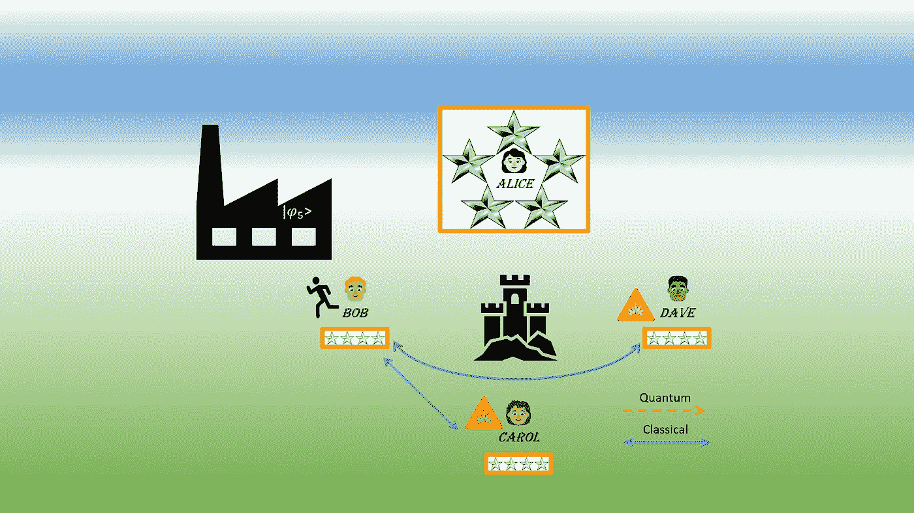
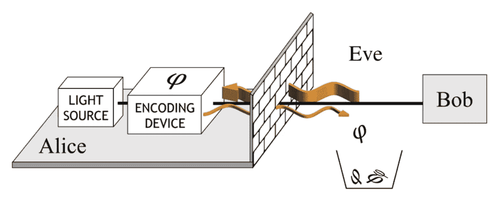
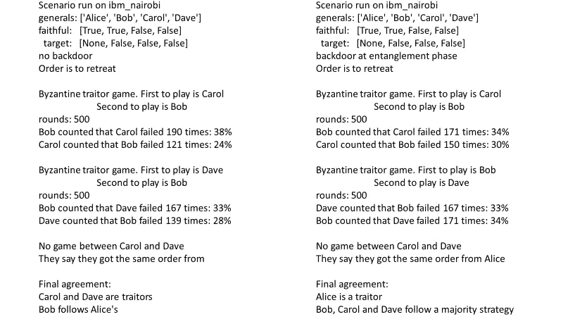
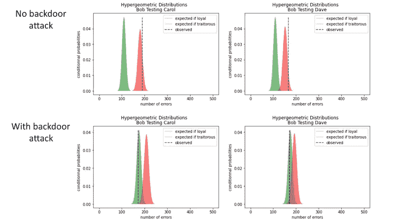
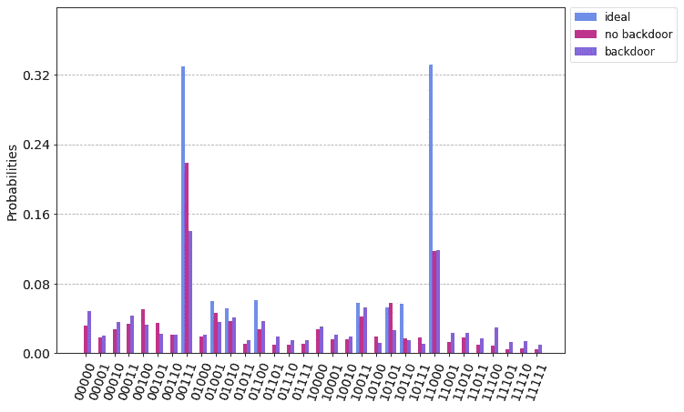

# 间谍游戏中的拜占庭将军

> 原文：<https://medium.com/geekculture/byzantine-generals-in-a-spy-game-46c4e1e1fd0d?source=collection_archive---------12----------------------->

## 可靠广播中的木马及其对策。

延续前几集，拜占庭将领将 [*转量子*](/geekculture/byzantine-generals-turn-to-quantum-ab81bd938cc2)[*转贝氏*](/geekculture/byzantine-generals-turn-to-bayes-b76a695b124e) *。*

🤓*嗨！我是值班的极客。如果你愿意，你可以忽略我的评论，这些评论旨在深化与量子计算和密码功能相关的某些方面。*

让我们记住，拜占庭帝国总协定的量子解决方案比传统解决方案能揭露更多将军圈子里的叛徒。

在前面的文章中，在追捕叛徒的过程中，中尉们的对抗是在平等的基础上发生的。由四名将军而不是两名将军组成的组合的优势之一是形成多数共识。在一个三将军的配置中，如果两个中尉都通过了测试，那么指挥官就是作弊。但是没办法知道目标是谁。然而，在四将军配置中，在两次没有检测到叛徒的对抗之后，指挥将军被认为是叛徒。指挥官作弊的目标被确定，中尉可以逻辑地执行发送给其他两人的命令。这相当于纠错。

A traitor hunt. Suppose Bob informs Carol and Dave that he has been ordered to retreat, while they respond to Bob that they have been ordered to strike. Bob will face Carol and then Dave in a confrontation where the adversaries send clues to each other in turn. Image by author

该协议与 Fitzi 等人提出的[原始](https://arxiv.org/pdf/quant-ph/0107127v1.pdf)协议不同。他们的分发-&-测试协议不涉及共享保留部分副本的结果，以建立所有可能场景的错误发生率表。在最初的版本中，一名中尉在广播期间接受另一名中尉的测试。

可以设想不同类型的恶意攻击。这里不考虑所有与安全经典信道相关的问题:假设在后量子密码术世界中完全保密。人们感兴趣的是对协议量子方面的攻击。

🤓拜占庭将军协议的量子解决方案与量子密钥分配(QKD)有几个相似之处。如本[*2022 年初回顾*](https://www.mdpi.com/1492956) *所述，在光学 QKD 系统中，一系列的攻击可想而知。这些攻击可以针对编码器、量子信道或解码器。通过激光破坏在量子通信中创建后门已经由* [*Makarov 等人*](https://arxiv.org/pdf/1510.03148.pdf) *描述过，其他各种技术实现上的木马攻击和信息的侧漏渠道由* [*Lucamarini 等人*](https://journals.aps.org/prx/pdf/10.1103/PhysRevX.5.031030) *描述过。而*则由[T21 莫洛特科夫](https://link.springer.com/epdf/10.1134/S1063776120050064?sharing_token=cqD_hF7AFnHdohq7_-Fb_EckSORA_DxfnEvY7GoQybbekIkapuGTBiOLI8eARtYGjBZOZExBGZjgKnnK1-zqeUC536W1x2n5xa3wtJ-m9JOxwcbVSLOawBBD138WnDEusATus8akaJWkTL4knk13ANFAzcYJJHmKwACFaAgPlqk%3D)为例。然而，如果满足一份详细的要求清单，QKD 的无条件安全是可以设想的。这些论文为拜占庭总协议的量子解决方案中类似攻击的设计提供了灵感。

大多数对量子系统的攻击仅仅导致破坏，而没有进一步的后果。事实上，在量子位元测量之后、叛徒搜寻之前，有一个纠缠检查的阶段:随机抽取的一部分结果，会留作一致性验证之用。如果不满足该条件，协议中止。

现在假设一些中尉神奇地获得了逃避测谎的能力。在三将配置中，这样的中尉可以随意中止进程:破坏！

在四将军配置中，由于多数人的共识，这是不可能的。但是，两个背信弃义的中尉拥有神奇的天赋，可以说服一个忠诚的中尉执行与实际发出的命令相反的命令:政变！

破坏和政变在理论上是可行的，并将在量子硬件上演示。还将显示系统中校准良好的量子噪声可以是一种有效的对策。

实现了一个适合硬件模拟的木马攻击的基本玩具模型。代码是用 Python 写的，用的是开源的量子计算包 [Qiskit](https://qiskit.org/) 。该模型在 IBM Q 的超导量子计算系统上进行了测试。

🤓*代码可以在这个 GitHub* [*笔记本*](https://github.com/pdc-quantum/byzantine-generals-in-qiskit/blob/main/wip-trojan-horse.ipynb) *下 Apache License 2.0 下访问。*

# 量子政变

注意，从这里开始，这个阴谋和它的演员就像兰波特的拜占庭军队一样隐喻。

## 玩具模型

一个重要的灵感来源是 Lucamarini 等人描述的 QKD 特洛伊木马攻击。

Representation of the Trojan horse attack against an optical QKD setup. Figure reprinted from:
Practical Security Bounds Against the Trojan-Horse Attack in Quantum Key Distribution,
M. Lucamarini, I. Choi, M. B. Ward, J. F. Dynes, Z. L. Yuan, and A. J. Shields, Phys. Rev. X **5**, 031030.
DOI 10.1103/PhysRevX.5.031030, [URL](https://link.aps.org/doi/10.1103/PhysRevX.5.031030), [Creative Commons Attribution 3.0 Licence](http://creativecommons.org/licenses/by/3.0/)

🤓*与* *这次 QKD 木马攻击相反，我们的演示模型中的编码被篡改了。通过泄漏渠道，窃听者了解到“总司令”的测量结果。*

在目前 ibm-q/open/main 中可用的七量子位超导量子器件上，如 ibm-nairobi 或 ibm-oslo，由于高水平的传输，该布局允许两个辅助量子位增加电路保真度。但在这种情况下，一个卧底特工可以创造泄漏渠道。我们叫他艾文吧。量子电路被篡改了:在末端插入了两个 CNOT 门。CNOT 门的控制量子位是给指挥官的，目标量子位是辅助的。

Top left: layout of ibm-nairobi. Top right: Original circuit for the entanglement. Bottom: circuit with leakage channels. Image by author

🤓*当增加泄漏通道时，高纠缠态被修改:*

Top: original entanglement. Bottom: entanglement in Trojan horse attack. Image by author

## 阴谋

让我们想象下面的例子。卡罗尔和戴夫是鹰派。他们知道爱丽丝不愿意攻击。如果爱丽丝发出撤退命令，他们同意除掉她，并让她的对手好斗的夏娃负责。Evin 测量辅助量子位，并通过一个秘密安全的经典通道将结果传递给 Eve。

The conspiracy. The quantum state is changed from |φ₅> to |φ₇>. Evin, the infiltrated agent, receives the two additional qubits through the leakage channels he created, measures them, and relays the results to Eve. Eve, Carol, and Dave, in secret communication, are ready to set up their scheme. Image by author

## 作弊的叛徒追捕

多亏了艾文，伊芙有一份爱丽丝的机密结果的副本。在分发和测量量子位之后的阶段，Carol 和 Dave 知道结果的哪一部分是用于搜寻的，而不是用于纠缠检查的。然后，只要 Alice 发出撤退命令，Carol 和 Dave 就知道与该命令相关的认证索引列表。在追捕叛徒期间，他们应该避免在与 Bob 的交流中使用这些索引。共谋者创建一个对相反订单有效的相同长度的索引列表。卡罗尔和戴夫将在狩猎中使用这份伪造的名单，并假扮成忠诚的中尉。

🤓*注意，根据检查数据，共谋者可以事先模拟他们的计划，看看是否有机会*成功*。他们故意使用 Eve 的结果列表而不是 Alice 的结果列表来构建错误发生率的替代表。*

让我们看看输出:

On the left, no leakage channels. The traitors, Carol and Dave are caught. On the right, leakage channels are exploited. Carol and Dave manage to convince Bob that they are loyal. For Bob, Alice is therefore a traitor. Image by author

在程序输出中，当测试 Dave 时，Bob 观察到原始电路的错误率为 33%,修改过的电路的错误率为 34%。在测试 Carol 时，他观察到 38%的原始电路和 34%的修改电路。以下是解释:

Bayesian inference (see the [previous article](/geekculture/byzantine-generals-turn-to-bayes-b76a695b124e)). A rightward shift of the hypergeometric distributions is observed with leakage channels (bottom). For Carol, the error rate observed by Bob is lower when she succeeds in posing for loyalty thanks to the scheme. For Dave, an almost identical error rate is interpreted as traitorousness or loyalty depending on whether leakage channels are absent or present. Image by author

## 政变

从现在开始，鲍勃确信爱丽丝是一个叛徒。阴谋家们只剩下说服鲍勃支持他们的事业了。爱丽丝被罢免，但无法提供任何证据谴责该计划。伊芙指挥了这次行动，并对这座被围困的城市发起了猛攻。

🤓爱丽丝可以争辩说卡罗尔和大卫使用的证明索引列表与她的结果不一致，因此不是她提供的，但这将是她对他们的证词。

The coup was successful and the final assault is launched. Image by author

对于一个外部观察者来说，这与拜占庭式的可靠广播没有区别，因为在拜占庭式的可靠广播中，接收器没有故障。为了解释这个比喻，这相当于广播值在所有接收器中翻转，尽管服务器没有故障。

🤓*这个寓言在这里被刻意戏剧化，在强调其灾难性后果的全面攻击中达到高潮。在真实的分布式系统中，服务器广播的正确值将被忽略。*

## 对策

现在是时候研究逃避这种阴谋的可能方法了。不仅在我们的玩具模型中，而且可能在其他场景中，在不同类型的量子系统中，以及对于不同数量的当事人。

错误的做法是将这种纠结委托给一位将军。这个人可以很容易地修改系统，并获得任何其他人的结果的近似副本。

禁止辅助量子位是一个解决方案。但在现实世界中，自发的或创建的泄漏通道无论如何都可能被恶意攻击所利用。

🤓*在他们的四通用协议* [*中实验性地展示了*](https://arxiv.org/pdf/0710.0290.pdf) *在一个光子系统上，Gaertner 等人已经* [*展示了*](https://arxiv.org/pdf/0810.3832.pdf) *一种* [*拦截-重发攻击*](https://journals.aps.org/prl/abstract/10.1103/PhysRevLett.101.208901) *改变纠缠可以通过进一步分析所获得的数据来揭示。这一发现有助于理解下面的保护手段，甚至是不同的手段，来抵御我们在这里关心的特洛伊木马攻击*。

由于原始电路中存在足够水平的量子噪声，该协议是安全的。如果发生攻击，由于更深的电路、更多的双量子位门和额外的量子位测量，噪声将增加。对于每个将军的完整结果，以及对于为纠缠检查而汇集的结果部分，保真度将低于预期。这种变化还会增加贝叶斯推断表中的预期错误发生率。先前描述的超几何分布的移动将会出现。

Histograms of results (6144 copies). In the noisy quantum system, the leakages modify the histogram, and classical fidelity drops from 54.4% to 45.5%. Note that the histogram does not include Eve’s measurements: this is the view that each general derives from the shared data. Image by author

🤓在现实环境中，当噪声存在于两种情况下时，安全性是有保证的。首先，系统中的单个量子门和测量误差必须是已知的、恒定的和足够大的。第二，必须优化电路，以最终允许在所有情况下忠实与背叛者的两个超几何分布之间有足够的距离。这样，篡改过的电路不会与原始电路混淆。

## 结论:

也许你现在感觉有点远离分布式计算系统中量子辅助数据验证的问题。但是，如果从服务器和接收者的角度来考虑，这种攻击具有令人不安的特征。在三通用版本中，希望翻转位的接收器可能会重复中断传输，直到服务器最终发送一个非预期的翻转位。在四将军版本中，两个接收者必须合谋，但他们可以设法在一次尝试中成功。如果在区块链使用量子解决方案，这种特洛伊木马攻击可能在某个时候被用来验证替代账本。

尽管它具有玩具的性质，在真实的通信世界中也很难实现，但该模型表明，改变纠缠的特洛伊木马攻击可以在相对嘈杂的系统中被检测到。

这一集结束了这个量子拜占庭将军系列。

我希望你喜欢这种古希腊文化、今天的极客文化和明天的量子战争的混合。

> 我承认使用 IBM Quantum services 进行硬件测试。所表达的观点仅是作者的观点，并不反映 IBM 或 IBM Quantum 团队的官方政策或立场。