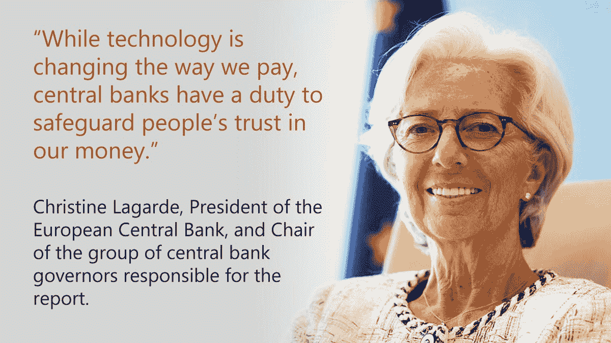
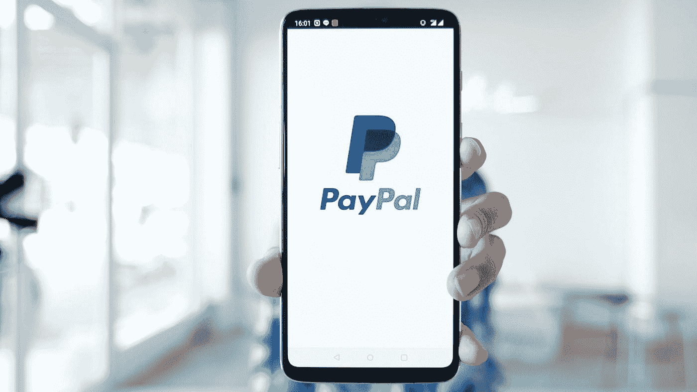

# CBDCs 和 Stablecoins:共存还是竞争？

> 原文：<https://medium.com/geekculture/can-cbdcs-co-exist-with-stablecoins-87b878d666e3?source=collection_archive---------10----------------------->

根据美联储和欧洲央行的定义，中央银行数字货币(CBDC)是中央银行对公众开放的数字负债。

Courtesy of [ceps.eu](https://www.ceps.eu/ceps-publications/central-bank-digital-currencies/)

国际清算银行最近进行的一项调查显示，大多数央行都在探索发行数字货币。如果 CBD 由世界主要央行提供，私人银行(如 Circle 的 USDC)会发挥作用吗？

答案在很大程度上取决于给定央行数字货币的范围。

目前，私人稳定货币发行者正在通过将法定货币引入公共区块链，在*交易*层面进行创新。就像 Revolut 为数字化金融服务的封闭生态系统带来欧元一样，Circle 为基于智能合约的应用程序的开放生态系统带来美元。

Courtesy of [TRT World](https://www.trtworld.com/magazine/what-are-stablecoins-and-how-did-they-trigger-a-crypto-market-crash-57370)

相比之下，中央银行活跃在*基础*层，发行公共货币资产和操作类似 Fedwire 的结算系统。公众可以以实物现金的形式获得这种资产，但绝大多数零售交易都是在私营部门——无论是金融科技公司、商业银行还是支付处理器——提供的轨道上进行的。

因此，根本问题是 CBDC 的设计是否会延伸或取代现有模式，即公共资金充当私人货币工具和轨道的锚，主导消费者交易。

阅读克里斯蒂娜·拉加德关于这个话题的最新想法，我们可以看出数字欧元的三个目标:

1.  在现金接受和使用日益减少的背景下，为公民提供直接获取公共资金的数字手段，以增强他们“对数字支付背后的货币锚的信任”。
2.  面对可能成为主导的非欧盟技术提供商，促进欧洲货币体系的战略自主性。
3.  提高欧洲支付系统的效率，促进私营部门的创新。

Courtesy of the [BIS](https://twitter.com/bis_org/status/1314461851846094853?lang=pl)

在大西洋彼岸，美联储通过类似的视角看待美联储发行的数字美元:它是现金的数字类比，为公众提供了以数字形式持有美元的选择，没有私营部门的风险，也是促进私人创新和美元国际角色的工具。

重要的是，美联储[认为](https://www.federalreserve.gov/publications/files/money-and-payments-20220120.pdf)央行数字货币应该被中介化:

> 中介模式将有助于使用私营部门现有的隐私和身份管理框架；利用私营部门的创新能力；减少对运转良好的美国金融体系造成不稳定破坏的可能性。

相反，一个没有中介的数字美元将代表“美联储在金融体系和经济中的角色的显著扩大”。在这方面，欧洲央行和美联储都认识到了 CBDC“过于成功”的风险，这将挤出私人支付解决方案，破坏金融中介的稳定。因此，他们都在研究对个人持股和利益分配的限制。

在我看来，私人发行的 stablecoins 可以与 CBD 共同繁荣，如果后者在交易层面尊重私营部门的作用的话。实际上，它们将在不同领域运作:

1.  CBDC 将存在于央行账本上，让公民可以选择持有没有中介风险的数字纸币。
2.  私人发行的稳定币将在公共区块链发行，私营部门将推动其在智能合约驱动的创新交易框架中的采用。

另一方面，如果中央银行将其范围扩大到交易领域，由此产生的问题将不仅仅涉及稳定的货币。欧洲央行会在支付处理方面与 Revolut 或 Visa 竞争吗？它会与商业银行争夺存款吗？它会决定哪些交易创新(即公共区块链和 L2s)配得上它的数字货币吗？

If CBDCs cannot co-exist with stablecoins, will they co-exist with PayPal?

政策制定者似乎同意，CBD 不应该破坏现有金融体系的稳定，也不应该干预私营部门的创新，因此稳定的资本似乎会有自己的空间。事实上，莱尔·布雷纳德(美联储副主席)已经在[明确指出:](https://www.coindesk.com/policy/2022/05/26/federal-vice-chair-lael-brainard-says-cbdc-could-coexist-with-stablecoins/)

> 通过在数字金融生态系统中提供安全的中央银行责任，BDC 可以与稳定的货币和商业银行货币共存并互为补充，就像目前现金与商业银行货币共存一样。

总之，值得一问的是，什么“类型”的稳定资本与依赖商品的发展中国家一起最有可能成功。最有可能的是**抵押可靠**和**在监管**范围内稳健运行的稳定债券。这种稳定的货币不会破坏货币体系，反而会提升其国际角色。