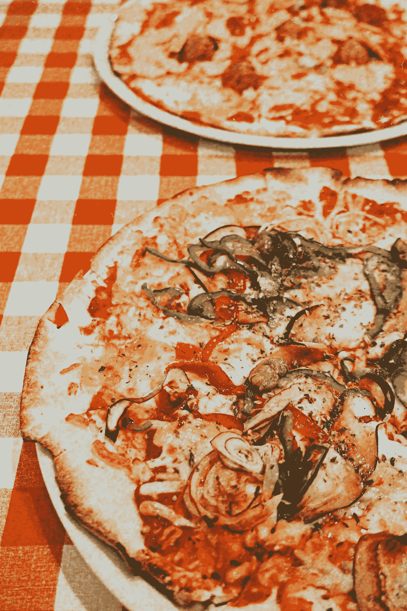

# 差分隐私能隐藏你对夏威夷披萨的喜爱吗？

> 原文：<https://medium.com/geekculture/can-differential-privacy-hide-your-love-for-hawaiian-pizza-3b5cf78612d9?source=collection_archive---------51----------------------->

第 1 部分，共 3 部分:差异隐私提供了什么级别的信息隐藏保证？

Photo by [**Adrianna Calvo**](https://www.pexels.com/@adriannaca?utm_content=attributionCopyText&utm_medium=referral&utm_source=pexels) from [**Pexels**](https://www.pexels.com/photo/pizza-with-pepper-and-cheese-1253737/?utm_content=attributionCopyText&utm_medium=referral&utm_source=pexels)

我的火腿菠萝披萨烤焦了。他们需要在阿罗哈的温度下烹饪。

你坐在办公桌前，试图避开午餐后的昏迷。*平！*一封想要了解人们对披萨喜好的随机调查邮件出现了。这是一个简洁的五分钟调查，一定会让你回到工作状态。你轻而易举地问了一些问题，比如你喜欢你的比萨饼，它的外皮，你喜欢从哪里得到它，还有配料。有这些盒子，你需要检查首选浇头。它也有菠萝的选择。你点击和动摇。等等！**你应该让这项调查知道你对夏威夷披萨的热爱吗？**你如何确定分享这些信息不会导致你获得相关的晋升？你怎么能确定当你打开社交媒体时，你不会开始看到城里最好的夏威夷披萨的推荐呢？更糟糕的是，如果你加入了某个公开的披萨菠萝狂热者团体，那该怎么办？

在深入讨论隐私问题之前，让我简单解释一下什么是调查。总有必要了解人口的某些特征。它可以从吸烟习惯到喜欢的鞋子类型。这些信息推动分析，有助于人口普查或相信某些理论适用于特定人群。例如，拥有毛茸茸宠物的人也会成为一系列新吸尘器的潜在买家。因为你知道，宠物皮屑！或者，集体骑车的人可能比独自骑车的人对健身相关的社交活动更感兴趣。所有这些假设被称为**假设**。这些假设是如何被接受或拒绝的？通过对收集的数据进行分析。现在，由于时间和资源的限制，不可能得到全体人口的投入。所以数据是从人群中选择的样本集中收集的。请注意！采样技术是一个完全不同的话题。因此，让我们坚持这样的认识:调查只关注构成整个人口样本集的少数代表。**从样本集中收集的数据用于接受或拒绝分析，或者可能提出新的假设**。

回到隐私辩论。假设你已经被选为样本集的一部分，就像这个故事开头的调查邮件一样。你有什么隐私保证可以理直气壮地回答真相？如果调查是关于像一个人的性史这样的隐私，那么确保个人隐私就更重要了。

还有一些条款，比如对数据记录中出现的人进行匿名处理。但这还不够。例如，一个州警察局被要求公布其雇员的工资。匿名化确保了名被替换为首字母，姓被加上星号，从而将法律顾问雅各布·安德森的名字改为 J. A*******。此外，该部门认为隐瞒姓名是不够的。工作职能也被隐藏起来，这样一名警员(据说名叫杰森·安德森)的工资就无法与相关法律顾问的工资区分开来。这听起来很安全。对吗？不完全是。因为我们生活在一个相互联系又有点爱管闲事的世界，安德森先生的某个邻居可能想知道他的工资。他知道他在哪里工作，他的职务是什么，并且可以很容易地找到他的详细资料。那么该部门应该怎么做呢？首先，新闻部应该停止公布绝对的细节。它们应该提供查询某些属性的机制。例如，有多少雇员的收入低于平均工资水平？或者受雇于该部门的法律顾问的最高工资是多少？同样，查询的组合可以告诉一个特别爱管闲事的邻居安德森先生的工资。

差分隐私提供了在 Anderson 先生在场和不在场的情况下查询结果将是相同的保证。也就是说，邻居不能确定计数查询的结果是否包括 Anderson 先生。这种魔力是通过在查询结果中添加经过仔细校准的噪声来实现的。关于数学解释，你可以阅读[这个关于差分隐私](/georgian-impact-blog/a-brief-introduction-to-differential-privacy-eacf8722283b)的故事。

所以你的披萨偏好调查是通过不同的隐私保证来保护的。不过还是那句话，这足以掩饰你对披萨上菠萝的喜爱吗？在这项调查中，差异隐私的承诺足以宣告你的爱吗？沉住气。

**如果披萨偏好调查是有差别的私人调查，你会期待什么？**

根据调查结果生成的查询结果列出了您所在地区的夏威夷披萨爱好者，可能会考虑您的答案，也可能不会。因此，只要其他参与者的数据没有被触及，在这两种情况下获得查询结果的概率不受您的在场或不在场的影响。

这是否意味着对于一个不同的私人调查，存在两个平行的宇宙？在一个宇宙中，你喜欢夏威夷披萨，而在另一个宇宙中，你不喜欢。你对它的爱仍然是一个秘密。分析师可以愉快地进行统计测试，并尽可能多地检验假设，而不用担心知识会被追踪到你身上。这是一个强有力的保证，但不幸的是并非没有漏洞。

*   你的公共行为可以用来建立你对披萨上的菠萝的偏好。例如，你的一个朋友是公开的情人，并经常在社交媒体上发布有关此事的帖子。你喜欢一个真正支持你的朋友和秘密的 p-o-p 爱好者“喜欢”这些帖子。在这种情况下，您已经允许公众喜欢被任何观察者看到。从而允许一种关联，这种关联可以指向你对 p-o-p 的亲和力。
*   由于我们都是社会联系的，其他人的“秘密”可以通过巧妙设计的算法与我们的联系起来。假设你不是那么积极地喜欢那个朋友的所有帖子。但是你们两个都关注一个烹饪节目，这个节目谈论了很多关于披萨的事情。在虚构的世界里，这是可能的，对吗？因此，一种算法可以使用节目订户数据并分析他们的行为，以确定你是否可能成为潜在的 P2P 爱好者。

当然，如果信息包含在一小组人的范围内，差别隐私将保护该小组人的信息。举例来说，如果你和你的朋友不沉迷于公开欣赏所说的烹饪节目，你们秘密的 p-o-p 爱可能仍然是一个秘密。

来源:

[实施和审计差别私有](https://arxiv.org/abs/2002.04049) [系统](https://arxiv.org/abs/2002.04049)的指导方针