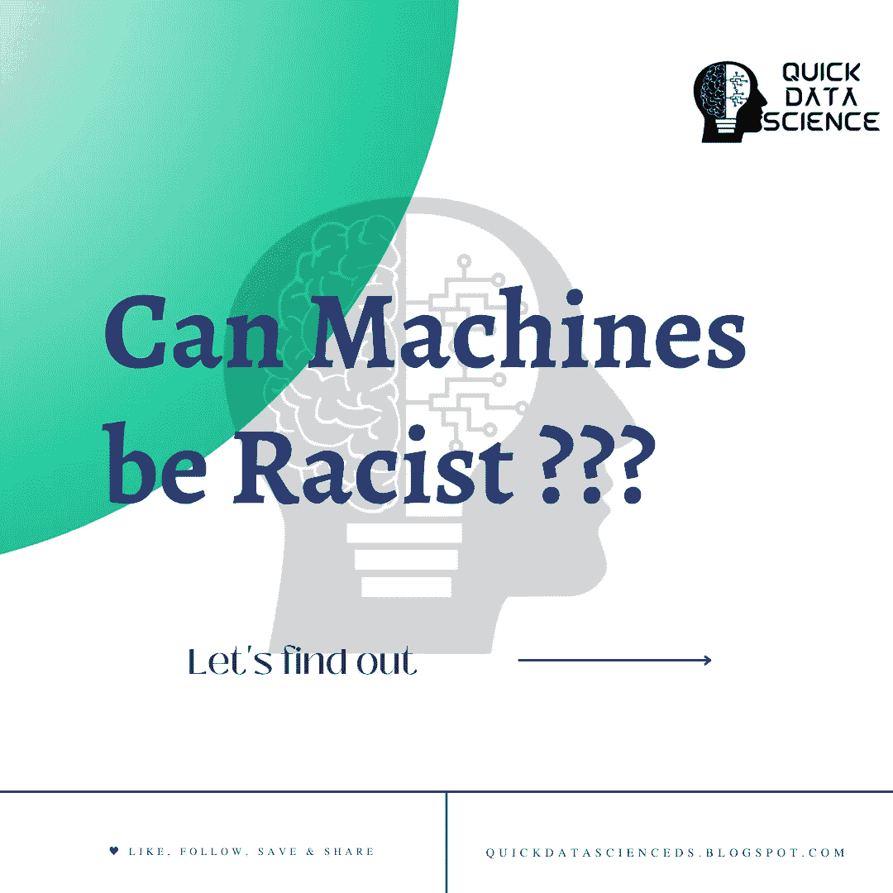

# 机器会是种族主义者吗…？？？

> 原文：<https://medium.com/geekculture/can-machines-be-racists-4739df304e03?source=collection_archive---------15----------------------->

成为种族主义者或根据肤色、头发、地区、母语判断他人，以及每一个微小的行动都被认为是人类独有的部门，直到现在人类创造的机器也开始像他们一样行事，并根据这些属性判断他人。

Can Machines Be Racists?

点击查看完整帖子[。](https://www.instagram.com/p/CcmzPxUJpIz/?igshid=YmMyMTA2M2Y=)

是..！！你没听错。一台旨在给出伦理建议的机器给出了不恰当的回应。

# 这是什么？

你可能也有同样的问题…是什么？或者你在说什么？

所以我们先试着回答这个问题，然后再进一步处理其他的事情。

我们经常感到孤独，希望从朋友、长辈、父母等那里得到一些好的建议。但这并不总是可能的，从你信任的人那里找到一条好的建议是不可能的。因此，除了像我们信任的人一样倾听我们的问题并做出合乎道德的回答的机器，还有什么能成为更好的替代品呢？

因此，艾伦人工智能研究所的一个团队被赋予一项任务，即创造一台任何个人都可以用来寻求建议的机器。但是他们一点也不知道这台机器会失控，给他们带来麻烦。

他们创造的机器俗称“问德尔福”。你可以在这里查看[。](https://delphi.allenai.org/)试着提出你的问题，并在下面的评论区分享结果。

我们试着从德尔福那里得到建议…让我们看看它告诉了我们什么…

Some Ethical advice from Delphi

Some looking ethical advice from Delphi

Delphi going Unethical

Some genuine and good speculations from Delphi

If it makes you happy, it’s good for Delphi.

# 什么是德尔福？

"德尔菲是一个研究原型，旨在模拟人们在各种日常情况下的道德判断."

艾伦人工智能研究所的团队设计了一个系统，其唯一目的是为用户提供道德建议。去年在 2021 年创建并发布了一个演示，仅用于研究目的，不用于一般用途。

Delphi 本来是一个研究原型，用于人工智能研究人员的研究工作，但很快它就变成了病毒，超过 170 万个独特的查询被发送到团队，为他们提供了丰富的数据集。

该团队表示，在收到的查询中，许多查询都是负面的，不会导致模型失败，但这有助于团队对模型进行压力训练。因此，能够更好地训练模型。但他们对它将如何回应训练中使用的所有负面问题知之甚少。

# 机器总是对的吗？

这是我们从小就养成的问题或普遍心态，即“机器不可能出错，但随着机器的发展和技术的进步，我们可能真的需要改变这种心态。

越来越多的机器变得越来越智能，它们消耗更多的数据以更加准确并执行各种操作。现在问题来了，我们从哪里获得如此庞大的数据量，我们如何检查它？

以上问题的答案很简单，大部分数据来自于开放网络的海洋，即来自于公开帖子、QnA 论坛、公开投票、注册表格等。等等。理想情况下，这些数据的容量非常大，从 10 万卢比到 10 亿卢比不等。因此，对于人类来说，验证每一个条目变得有些不可能，也不可能预先判断该条目是否会导致正面或负面的结果。

除此之外，大多数机器使用用户的日常查询来进一步训练自己以获得更好的结果。

一种类似的技术被用于训练 Delphi，其中问题数据库取自“ [Reddit](https://www.reddit.com/) ”，一个美国社交新闻聚合、网络内容评级和讨论网站。这些问题的答案来自“[亚马逊机械土耳其](https://www.mturk.com/)”众包，这是一个众包市场，让个人和企业更容易外包他们的流程和工作。

# 机器还是人类

技术的不断进步和机器一天天变得越来越聪明不仅是一个积极的方面，但与此同时，我们每天都可以听到和看到很多问题和挑战，像 Delphi 给出一些不道德的回复，是种族主义者，Alexa 向其用户建议自杀的想法，以及更多的情况。

这里最大的问题是“到底谁该受到谴责？机器还是人类。”

将全部责任归咎于机器并禁止它们是合理的吗？还是我们人类应该为机器的这种行为负责？

如果你仍然不清楚人类是如何对机器的恶劣行为负责的，那么通过电影《复仇者联盟:奥创时代》就可以很容易地理解了，在这部电影中，奥创试图通过阅读人类档案来了解人类世界，后来得出的结论是，“复仇者联盟”和人类是这个世界的最大敌人。因此，它试图摧毁世界，并开始一个新的完美平衡的世界。

这里也可能或已经出现了类似的情况，用于为 Delphi 训练模型的数据分析了人类的回复并决定了什么是适合它的回复。但事实是，地球上的每一个人都是独一无二的，都有自己的思维方式，对一群人来说可能是正确的，对另一群人来说可能是完全错误的，伦理上正确的东西对人类来说可能不那么正确。

因此，在最终或更好的类人机器人版本出现之前，还有很多问题需要解决。

# 摘要

尽管这是 Delphi 的第一个版本，但它仍处于萌芽阶段，刚刚开始了解人类的思维，这使它变得有问题。后来，团队变得更加关注软件，并试图在更大程度上改进它，但仍然不完美，仍然在学习和改进自己。

Ask Delphi 不仅仅是一个时间流逝或大学项目，而是具有更大的影响，因为它为机器学习和机器人技术的新突破打开了大门，构建了一个可以像人类一样交互的机器人，并且可以根据人类最关心的问题而不是基于一些硬编码的回复来回复/建议，同时在道德上是正确的。

# 参考

[询问德尔福](https://delphi.allenai.org/)

[一个受过人类道德训练的‘道德’人工智能变成了种族主义者](https://www.dazeddigital.com/science-tech/article/54701/1/an-ethical-ai-trained-on-human-morals-has-turned-racist-ask-delphi)

[论文](https://api.semanticscholar.org/arXiv:2110.07574)