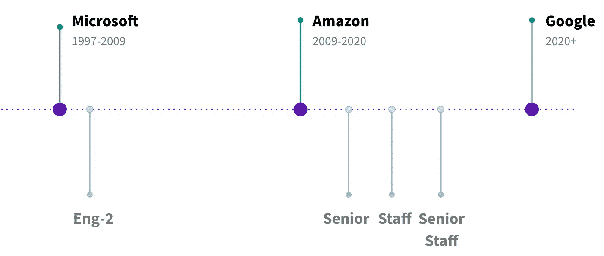
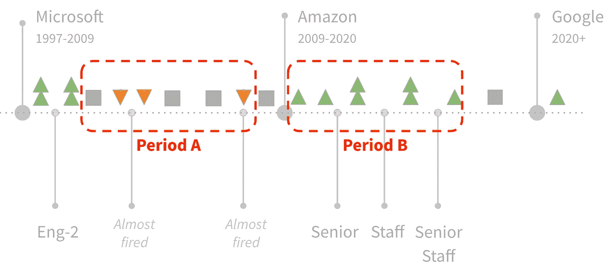

# 职业成长速度，解构

> 原文：<https://medium.com/geekculture/career-growth-speed-deconstructed-a8005fec0a25?source=collection_archive---------0----------------------->

## 有时我呈指数级增长，有时呈冰川级增长——为什么？

我最近潜伏在 linkedin 上，注意到我最喜欢的亚马逊高级首席工程师之一在十年内从实习生变成了高级主管。从各方面来看，这是一个惊人的增长(每两年提升一次)。在很长一段时间里，他的工作资料照片都是实习的时候拍的，所以我可以想象，那些只看他照片的人会感到非常困惑。

一些工程师成长极其缓慢(或者根本没有)；而其他人则以惊人的速度成长。通常这是个人技能、领导支持和形势运气的结合。我已经写了一些这方面的东西([自我奋斗的谬误](https://link.medium.com/yRvkLEOfZlb))，但是**今天这篇文章更深入地探究了我一生中做这些事情的时间，以及为什么。**

我过去 25 年工作过的 3 家公司(微软、亚马逊、谷歌)的级别名称略有不同，条形图略有不同，分布也略有不同，但高层概念在所有公司都是通用的。有初级工程师(你在这个行业的最初几年)，二级工程师(你将花大部分时间编写代码的大宗工程角色)，高级工程师(在团队中领导技术决策)，然后是员工，负责人和杰出的工程师级别(我在这里写了更多关于[和](https://link.medium.com/vZvS6ogMBlb)[的内容)。我是谷歌的高级工程师。](https://link.medium.com/801Ot5nlqib)

我用**高级时间线**开始了我的思想实验。这是我工作的地方。

接下来，我尝试添加我的**等级进展**。我在这里使用的是谷歌级别，但由于亚马逊没有员工和高级员工的概念，这有点近似/推断。

我的下一步是通过标记出我长得快的时间和我长得慢的时间来使它更细化。当我快速增长时，我添加了向上的绿色三角形(双绿色三角形代表我快速增长的次数)。同样，橙色的三角形指向我事业退步的地方。灰色方块代表线性增长的时间。为了更好的衡量，我增加了两次我差点被解雇的机会。

你可能会认为，一个人晋升到高级职员工程师(这个职位大约由 2%的谷歌员工担任)的道路会是*美好而整洁的*。不是我。我的职业发展一塌糊涂！不需要数据科学家来识别这两个感兴趣的领域。我用红色圈出了它们。

在我人生的这两个阶段，我的表现是多么的不同啊！然而，我还是同一个人类——是什么让我的行为如此不同？我敢打赌，一些在 A 期认识我的人可能会对我的 B 期感到惊讶…反之亦然！

两个时期都是 6 年左右。只是在**期 A，**我一单晋升都没有，事业陈腐，薪酬真的没有变化。在**B**期，我被提升了 3 次，薪酬翻倍。还有，更艰难的晋升。为什么它们会有如此显著的不同？微软*比亚马逊*难吗？不，一点也不。事实上，亚马逊是一个更加严酷、更加苛刻的环境。但不知何故，亚马逊以微软没有的方式推动了我的职业生涯。为什么？

# 我的经理很重要

在 A 阶段，我有一长串糟糕透顶的经理。他们更关心发展自己的事业，对指导我没有真正的兴趣。我不记得他们中的任何一个人和我坐下来，坦率地告诉我:这就是你所在的地方，这是你应该少做的行为，这是你应该多做的行为。

在 B 阶段，我有一系列出色的经理，我和他们建立了深厚而长久的关系。他们对我的成长表现出真正的兴趣，对我的优点和缺点提供坦诚的反馈，向我提出挑战，并在我应得的时候为我提供快速通道。有一个伟大的经理并不意味着他们总是描绘一幅美好的画面:我最喜欢的一些经理是我最苛刻的一些经理。

***但经过一番思考后，我认为，最初关于经理决定了我的职业发展的观察过于简单化，并推卸了我太多的责任。***

在 A 阶段，我妻子耐心地忍受了我多年来对这些经理的抱怨。她不是那种对我甜言蜜语的人，所以有一天她受够了我的抱怨，说:“嘿，卡洛斯，这是你抱怨的第三个经理了！也许不只是他们，也许是你！”那个紧张的挑战让我有点震惊。她是对的。最终，我掌握了自己的命运。我不需要呆在不健康的地方。我不需要继续向一个不关心我的蹩脚经理汇报。随着时间的推移，我明白了有些环境下我表现出色，有些环境下我则不然。我不再责怪我的经理，而是主动推动我的职业发展。

# 补偿很重要

金钱不应该是激励你工作的唯一因素，但是它确实有助于看到你如何照顾公司和公司如何照顾你之间的直接联系。

在我[发明了两个为微软节省了数百万美元的东西](https://link.medium.com/SeNroHB5Wgb)之后，A 期开始了，我不仅没有得到晋升，反而获得了少得可怜的 1 万美元的加薪/奖金。这种股票已经过期多年了。每天我都越来越难看到我的努力工作带来的直接经济利益。我知道我在微软的工资很低，我肩上扛着的芯片一天比一天大。我的态度一天比一天糟糕——这没用。

另一方面，B 阶段开始时，亚马逊把我在微软的薪酬提高了一倍。在此期间，股票增长了 10 倍。这一切都为我看到自己努力工作的直接后果定下了积极的基调，这反过来又创造了一个自我循环。每天早上我来上班时都会想:“这家公司对我照顾得真的很好，*我要怎么做才能对得起他们给我的薪水？*“事实上，有一段时间，由于股票的增长，我觉得我得到的报酬超过了我的价值，这给了我一种奇怪但充满活力的压力，要我为公司做更多的事情。

# 长时间工作并不重要

在 B 阶段，我平均每周工作 40 小时，因为我一次又一次地获得晋升。我把这个放在*后面，因为有时候我有对业务很重要的最后期限，我愿意鞭策自己并做出牺牲。是的，有几周我工作了 60 个小时或更多，因为这是时间敏感的，但生活/工作平衡对我来说一直很重要，我的经理理解并尊重这一点。

我可能在 A 阶段工作了更长的时间，但是它们没有我在 b 阶段工作的时间有效。

这就引出了我的观点:*问题不在于你工作了多少小时，而在于你在工作的时间里做了什么。*我认为在任何给定的时间，我都在做一定比例的 1 级工作、一定比例的适合 1 级的工作和一定比例的+1 级工作，但是我需要仔细考虑这些比例随时间的变化。专注于重要的、对业务有影响的事情。

# 赞助和自由很重要

我最近在谷歌面临一个两难的境地。我们向一位副总裁展示了一件东西，我们希望得到他的认可。这需要进行得很好，所以我被要求出席，因为作为一名高级员工工程师，我经常与董事和副总裁在一起，所以说他们的语言让我感觉很舒服。但是有一个资历更浅的工程师完成了大部分的实际工作，我觉得应该由 T2 和 T3 来炫耀，因为他没有太多向领导展示的经验。这是一个风险。但我坚持。那天晚上，我熬夜帮他排练演讲，完善演讲要点以及如何回答一些棘手的问题。第二天早上我随时待命——如果他有麻烦，我随时准备帮他解决。但是我守口如瓶，他干得非常出色。

对我来说做陈述会更容易。这也(可能)降低了风险。也许对我自己的绩效评估更好，因为我可以声称取得了那项成就。但是我强烈地感觉到 [***伟大的领袖会带着人们一起前进。这个演示是一个成长的机会，但它对其他工程师来说比对我来说更有价值。我坚信，即使对我自己的职业生涯来说，对我周围的人的成长进行长期投资比我自己做这项工作并在下一次绩效评估中获得的短期收益更能让我受益。***](https://link.medium.com/w2ly0ggpNlb)

在 B 阶段，我身边有一些人*创造了那种确切的曝光*(有时是经理，有时是我信任和尊重的首席工程师)。他们把我(有时违背我自己的意愿，但总是出于好意)置于需要我挺身而出的境地。我很确定，很多时候这对他们来说是有风险的，但他们在我身上冒了一次险，因为我知道他们有，我不想让他们失望，所以我格外努力地工作。

我最近发现西尔维娅·安·休利特的一个精彩演讲，完美而雄辩地阐明了这是什么以及为什么它很重要。这不同于**师徒制**。作为一名导师，你可以说，“哦，我给了建议，但他们没有采纳”，但是当你资助某人时，你的利益也在其中。

在第一阶段，有很多经理保护我免受这些影响。我认为，有时他们只是抓住成长机会，接触高层领导，以帮助自己的职业生涯。回到 90 年代，在纳德拉时代之前，鲍尔默的微软是一个有毒的充满睾丸激素的工作场所，每个人都为自己着想。这是非常规避风险的。文化中有一种不成文的对失败的恐惧，所以在一个可能成功也可能失败的人身上冒险并不常见(很高兴看到纳德拉最近实现的文化机遇！)

回到 B 时期:亚马逊的实验文化伴随着健康的舒适水平，偶尔也会失败。我[创建了负载和性能测试平台](https://carloarg02.medium.com/how-i-grew-an-engineering-productivity-tool-to-impact-thousands-of-engineers-at-amazon-and-how-28a990091207)并一直沿用至今，以确保成千上万的服务能够处理高峰流量。这不是有人告诉我要做的事情，这是我认为需要做的事情，我只是做了。我自下而上地有机发展平台。这首先是一个周末和晚上的宠物项目。然后我想更严肃地对待这件事，我向我的老板[提出了利用工作时间的想法。她连珠炮似的问我一些问题，以确保我知道我要做什么，然后，有点信服地说，“好吧，你有 3 个月的自由去追求这个。”三个月后，它已经被足够多的人采用，她让我向副总裁做一个更精炼的推销，这样一些人就可以帮我了。他也问了我很多问题，然后又给了我六个月和三个工程师。之后，我又向我的高层领导做了一次游说，说服他们出资组建一个真正的团队，在全公司范围内发展并永久支持该产品。它成为了业务关键型基础架构，为公司节省了数百万美元。如果没有这些人的赞助，它就不会有今天。](https://www.linkedin.com/in/claire-ngo-7b43521/)

# 榜样很重要

在 a 时期，我身边没有太多强有力的榜样。我认为，或许是鲍尔默在 90 年代在微软倡导的“人人为自己”的文化，激励个人被比他们级别高的领导**看到，而被比他们级别低的工程师**看到并没有特别的回报。****

B 期，亚马逊有首席工程师的[崇拜。私人股本不仅仅是更引人注目，他们还被*期望*成为明确的行为榜样。当](https://www.linkedin.com/in/carlos-arguelles-6352392/details/featured/)[我成为首席工程师](https://link.medium.com/ibz3Dcc2Nnb)时，晋升的标准之一正是如此。我认识一些人，他们的体育晋升之所以受阻，是因为他们的行为不符合“榜样”的要求。

让榜样高度可见对我非常有益。我第一次清楚地看到，这些人的行为得到了公司的奖励，也是我应该效仿的。

# 有时候，一切都顺理成章

我相信，无论你工作多努力，无论你工作多聪明，你也需要一点运气才能得到快速提升。

在我的例子中，我(意外地)创造了一项技术，恰好在亚马逊需要它的时候([亚马逊规模的负载和性能测试](https://carloarg02.medium.com/how-i-grew-an-engineering-productivity-tool-to-impact-thousands-of-engineers-at-amazon-and-how-28a990091207))。我很可能早两年创建了它，没有人会在意。或者我可能晚了两年才创造出来，到那时可能已经有人打败我了。正是在这个转折点上，亚马逊服务超过了每秒数百万次的交易量，负载测试也从一项必须完成的任务转变为一项必须完成的任务。你可能会说，也许我只是碰巧睁大了眼睛，有判断力主动识别需要的东西，并愿意采取行动。我想这只是宇宙在为我排队。与此同时，还有其他内部的交叉努力可能会取得胜利。我坚持不懈地竞争和合作，因为我真诚地相信我的技术是最好的。但同样，也有一些运气。