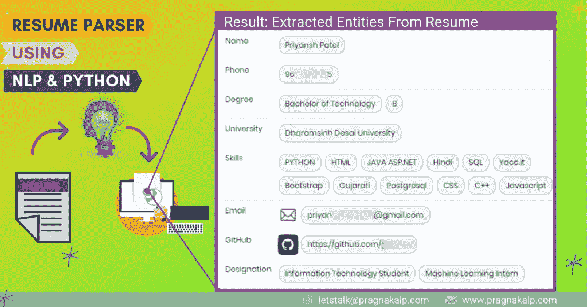

# 案例研究:基于自然语言处理的简历解析器

> 原文：<https://medium.com/geekculture/case-study-nlp-based-resume-parser-using-bert-in-python-55fe327e0f3b?source=collection_archive---------9----------------------->

# 目标

Python 项目中基于[自然语言处理(NLP)](https://en.wikipedia.org/wiki/Natural_language_processing) 的简历解析器的主要目标是提取所需的候选人信息，而不必手动浏览每一份简历，最终实现更省时、更节能的流程。

# 继续解析

简历通常以 PDF 或 MS word 格式呈现，没有特定的结构化格式来呈现/创建简历。因此，我们可以说每个人在准备简历时都会创建一个不同的结构。

由于我们的经验和理解，我们人类很容易阅读和理解那些非结构化或相当不同结构的数据，但机器不会这样工作。机器不能像我们一样容易地解释它。

在我们必须处理大量数据的情况下，将 cv/resume 转换成格式化文本或结构化信息以使其易于审阅、分析和理解是一项基本要求。基本上，将非结构化的简历/cv 作为输入并提供结构化的输出信息被称为简历解析。

简历解析器是一个 NLP 模型，可以提取技能、大学、学位、姓名、电话、头衔、电子邮件、其他社交媒体链接、国籍等信息。不管它们的结构如何。

为了创建这样一个可以从简历中提取各种信息的 NLP 模型，我们必须在适当的数据集上训练它。我们都知道，如果我们进行手动标记，创建数据集是很困难的。

为了减少创建数据集所需的时间，我们使用了 python 中的各种技术和库，帮助我们从简历中识别所需的信息。然而，并不是所有的东西都可以通过脚本提取，所以我们也必须做大量的手工工作。对于手动标记，我们使用 Doccano。Doccano 确实是一个非常有用的工具，可以减少手动标记的时间。

下面是我们用来创建数据集的方法。

# 创建数据集的方法

*   自然语言处理
*   Python 库/Python 包
*   预测分析
*   正则表达式/基于规则的解析
*   命名实体识别(NER)
*   斯帕西的 NER
*   伯特 BERT

# 面临的挑战

## Pdf 到文本的转换

将 pdf 数据转换成文本数据看起来很容易，但要将简历数据转换成文本，却绝非易事。

我们尝试了各种开源的 python 库，像 pdf_layout_scanner、pdfplumber、python-pdfbox、pdftotext、PyPDF2、pdfminer.six、pdftotext-layout、pdfminer.pdfparser、pdfminer.pdfdocument、pdfminer.pdfpage、pdfminer.converter、pdfminer.pdfinterp，每一个都有各自的优缺点。我们面临的另一个挑战是将列式简历 pdf 转换为文本。

在尝试了很多方法后，我们得出结论，python-pdfbox 最适合所有类型的 pdf 简历。

## Docx 到文本的转换

首先，我们使用 python-docx 库，但是后来我们发现表数据丢失了。

之后，我们的第二个方法是使用 google drive API，google drive API 的结果对我们来说似乎不错，但问题是我们必须依赖 google 资源，另一个问题是令牌过期。

不知何故，我们找到了一种方法，通过添加表检索代码来重新创建我们的旧 python-docx 技术。它的产量很高。(现在这样我们就不用依赖谷歌平台了)。这里要注意的是，有时电子邮件也不会被获取，我们也必须解决这个问题。

## 地址解析

很容易找到具有相似格式的地址(如美国或欧洲国家等)，但当我们想让它适用于世界各地的任何地址时，这是非常困难的，尤其是印度地址。有些简历只有一个位置，有些有完整的地址。

我们尝试了各种 python 库来获取地址信息，如 geopy、address-parser、address、pyresparser、pyap、geograpy3、address-net、geocoder、pypostal。

最后，由于其更高的准确性，我们使用了静态代码和 pypostal 库的组合来使其工作。

## 手动标记

手动标签标注比我们想象的要耗时得多。因为我们不仅要使用库查看所有标记的数据，还要确保它们是否准确，如果标记错误，则移除标记，添加脚本留下的标记，等等。

我们使用了 Doccano 工具，这是一种在需要手动标记的地方创建数据集的有效方法。我们强烈建议使用 Doccano。

## 国籍标签

国籍标注可能很棘手，因为它也可能是语言。例如，汉语也是民族，也是语言。所以，我们在标注国籍时必须小心。

# 创建数据集的限制

它不能解析如下信息:

*   毕业年份
*   成就
*   优势和劣势
*   目标/职业目标:如果目标文本正好在标题目标之下，则简历解析器将返回输出，否则将留空
*   CGPA/GPA/Percentage/Result:通过使用正则表达式，我们可以提取候选人的结果，但在某种程度上，不是 100%准确
*   出生日期:
*   由于简历中提到了很多日期，我们很难区分哪个日期是出生日期，哪个不是。
*   我们可以尝试一种方法，如果我们可以得出最低的年份，那么我们可以让它工作，但最大的障碍是，如果用户没有在简历中提到出生日期，那么我们可能会得到错误的输出。

## 训练模型

我们没有从头开始创建模型，而是使用了 [BERT](https://github.com/google-research/bert) 预训练模型，这样我们就可以利用 BERT 预训练模型的 NLP 功能。

# 演示

我们基于 NLP 的[简历解析器演示](https://demos.pragnakalp.com/resume-parser/)可以在线测试。

目前，该演示程序能够提取姓名、电子邮件、电话号码、头衔、学位、技能和大学详细信息，各种社交媒体链接，如 Github、Youtube、Linkedin、Twitter、Instagram、Google Drive，

# NLP 模型结果的缺陷

获取地址

*   即使在数据集中正确标记了地址，我们也无法在输出中获得正确的地址。
*   这里要考虑的一个主要原因是，在简历中，我们曾经创建了一个数据集，只有 10%的简历中有地址。

# 未来路线图

*   提高模型提取所有数据的准确性。
*   进一步测试该模型，并使其适用于来自世界各地的简历。
*   使简历分析器多语言化
*   改进数据集以提取更多的实体类型，如地址、出生日期、工作过的公司、工作期限、毕业年份、成就、优势和劣势、国籍、职业目标、CGPA/GPA/百分比/结果。
*   通过 API 使简历解析器可用

*最初发表于* [***基于 NLP 的简历解析器使用了 BERT 中的 Python***](https://www.pragnakalp.com/case-study/nlp-resume-parser-bert-python/) *。*