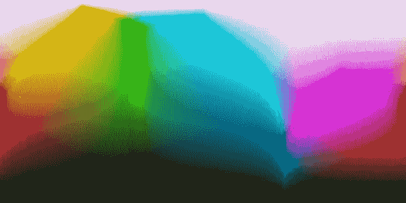
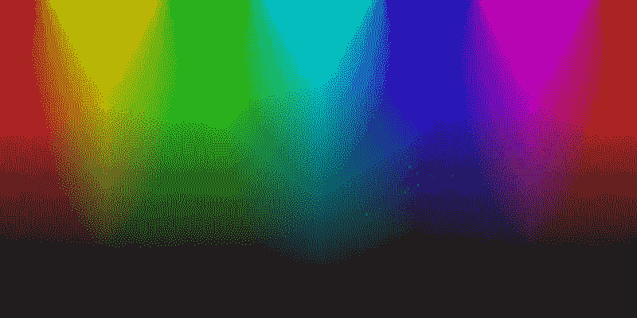
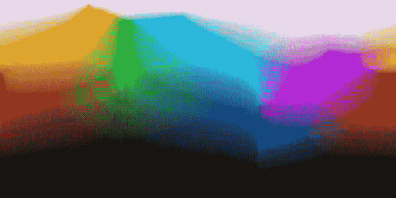

# CHCLT 颜色模型

> 原文：<https://medium.com/geekculture/chclt-color-model-9a4c1401bc81?source=collection_archive---------19----------------------->

CHCLT spectrum

一种新的用户界面颜色模型。CHCLT(发音为 chocolate)，科尔色调色度亮度变换。

我想要看起来很简单的东西，找到一种颜色作为另一种颜色的背景看起来很好。事实证明，这很难。这最终导致了一个新的颜色模型 CHCLT 的诞生，它擅长选择颜色搭配，同时又直观易用。

你能用 CHCLT 做什么？

*   从单一原色创建颜色主题和调色板。
*   为界面元素选择或多或少突出的颜色。
*   选择对比色作为前景或背景。
*   创建类似于[立方体螺旋](http://www.mrao.cam.ac.uk/~dag/CUBEHELIX/)的亮度渐变。
*   选择易于色盲观众使用的对比色。
*   选择色域和接近感知均匀性的相关颜色。
*   创建一个更好的颜色选择器。

有一些颜色模型，像 [HSL 和 HSV](https://en.wikipedia.org/wiki/HSL_and_HSV) ，很容易使用。直观和几何统一。有一些，像来自[实验室](https://en.wikipedia.org/wiki/CIELAB_color_space)或 [LUV](https://en.wikipedia.org/wiki/CIELUV) 的 LCH，擅长寻找颜色之间的关系。几乎感觉一致。没有也不可能有几何上和感知上都一致的模型，因为人类对颜色的感知是不方便的。看看像 [CIECAM02](https://en.wikipedia.org/wiki/CIECAM02) 这样的统一色彩空间，你会感觉到有多不方便。

CHCLT 直观且均匀，但只有亮度在感觉上是均匀的。在实践中，人眼对亮度比对颜色的色调和强度的细微变化更敏感，因此具有接近均匀亮度的颜色模型对感知均匀性的好处大有帮助。

CHCLT 旨在替代颜色拾取器中的 HSL。它还可以在应用程序代码中自动生成界面颜色。使用 HSL 或 HSV 自动生成界面颜色通常不会有好的结果。使用 LCH 经常会避开色域。

CHCLT 旨在使选择搭配起来好看的颜色变得容易，并且即使对于色盲的人也容易辨认。有了均匀的亮度，选择具有良好亮度对比度的颜色变得很直观。

CHCLT 有三个主要成分:色调、色度和亮度。

色调是原色的比率。对于 HSL 或 HSV 中的色调，原色在色调范围内均匀分布。在 CHCLT 中，像 LCH 一样，原色在数学上是重要的位置，但不是均匀分布的。在 CHCLT 中，红色位于色调范围的两端，绿色靠近⅓，蓝色靠近⅔，大致匹配 HSL 和 HSV。

色度是颜色与具有相同色调和亮度的完全饱和颜色的比率。对于 LCH 色度，两个具有相等值的颜色将具有相似的感知强度。CHCLT 的色度更像 HSL 的饱和度，因为它从灰色变化到彩色，但不是颜色强度相似性的良好度量，除非这些颜色具有相似的色调和亮度。

亮度是颜色的感知亮度。CHCLT 使用底层色彩空间，通常是 [sRGB](https://en.wikipedia.org/wiki/SRGB) ，来计算亮度和亮度。亮度是处理 CHCLT 颜色时使用的值，亮度是大多数与色度和色调相关的基本数学运算使用的值。

几何上统一的颜色模型具有方便、直观的形状。HSV 是圆柱体，HSL 和 CHCLT 是双锥。都可以表示为一个立方体。并且该形状中的所有点直接映射到 RGB 立方体或从 RGB 立方体映射。换句话说，模型中的所有颜色都在基础颜色空间的色域中。

HSL bicone and RGB cube

如果您想象本文顶部的 CHCLT 图像包裹在 HSL 双锥周围，那就是 CHCLT 颜色模型。双锥的每个横截面具有均匀的亮度。最高色度的颜色在周边，色度向灰色中心轴方向降低，从一个锥尖的黑色到另一个锥尖的白色。

CHCLT 中的颜色有第四个组成部分，对比度。拥有一个对比组件可以轻松直观地选择满足可访问性要求的颜色，如 WCAG 和 Section 508。CHCLT 中对比度的计算不同于标准，不那么模糊，更感性。

对比度是抽象的，从某种意义上说，黑色和白色都有最大的对比度，增加对比度会使浅色向白色移动，或深色向黑色移动。抽象的对比使得为界面元素选择相关或相反的颜色变得容易，而不需要知道原色。例如，选择一种或多或少突出的颜色，或者是一种很好的背景颜色，会在感觉上保持一致。对于 HSL 或 HSV，最好的方法通常是 alpha 淡入淡出或手动选择颜色。

对比度相对于中等亮度。降低对比度会将任何颜色移向中等亮度。中等亮度是相对于黑色或白色更清晰的颜色之间的阈值。通常，中等亮度被选作黑色和白色的中间点。

如何从 RGB 转换到 CHCLT？

CHCLT 是一种颜色模型，必须与提供可逆传递函数和亮度定义的 RGB 颜色空间相关联。一般来说，任何映射到 XYZ、YCC 或类似地方的 RGB 颜色空间都可以。XYZ 或 YCC 的 Y 是 CHCLT 使用的亮度定义。

使用传递函数直接从亮度计算亮度。亮度从线性 RGB 向量中分解出来以计算色调和色度。色调源自与红色的角度，计算为与参考向量的点积。

要降低线性 RGB 颜色的饱和度，请向等亮度的灰色插值。该插值遵循从灰色到色域中最饱和颜色的向量。色度计算为沿该向量的相对距离，或色域内最大饱和度的比率。

如何从 CHCLT 转换成 RGB？

围绕参考轴旋转参考红色以建立色调。采用旋转的矢量，并应用亮度，通过统一缩放组件转换为亮度。如果旋转或缩放使颜色不正常，则使颜色正常化。通过降低颜色的饱和度来应用色度。

所有分量的范围都是从零到一。色调是循环的，因此例如-0.75、0.25 和 1.25 都是相等的色调。亮度被截断。负色度创建一个补色，色度为 0.5，色度值相同。负对比度创建一个极限颜色，在中等亮度的另一侧具有相同的对比度。

CHCLT Chroma Contrast Plane

上图中心的对比度和色度都为零。色度从左边缘的-1 到右边缘的+1 均匀增加。相对于图像上半部分的颜色，对比度从底部边缘的-1 到顶部边缘的+1 均匀增加。负值用于将一种颜色转换为另一种颜色，但颜色的色度和对比度永远不会为负。

这很微妙，但你可以在这张图片中看到，最饱和的天蓝色与最饱和的橙色不在一个水平线上。在感知均匀的颜色空间中，它们将是水平的。纯蓝色低很多，纯黄色靠近顶部，在文章顶部的全谱图中可以看到。

使用这个对比度和色度平面，可以很容易地选择比给定颜色更突出或更不突出的颜色，与相同颜色相比具有更高或更低对比度的颜色，或者与起始颜色相比具有良好对比度的颜色。因为对于给定的色调，这些修改具有感知一致的效果，所以它们可以在软件中应用。

为了选择一对相互对比良好的颜色，即使对于有视觉障碍如色盲的观众来说，颜色也必须是飞机高度的一半。深色和浅色对比度的总和，即阈值对，必须加到至少 1.0，或 1.2 以达到更严格的一致性。这条中间规则同样适用于文章顶部的全谱图像。

像 [WCAG](https://www.w3.org/WAI/WCAG21/Techniques/general/G18) 和 Section 508 这样的标准使用偏移彩色亮度的比率。CHCLT 使用亮度差并定义中等亮度。有了这个比率，就有了一个隐含的中等亮度范围，但它不是为感知质量而选择的。有一个狭窄的颜色带，普通 CHCLT 认为是暗的，而标准认为是亮的。

比较

HSV or HSB

HSV 颜色空间可能是颜色拾取器中最常见的。原色和二次色的色调间隔相等。蓝色和黄色具有相等的值或亮度。

OKLAB

这是 OKLAB 色域外景。 [OKLAB](https://bottosson.github.io/posts/oklab/) 是一个 LAB 变种，具有一些优秀的色彩品质，用于图像处理。表面在蓝色附近是不连续的。

如何使用 CHCLT？

CHCLT 尚未打包用于分发。在 [github](https://github.com/hystericcole/chocolate) 上有一个带有 CHCLT 源代码的示例应用。源代码在 GNU GPL 下。用 Swift 编写的示例应用程序可以在 macOS 和 iOS 上运行。

我可能会将核心逻辑移植到 javacsript 来制作一个 web 演示。

那是什么颜色空间？

这里生成的所有图像都使用了 sRGB 颜色空间。CHCLT 可以处理许多 RGB 颜色空间，但结果会有所不同。例如， [ACEScg](https://en.wikipedia.org/wiki/Academy_Color_Encoding_System) 色彩空间是线性的，因此亮度在感知上不均匀，并且 [ROMMRGB](https://en.wikipedia.org/wiki/ProPhoto_RGB_color_space) 给蓝色提供接近零的亮度。计算机显示器的色彩空间效果最好。

缺点是什么？

CHCLT 在计算上比 HSL 或 HSV 更复杂。当为一个界面选择几种颜色时，这是无关紧要的。当生成像这篇文章中提到的全谱图像时，复杂性需要更多的时间。CHCLT 不太适合整数数学。

CHCLT 中亮度的感知均匀性仅与基础色彩空间一样好。

对于大多数颜色模型，您可以从 RGB 转换到颜色模型，对组件进行更改，然后再转换回 RGB。使用 CHCLT 时，直接对 RGB 分量进行操作可能更有效。这可能不是什么坏事。

CHCLT 在图像处理方面比 HSL 或 HSV 更好，但不如感知均匀的颜色空间好。

这里使用的颜色术语词汇表。

**色度**:色域内颜色与全饱和度的比值。

**互补色**:相反色调的颜色。

**对比度**:与中等亮度的距离。

**反规格化**:RGB 色域外的颜色。

**色调**:去除亮度后，红、绿、蓝三原色的比例。基于颜色和纯红色之间的角度。

**阈值**:中亮度相对两侧的一对颜色，一暗一亮。

**亮度**:在显示器中测量的颜色的感知亮度，伽玛压缩值。灰色的亮度等于灰度级。

**亮度**:颜色的感知亮度，以线性、伽玛扩展值测量，例如转换到 XYZ 色彩空间时颜色的 Y 值。

**中亮度**:浅色(黑色最清晰)和深色(白色最清晰)之间的阈值。

**规格化**:通过去饱和在色域中移动非规格化的颜色。

**饱和度**:去除亮度后颜色向量的长度。在保留亮度和色调的同时，降低颜色的饱和度会减少该矢量的长度。